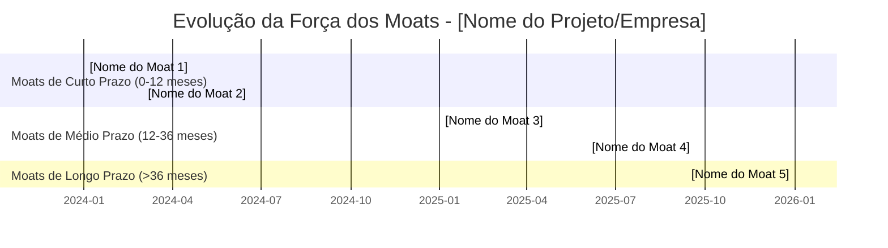

# Template: Vantagens Competitivas Sustentáveis (Moats)

> **Propósito:** Este documento serve como um guia para identificar, analisar e planejar a construção de vantagens competitivas sustentáveis (também conhecidas como "moats" ou fossos econômicos) para `[Nome do Projeto/Empresa]`.
> 
> **Instruções:** Substitua os placeholders `[texto]` pelo conteúdo específico do seu projeto. Use as seções como um guia para uma análise aprofundada.

## 1. Visão Geral dos Moats

### 1.1 Definição e Importância Estratégica

Os "moats" (fossos econômicos) são vantagens estruturais e duradouras que protegem a rentabilidade e a posição de mercado de uma empresa contra a concorrência. Para `[NOME_DO_PROJETO]`, a construção deliberada de moats é fundamental para garantir o sucesso e a sustentabilidade a longo prazo.

Nesta seção, identifique os principais tipos de moats que serão construídos (ex: Efeitos de Rede, Custos de Troca, Vantagens de Custo, Ativos Intangíveis, etc.) e justifique sua relevância para o modelo de negócio.

### 1.2 Cronograma de Construção e Força dos Moats

Visualize a evolução da força de cada moat ao longo do tempo. Isso ajuda a alinhar as prioridades estratégicas e táticas.

## 2. Análise Detalhada dos Moats

Para cada moat identificado, detalhe os seguintes pontos:

### 2.1 [Nome do Moat 1] (Ex: Ativos Intangíveis - Marca e Patentes)

*   **Descrição:** Descreva o moat em detalhe. O que o constitui? (Ex: Uma marca forte que gera confiança e lealdade; tecnologia patenteada que impede a cópia direta por concorrentes).
*   **Força e Sustentabilidade:** Por que este moat é difícil de ser replicado ou superado pela concorrência? Quais são suas barreiras de entrada?
*   **Estratégias de Construção e Fortalecimento:** Liste as ações concretas que serão tomadas para construir e fortalecer este moat. (Ex: Campanhas de marketing focadas em valor; registro de patentes; criação de conteúdo de liderança de pensamento).
*   **Métricas de Acompanhamento (KPIs):** Como você medirá o sucesso e a força deste moat? (Ex: Net Promoter Score (NPS); Brand Awareness; número de citações da patente; Share of Voice).

### 2.2 [Nome do Moat 2] (Ex: Custos de Troca - Switching Costs)

*   **Descrição:** Explique como a plataforma/produto cria custos (financeiros, de tempo, de esforço, de risco) para o cliente que decidir mudar para um concorrente. (Ex: Integração profunda com os workflows do cliente; dados históricos valiosos armazenados na plataforma).
*   **Força e Sustentabilidade:** O quão altos são esses custos de troca? Eles aumentam com o tempo de uso do produto?
*   **Estratégias de Construção e Fortalecimento:** (Ex: Criação de perfis de usuário ricos e personalizados; desenvolvimento de integrações com outras ferramentas essenciais; programas de fidelidade).
*   **Métricas de Acompanhamento (KPIs):** (Ex: Taxa de Churn (desistência); Lifetime Value (LTV); taxa de adoção de funcionalidades avançadas).

### 2.3 [Nome do Moat 3] (Ex: Efeitos de Rede - Network Effects)

*   **Descrição:** O valor do produto/serviço aumenta para um usuário à medida que mais usuários se juntam à rede? Descreva o tipo de efeito de rede (direto, indireto, bilateral, etc.).
*   **Força e Sustentabilidade:** Qual a massa crítica necessária para que o efeito de rede se torne uma vantagem defensável? Como ele se auto-reforça?
*   **Estratégias de Construção e Fortalecimento:** (Ex: Programa de indicações; criação de funcionalidades de comunidade; desenvolvimento de um marketplace bilateral).
*   **Métricas de Acompanhamento (KPIs):** (Ex: Coeficiente viral; taxa de crescimento orgânico; densidade da rede (interações por usuário)).

### 2.4 [Nome do Moat 4] (Ex: Vantagens de Custo / Economias de Escala)

*   **Descrição:** A empresa possui uma vantagem estrutural que lhe permite produzir ou entregar seu produto/serviço a um custo menor que os concorrentes? (Ex: Processos proprietários mais eficientes; acesso exclusivo a recursos de baixo custo; economias de escala).
*   **Força e Sustentabilidade:** Essa vantagem de custo é sustentável a longo prazo ou pode ser erodida por novas tecnologias ou concorrentes?
*   **Estratégias de Construção e Fortalecimento:** (Ex: Automação de processos; otimização da cadeia de suprimentos; negociação de contratos de longo prazo com fornecedores).
*   **Métricas de Acompanhamento (KPIs):** (Ex: Custo por unidade; margem bruta; eficiência operacional (receita por funcionário)).

---

*Continue adicionando seções para cada moat identificado.*

## 3. Roadmap de Implementação e Priorização

Detalhe o plano de ação para construir os moats identificados, alinhando com o roadmap geral do produto e da empresa.

### 3.1 Fase 1: Fundação (Ex: Primeiros 6 meses)
*   **Foco:** [Nome do Moat 1], [Nome do Moat 2]
*   **Prioridades:**
    1.  `[Ação Chave 1 para o Moat 1]`
    2.  `[Ação Chave 1 para o Moat 2]`
    3.  `[Ação Chave 2 para o Moat 1]`

### 3.2 Fase 2: Escala (Ex: Meses 6-18)
*   **Foco:** Fortalecer [Moat 1] e [Moat 2], Iniciar [Moat 3]
*   **Prioridades:**
    1.  `[Ação Chave para fortalecer Moat 1]`
    2.  `[Ação Chave para iniciar Moat 3]`

---

> **Revisão:** Este documento deve ser revisado trimestralmente para garantir que as estratégias de construção de moats permaneçam alinhadas com os objetivos da empresa e a dinâmica do mercado.
2. Criar casos de sucesso iniciais
3. Estabelecer transparência e confiança
4. Iniciar coleta de dados proprietários

### 3.2 Fase 2: Crescimento (2025 Q3-2026 Q2)
**Foco:** Data Moats + Switching Costs

**Prioridades:**
1. Acelerar coleta e análise de dados
2. Desenvolver funcionalidades que aumentem switching costs
3. Expandir integrações e personalizações
4. Preparar infraestrutura para network effects

### 3.3 Fase 3: Escala (2026 Q3+)
**Foco:** Network Effects + Economies of Scale

**Prioridades:**
1. Atingir massa crítica para network effects
2. Otimizar custos operacionais
3. Expandir para novos segmentos/regiões
4. Consolidar posição de liderança

## 4. Estratégias de Defesa Competitiva

### 4.1 Contra Novos Entrantes
- **Barreira de Dados:** Vantagem de first-mover em dados proprietários
- **Barreira de Marca:** Investimento contínuo em brand building
- **Barreira Técnica:** Complexidade dos algoritmos de IA

### 4.2 Contra Incumbentes (LinkedIn, Catho, etc.)
- **Especialização:** Foco específico em profissionais de TI
- **Inovação:** Funcionalidades de IA avançadas
- **Agilidade:** Capacidade de adaptação rápida

### 4.3 Contra Disruptores
- **Relacionamentos:** Network effects como barreira
- **Dados:** Vantagem competitiva em qualidade de matching
- **Integração:** Switching costs elevados

## 5. Cenários Competitivos e Contingências

### 5.1 Cenário: Entrada de Big Tech
**Probabilidade:** Média (após validação do mercado)

**Estratégias de Defesa:**
- Acelerar construção de network effects
- Focar em nichos específicos (especialização)
- Parcerias estratégicas com players locais
- Inovação contínua em IA especializada

### 5.2 Cenário: Guerra de Preços
**Probabilidade:** Alta (fase de crescimento)

**Estratégias de Defesa:**
- Diferenciação por valor, não por preço
- Foco em ROI demonstrável
- Modelo freemium para capturar usuários
- Economies of scale para sustentar margens

### 5.3 Cenário: Mudança Regulatória
**Probabilidade:** Média (LGPD, IA)

**Estratégias de Defesa:**
- Compliance proativo
- Transparência como diferencial
- Participação em discussões regulatórias
- Flexibilidade arquitetural

## 6. Métricas Consolidadas de Moats

### 6.1 Dashboard de Moats (Atualização Mensal)

| Moat | Métrica Principal | Meta 2025 | Meta 2026 | Meta 2027 |
|------|------------------|-----------|-----------|----------|
| Inteligência Especializada | Taxa de Sucesso Recolocação | 75% | 85% | 90% |
| Brand & Trust | NPS | 50+ | 70+ | 80+ |
| Data Moats | Volume Dados (GB/mês) | 10 | 100 | 500 |
| Switching Costs | Taxa Churn Mensal | <5% | <3% | <2% |
| Network Effects | Usuários Ativos | 1K | 5K | 15K |
| Economies of Scale | Margem Bruta | 50% | 70% | 80% |

### 6.2 Indicadores de Alerta

**Sinais de Enfraquecimento dos Moats:**
- Queda na taxa de sucesso de recolocações
- Aumento do churn rate
- Redução no NPS
- Estagnação no crescimento de usuários
- Compressão de margens

**Ações Corretivas:**
- Revisão da estratégia de produto
- Investimento adicional em P&D
- Campanhas de retenção
- Análise competitiva aprofundada

## 7. Integração com Outros Documentos Estratégicos

### 7.1 Alinhamento com Go-to-Market
- As estratégias de moats devem ser comunicadas no [[ESTRATEGIA_GO_TO_MARKET]]
- Mensagens de diferenciação baseadas nos moats mais fortes em cada fase

### 7.2 Validação de Premissas
- Hipóteses sobre moats devem ser testadas no [[docs/01_Guias_Centrais/PLANO_VALIDACAO_PREMISSAS_NEGOCIO.md]]
- Métricas de moats incluídas nos experimentos de validação

### 7.3 Métricas de Sucesso
- KPIs de moats integrados ao [[METRICAS_SUCESSO_BASE_MERCADO]]
- Benchmarking contínuo contra concorrentes

## 8. Próximos Passos e Responsabilidades

### 8.1 Ações Imediatas (Próximas 4 semanas)
1. **Maestro:** Revisar e validar estratégias de moats
2. **@AgenteOrquestrador:** Integrar métricas de moats no sistema de acompanhamento
3. **Equipe de Produto:** Priorizar funcionalidades que fortalecem switching costs
4. **Marketing:** Desenvolver mensagens baseadas em inteligência especializada

### 8.2 Revisões Periódicas
- **Mensal:** Análise de métricas de moats
- **Trimestral:** Revisão de estratégias competitivas
- **Semestral:** Atualização do roadmap de moats
- **Anual:** Revisão completa do documento

---

## Conclusão

A construção de **vantagens competitivas sustentáveis** para o [NOME_DO_PROJETO] segue uma **progressão temporal estratégica**. Começamos com moats que podemos construir imediatamente (**[MOAT_IMEDIATO_1]** e **[MOAT_IMEDIATO_2]**), evoluímos para aqueles que requerem dados e tempo (**[MOAT_MEDIO_PRAZO_1]** e **[MOAT_MEDIO_PRAZO_2]**), e culminamos com os mais poderosos que dependem de escala significativa (**[MOAT_LONGO_PRAZO_1]** e **[MOAT_LONGO_PRAZO_2]**).

O reconhecimento de que **Network Effects** e **Economies of Scale** são moats de **força futura** é crucial para o planejamento estratégico. Eles representam o **potencial de longo prazo** da plataforma, mas requerem **paciência, execução consistente e crescimento sustentado** para se materializarem.

A chave do sucesso está em **executar excelentemente os moats imediatos** enquanto **preparamos sistematicamente o terreno** para os moats de longo prazo que, uma vez estabelecidos, criarão barreiras competitivas quase intransponíveis.

---

## 🔄 Considerações de Orquestração Inteligente

### Integração com Metodologia v1.1
- **Agentes Especializados**: Utilização de @AgenteOrquestrador para análise estratégica contínua dos moats e @AgenteMentorMarketing para execução de estratégias competitivas
- **RAG Operacional**: Monitoramento contínuo de concorrentes e tendências de mercado via base de conhecimento
- **Métricas Contínuas**: Acompanhamento automático da força dos moats através de KPIs específicos
- **Specialized Intelligence**: Delegação eficiente de análises competitivas para agentes especializados

### Critérios de Validação Metodológica
- ✅ **Eficiência de Monitoramento**: Redução de 60-80% no tempo de análise competitiva
- ✅ **Qualidade de Insights**: Padronização de 100% dos relatórios de posicionamento competitivo
- ✅ **Rastreabilidade**: Histórico completo de evolução dos moats e decisões estratégicas
- ✅ **Escalabilidade**: Suporte ao crescimento e fortalecimento dos moats

### Alinhamento com Documentação Viva
- **Sincronização**: Análises competitivas automaticamente sincronizadas com base RAG
- **Versionamento**: Controle de versão integrado das estratégias de moats
- **Referências**: Links automáticos para documentos de estratégia e métricas
- **Dashboards**: Métricas em tempo real da força competitiva

## 📊 Histórico de Versões

### v1.1 (Junho 2025) - Orquestração Inteligente e Specialized Intelligence
- Atualização de referências para documentos v1.1
- Alinhamento com metodologia de Orquestração Inteligente
- Integração com agentes especializados para análise competitiva
- Adição de métricas de eficiência de monitoramento
- Sincronização com base RAG operacional

### v1.0 (Junho 2025) - Versão Inicial
- Definição dos cinco tipos principais de moats
- Cronograma de evolução da força competitiva
- Estratégias específicas para cada tipo de moat
- Métricas de acompanhamento e validação

## 📚 Documentos Relacionados

- [[docs/01_Guias_Centrais/GUIA_AVANCADO.md]] (v1.1) - Metodologia base
- [[docs/01_Guias_Centrais/PLANO_MESTRE_RECOLOCA_AI.md]] (v1.1) - Visão estratégica geral
- [[ESTRATEGIA_GO_TO_MARKET]] (v1.1) - Execução de mercado
- [[METRICAS_SUCESSO_BASE_MERCADO]] (v1.1) - Acompanhamento de performance
- [[docs/01_Guias_Centrais/PLANO_VALIDACAO_PREMISSAS_NEGOCIO.md]] (v1.1) - Validação de hipóteses
- [[docs/04_Agentes_IA/AGENTES_IA_MENTORES_OVERVIEW.md]] - Agentes especializados

**Nota:** Este documento (v1.1) está totalmente alinhado com a metodologia de "Orquestração Inteligente" e "Specialized Intelligence" definida no [[docs/01_Guias_Centrais/GUIA_AVANCADO.md]] (v1.1), incorporando automação de análises competitivas e medição contínua da força dos moats.

--- FIM DO DOCUMENTO VANTAGENS_COMPETITIVAS_SUSTENTAVEIS.md (v1.1) ---