# User Story: Complete MVP Journey - Wizard-Style

**Version**: 1.0  
**Creation Date**: June 6, 2025  
**Based on**: [[docs/01_Central_Guides/01_MASTER_PLAN_RECOLOCA_AI.md]] (v1.5), [[docs/02_Requirements/01_SRS.md]] (v0.5)  
**Strategic Context**: Task [EST-DEV-001] - Feature Prioritization and Sequencing Definition for MVP

## 📋 Executive Summary

This document defines the **complete user journey** in [PROJECT_NAME] MVP, using a **wizard-style** approach with initial focus on **[FOCUS_PLATFORM]**. The journey is structured in **micro-value cycles** that guide the user from first access to the **"AHA! Moment"** - [AHA_MOMENT].

### 🎯 Journey Objective
- **Guide the user** through core functionalities
- **Maximize perceived value** at each step
- **Reduce friction** in onboarding and first interactions
- **Validate value proposition** through the "AHA! Moment"

---

## 🗺️ Complete Journey Mapping

### **Micro-Cycle 1: Foundation & Onboarding**

```mermaid
flowchart TD
    A["🔐 Access to [PROJECT_NAME]"] --> B["📝 Supabase Registration/Login"]
    B --> C["📄 Base Resume Upload"]
    C --> D["🤖 Automatic Parsing (pymupdf + LLM)"]
    D --> E["✅ User Validation"]
    E --> F["👋 Guided Onboarding"]
    F --> G["📊 Empty Kanban Visualization"]
    G --> H["💡 Visual Tips and Call-to-Action"]
```



**Estimated Duration**: 3-5 minutes  
**Value Delivered**: Account created, base resume processed, interface understanding

#### Acceptance Criteria - Micro-Cycle 1:
- [ ] **AC-MC1-001**: User can register/login via Supabase in less than 2 minutes
- [ ] **AC-MC1-002**: Resume upload accepts PDF, DOC, DOCX formats (maximum 5MB)
- [ ] **AC-MC1-003**: Parsing extracts at least: name, email, phone, experiences, education
- [ ] **AC-MC1-004**: User can edit/correct extracted information before confirming
- [ ] **AC-MC1-005**: Onboarding presents product value in maximum 3 screens
- [ ] **AC-MC1-006**: Empty Kanban shows visual tips to add first job

---

### **Micro-Cycle 2: First Job & AHA! Moment**

```mermaid
flowchart TD
    A["➕ Add First Job"] --> B["📝 LinkedIn-Focused Form"]
    B --> C["💾 Job Saved in Kanban"]
    C --> D["🎯 Trigger: Resume Optimization"]
    D --> E["🤖 AI Analyzes Job + Base Resume"]
    E --> F["✨ Optimized Resume Generated"]
    F --> G["📋 Changes Presentation"]
    G --> H["💬 AI Coach: Contextual Insights"]
    H --> I["📥 Optimized Resume Download"]
    I --> J["📌 Job → 'Applied' Status"]
```



**Estimated Duration**: 5-8 minutes  
**Value Delivered**: **AHA! MOMENT** - Resume personalized for specific job

#### Acceptance Criteria - Micro-Cycle 2:
- [ ] **AC-MC2-001**: Job form captures: Title, Company, LinkedIn Link, Location, Salary (optional), Description
- [ ] **AC-MC2-002**: Job is automatically added to "Interested" column in Kanban
- [ ] **AC-MC2-003**: Resume optimization happens in less than 30 seconds
- [ ] **AC-MC2-004**: System clearly presents changes made to resume (visual diff)
- [ ] **AC-MC2-005**: AI Coach provides at least 2 relevant insights about job/optimization
- [ ] **AC-MC2-006**: Optimized resume maintains professional formatting and is downloadable as PDF
- [ ] **AC-MC2-007**: User can move job to "Applied" with one click

---

### **Micro-Cycle 3: Follow-up & Evolution**

```mermaid
flowchart TD
    A["🔄 Kanban Management"] --> B["📱 Drag Between Columns"]
    B --> C["📈 Status Update"]
    C --> D["💡 Contextual AI Coach"]
    D --> E["📊 Insights by Status"]
    E --> F["➕ Adding New Jobs"]
    F --> G["🔁 Cycle Repeats"]
    G --> H["📈 Pipeline Evolution"]
```



**Estimated Duration**: Continuous  
**Value Delivered**: Organized tracking, continuous insights, pipeline growth

#### Acceptance Criteria - Micro-Cycle 3:
- [ ] **AC-MC3-001**: Kanban allows drag-and-drop between columns: "Interested" → "Applied" → "In Process" → "Interview" → "Finished"
- [ ] **AC-MC3-002**: AI Coach provides contextual messages based on job status
- [ ] **AC-MC3-003**: System suggests actions based on time in each status
- [ ] **AC-MC3-004**: User can add notes/comments to each job
- [ ] **AC-MC3-005**: Dashboard shows basic metrics: total jobs, response rate, average time per status

---

## 🎯 Prioritized Features (Framework Applied)

### **Prioritization Matrix - Strategic Analysis Result**

| Feature | User Impact | Dev Effort | Dependencies | Technical Risk | **Total Score** | **Priority** |
|---|---|---|---|---|---|---|
| **5. AI Resume Optimization** ⭐ | 5 | 4 | 3 | 3 | **15** | **P0 - CORE** |
| **6. Basic AI Coach** | 5 | 4 | 4 | 3 | **16** | **P0 - CORE** |
| **4. Complete Kanban** | 4 | 4 | 3 | 4 | **15** | **P1 - High** |
| **2. Resume Upload & Parsing** | 4 | 3 | 3 | 3 | **13** | **P1 - High** |
| **7. Optimized Resume Download** | 4 | 2 | 4 | 2 | **12** | **P2 - Medium** |
| **1. Supabase Authentication** | 3 | 3 | 2 | 2 | **10** | **P2 - Medium** |
| **3. Manual Job Form** | 3 | 3 | 2 | 1 | **9** | **P3 - Low** |

**Note**: Score calculated as: (Impact × 2) + (6 - Effort) + (6 - Dependencies) + (6 - Risk)

---

## 📱 Interface Specification (LinkedIn-Focused)

### **Job Form - Essential Fields**

```yaml
Required_Fields:
  - job_title: string (max 100 chars)
  - company: string (max 50 chars)
  - linkedin_link: url (LinkedIn validation)
  
Optional_Fields:
  - location: string (max 50 chars)
  - salary_min: number
  - salary_max: number
  - work_mode: enum ["On-site", "Remote", "Hybrid"]
  - description: text (max 2000 chars)
  
Automatic_Fields:
  - date_added: timestamp
  - initial_status: "Interested"
  - user_id: foreign_key
```

### **Kanban Columns**

1. **"Interested"** - Identified jobs, not yet applied
2. **"Applied"** - Application sent, awaiting response
3. **"In Process"** - Selection process ongoing
4. **"Interview"** - Interviews scheduled/completed
5. **"Finished"** - Process concluded (Approved/Rejected)

---

## 🤖 AI Coach Specification

### **Contextual Messages by Status**

#### Status: "Interested"
- *"Great choice! This job seems aligned with your profile. How about optimizing your resume for it?"*
- *"Tip: Companies on LinkedIn respond 40% more when resumes are personalized for the job."*

#### Status: "Applied"
- *"Application sent! Average response time for similar jobs is 7-10 days."*
- *"While you wait, how about preparing? Research the company and practice possible questions."*

#### Status: "In Process"
- *"Congratulations! You passed the first phase. This puts you in the top 20% of candidates."*
- *"Tip: Prepare specific examples using the STAR methodology for next steps."*

#### Status: "Interview"
- *"Moment of truth! Remember: they already liked your profile, now show cultural fit."*
- *"Checklist: Researched the company? Prepared questions? Tested connection if online?"*

#### Status: "Finished"
- *"Process completed! Regardless of result, each experience is learning."*
- *"How about adding your impressions about the process? This helps in future applications."*

---

## 🔄 Data Flow and Integrations

### **Resume Optimization Pipeline**


---

## 📊 Journey Success Metrics

### **KPIs by Micro-Cycle**

#### Micro-Cycle 1 (Onboarding):
- **Completion Rate**: > 80% of users complete resume upload
- **Average Time**: < 5 minutes from registration to Kanban
- **Parsing Quality**: > 90% accuracy in extracted data

#### Micro-Cycle 2 (AHA! Moment):
- **First Optimization Rate**: > 70% optimize resume on first job
- **Result Satisfaction**: > 4.0/5.0 in optimization evaluation
- **Download Rate**: > 85% download optimized resume

#### Micro-Cycle 3 (Retention):
- **Jobs per User**: Average > 3 jobs in first month
- **Usage Frequency**: > 2 sessions per week
- **Kanban Progression**: > 50% move jobs between statuses

---

## 🚀 Implementation Next Steps

### **Phase 1: Foundation (Weeks 1-2)**
1. **Configure Supabase authentication**
2. **Implement basic resume upload and parsing**
3. **Create Kanban structure**
4. **Develop LinkedIn-focused job form**

### **Phase 2: Core Value (Weeks 3-4)**
1. **Integrate Gemini LLM for optimization**
2. **Implement resume optimization pipeline**
3. **Develop basic AI Coach**
4. **Create resume download system**

### **Phase 3: Polish & Launch (Week 5)**
1. **Implement guided onboarding**
2. **Add metrics and analytics**
3. **Usability testing**
4. **Deploy and validate with beta users**

---

## 📚 Related Documents

- [[docs/01_Central_Guides/01_MASTER_PLAN_RECOLOCA_AI.md]] - Overview and objectives
- [[docs/02_Requirements/01_SRS.md]] - Requirements specification
- [[docs/03_Architecture_and_Design/01_HLD.md]] - High-level architecture
- [[docs/00_Project_Management/KANBAN/]] - Task management

---

**Strategic Notes**:
- Initial focus on **LinkedIn** reduces complexity and improves data quality
- **Wizard-style** approach naturally guides user through value flow
- **"AHA! Moment"** (resume optimization) is strategically positioned in second micro-cycle
- Each micro-cycle delivers **incremental value** and can be validated independently

--- END OF DOCUMENT US_MVP_User_Journey.md (v1.0) ---