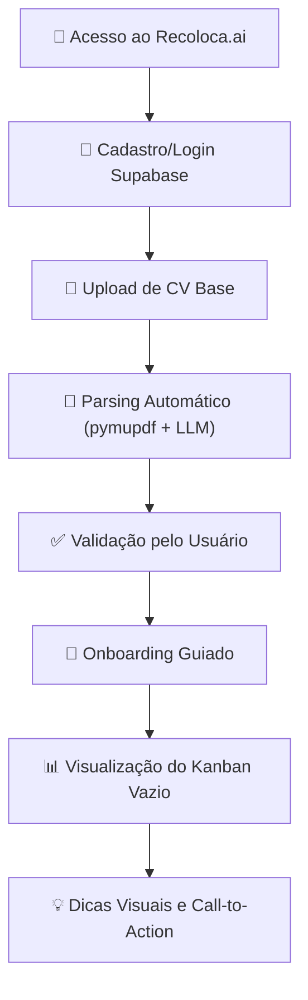
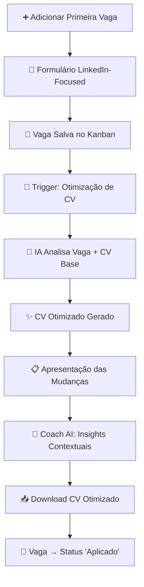
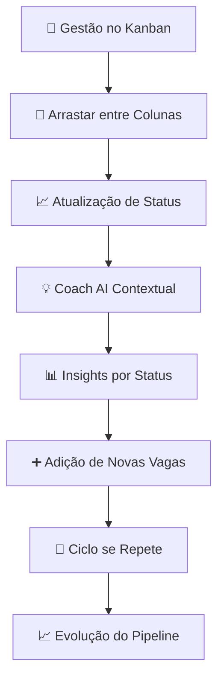
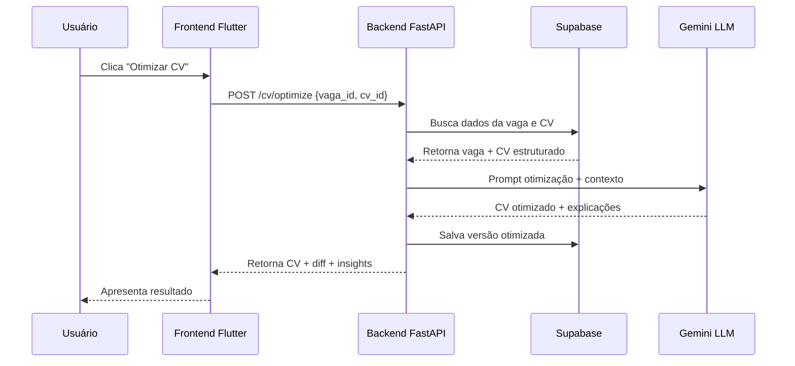

# História de Usuário: Jornada Completa do MVP - Wizard-Style

**Versão**: 1.0  
**Data de Criação**: 06 de junho de 2025  
**Baseado em**: [[docs/01_Guias_Centrais/01_PLANO_MESTRE_RECOLOCA_AI.md]] (v1.5), [[docs/02_Requisitos/01_ERS.md]] (v0.5)  
**Contexto Estratégico**: Tarefa [EST-DEV-001] - Definição de Prioridades e Sequenciamento de Features para o MVP

## 📋 Sumário Executivo

Este documento define a **jornada completa do usuário** no Recoloca.ai MVP, utilizando uma abordagem **wizard-style** com foco inicial no **LinkedIn**. A jornada é estruturada em **micro-ciclos de valor** que conduzem o usuário desde o primeiro acesso até o **"Momento AHA!"** - a otimização de currículo com IA.

### 🎯 Objetivo da Jornada
- **Conduzir o usuário** de forma guiada através das funcionalidades core
- **Maximizar o valor percebido** em cada etapa
- **Reduzir a fricção** no onboarding e primeiras interações
- **Validar a proposta de valor** através do "Momento AHA!"

---

## 🗺️ Mapeamento da Jornada Completa

### **Micro-Ciclo 1: Fundação & Onboarding**



**Duração Estimada**: 3-5 minutos  
**Valor Entregue**: Conta criada, CV base processado, entendimento da interface

#### Critérios de Aceitação - Micro-Ciclo 1:
- [ ] **AC-MC1-001**: Usuário consegue se cadastrar/logar via Supabase em menos de 2 minutos
- [ ] **AC-MC1-002**: Upload de CV aceita formatos PDF, DOC, DOCX (máximo 5MB)
- [ ] **AC-MC1-003**: Parsing extrai pelo menos: nome, email, telefone, experiências, formação
- [ ] **AC-MC1-004**: Usuário pode editar/corrigir informações extraídas antes de confirmar
- [ ] **AC-MC1-005**: Onboarding apresenta valor do produto em máximo 3 telas
- [ ] **AC-MC1-006**: Kanban vazio mostra dicas visuais para adicionar primeira vaga

---

### **Micro-Ciclo 2: Primeira Vaga & Momento AHA!**



**Duração Estimada**: 5-8 minutos  
**Valor Entregue**: **MOMENTO AHA!** - CV personalizado para vaga específica

#### Critérios de Aceitação - Micro-Ciclo 2:
- [ ] **AC-MC2-001**: Formulário de vaga captura: Título, Empresa, Link LinkedIn, Localização, Salário (opcional), Descrição
- [ ] **AC-MC2-002**: Vaga é automaticamente adicionada na coluna "Interessado" do Kanban
- [ ] **AC-MC2-003**: Otimização de CV acontece em menos de 30 segundos
- [ ] **AC-MC2-004**: Sistema apresenta claramente as mudanças feitas no CV (diff visual)
- [ ] **AC-MC2-005**: Coach AI fornece pelo menos 2 insights relevantes sobre a vaga/otimização
- [ ] **AC-MC2-006**: CV otimizado mantém formatação profissional e é downloadável em PDF
- [ ] **AC-MC2-007**: Usuário pode mover vaga para "Aplicado" com um clique

---

### **Micro-Ciclo 3: Acompanhamento & Evolução**



**Duração Estimada**: Contínua  
**Valor Entregue**: Acompanhamento organizado, insights contínuos, crescimento do pipeline

#### Critérios de Aceitação - Micro-Ciclo 3:
- [ ] **AC-MC3-001**: Kanban permite drag-and-drop entre colunas: "Interessado" → "Aplicado" → "Em Processo" → "Entrevista" → "Finalizado"
- [ ] **AC-MC3-002**: Coach AI fornece mensagens contextuais baseadas no status da vaga
- [ ] **AC-MC3-003**: Sistema sugere ações baseadas no tempo em cada status
- [ ] **AC-MC3-004**: Usuário pode adicionar notas/comentários em cada vaga
- [ ] **AC-MC3-005**: Dashboard mostra métricas básicas: total de vagas, taxa de resposta, tempo médio por status

---

## 🎯 Funcionalidades Priorizadas (Framework Aplicado)

### **Matriz de Priorização - Resultado da Análise Estratégica**

| Funcionalidade | Impacto Usuário | Esforço Dev | Dependências | Risco Técnico | **Score Total** | **Prioridade** |
|---|---|---|---|---|---|---|
| **5. Otimização CV com IA** ⭐ | 5 | 4 | 3 | 3 | **15** | **P0 - CORE** |
| **6. Coach AI Básico** | 5 | 4 | 4 | 3 | **16** | **P0 - CORE** |
| **4. Kanban Completo** | 4 | 4 | 3 | 4 | **15** | **P1 - Alto** |
| **2. Upload & Parsing CV** | 4 | 3 | 3 | 3 | **13** | **P1 - Alto** |
| **7. Download CV Otimizado** | 4 | 2 | 4 | 2 | **12** | **P2 - Médio** |
| **1. Autenticação Supabase** | 3 | 3 | 2 | 2 | **10** | **P2 - Médio** |
| **3. Formulário Vaga Manual** | 3 | 3 | 2 | 1 | **9** | **P3 - Baixo** |

**Nota**: Score calculado como: (Impacto × 2) + (6 - Esforço) + (6 - Dependências) + (6 - Risco)

---

## 📱 Especificação da Interface (LinkedIn-Focused)

### **Formulário de Vaga - Campos Essenciais**

```yaml
Campos_Obrigatorios:
  - titulo_vaga: string (max 100 chars)
  - empresa: string (max 50 chars)
  - link_linkedin: url (validação LinkedIn)
  
Campos_Opcionais:
  - localizacao: string (max 50 chars)
  - salario_min: number
  - salario_max: number
  - modalidade: enum ["Presencial", "Remoto", "Híbrido"]
  - descricao: text (max 2000 chars)
  
Campos_Automaticos:
  - data_adicao: timestamp
  - status_inicial: "Interessado"
  - id_usuario: foreign_key
```

### **Colunas do Kanban**

1. **"Interessado"** - Vagas identificadas, ainda não aplicadas
2. **"Aplicado"** - Candidatura enviada, aguardando resposta
3. **"Em Processo"** - Processo seletivo em andamento
4. **"Entrevista"** - Entrevistas agendadas/realizadas
5. **"Finalizado"** - Processo concluído (Aprovado/Rejeitado)

---

## 🤖 Especificação do Coach AI

### **Mensagens Contextuais por Status**

#### Status: "Interessado"
- *"Ótima escolha! Esta vaga parece alinhada com seu perfil. Que tal otimizar seu CV para ela?"*
- *"Dica: Empresas no LinkedIn respondem 40% mais quando o CV é personalizado para a vaga."*

#### Status: "Aplicado"
- *"Candidatura enviada! O tempo médio de resposta para vagas similares é de 7-10 dias."*
- *"Enquanto aguarda, que tal se preparar? Pesquise sobre a empresa e pratique possíveis perguntas."*

#### Status: "Em Processo"
- *"Parabéns! Você passou da primeira fase. Isso coloca você no top 20% dos candidatos."*
- *"Dica: Prepare exemplos específicos usando a metodologia STAR para as próximas etapas."*

#### Status: "Entrevista"
- *"Hora da verdade! Lembre-se: eles já gostaram do seu perfil, agora é mostrar fit cultural."*
- *"Checklist: Pesquisou a empresa? Preparou perguntas? Testou a conexão se for online?"*

#### Status: "Finalizado"
- *"Processo concluído! Independente do resultado, cada experiência é aprendizado."*
- *"Que tal adicionar suas impressões sobre o processo? Isso ajuda nas próximas candidaturas."*

---

## 🔄 Fluxo de Dados e Integrações

### **Pipeline de Otimização de CV**



---

## 📊 Métricas de Sucesso da Jornada

### **KPIs por Micro-Ciclo**

#### Micro-Ciclo 1 (Onboarding):
- **Taxa de Conclusão**: > 80% dos usuários completam upload de CV
- **Tempo Médio**: < 5 minutos do cadastro ao Kanban
- **Qualidade do Parsing**: > 90% de precisão nos dados extraídos

#### Micro-Ciclo 2 (Momento AHA!):
- **Taxa de Primeira Otimização**: > 70% otimizam CV na primeira vaga
- **Satisfação com Resultado**: > 4.0/5.0 na avaliação da otimização
- **Taxa de Download**: > 85% fazem download do CV otimizado

#### Micro-Ciclo 3 (Retenção):
- **Vagas por Usuário**: Média > 3 vagas no primeiro mês
- **Frequência de Uso**: > 2 sessões por semana
- **Progressão no Kanban**: > 50% movem vagas entre status

---

## 🚀 Próximos Passos de Implementação

### **Fase 1: Fundação (Semanas 1-2)**
1. **Configurar autenticação Supabase**
2. **Implementar upload e parsing básico de CV**
3. **Criar estrutura do Kanban**
4. **Desenvolver formulário de vaga LinkedIn-focused**

### **Fase 2: Core Value (Semanas 3-4)**
1. **Integrar Gemini LLM para otimização**
2. **Implementar pipeline de otimização de CV**
3. **Desenvolver Coach AI básico**
4. **Criar sistema de download de CV**

### **Fase 3: Polish & Launch (Semana 5)**
1. **Implementar onboarding guiado**
2. **Adicionar métricas e analytics**
3. **Testes de usabilidade**
4. **Deploy e validação com usuários beta**

---

## 📚 Documentos Relacionados

- [[docs/01_Guias_Centrais/01_PLANO_MESTRE_RECOLOCA_AI.md]] - Visão geral e objetivos
- [[docs/02_Requisitos/01_ERS.md]] - Especificação de requisitos
- [[docs/03_Arquitetura_e_Design/01_HLD.md]] - Arquitetura de alto nível
- [[docs/00_Gerenciamento_Projeto/KANBAN/]] - Gestão de tarefas

---

**Observações Estratégicas**:
- O foco inicial no **LinkedIn** reduz complexidade e melhora qualidade dos dados
- A abordagem **wizard-style** guia o usuário naturalmente pelo fluxo de valor
- O **"Momento AHA!"** (otimização de CV) é posicionado estrategicamente no segundo micro-ciclo
- Cada micro-ciclo entrega **valor incremental** e pode ser validado independentemente

--- FIM DO DOCUMENTO HU_MVP_Jornada_Usuario.md (v1.0) ---