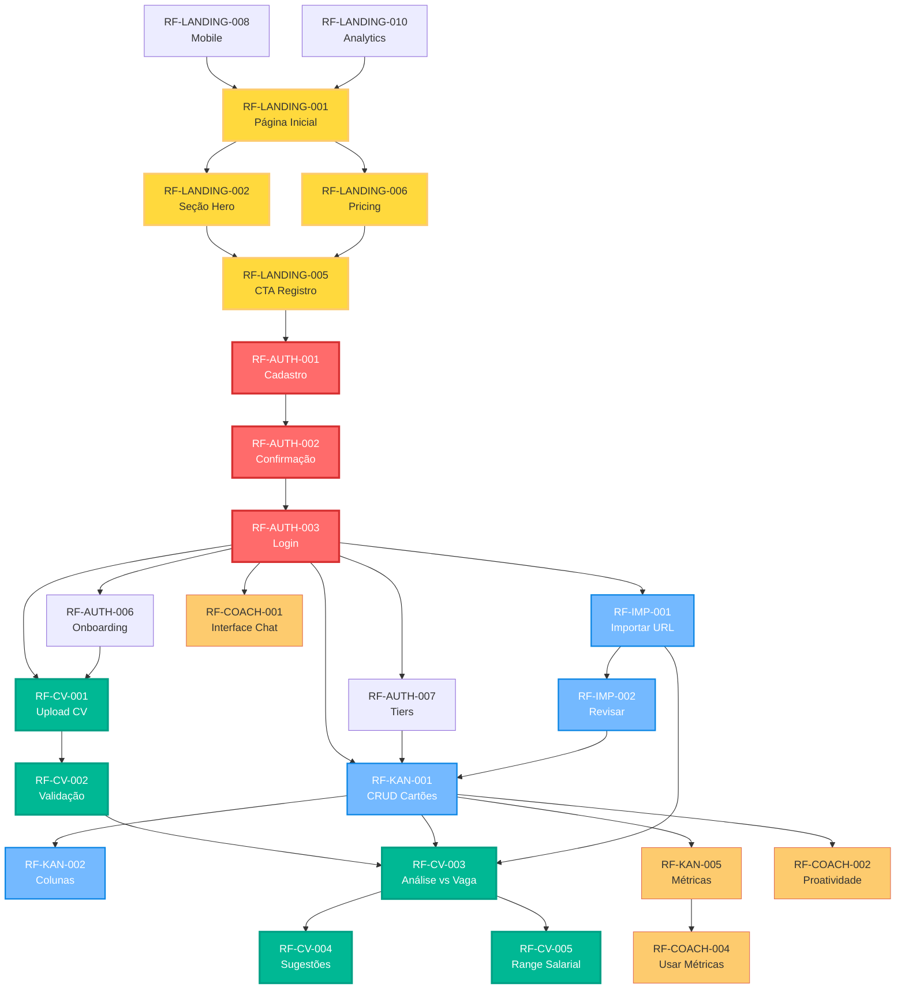

---
tags:
  - requisitos
  - dependencias
  - priorizacao
  - mvp
sticker: lucide//git-branch
---
# Mapeamento de Dependências dos Requisitos Funcionais - Recoloca.ai

**Versão**: 1.1 (Orquestração Inteligente e Specialized Intelligence)
**Data de Criação**: 06 de junho de 2025
**Data de Última Atualização**: Junho de 2025
**Baseado em**: [[docs/02_Requisitos/01_ERS.md]] (v1.1), [[docs/01_Guias_Centrais/02_GUIA_AVANCADO.md]] (v1.1), [[docs/03_Arquitetura_e_Design/01_HLD.md]] (v1.1)
**Criado por**: @AgenteOrquestrador em colaboração com Maestro

## 1. Objetivo e Metodologia

### 1.1. Objetivo
Este documento mapeia as **dependências técnicas e de negócio** entre os requisitos funcionais do [[docs/02_Requisitos/01_ERS.md]] para:
- Otimizar a sequência de desenvolvimento do MVP
- Identificar "componentes de núcleo" que desbloqueiam múltiplas funcionalidades
- Preparar a aplicação do framework RICE com contexto de dependências
- Minimizar retrabalho e riscos de desenvolvimento

### 1.2. Critérios Aplicados para Identificação de Dependências

**Critérios Explícitos Utilizados:**

1. **Dependência Técnica Direta (Peso: Alto)**
   - RF-B não pode funcionar sem RF-A estar implementado
   - Exemplo: RF-KAN-001 (criar cartões) depende de RF-AUTH-003 (login)

2. **Dependência de Dados/Estado (Peso: Alto)**
   - RF-B precisa de dados/estado criados por RF-A
   - Exemplo: RF-CV-003 (análise CV vs vaga) depende de RF-IMP-001 (importar vaga)

3. **Dependência de UX/Fluxo (Peso: Médio)**
   - RF-B faz mais sentido na jornada do usuário após RF-A
   - Exemplo: RF-AUTH-006 (onboarding) após RF-AUTH-003 (login)

4. **Dependência de Infraestrutura (Peso: Alto)**
   - RF-B usa componentes/serviços estabelecidos por RF-A
   - Exemplo: Todos os RFs dependem da infraestrutura de autenticação

5. **Valor de Desbloqueio (Peso: Médio-Alto)**
   - RF-A "desbloqueia" múltiplos outros RFs (componente de núcleo)
   - Exemplo: RF-AUTH-001/003 desbloqueia praticamente todos os outros

**Por que estes critérios:**
- **Técnica/Dados/Infraestrutura**: Impedem desenvolvimento paralelo, causam bloqueios absolutos
- **UX/Fluxo**: Impactam na validação com usuários e na coerência do produto
- **Valor de Desbloqueio**: Maximizam ROI do desenvolvimento, identificam prioridades estratégicas

## 2. Mapa de Dependências por Módulo
### 2.1. Módulo LANDING (Landing Page) - Componente de Aquisição

**Requisitos Fundamentais (Sem Dependências):**
- `RF-LANDING-001` (Página Inicial)
- `RF-LANDING-002` (Seção Hero)
- `RF-LANDING-006` (Seção Pricing)
- `RF-LANDING-008` (Responsividade Mobile)
- `RF-LANDING-010` (Analytics/Tracking)

**Dependências Internas do Módulo:**
```
RF-LANDING-001 → RF-LANDING-002 → RF-LANDING-005 (CTA Registro)
                                      ↓
                                   RF-AUTH-001 (Registro)
```

**Justificativa**: LANDING é o **componente de aquisição** - sem ele, não há descoberta nem conversão de usuários.

### 2.2. Módulo AUTH (Autenticação) - Componente de Núcleo

**Requisitos Fundamentais (Sem Dependências):**
- `RF-AUTH-001` (Cadastro)
- `RF-AUTH-002` (Confirmação Email)
- `RF-AUTH-003` (Login)
- `RF-AUTH-005` (Reset Senha)

**Dependências Internas do Módulo:**
```
RF-AUTH-001 → RF-AUTH-002 → RF-AUTH-003 → RF-AUTH-006 (Onboarding)
                                      ↓
                                   RF-AUTH-007 (Tiers)
                                      ↓
                              RF-AUTH-008/009/010/011/012
```

**Justificativa**: AUTH é o **componente de núcleo absoluto** - desbloqueia 100% das funcionalidades do sistema.

### 2.3. Módulo KAN (Kanban) - Componente de Núcleo Secundário

**Dependências Externas:**
- `RF-KAN-001` ← `RF-AUTH-003` (Login obrigatório)
- `RF-KAN-001` ← `RF-AUTH-007` (Tiers para limitações)

**Dependências Internas:**
```
RF-KAN-001 (CRUD cartões) → RF-KAN-002 (Colunas/Status)
                          → RF-KAN-003 (Filtros)
                          → RF-KAN-004 (Histórico)
                          → RF-KAN-005 (Métricas)
                          → RF-KAN-006/007 (Limitações Tier)
```

**Justificativa**: KAN é o **"cockpit" central** - necessário para gerenciar vagas importadas e visualizar progresso.

### 2.4. Módulo IMP (Importação)

**Dependências Externas:**
- `RF-IMP-001` ← `RF-AUTH-003` (Login)
- `RF-IMP-001` ← `RF-KAN-001` (Para salvar vaga importada)

**Dependências Internas:**
```
RF-IMP-001 (Importar URL) → RF-IMP-002 (Revisar/Editar)
                         → RF-KAN-001 (Salvar no Kanban)
```

**Justificativa**: IMP alimenta o Kanban com dados de vagas - dependência de dados crítica.

### 2.5. Módulo CV (Otimização de Currículo) - Funcionalidade "Momento AHA!"

**Dependências Externas:**
- `RF-CV-001` ← `RF-AUTH-003` (Login)
- `RF-CV-001` ← `RF-AUTH-006` (Onboarding sugere upload CV)
- `RF-CV-003` ← `RF-IMP-001` + `RF-KAN-001` (Vaga deve existir)
- `RF-CV-008/009` ← `RF-AUTH-007` (Limitações Tier)

**Dependências Internas:**
```
RF-CV-001 (Upload CV) → RF-CV-002 (Validação) → RF-CV-003 (Análise vs Vaga)
                                              → RF-CV-004 (Sugestões)
                                              → RF-CV-005 (Range Salarial)
                                              → RF-CV-006 (Download)
                                              → RF-CV-007 (Versões)
```

**Justificativa**: CV é o **"Momento AHA!" principal** - mas depende de ter vagas para comparar.

### 2.6. Módulo COACH (Assistente IA)

**Dependências Externas:**
- `RF-COACH-001` ← `RF-AUTH-003` (Login)
- `RF-COACH-002` ← `RF-KAN-001` (Monitorar atividades Kanban)
- `RF-COACH-004` ← `RF-KAN-005` (Usar métricas)
- `RF-COACH-005/006` ← `RF-AUTH-007` (Limitações Tier)

**Dependências Internas:**
```
RF-COACH-001 (Interface Chat) → RF-COACH-002 (Proatividade)
                             → RF-COACH-003 (Orientações)
                             → RF-COACH-004 (Usar Métricas)
```

**Justificativa**: COACH é **complementar** - agrega valor mas não é bloqueante para o fluxo principal.

## 3. Grafo de Dependências Críticas (Mermaid)



## 4. Componentes de Núcleo Identificados

### 4.1. Núcleo de Aquisição (Prioridade Máxima)
**Módulo LANDING - Requisitos de Conversão:**
- `RF-LANDING-001` (Página Inicial)
- `RF-LANDING-002` (Seção Hero)
- `RF-LANDING-005` (CTA Registro)
- `RF-LANDING-006` (Seção Pricing)
- `RF-LANDING-008` (Responsividade Mobile)

**Critério**: Desbloqueia 100% da aquisição de usuários. Sem landing page, não há conversão.

### 4.2. Núcleo Absoluto (Prioridade Máxima)
**Módulo AUTH - Requisitos Fundamentais:**
- `RF-AUTH-001` (Cadastro)
- `RF-AUTH-002` (Confirmação Email)
- `RF-AUTH-003` (Login)
- `RF-AUTH-007` (Tiers)

**Critério**: Desbloqueia 100% das funcionalidades. Sem AUTH, nada funciona.

### 4.3. Núcleo Secundário (Prioridade Alta)
**Módulo KAN + IMP - Fluxo Principal:**
- `RF-KAN-001` (CRUD Cartões)
- `RF-IMP-001` (Importar URL)
- `RF-IMP-002` (Revisar/Editar)

**Critério**: Estabelece o fluxo principal de valor - importar e gerenciar vagas.

### 4.4. Momento AHA! (Prioridade Alta)
**Módulo CV - Diferencial Competitivo:**
- `RF-CV-001` (Upload CV)
- `RF-CV-002` (Validação)
- `RF-CV-003` (Análise vs Vaga)
- `RF-CV-004` (Sugestões)

**Critério**: Entrega o principal diferencial competitivo e valor percebido.

## 5. Sequência Otimizada para Desenvolvimento

### 5.1. Fase 0 - Aquisição e Conversão (Semana 1)
1. `RF-LANDING-001/002/005/006` - Landing page core
2. `RF-LANDING-008` - Responsividade mobile
3. `RF-LANDING-010` - Analytics básico

### 5.2. Fase 1 - Fundação (Semanas 2-3)
4. `RF-AUTH-001/002/003` - Sistema de autenticação básico
5. `RF-AUTH-007` - Sistema de tiers (estrutura básica)
6. `RF-KAN-001` - CRUD básico de cartões

### 5.3. Fase 2 - Fluxo Principal (Semanas 4-5)
7. `RF-IMP-001/002` - Importação e revisão de vagas
8. `RF-KAN-002` - Sistema de colunas/status
9. `RF-CV-001/002` - Upload e validação de CV

### 5.4. Fase 3 - Momento AHA! (Semanas 6-7)
10. `RF-CV-003` - Análise CV vs Vaga (IA)
11. `RF-CV-004` - Sugestões de otimização
12. `RF-CV-005` - Range salarial

### 5.5. Fase 4 - Complementos (Semana 8)
13. `RF-AUTH-006` - Onboarding
14. `RF-KAN-005` - Métricas básicas
15. `RF-COACH-001` - Chat básico

## 6. Impacto para Aplicação do RICE

### 6.1. Ajustes no "Effort" (Esforço)
- **Componentes de Núcleo**: Esforço base + complexidade de dependências
- **Funcionalidades Dependentes**: Esforço reduzido se núcleo já existe

### 6.2. Bônus de "Unlocking Value" (Valor de Desbloqueio)
- **LANDING**: +60 pontos (desbloqueia aquisição de usuários)
- **AUTH**: +50 pontos (desbloqueia tudo)
- **KAN-001**: +30 pontos (desbloqueia CV, Coach, Métricas)
- **IMP-001**: +20 pontos (desbloqueia análises CV)

### 6.3. Ajustes na "Probability" (Probabilidade)
- **Sem Dependências**: Probabilidade base
- **Com Dependências Simples**: -10% probabilidade
- **Com Dependências Complexas**: -20% probabilidade

## 7. Riscos e Mitigações Identificados

### 7.1. Riscos de Dependência
1. **Gargalo AUTH**: Se AUTH falhar, tudo para
   - **Mitigação**: Priorizar validação técnica AUTH+Supabase

2. **Complexidade IA (CV)**: Análise CV vs Vaga é tecnicamente complexa
   - **Mitigação**: Protótipo isolado antes da integração

3. **Dependência Externa (APIs)**: Gemini, Supabase
   - **Mitigação**: Fallbacks e rate limiting

### 7.2. Oportunidades Identificadas
1. **Desenvolvimento Paralelo**: COACH pode ser desenvolvido em paralelo após KAN-001
2. **MVP Incremental**: Cada fase entrega valor utilizável
3. **Validação Precoce**: Fase 2 já permite validação com usuários

## 7. Considerações de Orquestração Inteligente

### 7.1 Impacto na Specialized Intelligence

**Métricas de Eficiência de Orquestração**:
- **Tempo de Resolução de Dependências**: Medição do tempo para resolver bloqueios entre módulos
- **Taxa de Paralelização**: Percentual de desenvolvimento que pode ocorrer em paralelo
- **Índice de Retrabalho**: Frequência de mudanças devido a dependências mal mapeadas

**Integração com Sistema RAG**:
- Documentação automática de decisões de dependência
- Histórico de mudanças e justificativas
- Base de conhecimento para futuras decisões similares

### 7.2 Agentes de IA Envolvidos

**Tier 1 (MVP)**:
- `@AgenteM_Backend`: Implementação das dependências técnicas críticas
- `@AgenteM_Frontend`: Coordenação de fluxos UX dependentes
- `@AgenteM_Testes`: Validação de integração entre módulos dependentes

**Tier 2 (Pós-MVP)**:
- `@AgenteM_DevOps`: Automação de deploy considerando dependências
- `@AgenteM_Performance`: Otimização baseada no grafo de dependências

## 8. Próximos Passos Recomendados

1. **Aplicar RICE com Dependências**: Usar este mapeamento para calcular RICE ajustado
2. **Validar Sequência**: Revisar com Maestro a sequência proposta
3. **Protótipos de Risco**: Validar tecnicamente AUTH+Supabase e parsing CV
4. **Definir Critérios de Aceitação**: Para cada componente de núcleo identificado
5. **Configurar Métricas**: Implementar dashboard de specialized intelligence
6. **Integrar RAG**: Documentar decisões na base de conhecimento

## 9. Histórico de Versões

### v1.1 (Junho 2025) - Orquestração Inteligente e Specialized Intelligence
- **Adição**: Considerações de orquestração inteligente e métricas de specialized intelligence
- **Melhoria**: Integração com sistema RAG para documentação automática de decisões
- **Expansão**: Mapeamento de agentes de IA por tier para implementação das dependências
- **Alinhamento**: Sincronização com documentos centrais atualizados (GUIA_AVANCADO v1.1, HLD v1.1, ERS v1.1)
- **Framework**: Inclusão de métricas de eficiência de orquestração e índices de qualidade
- **Correção**: Atualização de versões e datas para refletir o estado atual (Junho 2025)

### v1.0 (Maio 2025) - Versão Inicial
- **Criação**: Mapeamento inicial de dependências baseado no ERS v0.9
- **Estrutura**: Definição de critérios, grafo de dependências e componentes de núcleo
- **Metodologia**: Aplicação de framework RICE ajustado
- **Sequenciamento**: Proposta de fases de desenvolvimento otimizadas

## 10. Documentos Relacionados

### Documentos de Gestão
- [[docs/00_Gerenciamento_Projeto/01_TAP.md]] - Termo de Abertura do Projeto
- [[docs/01_Guias_Centrais/01_PLANO_MESTRE_RECOLOCA_AI.md]] - Plano Mestre e Roadmap
- [[docs/01_Guias_Centrais/02_GUIA_AVANCADO.md]] - Metodologia de Orquestração Inteligente
- [[docs/00_Gerenciamento_Projeto/KANBAN/]] - Prioridades e Status

### Documentos Técnicos
- [[docs/02_Requisitos/01_ERS.md]] - Especificação de Requisitos de Software
- [[docs/03_Arquitetura_e_Design/01_HLD.md]] - Arquitetura de Alto Nível
- [[docs/04_Agentes_IA/02_AGENTES_IA_MENTORES_OVERVIEW.md]] - Visão Geral dos Agentes
- [[docs/01_Guias_Centrais/07_GLOSSARIO_Recoloca_AI.md]] - Glossário do Projeto

### Perfis de Agentes
- [[docs/04_Agentes_IA/01_Perfis/]] - Perfis detalhados dos Agentes de IA Mentores

---

**Critérios de Validação deste Documento:**
- ✅ Dependências mapeadas com critérios explícitos
- ✅ Componentes de núcleo identificados
- ✅ Sequência otimizada proposta
- ✅ Impactos para RICE documentados
- ✅ Riscos e oportunidades analisados

**Nota**: Este documento é parte da "Documentação Viva" do projeto Recoloca.ai, integrado à metodologia de "Orquestração Inteligente" e "Specialized Intelligence". É atualizado automaticamente conforme o desenvolvimento progride e novas dependências são identificadas, com todas as decisões documentadas no sistema RAG para aprendizado contínuo.

--- FIM DO DOCUMENTO MAPEAMENTO_DEPENDENCIAS_RF.md (v1.1) ---