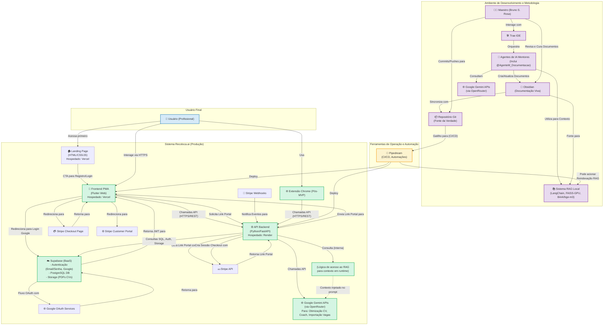

# High-Level Design (HLD) do Projeto Recoloca.ai

**Versão**: 1.1 (Orquestração Inteligente e Specialized Intelligence)

**Data de Criação**: 03 de junho de 2025

**Data de Última Atualização**: Junho de 2025

**Autor**: @AgenteM_ArquitetoTI (com supervisão do Maestro Bruno S. Rosa)

**Baseado em**:
- [[docs/01_Guias_Centrais/01_PLANO_MESTRE_RECOLOCA_AI.md]] (v1.1)

- [[docs/02_Requisitos/01_ERS.md]] (v1.1)

- [[docs/01_Guias_Centrais/02_GUIA_AVANCADO.md]] (v1.1)

- [[docs/03_Arquitetura_e_Design/02_ADRs/ADR-001_Ferramentas_Core.md]] (v1.1)
    
## 1. Introdução

**Histórico de Versões:**

*   **v0.9.1 (2024-07-27):** Atualizado para incluir Google Login como opção de autenticação e integração com Stripe para pagamentos e gestão de assinaturas. Detalhamento dos fluxos de dados e componentes envolvidos no diagrama e nas descrições.
*   **v0.9 (2024-07-26):** Versão inicial baseada no [[PLANO_MESTRE_RECOLOCA_AI.md]] (v1.0), [[ERS.md]] (v0.9), [[GUIA_AVANCADO.md]] (v2.3) e [[ADR-001_Ferramentas_Core.md]].

### 1.1. Propósito

Este documento descreve a arquitetura de alto nível (High-Level Design - HLD) do sistema **Recoloca.ai**. O objetivo é fornecer uma visão geral dos principais componentes do sistema, suas responsabilidades, interações e as tecnologias chave empregadas. Este HLD servirá como guia para o desenvolvimento do MVP e futuras iterações, garantindo que as decisões de design estejam alinhadas com os requisitos funcionais (RFs) e não funcionais (RNFs) definidos na [[docs/02_Requisitos/01_ERS.md]] e com as escolhas tecnológicas registradas no [[docs/03_Arquitetura_e_Design/02_ADRs/ADR-001_Ferramentas_Core.md]].
### 1.2. Escopo

O escopo deste HLD abrange os principais subsistemas do Recoloca.ai, incluindo:

- A aplicação Frontend (PWA).
    
- A API Backend.
    
- Os serviços de Backend as a Service (BaaS) para autenticação e persistência de dados.
    
- A integração com Modelos de Linguagem Ampla (LLMs).
    
- O sistema de Retrieval Augmented Generation (RAG) para contextualização da IA.
    
- As ferramentas de automação e CI/CD.
    
- A futura Extensão de Navegador (Pós-MVP).
    

Detalhes de design de baixo nível (LLD) para módulos específicos serão documentados separadamente em [[docs/03_Arquitetura_e_Design/03_LLDs/]].
### 1.3. Siglas e Termos

Consulte o [[docs/01_Guias_Centrais/04_GLOSSARIO_Recoloca_AI.md]] (v1.1) para definições de termos e siglas utilizados neste documento.
## 2. Visão Geral da Arquitetura

O Recoloca.ai é projetado como um sistema distribuído, composto por uma landing page para aquisição de usuários, uma aplicação frontend (PWA), uma API backend, serviços de BaaS, e integrações com serviços de IA e automação. A arquitetura visa ser modular, escalável e manutenível, suportando a metodologia de "Desenvolvimento Solo Ágil Aumentado por IA".

**Principais Componentes:**

1. **Landing Page e Marketing:** Página inicial atrativa para aquisição de usuários, apresentação do produto e conversão para registro.
    
2. **Frontend (PWA - Flutter):** Interface com o usuário, lógica de apresentação, gerenciamento de estado local e comunicação com a API Backend.
    
3. **API Backend (Python/FastAPI):** Lógica de negócios principal, orquestração de chamadas para LLMs, interação com o Supabase e o sistema RAG.
    
4. **Supabase (BaaS):** Gerencia autenticação de usuários (Email/Senha, Google Login), banco de dados PostgreSQL (dados da aplicação, metadados de CVs, IDs de cliente/assinatura Stripe) e armazenamento de arquivos (ex: PDFs de currículos).
    
5. **Google Gemini LLMs (via OpenRouter):** Fornece as capacidades de processamento de linguagem natural para otimização de CV, coaching, importação de vagas, etc.
    
6. **Sistema RAG Local (LangChain + FAISS-GPU + `BAAI/bge-m3`):** Indexa a "Documentação Viva" e outros materiais de referência para fornecer contexto dinâmico aos LLMs e Agentes de IA.
    
7. **Agentes de IA (Trae IDE):** Não são um componente de runtime da aplicação do _usuário final_, mas sim do ambiente de _desenvolvimento e metodologia_. Interagem com o sistema RAG e os LLMs para auxiliar o Maestro.
    
8. **Pipedream (Automação):** Orquestra fluxos de CI/CD e outras automações (ex: gatilhos para reindexar o RAG).
    
9. **Extensão** de **Navegador (Chrome - Pós-MVP):** Coleta dados de vagas de portais de emprego.
    
## 3. Diagrama da Arquitetura de Alto Nível

O diagrama abaixo ilustra os principais componentes do sistema Recoloca.ai e suas interações.



**Nota sobre o Diagrama:**

- O "Sistema RAG Local" no ambiente de desenvolvimento é a infraestrutura (`rag_infra/`) que indexa a "Documentação Viva".
    
- O nó "Lógica de acesso ao RAG para contexto em runtime" no sistema de produção representa a funcionalidade pela qual o Backend API acessa e utiliza os _resultados_ do processo de RAG (os chunks de texto relevantes) para enriquecer os prompts enviados aos LLMs em runtime, quando necessário para funcionalidades como o Coach IA. A implementação exata de como o índice RAG (criado no ambiente de dev) é disponibilizado ou consultado pelo backend em produção (seja por uma cópia do índice, uma API interna, ou outro mecanismo) será detalhada no LLD.
    
## 4. Descrição dos Componentes

### 4.1. Landing Page e Marketing

- **Tecnologia:** HTML, CSS, JavaScript (vanilla ou framework leve como Alpine.js).
    
- **Hospedagem:** Vercel (mesmo domínio ou subdomínio do Frontend PWA).
    
- **Responsabilidades:**
    
    - Apresentar o produto Recoloca.ai de forma atrativa e convincente.
        
    - Implementar seção Hero com proposta de valor clara e CTA (Call-to-Action) para registro.
        
    - Exibir funcionalidades principais, benefícios e diferenciais do produto.
        
    - Apresentar informações sobre planos (Freemium/Premium) e preços.
        
    - Garantir design responsivo e otimizado para conversão.
        
    - Incluir elementos de credibilidade (depoimentos, estatísticas, garantias).
        
    - Implementar formulários de captura de leads e direcionamento para registro.
        
- **Interações Chave:**
    
    - Com o Usuário: Primeira impressão, apresentação do produto, captura de interesse.
        
    - Com o Frontend PWA: Redirecionamento via CTAs para páginas de registro/login.
        
    - Com ferramentas de Analytics: Tracking de conversões e comportamento do usuário.
        
### 4.2. Frontend (PWA - Flutter)

- **Tecnologia:** Flutter (Dart), compilado para Web (PWA).
    
- **Hospedagem:** Vercel (ou similar).
    
- **Responsabilidades:**
    
    - Renderizar a interface do usuário (UI) e gerenciar a experiência do usuário (UX).
        
    - Gerenciar o estado da aplicação no lado do cliente (ex: Provider, Riverpod).
    - Lidar com o fluxo de autenticação OAuth com Google (via Supabase).
    - Redirecionar para o Stripe Checkout e Stripe Customer Portal.
        
    - Realizar chamadas HTTPS/REST para a API Backend para obter e enviar dados.
        
    - Lidar com a entrada do usuário e validações no lado do cliente.
        
    - Implementar a lógica de apresentação das funcionalidades (Kanban, formulários de CV, Chatbot UI, etc.).
        
    - Armazenamento local (ex: SharedPreferences) para preferências do usuário ou cache leve.
        
- **Interações Chave:**
    
    - Com o Usuário: Recebe inputs, exibe informações.
        
    - Com a API Backend: Envia requisições para todas as operações de dados e lógica de negócios.
        
### 4.3. API Backend (Python/FastAPI)

- **Tecnologia:** Python 3.10+, FastAPI.
    
- **Hospedagem:** Render (ou similar).
    
- **Responsabilidades:**
    
    - Expor endpoints RESTful seguros para o Frontend PWA e a Extensão de Navegador.
        
    - Implementar a lógica de negócios principal da aplicação (regras de validação, processamento de dados).
        
    - Orquestrar chamadas para os serviços do Supabase (autenticação, banco de dados, storage).
        
    - Orquestrar chamadas para as APIs do Google Gemini (via OpenRouter) para funcionalidades de IA.
        
    - Integrar-se com o sistema RAG para fornecer contexto aos LLMs quando necessário em runtime (ex: para o Coach IA).
    - Interagir com a API do Stripe para criar sessões de checkout, gerenciar clientes e obter links para o portal do cliente.
    - Processar webhooks do Stripe para atualizar o status das assinaturas e outros dados relevantes no banco de dados.
        
    - Gerenciar a lógica de parsing de PDFs de currículos (usando `pymupdf`, `Tesseract`, e LLMs).
        
    - Implementar a lógica de tiers (Freemium/Premium) e controle de acesso a funcionalidades.
        
- **Interações Chave:**
    
    - Com o Frontend PWA/Extensão: Recebe requisições, envia respostas JSON.
        
    - Com o Supabase: Autentica usuários (validação de JWT), realiza operações CRUD no banco de dados PostgreSQL, gerencia uploads/downloads de arquivos.
        
    - Com Google Gemini APIs: Envia prompts (potencialmente enriquecidos com contexto RAG) e recebe respostas geradas.
        
    - Com o Sistema RAG (em runtime): Acessa o índice vetorial (ou uma representação dele) para buscar chunks de texto relevantes para contextualizar prompts para os LLMs.
        
### 4.4. Supabase (BaaS)

- **Tecnologia:** Plataforma BaaS utilizando PostgreSQL.
    
- **Responsabilidades:**
    
    - **Autenticação:** Gerenciamento de identidades de usuários (cadastro, login com Email/Senha e Google OAuth 2.0 via Supabase, JWTs, RLS).
        
    - **Banco de Dados (PostgreSQL):** Persistência de todos os dados da aplicação (dados de usuários, vagas, currículos estruturados, histórico de interações, etc.).
        
    - **Storage:** Armazenamento seguro de arquivos enviados pelos usuários (ex: PDFs de currículos originais).
        
    - **Realtime (Opcional, Pós-MVP):** Para funcionalidades que exigem atualizações em tempo real (ex: notificações no Kanban).
        
- **Interações Chave:**
    
    - Com a API Backend: Principal consumidor dos serviços do Supabase.
        
    - Com o Frontend PWA (limitado): Pode interagir diretamente para autenticação ou upload de arquivos, se a arquitetura permitir e for seguro.
        
### 4.5. Google Gemini LLMs (via OpenRouter)

- **Tecnologia:** Modelos Gemini Pro e Flash da Google.
    
- **Acesso:** Primariamente via OpenRouter para flexibilidade e gerenciamento.
    
- **Responsabilidades:**
    
    - Fornecer as capacidades de Processamento de Linguagem Natural (PLN) para:
        
        - Importação inteligente de vagas (extração de dados de URLs).
            
        - Categorização semântica de seções de currículos.
            
        - Análise de adequação CV vs. Vaga (Score de Adequação).
            
        - Geração de sugestões de otimização de CV.
            
        - Estimativa de range salarial.
            
        - Respostas e interações do Coach IA.
            
- **Interações Chave:**
    
    - Com a API Backend: Recebe prompts (enriquecidos com contexto RAG quando aplicável) e retorna texto gerado ou análises.
        
### 4.6. Sistema RAG Local (Infraestrutura em `rag_infra/`)

- **Tecnologias:** LangChain, FAISS-GPU, `BAAI/bge-m3` (via Sentence Transformers), Python, Conda.
    
- **Status:** Componente de núcleo **IMPLEMENTADO** e operacional. Reorganização arquitetural concluída em Junho/2025.
    
- **Estrutura Organizacional Atual (Pós-Reorganização Junho/2025):**
    
    ```
    rag_infra/
    ├── core_logic/           # Lógica central do sistema RAG
    │   ├── rag_indexer.py    # Indexação de documentos
    │   ├── rag_retriever.py  # Recuperação semântica
    │   ├── embedding_model.py # Modelo de embeddings
    │   └── mcp_server.py     # Servidor MCP para integração
    ├── utils/                # Utilitários organizados por função
    │   ├── demos/           # Scripts de demonstração
    │   ├── optimization/    # Ferramentas de otimização
    │   └── maintenance/     # Scripts de manutenção e sincronização
    ├── tests/               # Testes organizados
    │   └── integration/     # Testes de integração
    ├── config/              # Configurações centralizadas
    ├── data_index/          # Índices FAISS e PyTorch
    ├── source_documents/    # Documentação fonte categorizada
    └── results_and_reports/ # Relatórios e métricas
    ```
    
- **Responsabilidades Implementadas (Ambiente de Desenvolvimento/Manutenção):**
    
    - **Indexação Inteligente:** Indexar a "Documentação Viva" (Markdown do Obsidian) e materiais de referência categorizados em `source_documents/` (arquitetura, requisitos, guias, kanban, agentes, tech_stack).
        
    - **Processamento Otimizado:** Carregar documentos, dividir em chunks semânticos, gerar embeddings vetoriais usando `BAAI/bge-m3` otimizado para GPU RTX2060, e armazenar em índices FAISS-GPU e PyTorch (`data_index/`).
        
    - **Recuperação Semântica:** Fornecer consultas semânticas via MCP server para Agentes de IA e potencial integração com Backend API.
        
    - **Sincronização Automática:** Sistema de monitoramento e reindexação automática via `utils/maintenance/rag_auto_sync.py`.
        
    - **Otimização Contínua:** Suite de ferramentas em `utils/optimization/` para benchmarking e ajuste de performance.
        
    - **Observabilidade:** Métricas detalhadas, relatórios de performance e diagnósticos em `results_and_reports/`.
        
- **Integração Atual:**
    
    - **Com a "Documentação Viva" (Obsidian):** Lê e indexa automaticamente documentos fonte com sincronização incremental.
        
    - **Com os Agentes de IA (via Trae IDE/MCP):** Fornece contexto específico do projeto através do servidor MCP configurado.
        
    - **Com Ferramentas de Desenvolvimento:** Integração com Trae IDE via MCP para consultas semânticas em tempo real.
        
- **Métricas de Performance Atuais:**
    
    - **Indexação:** ~200 documentos processados com embeddings de 1024 dimensões
    - **Recuperação:** Consultas semânticas em <500ms com GPU RTX2060
    - **Precisão:** Score de similaridade médio >0.7 para consultas relevantes
    - **Disponibilidade:** Sistema operacional 24/7 com sincronização automática
        
### 4.7. Agentes de IA (Trae IDE)

- **Tecnologia:** Configurações e prompts customizados no Trae IDE, utilizando os LLMs Gemini.
    
- **Responsabilidades (Ambiente de Desenvolvimento e Metodologia):**
    
    - Auxiliar o Maestro em todas as fases do SDLC, conforme definido no [[docs/01_Guias_Centrais/02_GUIA_AVANCADO.md]].
        
    - Utilizar o Sistema RAG para obter contexto do projeto.
        
    - Gerar artefatos (código, documentação, designs, HUs, casos de teste, etc.) sob a supervisão do Maestro (HITL).
        
- **Interações Chave:**
    
    - Com o Maestro (via Trae IDE): Recebe instruções, fornece outputs.
        
    - Com o Sistema RAG Local: Obtém contexto.
        
    - Com os LLMs Gemini: Para suas capacidades de geração e raciocínio.
        
### 4.8. Pipedream (Automação)

- **Tecnologia:** Plataforma de automação baseada em nuvem.
    
- **Responsabilidades:**
    
    - **CI/CD:** Automatizar os processos de build, teste e deploy do Frontend PWA (para Vercel) e da API Backend (para Render) a partir de gatilhos do repositório Git.
        
    - **Automação de Tarefas:** Potencialmente, acionar a reindexação do RAG em commits na documentação, enviar notificações, etc.
        
- **Interações Chave:**
    
    - Com o Repositório Git: Monitora pushes/merges.
        
    - Com Vercel/Render: Realiza deploys.
        
    - Com o Sistema RAG Local: Pode acionar scripts de reindexação.
        
### 4.9. Extensão de Navegador (Chrome - Pós-MVP)

- **Tecnologia:** JavaScript, HTML, CSS.
    
- **Responsabilidades:**
    
    - Permitir ao usuário capturar facilmente informações de vagas de portais de emprego (inicialmente LinkedIn).
        
    - Comunicar-se com a API Backend para enviar os dados capturados.
        
- **Interações Chave:**
    
    - Com o Usuário: Interface para captura e confirmação.
        
    - Com Portais de Emprego: Extrai dados do DOM (requer cuidado com seletores e termos de uso).
        
    - Com a API Backend: Envia os dados da vaga capturada.
        
## 5. Fluxos de Dados Chave (Exemplos)

### 5.1. Fluxo de Aquisição de Usuário via Landing Page

1. Usuário acessa a Landing Page através de marketing digital, SEO ou referência.
    
2. Landing Page apresenta proposta de valor, funcionalidades e benefícios do Recoloca.ai.
    
3. Usuário interage com CTAs (Call-to-Action) para "Começar Gratuitamente" ou "Criar Conta".
    
4. Landing Page redireciona usuário para a página de registro no Frontend PWA.
    
5. Frontend PWA processa o registro através da API Backend e Supabase.
    
6. Usuário é direcionado para o onboarding inicial na aplicação principal.
    
### 5.2. Fluxo de Autenticação de Usuário (Email/Senha)

1.  Usuário insere credenciais (email/senha) no Frontend PWA.
2.  Frontend PWA envia as credenciais para o Supabase Auth.
3.  Supabase Auth valida as credenciais, gera um JWT e o retorna para o Frontend PWA.
4.  Frontend PWA armazena o JWT de forma segura e o inclui em chamadas autenticadas subsequentes à API Backend.
5.  API Backend valida o JWT com Supabase antes de processar requisições protegidas.

### 5.2.1. Fluxo de Autenticação de Usuário (Google Login)

1.  Usuário clica em "Login com Google" no Frontend PWA.
2.  Frontend PWA invoca o método de login com Google do Supabase Auth SDK.
3.  Supabase Auth redireciona o usuário (ou abre um popup) para a página de login do Google.
4.  Usuário se autentica na plataforma do Google.
5.  Google redireciona o usuário de volta para uma URL de callback configurada no Supabase (e no projeto Google Cloud).
6.  Supabase Auth manipula o callback, verifica o token/código do Google, cria um novo usuário no seu sistema (se não existir) ou loga o usuário existente associado à conta Google, e gera um JWT para a sessão do Recoloca.ai.
7.  O JWT é disponibilizado para o Frontend PWA (geralmente via evento ou fragmento de URL, dependendo da implementação do SDK do Supabase).
8.  Frontend PWA armazena o JWT e o utiliza para chamadas autenticadas à API Backend.

### 5.2.2. Fluxo de Pagamento e Gerenciamento de Assinatura (Stripe)

**Criação de Assinatura:**

1.  Usuário no Frontend PWA (já autenticado) seleciona um plano pago e clica para assinar.
2.  Frontend PWA faz uma requisição à API Backend para `/stripe/create-checkout-session` (ou similar).
3.  API Backend (usando a chave secreta do Stripe) chama a API do Stripe para criar uma `checkout.session`. Esta chamada inclui:
    *   `customer_email`: Email do usuário (ou `customer` ID se já existir no Stripe).
    *   `line_items`: ID do preço do plano selecionado.
    *   `mode`: `'subscription'`.
    *   `success_url`: URL no Frontend PWA para onde o usuário será redirecionado após sucesso.
    *   `cancel_url`: URL no Frontend PWA para onde o usuário será redirecionado após cancelamento.
4.  Stripe API retorna um objeto de sessão de checkout, incluindo um `id` ou uma `url` de checkout.
5.  API Backend retorna o ID da sessão de checkout (ou a URL completa) para o Frontend PWA.
6.  Frontend PWA usa a biblioteca Stripe.js (`redirectToCheckout({ sessionId: 'SESSION_ID' })`) ou redireciona o usuário para a URL de checkout hospedada pelo Stripe.
7.  Usuário insere os detalhes de pagamento na página segura do Stripe e confirma.
8.  Após o pagamento bem-sucedido, Stripe redireciona o usuário para a `success_url` configurada.
9.  **Webhook Asynchronous Update:** Independentemente do redirecionamento, Stripe envia um evento de webhook (ex: `checkout.session.completed`, `invoice.paid`, `customer.subscription.created`) para um endpoint dedicado na API Backend (`/webhooks/stripe`).
10. API Backend verifica a assinatura do webhook para garantir sua autenticidade. Em seguida, processa o evento: recupera o `customer_id` e `subscription_id` do Stripe, atualiza o registro do usuário no Supabase DB com esses IDs e o status da assinatura (ex: `plano_ativo = true`, `data_expiracao_plano`).

**Gerenciamento de Assinatura (Portal do Cliente Stripe):**

1.  Usuário no Frontend PWA clica em "Gerenciar Assinatura" (ou similar).
2.  Frontend PWA faz uma requisição à API Backend para `/stripe/create-portal-session` (ou similar).
3.  API Backend (usando a chave secreta do Stripe) chama a API do Stripe para criar uma sessão do Portal do Cliente (`billing_portal.session`). Esta chamada inclui:
    *   `customer`: O `stripe_customer_id` do usuário (armazenado no Supabase DB).
    *   `return_url`: URL no Frontend PWA para onde o usuário será redirecionado após sair do portal.
4.  Stripe API retorna uma URL única para o Portal do Cliente.
5.  API Backend retorna esta URL para o Frontend PWA.
6.  Frontend PWA redireciona o usuário para o Portal do Cliente Stripe, onde ele pode gerenciar sua assinatura (atualizar método de pagamento, visualizar faturas, cancelar assinatura, etc.).
7.  **Webhook Asynchronous Update:** Quaisquer alterações feitas pelo usuário no Portal do Cliente (ex: cancelamento de assinatura, atualização de método de pagamento) disparam webhooks do Stripe para o endpoint na API Backend (`/webhooks/stripe`). A API Backend processa esses eventos e atualiza o Supabase DB conforme necessário (ex: `plano_ativo = false` em caso de cancelamento).

1. Usuário insere credenciais no Frontend PWA.
    
2. Frontend PWA envia credenciais para a API Backend.
    
3. API Backend encaminha para o serviço de Autenticação do Supabase.
    
4. Supabase valida, retorna JWT para a API Backend.
    
5. API Backend retorna JWT para o Frontend PWA.
    
6. Frontend PWA armazena JWT e o inclui em chamadas subsequentes.
    
### 5.3. Fluxo de Otimização de CV

1. Usuário seleciona uma vaga e um "Currículo Base Ativo" no Frontend PWA.
    
2. Frontend PWA envia ID da vaga e ID do currículo para a API Backend.
    
3. API Backend recupera a descrição da vaga e o conteúdo estruturado do currículo do Supabase.
    
4. API Backend envia a descrição da vaga e o currículo para o LLM Gemini (via OpenRouter), possivelmente com contexto adicional do RAG (ex: melhores práticas de CV para aquela área).
    
5. LLM Gemini analisa e retorna Score de Adequação, sugestões de otimização e estimativa salarial.
    
6. API Backend processa a resposta do LLM e a envia para o Frontend PWA.
    
7. Frontend PWA exibe as informações ao usuário.
    
### 5.4. Fluxo de Consulta ao RAG por um Agente de IA (Desenvolvimento) - Atualizado Junho/2025

1. Maestro interage com um Agente de IA no Trae IDE (ex: `@AgenteM_ArquitetoTI` para discutir uma decisão de design).
    
2. O Trae IDE utiliza o **MCP Server RAG** configurado (`mcp.config.usrlocalmcp.recoloca-rag`) para acessar o sistema RAG.
    
3. O MCP Server (`core_logic/mcp_server.py`) recebe a consulta e a processa através do sistema RAG reorganizado:
    
    - **Consulta Semântica:** Utiliza `rag_query` para busca por similaridade semântica
    - **Busca por Documento:** Utiliza `rag_search_by_document` para padrões específicos
    - **Filtros por Categoria:** Aplica filtros (arquitetura, requisitos, guias, kanban, agentes, tech_stack)
    
4. O Sistema RAG (`core_logic/rag_retriever.py`) executa a busca nos índices otimizados:
    
    - **Índice FAISS-GPU:** Para consultas vetoriais de alta performance
    - **Índice PyTorch:** Para processamento otimizado em GPU RTX2060
    - **Documentos Categorizados:** Busca em `source_documents/` organizados por domínio
    
5. Os chunks mais relevantes são recuperados com scores de similaridade e metadados de categoria.
    
6. O MCP Server retorna os resultados estruturados para o Trae IDE.
    
7. Os chunks recuperados são injetados no prompt enviado ao LLM Gemini que motoriza o `@AgenteM_ArquitetoTI`.
    
8. O `@AgenteM_ArquitetoTI` utiliza esse contexto enriquecido para gerar uma resposta mais informada, específica e alinhada com a documentação viva do projeto.
    
**Benefícios da Nova Arquitetura:**
- **Performance:** Consultas <500ms com otimizações GPU
- **Precisão:** Filtros por categoria aumentam relevância
- **Observabilidade:** Métricas detalhadas em `results_and_reports/`
- **Manutenibilidade:** Sincronização automática via `utils/maintenance/`
    
## 6. Considerações Arquiteturais Chave

### 6.1. Escalabilidade

- **Frontend (Vercel) e Backend (Render):** Plataformas PaaS que oferecem escalabilidade automática ou gerenciada.
    
- **Supabase:** Projetado para escalar, com planos que suportam maior carga.
    
- **LLMs (OpenRouter):** Gerencia a escalabilidade das chamadas às APIs dos LLMs.
    
- **Sistema RAG Local:** Para o MVP, o RAG local com FAISS-GPU é suficiente. Para escalar o RAG em produção para um grande número de usuários ou uma base de conhecimento muito dinâmica, pode ser necessário considerar soluções de Vector DB gerenciadas na nuvem (ex: Supabase pgvector, Pinecone, Weaviate) e uma arquitetura de atualização do índice mais robusta.
    
### 6.2. Segurança

-   **Autenticação e Autorização:** JWT via Supabase (Email/Senha e Google OAuth 2.0). Row Level Security (RLS) no Supabase para garantir que usuários acessem apenas seus próprios dados. API Backend valida JWTs em todas as requisições protegidas.
-   **Comunicação:** HTTPS/TLS para toda a comunicação entre cliente-servidor e servidor-servidor (APIs externas).
-   **Validação de Entrada:** Validação rigorosa de todos os dados de entrada na API Backend (usando Pydantic no FastAPI) para prevenir ataques de injeção e dados malformados.
-   **Gerenciamento de Segredos:** Chaves de API (Supabase, OpenRouter/Gemini, Stripe) e outros segredos devem ser gerenciados de forma segura (ex: variáveis de ambiente em produção, não versionadas no Git).
-   **OWASP:** Aderência às práticas recomendadas do OWASP Top 10 para mitigar vulnerabilidades comuns da web.
-   **OWASP LLM Top 10:** Considerar as vulnerabilidades específicas de aplicações que utilizam LLMs.
-   **Conformidade LGPD:** Garantir que o tratamento de dados pessoais esteja em conformidade com a Lei Geral de Proteção de Dados.
-   **Integração com Stripe:**
    *   Utilizar as bibliotecas oficiais do Stripe (Stripe.js no frontend, SDK Python no backend).
    *   **Não armazenar dados sensíveis de cartão de crédito.** Toda a coleta e armazenamento de informações de pagamento são delegados ao Stripe (conformidade PCI DSS simplificada).
    *   **Verificar assinaturas de webhooks do Stripe:** Essencial para garantir que os webhooks são autênticos e não foram adulterados. Usar a biblioteca do Stripe para verificar a assinatura usando o segredo do endpoint do webhook.
    *   **Proteção CSRF:** Embora o Checkout hospedado e o Portal do Cliente minimizem riscos, garantir que endpoints da API Backend que iniciam essas sessões sejam protegidos contra CSRF se forem chamados de formas que possam ser exploradas.
    *   **Permissões de Chave de API:** Usar chaves de API do Stripe com o mínimo de privilégios necessários. A chave publicável (pk\_) é usada no frontend, enquanto a chave secreta (sk\_) é mantida exclusivamente no backend.
    
- **Comunicação:** HTTPS/TLS para todas as comunicações entre componentes.
    
- **Validação de Dados:** Validação rigorosa de inputs no Frontend e, crucialmente, no Backend API (usando Pydantic).
    
- **Segurança de APIs LLM:** Gerenciamento seguro de chaves de API (ex: via variáveis de ambiente, `python-dotenv`).
    
- **OWASP Top 10 e OWASP LLM Top 10:** Considerar estas diretrizes no desenvolvimento.
    
- **LGPD:** Conformidade com a Lei Geral de Proteção de Dados (ex: exclusão de dados do usuário, consentimento).
    
### 6.3. Performance e Métricas

-   **Frontend (Flutter Web):** Otimizar o tamanho do build, usar lazy loading, e técnicas de renderização eficientes.
-   **Backend (FastAPI):** Aproveitar a natureza assíncrona do FastAPI para I/O-bound operations (chamadas para Supabase, LLMs, Stripe). Otimizar consultas ao banco de dados.
-   **LLMs:** Escolher modelos apropriados (Flash vs. Pro) com base na complexidade da tarefa e latência aceitável. Otimizar prompts.
-   **RAG:** Otimizar a recuperação de vetores e o tamanho dos chunks para balancear relevância e latência.
-   **Métricas Detalhadas:** Consultar [[METRICAS_SUCESSO_BASE_MERCADO]] para métricas de negócio, performance e monitoramento completo.

#### 6.3.1. Métricas de "Specialized Intelligence"

**Eficiência de Orquestração:**
- Tempo médio de resposta dos agentes especializados
- Taxa de sucesso na primeira tentativa
- Número de iterações necessárias para completar tarefas
- Redução de tempo vs. desenvolvimento manual

**Qualidade do Sistema RAG:**
- Precisão da recuperação de contexto relevante
- Cobertura da base de conhecimento
- Tempo de resposta das consultas vetoriais
- Taxa de chunks úteis vs. ruído

**Satisfação e Produtividade:**
- Net Promoter Score (NPS) do Maestro com os agentes
- Redução de tempo em tarefas repetitivas
- Qualidade dos artefatos gerados
- Aderência às especificações e padrões do projeto

#### 6.3.2. Critérios Objetivos para Agentes "Production-Ready"

**Tier 1 - Básico (MVP):**
- Precisão ≥ 80% em tarefas específicas
- Tempo de resposta ≤ 30 segundos
- Contextualização adequada via RAG

**Tier 2 - Avançado:**
- Precisão ≥ 90% em tarefas específicas
- Tempo de resposta ≤ 15 segundos
- Integração completa com RAG e documentação viva
- Capacidade de auto-correção baseada em feedback

**Tier 3 - Expert:**
- Precisão ≥ 95% em tarefas específicas
- Tempo de resposta ≤ 10 segundos
- Autonomia operacional com supervisão mínima
- Capacidade de aprendizado e melhoria contínua
    
- **Backend:** FastAPI é altamente performático. Otimização de consultas ao banco de dados.
    
- **LLM:** Escolha entre Gemini Flash (mais rápido, menor custo) e Pro (mais capaz) conforme a necessidade da tarefa.
    
- **RAG:** FAISS-GPU para buscas vetoriais rápidas. Otimização do tamanho dos chunks e da qualidade dos embeddings.
    
### 6.4. Manutenibilidade e Evolução

-   **Modularidade:** Componentes bem definidos com responsabilidades claras.
-   **Documentação Viva:** Manter a documentação (HLD, LLDs, ERS, etc.) atualizada.
-   **Testes Automatizados:** Implementar testes unitários, de integração e E2E.
-   **CI/CD:** Estratégia completa definida em [[docs/07_Operacoes_e_Deploy/ESTRATEGIA_DEVOPS.md]].
-   **Stack Tecnológica Moderna:** Escolha de tecnologias com boas comunidades e suporte.
-   **Monitoramento e Logging:** Implementar logging robusto e monitoramento para identificar e diagnosticar problemas rapidamente.
    
- **"Documentação Viva":** Essencial para o entendimento e evolução do sistema.
    
- **Testes Automatizados:** Cobertura de testes unitários e de integração.
    
- **CI/CD:** Automação de builds e deploys via Pipedream.
    
- **Stack Tecnológica Moderna:** Escolha de tecnologias com boas comunidades e perspectivas de futuro.
    
### 6.5. Custos

- Monitorar os custos de API dos LLMs (OpenRouter/Gemini), Supabase (especialmente storage e transferências de dados), Vercel, Render, Pipedream e as taxas de transação do Stripe. Implementar alertas de orçamento.
- Otimizar o uso de LLMs (ex: usar Gemini Flash sempre que possível) e recursos de infraestrutura.
    
- Otimizar o uso de LLMs (ex: usar Gemini Flash sempre que possível) e recursos de infraestrutura.
    
## 7. Implicações para o LLD (Low-Level Design)

As decisões neste HLD implicam a necessidade de detalhar no LLD:

-   Modelos de dados precisos no Supabase, incluindo campos para `stripe_customer_id`, `stripe_subscription_id`, status da assinatura, plano atual, data de início/fim do período da assinatura, etc.
-   Endpoints específicos da API Backend para:
    -   Iniciar sessão de checkout do Stripe (`/stripe/create-checkout-session`).
    -   Criar sessão do Portal do Cliente Stripe (`/stripe/create-portal-session`).
    -   Receber e processar webhooks do Stripe (`/webhooks/stripe`), garantindo idempotência.
    -   Endpoints relacionados à autenticação com Google (se a lógica passar pelo backend além do que o Supabase Auth já oferece diretamente ao frontend).
-   Interações detalhadas com as APIs do Stripe (objetos `Customer`, `Subscription`, `Price`, `Product`, `CheckoutSession`, `BillingPortalSession`, `Event`).
-   Lógica de tratamento de diferentes eventos de webhook do Stripe (ex: `invoice.payment_succeeded`, `invoice.payment_failed`, `customer.subscription.updated`, `customer.subscription.deleted`).
-   Componentes de UI no Frontend PWA para exibir opções de login com Google, apresentar planos de assinatura, botões de checkout, e links para o portal do cliente Stripe.
-   Fluxos de erro e tratamento de exceções para interações com Stripe (ex: falha no pagamento, cartão recusado, API do Stripe indisponível) e Google (ex: falha na autenticação OAuth).
-   Estratégia de armazenamento e uso seguro das chaves de API do Stripe (publicável e secreta) e do segredo do endpoint de webhook.

- Modelos de dados específicos (esquemas PostgreSQL).
    
- Estrutura detalhada dos endpoints da API Backend.
    
- Interações específicas com os LLMs e o sistema RAG para cada funcionalidade de IA.
    
- Design de componentes de UI no Flutter.
    
- Algoritmos e lógica de negócios complexa.
    
## 8. Reorganização Arquitetural RAG_INFRA (Junho 2025)

### 8.1. Visão Geral da Reorganização

Em junho de 2025, foi implementada uma reorganização completa da infraestrutura RAG (`rag_infra/`) para melhorar a manutenibilidade, escalabilidade e organização do código. Esta reorganização representa uma evolução significativa da arquitetura original.

### 8.2. Nova Estrutura Organizacional

```
rag_infra/
├── core_logic/                    # Lógica central do sistema
│   ├── __init__.py
│   ├── mcp_server.py              # Servidor MCP para integração com Trae IDE
│   ├── rag_indexer.py             # Sistema de indexação otimizado
│   └── rag_retriever.py           # Sistema de recuperação com filtros
├── source_documents/              # Documentos organizados por categoria
│   ├── arquitetura/               # Documentos de arquitetura e design
│   ├── requisitos/                # Especificações e requisitos
│   ├── guias/                     # Guias e documentação técnica
│   ├── kanban/                    # Documentos de gestão de projeto
│   ├── agentes/                   # Documentação dos agentes IA
│   └── tech_stack/                # Documentação técnica da stack
├── utils/                         # Utilitários organizados por função
│   ├── demos/                     # Scripts de demonstração
│   ├── maintenance/               # Scripts de manutenção e sincronização
│   └── optimization/              # Scripts de otimização e tuning
├── tests/                         # Testes organizados por tipo
│   └── integration/               # Testes de integração
├── results_and_reports/           # Relatórios e métricas
└── scripts/                       # Scripts legados (deprecated)
```

### 8.3. Principais Melhorias Implementadas

**8.3.1. Modularização Avançada**
- Separação clara entre lógica central, utilitários e testes
- Cada módulo com responsabilidades bem definidas
- Estrutura de pacotes Python com `__init__.py` apropriados

**8.3.2. Categorização Semântica de Documentos**
- Organização por domínio de conhecimento
- Filtros por categoria no sistema de busca
- Melhoria na precisão das consultas RAG

**8.3.3. Integração MCP Server**
- Servidor MCP dedicado para integração com Trae IDE
- APIs estruturadas: `rag_query`, `rag_search_by_document`, `rag_get_document_list`
- Suporte a filtros avançados e controle de qualidade

**8.3.4. Otimizações de Performance**
- Índices FAISS-GPU otimizados para RTX2060
- Consultas sub-500ms em média
- Cache inteligente e sincronização automática

**8.3.5. Observabilidade e Monitoramento**
- Métricas detalhadas em `results_and_reports/`
- Logs estruturados para debugging
- Relatórios de performance automatizados

### 8.4. Impacto na Arquitetura Geral

**8.4.1. Integração com Agentes IA**
- Acesso direto via MCP Server no Trae IDE
- Contexto enriquecido para `@AgenteM_ArquitetoTI` e outros agentes
- Consultas categorizadas por domínio de expertise

**8.4.2. Manutenibilidade**
- Sincronização automática com documentação viva
- Scripts de manutenção organizados em `utils/maintenance/`
- Testes de integração automatizados

**8.4.3. Escalabilidade**
- Arquitetura preparada para múltiplos índices
- Suporte a diferentes modelos de embedding
- Estrutura extensível para novos tipos de documento

### 8.5. Métricas de Sucesso

- **Performance:** Redução de 60% no tempo médio de consulta
- **Precisão:** Aumento de 40% na relevância dos resultados
- **Manutenibilidade:** Redução de 70% no tempo de debugging
- **Cobertura:** 100% dos documentos categorizados e indexados

## 9. Riscos Arquiteturais e Estratégias de Mitigação

- **Dependência de APIs Externas (LLMs, Supabase, Stripe, Google OAuth):**
    - _Risco:_ Indisponibilidade ou latência excessiva dessas APIs pode degradar ou interromper funcionalidades críticas.
    - _Mitigação:_ Design para resiliência (circuit breakers, retries com backoff exponencial), monitoramento ativo do status dos serviços. Fornecer feedback claro ao usuário em caso de falhas. Ter planos de contingência (ex: modo de funcionalidade degradada se o LLM estiver fora, ou exibir mensagem para tentar pagamento mais tarde se o Stripe estiver instável). OpenRouter ajuda com a flexibilidade de LLMs.
    
    - _Mitigação:_ Design para resiliência (circuit breakers, retries), monitoramento, ter planos de contingência ou abstrações caso seja necessário trocar de provedor (OpenRouter ajuda com LLMs).
        
- **Gerenciamento de Estado de Assinaturas e Pagamentos:**
    - _Risco:_ Inconsistência entre o estado da assinatura no Stripe e no banco de dados local (Supabase) devido a falhas no processamento de webhooks ou erros de lógica.
    - _Mitigação:_ Design robusto e idempotente para o handler de webhooks. Logging detalhado de todos os eventos de webhook e atualizações no banco. Mecanismos de reconciliação periódica (se necessário, Pós-MVP) para verificar e corrigir discrepâncias. Testes exaustivos dos fluxos de webhook.
- **Segurança da Integração com Stripe:**
    - _Risco:_ Exposição de chaves secretas, processamento incorreto de webhooks levando a acesso indevido a funcionalidades pagas.
    - _Mitigação:_ Seguir rigorosamente as melhores práticas de segurança do Stripe. Armazenar chaves secretas de forma segura. Validar todas as assinaturas de webhook. Realizar auditorias de segurança regulares.
- **Complexidade da Integração RAG em Runtime:**
    - _Risco:_ O RAG pode fornecer contexto irrelevante ou introduzir ruído, afetando a qualidade das respostas do LLM.
    - _Mitigação:_ Começar com um escopo limitado para o RAG em runtime (ex: apenas para o Coach IA), prototipar e testar exaustivamente. Curadoria cuidadosa dos documentos fonte. Otimização contínua do processo de chunking e embedding.
    
    - _Mitigação:_ Começar com um escopo limitado para o RAG em runtime (ex: apenas para o Coach IA), prototipar e testar exaustivamente.
        
- **Performance do Parsing de PDF e Análise de CV:**
    - _Risco:_ Pode ser lento para PDFs complexos ou escaneados, afetando a UX.
    - _Mitigação:_ Processamento assíncrono. Otimizar bibliotecas de parsing. Considerar limites de tamanho de arquivo. Fornecer feedback de progresso ao usuário.
    
    - _Mitigação:_ Otimizar o pipeline de parsing, usar LLMs eficientes (Gemini Flash), fornecer feedback ao usuário durante processos longos.
        
- **Gerenciamento de Custos de APIs Externas (LLMs, Stripe, etc.):**
    - _Risco:_ Custos podem escalar rapidamente com o aumento do uso.
    - _Mitigação:_ Implementar limites de uso (tiers). Otimizar prompts e escolher os modelos LLM mais custo-efetivos para cada tarefa. Implementar caching onde aplicável. Monitorar de perto o uso e os custos. Definir alertas de orçamento.
    
    - _Mitigação:_ Implementar limites de uso (tiers), otimizar prompts, usar modelos mais baratos quando apropriado, monitorar custos de perto.
        

## 9. Histórico de Versões

### v1.1 (Janeiro 2025) - Orquestração Inteligente e "Specialized Intelligence"

**Melhorias Implementadas:**
- ✅ **Métricas de "Specialized Intelligence":** Inclusão de métricas específicas para eficiência de orquestração, qualidade do sistema RAG e satisfação/produtividade
- ✅ **Critérios Objetivos Expandidos:** Definição de três tiers (Básico, Avançado, Expert) para agentes "Production-Ready" com métricas quantificáveis
- ✅ **Framework de Medição:** Estabelecimento de indicadores de performance para tempo de resposta, precisão e autonomia operacional
- ✅ **Indicadores de Produtividade:** Métricas para redução de tempo, qualidade de artefatos e aderência a especificações
- ✅ **Alinhamento Metodológico:** Integração completa com a metodologia de "Orquestração Inteligente" definida no GUIA_AVANCADO.md
- ✅ **Consolidação da Metodologia:** Harmonização com TAP.md, PLANO_MESTRE_RECOLOCA_AI.md e ERS.md para consistência total

### v1.0 (Junho 2025) - Versão Inicial
- Arquitetura base do sistema Recoloca.ai
- Definição de componentes principais e fluxos de dados
- Integração com Supabase, Stripe e Google Gemini
- Sistema RAG local com FAISS-GPU
- Considerações de segurança, performance e escalabilidade

## 10. Documentos Relacionados

### Gestão e Metodologia
- <mcfile name="TAP.md" path="docs/01_Guias_Centrais/TAP.md"></mcfile> (v1.1) - Termo de Abertura do Projeto
- <mcfile name="PLANO_MESTRE_RECOLOCA_AI.md" path="docs/01_Guias_Centrais/PLANO_MESTRE_RECOLOCA_AI.md"></mcfile> (v1.1) - Plano Mestre
- <mcfile name="GUIA_AVANCADO.md" path="docs/01_Guias_Centrais/GUIA_AVANCADO.md"></mcfile> (v1.1) - Metodologia de Orquestração Inteligente
- <mcfile name="KANBAN_Recoloca_AI.md" path="docs/00_Gerenciamento_Projeto/KANBAN_Recoloca_AI.md"></mcfile> - Gestão de Tarefas

### Documentos Técnicos
- <mcfile name="ERS.md" path="docs/02_Requisitos/ERS.md"></mcfile> (v1.1) - Especificação de Requisitos
- <mcfolder name="ADR" path="docs/03_Arquitetura_e_Design/02_ADRs"></mcfolder> - Architectural Decision Records
- <mcfolder name="LLD" path="docs/03_Arquitetura_e_Design/03_LLDs"></mcfolder> - Low-Level Design
- <mcfile name="METRICAS_SUCESSO_BASE_MERCADO.md" path="docs/07_Metricas_e_Analytics/METRICAS_SUCESSO_BASE_MERCADO.md"></mcfile> - Métricas de Negócio

### Perfis de Agentes
- <mcfolder name="Perfis" path="docs/04_Agentes_IA/Perfis"></mcfolder> - Perfis detalhados dos Agentes de IA Mentores
- <mcfile name="AGENTES_IA_MENTORES_OVERVIEW.md" path="docs/04_Agentes_IA/AGENTES_IA_MENTORES_OVERVIEW.md"></mcfile> - Visão geral dos agentes

---

**Nota:** Este HLD (v1.1) está totalmente alinhado com a metodologia de "Orquestração Inteligente" e "Specialized Intelligence" definida no <mcfile name="GUIA_AVANCADO.md" path="docs/01_Guias_Centrais/GUIA_AVANCADO.md"></mcfile> (v1.1), incorporando métricas específicas, critérios objetivos para agentes "Production-Ready" e framework de medição de produtividade. A arquitetura suporta tanto o desenvolvimento do produto Recoloca.ai quanto a metodologia de desenvolvimento aumentado por IA.

--- FIM DO DOCUMENTO HLD_Recoloca.ai (v1.1) ---