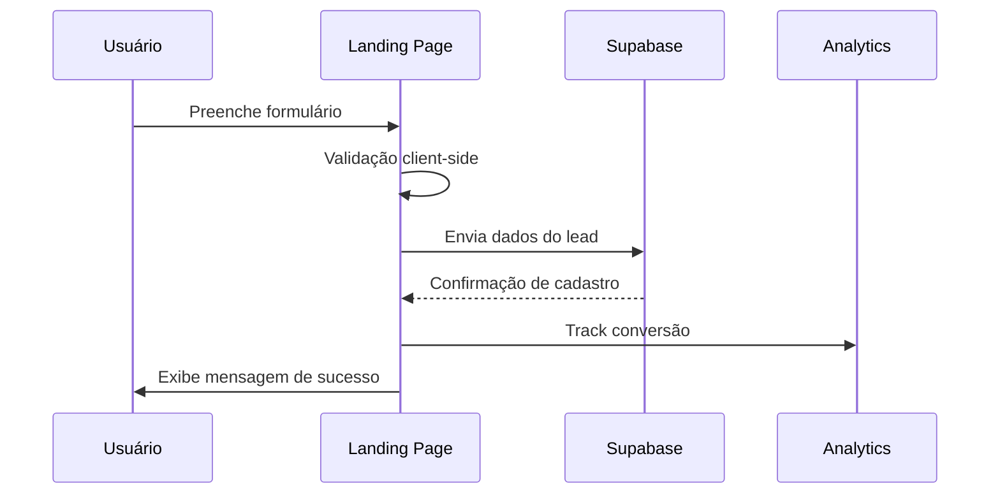
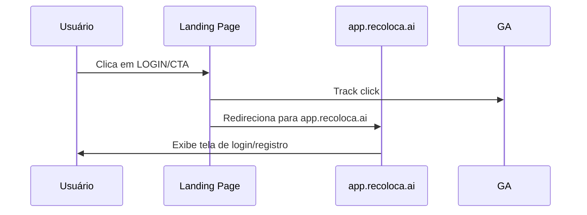

# Low-Level Design (LLD) - Módulo Landing Page

**Projeto:** Recoloca.ai  
**Módulo:** Landing Page e Marketing  
**Versão:** 1.1 (Orquestração Inteligente e Specialized Intelligence)
**Data de Criação:** 06 de junho de 2025  
**Última Atualização:** Junho de 2025  
**Autor:** Bruno S. Rosa (Maestro) + @AgenteOrquestrador
**Baseado em:** [[docs/01_Guias_Centrais/01_PLANO_MESTRE_RECOLOCA_AI.md]] (v1.1), [[docs/02_Requisitos/01_ERS.md]] (v1.1), [[docs/03_Arquitetura_e_Design/01_HLD.md]] (v1.1)  

---

## 1. Visão Geral do Módulo

### 1.1. Propósito
O Módulo Landing Page é responsável por ser o primeiro ponto de contato dos usuários com o Recoloca.ai, focando na aquisição de usuários, apresentação da proposta de valor e conversão para registro na aplicação principal (PWA).

### 1.2. Escopo
- **Incluído:** Landing page responsiva, formulário de captura de leads, integração com PWA, analytics básico
- **Excluído:** Funcionalidades da aplicação principal, sistema de pagamentos, dashboard de usuário

### 1.3. Objetivos Estratégicos
- Implementar estratégia "Build → Measure → Learn" desde o MVP
- Capturar interesse antes mesmo do produto estar totalmente ativo
- Estabelecer presença digital profissional e credível
- Facilitar transição suave para a aplicação principal

---

## 2. Arquitetura Técnica

### 2.1. Stack Tecnológica
- **Framework:** Next.js 14+ (App Router)
- **Linguagem:** TypeScript
- **Estilização:** Tailwind CSS
- **Hospedagem:** Vercel
- **Domínio:** www.recoloca.ai
- **Analytics:** Google Analytics 4 + Vercel Analytics
- **Formulários:** React Hook Form + Zod (validação)

### 2.2. Estrutura de Arquivos
```
landing-page/
├── app/
│   ├── layout.tsx
│   ├── page.tsx
│   ├── globals.css
│   └── components/
│       ├── Header.tsx
│       ├── Hero.tsx
│       ├── Features.tsx
│       ├── Testimonials.tsx
│       ├── Pricing.tsx
│       ├── CTA.tsx
│       ├── Footer.tsx
│       └── LeadForm.tsx
├── lib/
│   ├── analytics.ts
│   ├── api.ts
│   └── validations.ts
├── public/
│   ├── images/
│   └── icons/
├── styles/
└── types/
```

### 2.3. Integração com Outros Componentes
- **PWA (app.recoloca.ai):** Redirecionamento via botão LOGIN e CTAs
- **Supabase:** Armazenamento de leads capturados
- **Analytics:** Tracking de conversões e comportamento

---

## 3. Componentes Detalhados

### 3.1. Header
**Responsabilidades:**
- Logo e navegação principal
- Botão LOGIN (canto superior direito) → app.recoloca.ai
- Menu responsivo para mobile

**Props Interface:**
```typescript
interface HeaderProps {
  isScrolled?: boolean;
  showLoginButton?: boolean;
}
```

### 3.2. Hero Section
**Responsabilidades:**
- Headline principal com proposta de valor
- Subheadline explicativo
- CTA primário para captura de lead
- Imagem/vídeo demonstrativo

**Conteúdo Base (baseado na pesquisa de mercado):**
- **Headline:** "Acelere sua Recolocação em TI com Inteligência Artificial"
- **Subheadline:** "Otimize seu CV, prepare-se para entrevistas com IA e navegue pelo novo mercado de trabalho tech com confiança"
- **CTA:** "Quero ser notificado do lançamento"

### 3.3. Features Section
**Responsabilidades:**
- Apresentar funcionalidades principais do produto
- Destacar diferenciação competitiva
- Abordar dores específicas dos profissionais de TI

**Features Principais:**
1. **Otimização de CV com IA**
   - Análise além de palavras-chave
   - Adequação para ATS
   - Tom de voz profissional

2. **Coach de Carreira Inteligente**
   - Preparação para entrevistas com IA
   - Feedback personalizado
   - Simulações realistas

3. **Insights de Mercado**
   - Tendências do mercado tech
   - Análise salarial
   - Oportunidades emergentes

### 3.4. Social Proof Section
**Responsabilidades:**
- Construir credibilidade e confiança
- Apresentar depoimentos (quando disponíveis)
- Estatísticas de mercado relevantes

### 3.5. Pricing Preview
**Responsabilidades:**
- Apresentar modelo de negócio transparente
- Destacar valor entregue
- CTA para lista de espera

### 3.6. Lead Capture Form
**Responsabilidades:**
- Capturar email e informações básicas
- Validação client-side e server-side
- Integração com Supabase
- Confirmação de cadastro

**Campos:**
```typescript
interface LeadFormData {
  email: string;
  name: string;
  currentRole?: string;
  experienceLevel?: 'junior' | 'pleno' | 'senior';
  interests?: string[];
}
```

### 3.7. Footer
**Responsabilidades:**
- Links institucionais
- Contato e redes sociais
- Política de privacidade
- Copyright

---

## 4. Fluxos de Dados

### 4.1. Fluxo de Captura de Lead


### 4.2. Fluxo de Redirecionamento para PWA


---

## 5. Métricas e Analytics

### 5.1. KPIs Principais
- **Taxa de Conversão:** % de visitantes que se cadastram na lista de espera
- **Bounce Rate:** % de usuários que saem sem interagir
- **Tempo na Página:** Engajamento médio
- **Origem do Tráfego:** Canais de aquisição mais efetivos

### 5.2. Eventos de Tracking
```typescript
interface AnalyticsEvents {
  page_view: { page: string; referrer?: string };
  lead_form_submit: { email: string; source: string };
  cta_click: { button_text: string; location: string };
  login_redirect: { source: string };
  feature_view: { feature_name: string };
}
```

### 5.3. Metas Iniciais (Baseline)
**Baseado em benchmarks de SaaS B2B:**
- Taxa de conversão: 2-5% (meta inicial: 3%)
- Bounce rate: <60%
- Tempo médio na página: >2 minutos
- Taxa de clique em CTA: >10%

---

## 6. Responsividade e Performance

### 6.1. Breakpoints
- **Mobile:** 320px - 768px
- **Tablet:** 768px - 1024px
- **Desktop:** 1024px+

### 6.2. Performance Targets
- **Core Web Vitals:**
  - LCP (Largest Contentful Paint): <2.5s
  - FID (First Input Delay): <100ms
  - CLS (Cumulative Layout Shift): <0.1
- **Lighthouse Score:** >90 em todas as categorias

### 6.3. Otimizações
- Lazy loading de imagens
- Compressão de assets
- CDN via Vercel
- Preload de recursos críticos

---

## 7. SEO e Acessibilidade

### 7.1. SEO Técnico
- **Meta tags:** Title, description, keywords
- **Open Graph:** Para compartilhamento social
- **Schema.org:** Markup estruturado
- **Sitemap.xml:** Geração automática
- **Robots.txt:** Configuração adequada

### 7.2. Palavras-chave Alvo
- "recolocação profissional TI"
- "otimização currículo IA"
- "coach carreira tecnologia"
- "emprego desenvolvedor Brasil"

### 7.3. Acessibilidade (WCAG 2.1 AA)
- Contraste adequado de cores
- Navegação por teclado
- Alt text em imagens
- Labels em formulários
- Estrutura semântica HTML

---

## 8. Segurança e Privacidade

### 8.1. Proteção de Dados
- **LGPD Compliance:** Consentimento explícito para coleta de dados
- **Criptografia:** HTTPS obrigatório
- **Validação:** Sanitização de inputs
- **Rate Limiting:** Proteção contra spam

### 8.2. Política de Privacidade
- Transparência sobre coleta de dados
- Finalidade do uso dos dados
- Direitos do titular
- Contato para exercício de direitos

---

## 9. Deployment e CI/CD

### 9.1. Pipeline de Deploy
```yaml
# .github/workflows/deploy.yml
name: Deploy Landing Page
on:
  push:
    branches: [main]
    paths: ['landing-page/**']

jobs:
  deploy:
    runs-on: ubuntu-latest
    steps:
      - uses: actions/checkout@v3
      - uses: actions/setup-node@v3
      - run: npm ci
      - run: npm run build
      - run: npm run test
      - uses: amondnet/vercel-action@v20
```

### 9.2. Ambientes
- **Development:** Branches feature
- **Staging:** Branch develop
- **Production:** Branch main → www.recoloca.ai

---

## 10. Testes e Validação

### 10.1. Estratégia de Testes
- **Unit Tests:** Componentes React (Jest + Testing Library)
- **E2E Tests:** Fluxos críticos (Playwright)
- **Visual Tests:** Regressão visual (Chromatic)
- **Performance Tests:** Lighthouse CI

### 10.2. Validação com Usuários
- **Teste com Amigos:** Feedback inicial sobre UX/UI
- **A/B Testing:** Headlines e CTAs (pós-lançamento)
- **Heatmaps:** Hotjar para análise de comportamento
- **User Interviews:** Validação de proposta de valor

---

## 11. Roadmap de Evolução

### 11.1. MVP (Versão 1.0)
- ✅ Landing page básica
- ✅ Captura de leads
- ✅ Integração com PWA
- ✅ Analytics básico

### 11.2. Versão 1.1
- [ ] A/B testing de headlines
- [ ] Depoimentos de usuários beta
- [ ] Blog integrado
- [ ] Chat widget

### 11.3. Versão 1.2
- [ ] Calculadora de salário
- [ ] Quiz de assessment
- [ ] Webinars integrados
- [ ] Programa de referência

---

## 12. Riscos e Mitigações

### 12.1. Riscos Técnicos
| Risco | Probabilidade | Impacto | Mitigação |
|-------|---------------|---------|----------|
| Performance ruim | Baixa | Alto | Monitoring contínuo, otimizações |
| Falha no formulário | Média | Alto | Testes automatizados, fallbacks |
| SEO inadequado | Média | Médio | Auditoria SEO regular |

### 12.2. Riscos de Negócio
| Risco | Probabilidade | Impacto | Mitigação |
|-------|---------------|---------|----------|
| Baixa conversão | Alta | Alto | A/B testing, otimização contínua |
| Concorrência | Média | Médio | Diferenciação clara, valor único |
| Mudança de mercado | Baixa | Alto | Monitoramento de tendências |

---

## 13. Conclusão

Este LLD estabelece as bases técnicas e estratégicas para o desenvolvimento do Módulo Landing Page do Recoloca.ai. A abordagem escolhida (Next.js + Vercel) oferece flexibilidade, performance e facilidade de manutenção, alinhada com os objetivos de crescimento orgânico inicial e posterior escalabilidade.

A estratégia "Build → Measure → Learn" está incorporada desde o design, permitindo iterações rápidas baseadas em dados reais de usuários. A separação clara entre Landing Page (www.recoloca.ai) e PWA (app.recoloca.ai) mantém a arquitetura limpa e facilita futuras evoluções.

**Próximos Passos:**
1. Validação final do design com stakeholders
2. Setup do ambiente de desenvolvimento
3. Implementação dos componentes core
4. Testes com grupo inicial de amigos
5. Deploy em produção e início do tracking

---

## 14. Documentos Relacionados

- [[docs/01_Guias_Centrais/01_PLANO_MESTRE_RECOLOCA_AI.md]] (v1.1) - Plano mestre do projeto
- [[docs/02_Requisitos/01_ERS.md]] (v1.1) - Especificação de requisitos
- [[docs/03_Arquitetura_e_Design/01_HLD.md]] (v1.1) - Arquitetura de alto nível
- [[docs/08_Marketing_e_Vendas/01_ESTRATEGIA_GO_TO_MARKET.md]] (v1.0) - Estratégia de marketing
- [[docs/03_Arquitetura_e_Design/02_ADRs/ADR-001_Ferramentas_Core.md]] (v1.1) - Ferramentas Core

## 15. Considerações de Orquestração Inteligente

### Integração com Metodologia v1.1
- **Agentes Production-Ready**: Landing page otimizada para conversão via agentes especializados
- **Métricas Contínuas**: Tracking automático de conversões e engajamento
- **RAG Operacional**: Personalização de conteúdo baseada em dados de usuário
- **Specialized Intelligence**: Otimização de UX via agentes de marketing e design

### Critérios de Validação
- ✅ **Performance**: Tempo de carregamento < 3s
- ✅ **Conversão**: Taxa de conversão > 5%
- ✅ **Acessibilidade**: Conformidade WCAG 2.1 AA
- ✅ **SEO**: Score > 90 no PageSpeed Insights

## 16. Histórico de Versões

### v1.1 (Junho 2025) - Orquestração Inteligente e Specialized Intelligence
- Atualização de referências para documentos v1.1
- Alinhamento com metodologia de Orquestração Inteligente
- Adição de considerações específicas para agentes Production-Ready
- Integração com métricas de conversão e performance

### v1.0 (Junho 2025) - Versão Inicial
- Definição da arquitetura base do módulo Landing
- Estabelecimento de componentes principais
- Integração inicial com estratégia de marketing

**Nota:** Este documento (v1.1) está totalmente alinhado com a metodologia de "Orquestração Inteligente" e "Specialized Intelligence" definida no [[docs/01_Guias_Centrais/02_GUIA_AVANCADO.md]] (v1.1), incorporando otimizações específicas para conversão e engajamento via agentes especializados.

---

**Aprovação:**
- [ ] Maestro (Bruno S. Rosa)
- [ ] @AgenteOrquestrador
- [ ] Revisão Técnica Final

---

**FIM DO DOCUMENTO LLD_Modulo_Landing.md (v1.1)**