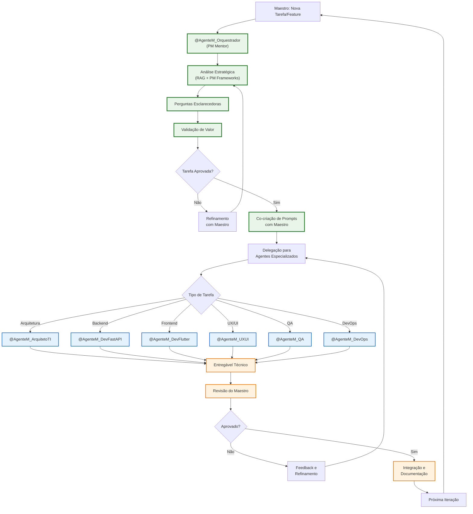
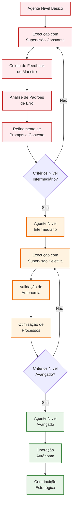
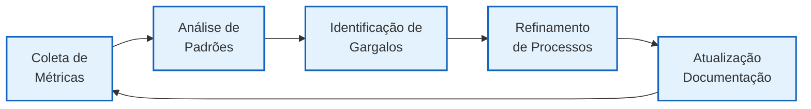
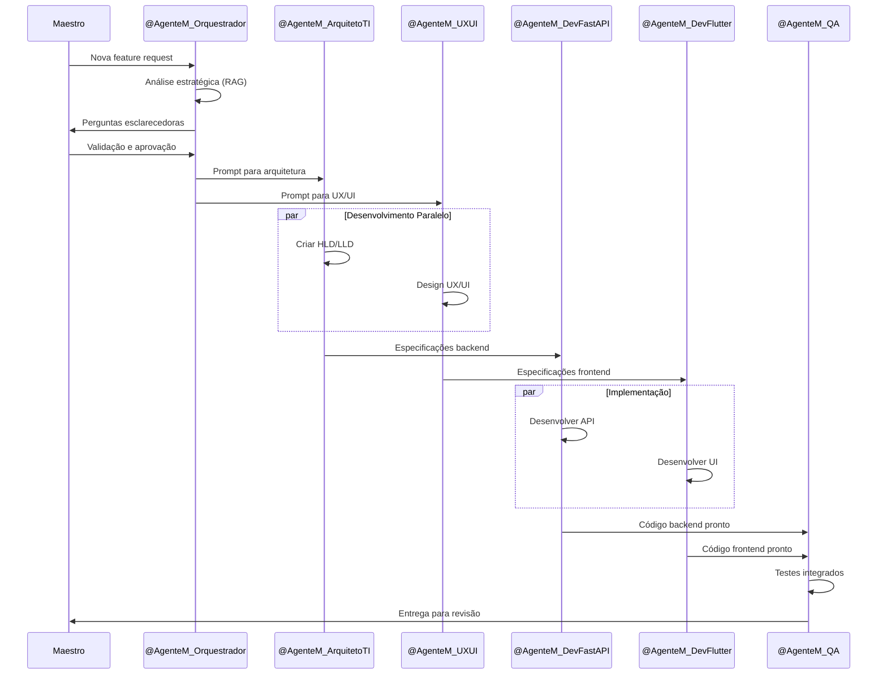
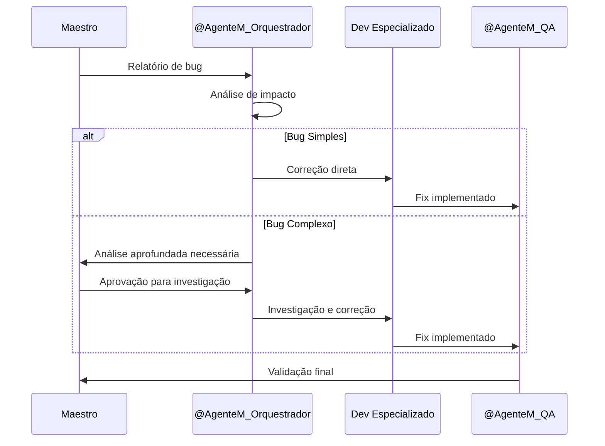
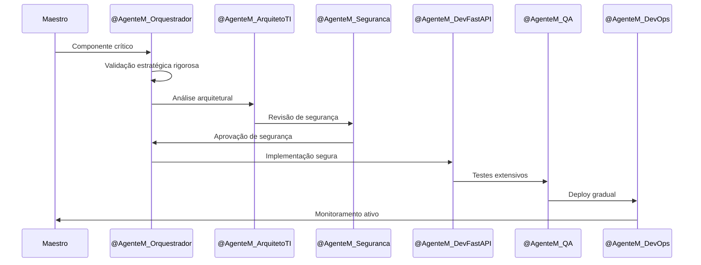

# Fluxo de Trabalho Geral - Recoloca.ai

**Versão**: 1.1 (Orquestração Inteligente e Specialized Intelligence)

**Status**: Aprovado

**Data de Criação**: 30 de maio de 2025

**Data de Última Atualização**: Junho de 2025 (Alinhamento com metodologia v1.1)

**Baseado em**: [[docs/01_Guias_Centrais/02_GUIA_AVANCADO.md]] (v1.1), [[docs/02_Requisitos/01_ERS.md]] (v1.1), [[docs/03_Arquitetura_e_Design/01_HLD.md]] (v1.1)

---

## 1. Introdução

Este documento define o **Fluxo de Trabalho Geral** para o desenvolvimento do projeto Recoloca.ai, aplicando a metodologia "Desenvolvimento Solo Ágil Aumentado por IA" conforme estabelecida no [[docs/01_Guias_Centrais/02_GUIA_AVANCADO.md]].

### 1.1. Paradigma: Orquestração Inteligente com Especialização de Domínio

O fluxo de trabalho é baseado na **orquestração centralizada** pelo `@AgenteM_Orquestrador` (PM Mentor e Engenheiro de Prompt), que atua como principal parceiro estratégico do Maestro, permitindo:

- **Validação Estratégica Prévia**: Toda tarefa passa por análise de Product Management antes da execução
- **Especialização de Domínio**: Agentes Mentores especializados em áreas técnicas específicas
- **Documentação Viva**: Integração contínua com RAG e base de conhecimento
- **HITL Evolutivo**: Human-in-the-Loop com crescente autonomia dos agentes
- **Iteração Contínua**: Ciclos rápidos de feedback e refinamento

### 1.2. Princípios Fundamentais

Conforme o [[docs/01_Guias_Centrais/02_GUIA_AVANCADO.md]], o fluxo segue os princípios:

1. **Orquestração Inteligente**: `@AgenteM_Orquestrador` como hub central de coordenação
2. **Especialização de Domínio**: Cada agente possui expertise específica
3. **Documentação Viva**: RAG integrado para contexto contínuo
4. **HITL Evolutivo**: Autonomia crescente com supervisão estratégica
5. **Iteração Contínua**: Feedback loops para melhoria constante

## 2. Fluxo de Trabalho Baseado no SDLC Ágil Adaptado

### 2.1. Fases do Desenvolvimento com Agentes Mentores

Conforme estabelecido no [[docs/01_Guias_Centrais/02_GUIA_AVANCADO.md]], o fluxo segue as fases do SDLC Ágil com integração de Agentes Mentores de IA:

| **Fase** | **Agentes Principais** | **Entregáveis** | **Critérios de Conclusão** |
|----------|------------------------|-----------------|----------------------------|
| **Concepção** | `@AgenteM_Orquestrador` | Análise estratégica, Prompts otimizados | Validação de valor e alinhamento |
| **Análise** | `@AgenteM_ArquitetoTI`, `@AgenteM_Orquestrador` | HLD, LLD, ADRs | Arquitetura aprovada |
| **Design** | `@AgenteM_UXUI`, `@AgenteM_ArquitetoTI` | Wireframes, Protótipos, Style Guide | Design validado |
| **Implementação** | `@AgenteM_DevFastAPI`, `@AgenteM_DevFlutter` | Código, Testes, Documentação | Funcionalidade operacional |
| **Testes** | `@AgenteM_QA` | Casos de teste, Relatórios | Qualidade assegurada |
| **Deploy** | `@AgenteM_DevOps` | Pipeline CI/CD, Monitoramento | Sistema em produção |

### 2.2. Fluxo Principal de Desenvolvimento



## 3. Papel Central do @AgenteM_Orquestrador

### 3.1. Função de PM Mentor e Engenheiro de Prompt

O `@AgenteM_Orquestrador` atua como **principal parceiro estratégico** do Maestro, com duas funções essenciais:

#### 3.1.1. Mentoria em Product Management
- **Validação Estratégica**: Análise de valor, alinhamento com objetivos, frameworks de priorização
- **Questionamento Construtivo**: Atua como 'advogado do diabo' para fortalecer soluções
- **Análise via RAG**: Consulta ativa à documentação viva e base de conhecimento PM
- **Identificação de Componentes de Núcleo**: Auxilia na classificação de features críticas

#### 3.1.2. Engenharia de Prompt Especializada
- **Co-criação de Prompts**: Colabora com o Maestro na criação de prompts otimizados
- **Contextualização Rica**: Utiliza RAG e documentação para prompts contextualizados
- **Aplicação de Best Practices**: Segue diretrizes do [[docs/01_Guias_Centrais/02_GUIA_AVANCADO.md]]
- **Templates Adaptados**: Utiliza [[docs/05_Prompts/01_Templates_Base/]] como base

### 3.2. Processo de Orquestração

```yaml
# Estrutura de Atuação do @AgenteM_Orquestrador
process:
  1_strategic_analysis:
    - rag_consultation: "Consulta documentação viva"
    - value_assessment: "Análise de valor para usuário"
    - alignment_check: "Verificação com objetivos do produto"
    - framework_application: "RICE, ICE, MoSCoW conforme contexto"
    
  2_clarifying_questions:
    - assumption_challenge: "Questiona premissas do Maestro"
    - scope_definition: "Define escopo e critérios de sucesso"
    - dependency_analysis: "Identifica dependências e riscos"
    
  3_prompt_engineering:
    - context_gathering: "Coleta contexto via RAG e MCPs"
    - template_selection: "Escolhe template apropriado"
    - customization: "Adapta para agente específico"
    - validation: "Valida com Maestro antes da delegação"
```

### 3.3. Critérios de Ativação

O `@AgenteM_Orquestrador` é ativado em:
- **Todas as novas tarefas/features** (validação estratégica obrigatória)
- **Decisões arquiteturais** (componentes de núcleo)
- **Mudanças de escopo** (reavaliação de prioridades)
- **Problemas complexos** (necessidade de análise aprofundada)
- **Preparação de prompts** (para outros agentes especializados)

## 4. Estratégia de Evolução dos Agentes

### 4.1. Critérios Objetivos de Maturidade

Conforme estabelecido no [[docs/01_Guias_Centrais/02_GUIA_AVANCADO.md]], os agentes evoluem através de três níveis:

#### 4.1.1. Nível Básico (Atual)
- **Precisão Técnica**: 70-80% de acertos em primeira tentativa
- **Consistência Documental**: Segue 80% das diretrizes estabelecidas
- **Autonomia Operacional**: Executa tarefas simples com supervisão mínima
- **Integração RAG**: Consulta básica à documentação
- **Alinhamento Estratégico**: Compreende objetivos principais do projeto

#### 4.1.2. Nível Intermediário (Meta 6 meses)
- **Precisão Técnica**: 85-90% de acertos em primeira tentativa
- **Consistência Documental**: Segue 90% das diretrizes, sugere melhorias
- **Autonomia Operacional**: Executa tarefas complexas, escalona exceções
- **Integração RAG**: Consulta avançada, correlaciona informações
- **Alinhamento Estratégico**: Propõe otimizações alinhadas aos objetivos

#### 4.1.3. Nível Avançado (Meta 12 meses)
- **Precisão Técnica**: 95%+ de acertos, antecipa problemas
- **Consistência Documental**: Mantém e evolui padrões automaticamente
- **Autonomia Operacional**: Opera independentemente, reporta resultados
- **Integração RAG**: Síntese inteligente, insights proativos
- **Alinhamento Estratégico**: Contribui para evolução da estratégia

### 4.2. Processo de Evolução HITL



## 5. Integração com Documentação Viva e RAG

### 5.1. Estratégia RAG para Fluxo de Trabalho

Conforme [[docs/01_Guias_Centrais/02_GUIA_AVANCADO.md]], a integração RAG é fundamental:

#### 5.1.1. Consulta Ativa pelos Agentes
- **@AgenteM_Orquestrador**: Acessa [[rag_infra/source_documents/PM_Knowledge/]] para frameworks de PM
- **Agentes Técnicos**: Consultam documentação técnica via RAG antes de implementar
- **Todos os Agentes**: Verificam consistência com [[docs/02_Requisitos/01_ERS.md]] e [[docs/03_Arquitetura_e_Design/01_HLD.md]]

#### 5.1.2. Tecnologias RAG Utilizadas
- **Vector Store**: FAISS-GPU (local)
- **Embedding Model**: BAAI/bge-m3
- **Framework**: LangChain
- **Ambiente**: Conda com Python 3.10

### 5.2. Considerações para Perfis Neurodivergentes

O fluxo de trabalho considera as necessidades específicas do Maestro:
- **Estrutura Clara**: Processos bem definidos e previsíveis
- **Feedback Imediato**: Validação rápida em cada etapa
- **Flexibilidade Cognitiva**: Adaptação a diferentes estilos de processamento
- **Redução de Sobrecarga**: Automação de tarefas repetitivas

## 6. Métricas e Monitoramento

### 6.1. KPIs do Fluxo de Trabalho

| **Métrica** | **Objetivo** | **Frequência** |
|-------------|--------------|----------------|
| **Tempo Médio por Tarefa** | < 2h para tarefas standard | Semanal |
| **Taxa de Retrabalho** | < 15% | Semanal |
| **Satisfação do Maestro** | > 8/10 | Após cada entrega |
| **Precisão dos Agentes** | > 80% (Nível Básico) | Mensal |
| **Cobertura RAG** | > 90% consultas bem-sucedidas | Mensal |

### 6.2. Processo de Melhoria Contínua



## 7. Fluxos Específicos por Tipo de Tarefa

### 7.1. Desenvolvimento de Feature Completa



### 7.2. Correção de Bug



### 7.3. Componente de Núcleo



## 8. Próximos Passos e Evolução

### 8.1. Implementação Imediata
1. **Validação com Maestro**: Aprovação do fluxo alinhado
2. **Treinamento dos Agentes**: Aplicação dos critérios de maturidade
3. **Integração RAG**: Configuração completa da base de conhecimento
4. **Métricas Baseline**: Estabelecimento de indicadores iniciais

### 8.2. Evolução Planejada (6-12 meses)
1. **Automação Progressiva**: Redução gradual da supervisão manual
2. **Especialização Avançada**: Desenvolvimento de expertise específica por agente
3. **Integração de Ferramentas**: MCPs adicionais conforme necessidade
4. **Otimização de Performance**: Melhoria contínua baseada em dados

### 8.3. Considerações Estratégicas

#### 8.3.1. Questões para Reflexão
1. **Balanceamento**: Como equilibrar autonomia dos agentes com controle estratégico?
2. **Escalabilidade**: Como o fluxo se adapta ao crescimento do projeto?
3. **Qualidade**: Como manter consistência com autonomia crescente?
4. **Inovação**: Como incorporar aprendizados e melhorias contínuas?

#### 8.3.2. Riscos e Mitigações
- **Risco**: Perda de controle com automação excessiva
  - **Mitigação**: Critérios objetivos de maturidade e escalação
- **Risco**: Inconsistência entre agentes
  - **Mitigação**: RAG centralizado e documentação viva
- **Risco**: Sobrecarga do @AgenteM_Orquestrador
  - **Mitigação**: Evolução gradual e delegação inteligente

---

## 9. Documentos Relacionados

- [[docs/01_Guias_Centrais/02_GUIA_AVANCADO.md]] - Metodologia base (v1.1)
- [[docs/01_Guias_Centrais/03_METODOLOGIA_MVP.md]] - MVP da metodologia
- [[docs/02_Requisitos/01_ERS.md]] (v1.1) - Especificação de Requisitos
- [[docs/03_Arquitetura_e_Design/01_HLD.md]] (v1.1) - High-Level Design
- [[docs/03_Arquitetura_e_Design/02_ADRs/ADR-001_Ferramentas_Core.md]] (v1.1) - Ferramentas Core
- [[docs/04_Agentes_IA/01_AGENTES_IA_MENTORES_OVERVIEW.md]] - Visão geral dos agentes
- [[docs/00_Gerenciamento_Projeto/01_KANBAN_INTERNO_PROJETO.md]] - Gestão de tarefas
- [[docs/05_Prompts/01_Templates_Base/]] - Templates de prompts
- [[rag_infra/source_documents/PM_Knowledge/]] - Base de conhecimento PM

## Considerações de Orquestração Inteligente

### Integração com Metodologia v1.1
- **Agentes Production-Ready**: Fluxo suporta agentes Tier 2 e Tier 3
- **Métricas Contínuas**: Coleta automática de dados de produtividade
- **RAG Operacional**: Contextualização contínua via base de conhecimento
- **Specialized Intelligence**: Delegação eficiente para agentes especializados

### Critérios de Validação
- ✅ **Eficiência**: Redução de tempo de desenvolvimento
- ✅ **Qualidade**: Melhoria na qualidade dos entregáveis
- ✅ **Consistência**: Padronização de processos
- ✅ **Escalabilidade**: Suporte ao crescimento da equipe de agentes

## Histórico de Versões

### v1.1 (Junho 2025) - Orquestração Inteligente e Specialized Intelligence
- Atualização de referências para documentos v1.1
- Alinhamento com metodologia de Orquestração Inteligente
- Adição de considerações específicas para agentes Production-Ready
- Integração com métricas de produtividade

### v1.0 (Maio 2025) - Versão Inicial
- Definição do fluxo de trabalho base
- Estabelecimento de processos ágeis adaptados
- Integração inicial com agentes de IA

**Nota:** Este documento (v1.1) está totalmente alinhado com a metodologia de "Orquestração Inteligente" e "Specialized Intelligence" definida no [[docs/01_Guias_Centrais/02_GUIA_AVANCADO.md]] (v1.1), incorporando fluxos otimizados para agentes Production-Ready e medição contínua de produtividade.

---

**FIM DO DOCUMENTO FLUXO_TRABALHO_GERAL.md (v1.1)**

*"A verdadeira eficiência não está em fazer as coisas mais rápido, mas em fazer as coisas certas com a estratégia adequada."*