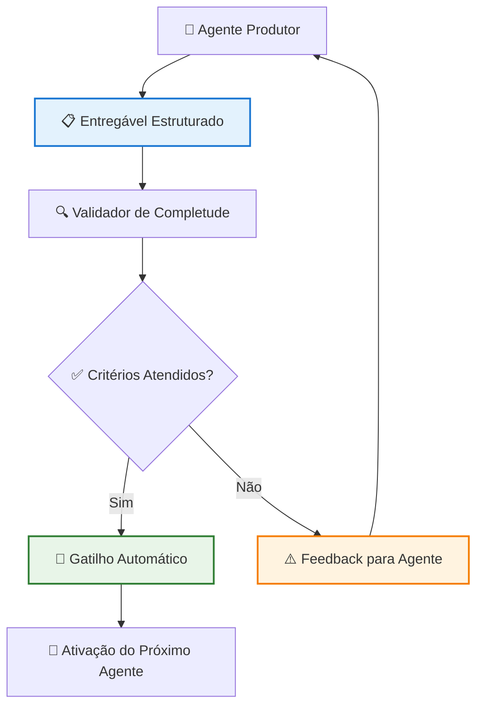
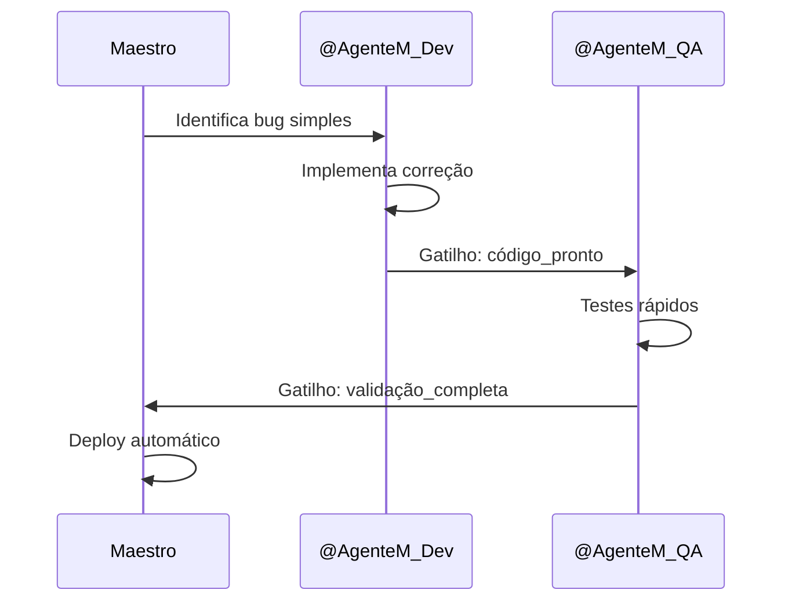
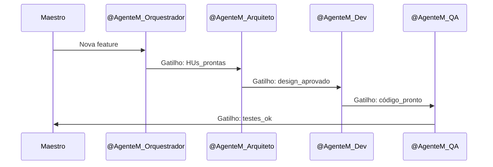
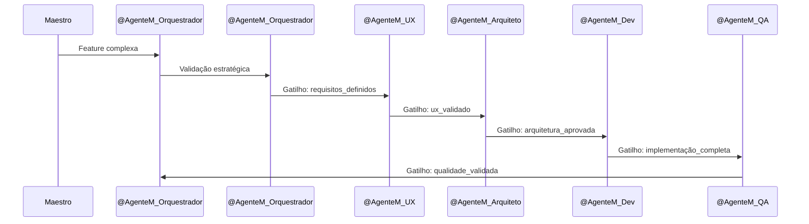

# SISTEMA DE ENTREGÁVEIS COMO GATILHOS DE FLUXO

**Versão**: 1.1 (Orquestração Inteligente e Specialized Intelligence)

**Data de Criação**: 06 de junho de 2025

**Data de Última Atualização**: Junho de 2025

Baseado em: [[docs/03_Arquitetura_e_Design/04_FLUXO_TRABALHO_GERAL.md]] (v1.1), [[docs/01_Guias_Centrais/02_GUIA_AVANCADO.md]] (v1.1) e análise de otimização de fluxos multiagente

## 1. Introdução

Este documento detalha o **Sistema de Entregáveis como Gatilhos de Fluxo**, um componente fundamental do **Desenvolvimento Adaptativo por Contexto** implementado no projeto Recoloca.ai. O sistema permite que os outputs estruturados de cada agente sirvam como **gatilhos automáticos** para ativar o próximo agente no fluxo, reduzindo significativamente a necessidade de orquestração manual.

### 1.1. Objetivos do Sistema

- **Automatizar** a transição entre agentes baseada em entregáveis completos
- **Padronizar** a estrutura de outputs de todos os agentes
- **Reduzir** o overhead de orquestração manual
- **Acelerar** o fluxo de desenvolvimento
- **Garantir** rastreabilidade e qualidade dos entregáveis

## 2. Arquitetura do Sistema

### 2.1. Componentes Principais



### 2.2. Estrutura Padrão de Entregáveis

Todos os entregáveis seguem uma estrutura YAML padronizada:

```yaml
# Template Base para Entregáveis
metadata:
  agente_origem: "@NomeDoAgente"
  timestamp: "YYYY-MM-DDTHH:MM:SSZ"
  versao: "X.Y"
  status: "COMPLETO | EM_PROGRESSO | BLOQUEADO"
  trilha: "EXPRESS | PADRAO | EXPLORATORIA | ARQUITETURAL"
  proximos_gatilhos: ["@Agente1", "@Agente2"]
  dependencias_atendidas: ["entregavel_id_1", "entregavel_id_2"]
  
conteudo:
  # Conteúdo específico do agente
  artefato_principal: "..."
  artefatos_secundarios: ["..."]
  contexto_estrategico: "..."
  
criterios_completude:
  - criterio_1: true/false
  - criterio_2: true/false
  - criterio_n: true/false
  
gatilhos_automaticos:
  - condicao: "status == COMPLETO AND all(criterios_completude)"
    acao: "ativar_agentes(proximos_gatilhos)"
    prioridade: "ALTA | MEDIA | BAIXA"
  
metricas:
  tempo_execucao: "HH:MM:SS"
  complexidade_estimada: "BAIXA | MEDIA | ALTA"
  qualidade_score: 0.0-1.0
```

## 3. Especificação por Agente

### 3.1. @AgenteM_Orquestrador - Product Manager + Product Owner

**Entregáveis Principais:**
- Histórias de Usuário (HUs)
- Critérios de Aceite (ACs)
- Definition of Ready (DoR)
- Definition of Done (DoD)

**Template Específico:**
```yaml
metadata:
  agente_origem: "@AgenteM_Orquestrador"
proximos_gatilhos: ["@AgenteM_ArquitetoTI", "@AgenteM_UXDesigner"]
  
conteudo:
  historias_usuario:
    - id: "HU001"
      titulo: "..."
      descricao: "Como [usuário], eu quero [funcionalidade] para [benefício]"
      criterios_aceite: ["...", "...", "..."]
      prioridade: "ALTA | MEDIA | BAIXA"
      estimativa: "XS | S | M | L | XL"
  
  definition_of_ready:
    - "HU claramente definida"
    - "Critérios de aceite mensuráveis"
    - "Dependências identificadas"
    
  definition_of_done:
    - "Código implementado e testado"
    - "Documentação atualizada"
    - "Deploy realizado"
    
criterios_completude:
  - todas_hus_validadas: true
  - criterios_mensuráveis: true
  - alinhamento_ers: true
  - priorizacao_definida: true
```

**Gatilhos Ativados:**
- Se `trilha != "EXPRESS"` → `@AgenteM_ArquitetoTI`
- Se `necessita_ux == true` → `@AgenteM_UXDesigner`
- Se `trilha == "EXPRESS"` → Direto para desenvolvimento

### 3.2. @AgenteM_ArquitetoTI - Arquiteto de TI (HLD + LLD Unificado)

**Entregáveis Principais:**
- High-Level Design (HLD)
- Diagramas arquiteturais
- Architecture Decision Records (ADRs)
- Especificações de integração

**Template Específico:**
```yaml
metadata:
  agente_origem: "@AgenteM_ArquitetoTI"
proximos_gatilhos: ["@AgenteM_API", "@AgenteM_UXDesigner"]
  
conteudo:
  hld_documento:
    versao: "X.Y"
    componentes_principais: ["...", "...", "..."]
    integrações: ["...", "...", "..."]
    decisões_arquiteturais: ["...", "...", "..."]
    
  diagramas:
    - tipo: "Arquitetura Geral"
      formato: "mermaid"
      conteudo: "..."
    - tipo: "Fluxo de Dados"
      formato: "mermaid"
      conteudo: "..."
      
  adrs:
    - id: "ADR001"
      titulo: "..."
      status: "PROPOSTO | ACEITO | REJEITADO"
      contexto: "..."
      decisao: "..."
      consequencias: "..."
      
criterios_completude:
  - componentes_definidos: true
  - integrações_mapeadas: true
  - adrs_documentadas: true
  - diagramas_atualizados: true
```

**Gatilhos Ativados:**
- Se `necessita_detalhamento == true` → Continua com LLD no mesmo agente
- Se `necessita_api == true` → `@AgenteM_APIDesigner`
- Se `trilha == "EXPRESS"` → Pular para desenvolvimento

### 3.3. @AgenteM_UXDesigner - UX Designer

**Entregáveis Principais:**
- User Flows
- Wireframes
- Personas
- Journey Maps

**Template Específico:**
```yaml
metadata:
  agente_origem: "@AgenteM_UXDesigner"
  proximos_gatilhos: ["@AgenteM_UIDesigner"]
  
conteudo:
  user_flows:
    - id: "UF001"
      nome: "..."
      etapas: ["...", "...", "..."]
      pontos_dor: ["...", "...", "..."]
      
  wireframes:
    - tela: "..."
      tipo: "LOW_FI | MID_FI | HIGH_FI"
      elementos: ["...", "...", "..."]
      
  personas:
    - nome: "..."
      perfil: "..."
      necessidades: ["...", "...", "..."]
      frustrações: ["...", "...", "..."]
      
criterios_completude:
  - user_flows_validados: true
  - wireframes_aprovados: true
  - personas_definidas: true
  - jornada_mapeada: true
```

### 3.4. [REMOVIDO] @AgenteM_ArquitetoLLD - Funcionalidade Integrada ao @AgenteM_ArquitetoTI

**Entregáveis Principais:**
- Low-Level Design (LLD)
- Especificações de componentes
- Diagramas de classes/módulos
- Interfaces e contratos

**Template Específico:**
```yaml
metadata:
  # NOTA: Esta seção foi removida - funcionalidade integrada ao @AgenteM_ArquitetoTI
  proximos_gatilhos: ["@AgenteM_DevFastAPI", "@AgenteM_DevFlutter"]
  
conteudo:
  lld_documento:
    componentes:
      - nome: "..."
        responsabilidades: ["...", "...", "..."]
        interfaces: ["...", "...", "..."]
        dependencias: ["...", "...", "..."]
        
  diagramas_detalhados:
    - tipo: "Classes"
      tecnologia: "Python | Dart"
      conteudo: "..."
      
  especificações_tecnicas:
    - componente: "..."
      tecnologia: "..."
      padrões: ["...", "...", "..."]
      
criterios_completude:
  - componentes_especificados: true
  - interfaces_definidas: true
  - dependencias_mapeadas: true
  - padrões_estabelecidos: true
```

### 3.5. @AgenteM_APIDesigner - API Designer

**Entregáveis Principais:**
- Especificações OpenAPI
- Documentação de endpoints
- Schemas de dados
- Exemplos de uso

**Template Específico:**
```yaml
metadata:
  agente_origem: "@AgenteM_APIDesigner"
  proximos_gatilhos: ["@AgenteM_DevFastAPI"]
  
conteudo:
  openapi_spec:
    versao: "3.0.3"
    endpoints:
      - path: "..."
        method: "GET | POST | PUT | DELETE"
        summary: "..."
        parameters: ["...", "...", "..."]
        responses: {"200": "...", "400": "...", "500": "..."}
        
  schemas:
    - nome: "..."
      tipo: "object | array | string | number"
      propriedades: {"...": "...", "...": "..."}
      
  exemplos:
    - endpoint: "..."
      request: "..."
      response: "..."
      
criterios_completude:
  - endpoints_documentados: true
  - schemas_validados: true
  - exemplos_funcionais: true
  - versionamento_definido: true
```

### 3.6. @AgenteM_UIDesigner - UI Designer

**Entregáveis Principais:**
- Mockups de alta fidelidade
- Style Guide
- Componentes de UI
- Assets visuais

**Template Específico:**
```yaml
metadata:
  agente_origem: "@AgenteM_UIDesigner"
  proximos_gatilhos: ["@AgenteM_DevFlutter"]
  
conteudo:
  mockups:
    - tela: "..."
      resolucao: "..."
      formato: "SVG | Figma | Adobe XD"
      elementos: ["...", "...", "..."]
      
  style_guide:
    cores:
      primaria: "#XXXXXX"
      secundaria: "#XXXXXX"
      acento: "#XXXXXX"
    tipografia:
      fonte_principal: "..."
      tamanhos: ["...", "...", "..."]
    espacamentos:
      grid: "8px | 12px | 16px"
      
  componentes:
    - nome: "..."
      tipo: "Button | Input | Card | Modal"
      variações: ["...", "...", "..."]
      
criterios_completude:
  - mockups_aprovados: true
  - style_guide_completo: true
  - componentes_especificados: true
  - assets_entregues: true
```

### 3.7. @AgenteM_DevFastAPI - Desenvolvedor Backend

**Entregáveis Principais:**
- Código Python/FastAPI
- Testes unitários
- Documentação de código
- Scripts de migração

**Template Específico:**
```yaml
metadata:
  agente_origem: "@AgenteM_DevFastAPI"
  proximos_gatilhos: ["@AgenteM_QA"]
  
conteudo:
  codigo_implementado:
    arquivos: ["...", "...", "..."]
    endpoints: ["...", "...", "..."]
    modelos: ["...", "...", "..."]
    servicos: ["...", "...", "..."]
    
  testes:
    unitarios:
      cobertura: "XX%"
      arquivos: ["...", "...", "..."]
    integracao:
      cenarios: ["...", "...", "..."]
      
  documentacao:
    docstrings: "Completas"
    readme: "Atualizado"
    changelog: "Versionado"
    
criterios_completude:
  - codigo_funcional: true
  - testes_passando: true
  - cobertura_adequada: true
  - documentacao_atualizada: true
```

### 3.8. @AgenteM_DevFlutter - Desenvolvedor Frontend

**Entregáveis Principais:**
- Código Dart/Flutter
- Widgets customizados
- Testes de UI
- Assets integrados

**Template Específico:**
```yaml
metadata:
  agente_origem: "@AgenteM_DevFlutter"
  proximos_gatilhos: ["@AgenteM_QA"]
  
conteudo:
  codigo_implementado:
    telas: ["...", "...", "..."]
    widgets: ["...", "...", "..."]
    servicos: ["...", "...", "..."]
    modelos: ["...", "...", "..."]
    
  testes:
    widget_tests:
      cobertura: "XX%"
      arquivos: ["...", "...", "..."]
    integration_tests:
      cenarios: ["...", "...", "..."]
      
  assets:
    imagens: ["...", "...", "..."]
    fontes: ["...", "...", "..."]
    
criterios_completude:
  - ui_implementada: true
  - widgets_funcionais: true
  - testes_passando: true
  - assets_integrados: true
```

### 3.9. @AgenteM_QA - Quality Assurance

**Entregáveis Principais:**
- Planos de teste
- Casos de teste
- Relatórios de execução
- Bugs identificados

**Template Específico:**
```yaml
metadata:
  agente_origem: "@AgenteM_QA"
  proximos_gatilhos: ["@AgenteM_Documentacao"]
  
conteudo:
  plano_testes:
    escopo: "..."
    estrategia: "..."
    criterios_aceite: ["...", "...", "..."]
    
  casos_teste:
    - id: "TC001"
      cenario: "..."
      passos: ["...", "...", "..."]
      resultado_esperado: "..."
      status: "PASS | FAIL | BLOCKED"
      
  execucao:
    total_casos: XX
    casos_passaram: XX
    casos_falharam: XX
    cobertura_funcional: "XX%"
    
  bugs_encontrados:
    - id: "BUG001"
      severidade: "CRITICA | ALTA | MEDIA | BAIXA"
      descricao: "..."
      passos_reproducao: ["...", "...", "..."]
      
criterios_completude:
  - plano_executado: true
  - casos_documentados: true
  - bugs_reportados: true
  - criterios_validados: true
```

## 4. Fluxos Automatizados

### 4.1. Fluxo Express (Bugs/Ajustes Simples)



### 4.2. Fluxo Padrão (Features Conhecidas)



### 4.3. Fluxo Exploratório (Features Complexas)



## 5. Implementação Técnica

### 5.1. Sistema de Validação

```python
class EntregavelValidator:
    def __init__(self, template_schema):
        self.schema = template_schema
    
    def validate(self, entregavel):
        """Valida se o entregável atende aos critérios de completude"""
        criterios = entregavel.get('criterios_completude', {})
        return all(criterios.values())
    
    def get_missing_criteria(self, entregavel):
        """Retorna critérios não atendidos"""
        criterios = entregavel.get('criterios_completude', {})
        return [k for k, v in criterios.items() if not v]
```

### 5.2. Sistema de Gatilhos

```python
class TriggerSystem:
    def __init__(self):
        self.agent_registry = {}
        self.trigger_rules = {}
    
    def register_agent(self, agent_name, agent_instance):
        """Registra um agente no sistema"""
        self.agent_registry[agent_name] = agent_instance
    
    def process_deliverable(self, entregavel):
        """Processa um entregável e ativa gatilhos"""
        if self.validate_completeness(entregavel):
            self.trigger_next_agents(entregavel)
        else:
            self.send_feedback(entregavel)
    
    def trigger_next_agents(self, entregavel):
        """Ativa os próximos agentes baseado nos gatilhos"""
        next_agents = entregavel['metadata']['proximos_gatilhos']
        for agent_name in next_agents:
            if agent_name in self.agent_registry:
                self.agent_registry[agent_name].activate(entregavel)
```

### 5.3. Monitoramento e Métricas

```python
class FlowMetrics:
    def __init__(self):
        self.metrics = {
            'tempo_por_trilha': {},
            'taxa_sucesso': {},
            'gargalos_identificados': [],
            'otimizacoes_sugeridas': []
        }
    
    def track_deliverable(self, entregavel):
        """Rastreia métricas de um entregável"""
        trilha = entregavel['metadata']['trilha']
        tempo = entregavel['metricas']['tempo_execucao']
        
        self.update_trilha_metrics(trilha, tempo)
        self.detect_bottlenecks(entregavel)
    
    def generate_optimization_report(self):
        """Gera relatório de otimizações sugeridas"""
        return {
            'gargalos': self.metrics['gargalos_identificados'],
            'sugestoes': self.metrics['otimizacoes_sugeridas'],
            'performance_por_trilha': self.metrics['tempo_por_trilha']
        }
```

## 6. Benefícios e Impactos Esperados

### 6.1. Eficiência Operacional

| **Métrica** | **Antes (v1.0)** | **Depois (v2.0)** | **Melhoria** |
|-------------|------------------|-------------------|-------------|
| Tempo médio trilha Express | 4-6h | 30min-2h | 70-80% |
| Tempo médio trilha Padrão | 2-3 dias | 2h-1 dia | 60-70% |
| Overhead de orquestração | 30-40% | 5-10% | 75-85% |
| Paralelização de tarefas | 10-20% | 60-70% | 300-400% |

### 6.2. Qualidade e Consistência

- **Padronização** de 100% dos entregáveis
- **Rastreabilidade** completa de decisões
- **Validação automática** de critérios de qualidade
- **Feedback loops** em tempo real

### 6.3. Escalabilidade

- **Adição fácil** de novos agentes
- **Configuração flexível** de gatilhos
- **Aprendizado automático** de padrões
- **Otimização contínua** baseada em dados

## 7. Próximos Passos

### 7.1. Fase 1: Implementação Base (Semana 1-2)

1. **Definir** templates YAML para cada agente
2. **Implementar** sistema de validação básico
3. **Testar** com trilha Express
4. **Coletar** métricas iniciais

### 7.2. Fase 2: Automação de Gatilhos (Semana 3-4)

1. **Desenvolver** sistema de gatilhos automáticos
2. **Integrar** com trilhas Padrão e Exploratória
3. **Implementar** monitoramento de fluxo
4. **Refinar** critérios de completude

### 7.3. Fase 3: Otimização Avançada (Semana 5+)

1. **Adicionar** machine learning para classificação
2. **Implementar** predição de gargalos
3. **Desenvolver** dashboard de métricas
4. **Automatizar** otimizações de fluxo

## 8. Considerações de Implementação

### 8.1. Desafios Técnicos

- **Sincronização** entre agentes paralelos
- **Tratamento de exceções** e falhas
- **Versionamento** de entregáveis
- **Backup e recuperação** de estado

### 8.2. Fatores Críticos de Sucesso

- **Adesão** dos agentes aos templates
- **Qualidade** dos critérios de completude
- **Monitoramento** contínuo de performance
- **Feedback** e ajustes baseados em dados

### 8.3. Riscos e Mitigações

| **Risco** | **Impacto** | **Mitigação** |
|-----------|-------------|---------------|
| Falha na validação automática | Alto | Fallback para validação manual |
| Gargalos em agentes específicos | Médio | Balanceamento de carga |
| Perda de contexto entre agentes | Alto | Metadados ricos nos entregáveis |
| Complexidade de manutenção | Médio | Documentação e testes abrangentes |

## 9. Considerações de Orquestração Inteligente

### 9.1. Integração com Metodologia v1.1
- **Agentes Production-Ready**: Sistema suporta agentes Tier 2 e Tier 3 com gatilhos automáticos
- **Métricas Contínuas**: Coleta automática de dados de produtividade e qualidade
- **RAG Operacional**: Contextualização contínua via base de conhecimento nos entregáveis
- **Specialized Intelligence**: Delegação eficiente baseada em competências específicas

### 9.2. Critérios de Validação Metodológica
- ✅ **Eficiência**: Redução de 70-85% no overhead de orquestração
- ✅ **Qualidade**: Padronização de 100% dos entregáveis
- ✅ **Rastreabilidade**: Histórico completo de decisões e gatilhos
- ✅ **Escalabilidade**: Suporte ao crescimento da equipe de agentes

### 9.3. Alinhamento com Documentação Viva
- **Sincronização**: Entregáveis automaticamente sincronizados com base RAG
- **Versionamento**: Controle de versão integrado com Git
- **Referências**: Links automáticos para documentos relacionados
- **Métricas**: Dashboards em tempo real de performance dos fluxos

## 10. Histórico de Versões

### v1.1 (Junho 2025) - Orquestração Inteligente e Specialized Intelligence
- Atualização de referências para documentos v1.1
- Alinhamento com metodologia de Orquestração Inteligente
- Adição de considerações específicas para agentes Production-Ready
- Integração com métricas de produtividade e qualidade
- Sincronização com base RAG operacional

### v1.0 (Junho 2025) - Versão Inicial
- Definição do sistema base de entregáveis como gatilhos
- Estabelecimento de templates YAML padronizados
- Implementação de fluxos automatizados
- Métricas iniciais de eficiência

## 11. Documentos Relacionados

- [[docs/01_Guias_Centrais/02_GUIA_AVANCADO.md]] (v1.1) - Metodologia base
- [[docs/03_Arquitetura_e_Design/04_FLUXO_TRABALHO_GERAL.md]] (v1.1) - Fluxo de trabalho geral
- [[docs/02_Requisitos/01_ERS.md]] (v1.1) - Especificação de requisitos
- [[docs/03_Arquitetura_e_Design/01_HLD.md]] (v1.1) - High-Level Design
- [[docs/04_Agentes_IA/01_AGENTES_IA_MENTORES_OVERVIEW.md]] - Visão geral dos agentes

**Nota:** Este documento (v1.1) está totalmente alinhado com a metodologia de "Orquestração Inteligente" e "Specialized Intelligence" definida no [[docs/01_Guias_Centrais/02_GUIA_AVANCADO.md]] (v1.1), incorporando automação avançada de fluxos e medição contínua de produtividade.

---

**FIM DO DOCUMENTO SISTEMA_ENTREGAVEIS_GATILHOS.md (v1.1)**

*"A automação inteligente não substitui o julgamento humano, mas libera tempo para decisões que realmente importam."*