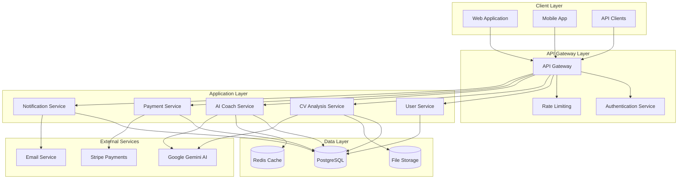
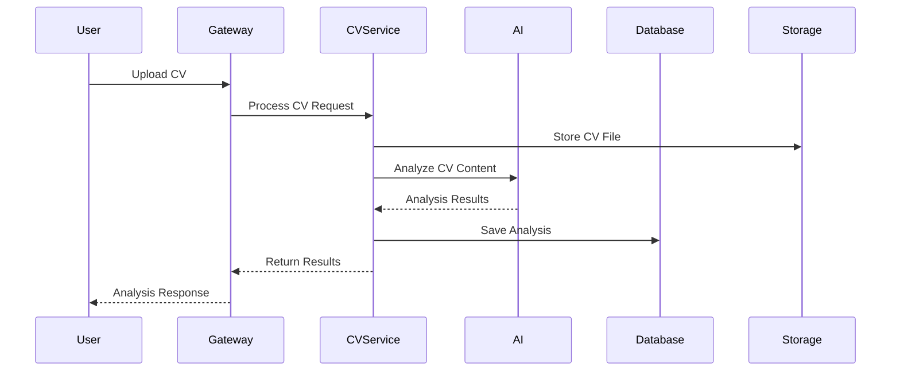
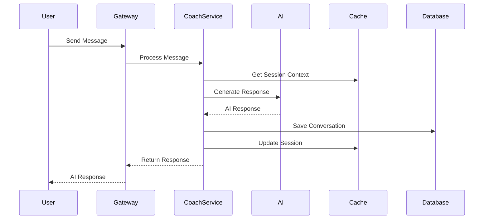

# High-Level Design - General Architecture Overview

## 📋 Executive Summary

This document presents the high-level architecture of the **Recoloca.ai** system, a comprehensive platform for CV optimization and career coaching powered by artificial intelligence. The architecture follows modern microservices patterns, emphasizing scalability, maintainability, and security.

## 🎯 Architectural Objectives

### Functional Objectives
- **Modular Design**: Independent, loosely coupled components
- **Scalability**: Horizontal scaling capability for high demand
- **Extensibility**: Easy integration of new features and services
- **Data Consistency**: Reliable data management across services

### Non-Functional Objectives
- **Performance**: < 2s response time for critical operations
- **Availability**: 99.9% uptime target
- **Security**: End-to-end encryption and secure authentication
- **Maintainability**: Clear separation of concerns and documentation

## 🏗️ System Architecture Overview

## 🔧 Core Components

### 1. Client Layer

#### Web Application (React/Next.js)
- **Purpose**: Primary user interface for desktop users
- **Technology**: React 18, Next.js 14, TypeScript
- **Features**: Responsive design, PWA capabilities, real-time updates

#### Mobile Application (Flutter)
- **Purpose**: Native mobile experience
- **Technology**: Flutter 3.x, Dart
- **Features**: Cross-platform, offline capabilities, push notifications

### 2. API Gateway Layer

#### API Gateway (FastAPI)
- **Purpose**: Single entry point for all client requests
- **Responsibilities**:
  - Request routing and load balancing
  - API versioning and documentation
  - Request/response transformation
  - Monitoring and logging

#### Authentication Service
- **Purpose**: Centralized authentication and authorization
- **Technology**: JWT tokens, OAuth 2.0
- **Features**: Multi-factor authentication, session management

### 3. Application Services

#### User Service
- **Purpose**: User management and profile operations
- **Responsibilities**:
  - User registration and profile management
  - Preference and settings management
  - User activity tracking

#### CV Analysis Service
- **Purpose**: CV processing and optimization recommendations
- **Responsibilities**:
  - CV parsing and content extraction
  - AI-powered analysis and scoring
  - Optimization suggestions generation

#### AI Coach Service
- **Purpose**: Conversational AI for career coaching
- **Responsibilities**:
  - Natural language processing
  - Context-aware responses
  - Session management and history

#### Payment Service
- **Purpose**: Subscription and payment processing
- **Responsibilities**:
  - Subscription lifecycle management
  - Payment processing and billing
  - Invoice generation and management

#### Notification Service
- **Purpose**: Multi-channel notification delivery
- **Responsibilities**:
  - Email, SMS, and push notifications
  - Template management
  - Delivery tracking and analytics

### 4. Data Layer

#### PostgreSQL Database
- **Purpose**: Primary relational data storage
- **Usage**: User data, CV analyses, coach sessions, payments
- **Features**: ACID compliance, advanced indexing, full-text search

#### Redis Cache
- **Purpose**: High-performance caching and session storage
- **Usage**: Session data, frequently accessed data, rate limiting
- **Features**: In-memory storage, pub/sub messaging, clustering

#### File Storage (AWS S3)
- **Purpose**: Document and media file storage
- **Usage**: CV files, generated reports, user uploads
- **Features**: Scalable storage, CDN integration, versioning

## 🔄 Data Flow Patterns

### 1. CV Analysis Flow

### 2. AI Coach Interaction Flow

## 🛡️ Security Architecture

### Authentication & Authorization
- **JWT Tokens**: Stateless authentication with refresh tokens
- **Role-Based Access Control (RBAC)**: Granular permission management
- **API Key Management**: Secure external service integration

### Data Protection
- **Encryption at Rest**: AES-256 encryption for sensitive data
- **Encryption in Transit**: TLS 1.3 for all communications
- **Data Anonymization**: PII protection and GDPR compliance

### Security Monitoring
- **Audit Logging**: Comprehensive activity tracking
- **Intrusion Detection**: Real-time threat monitoring
- **Vulnerability Scanning**: Regular security assessments

## 📊 Monitoring & Observability

### Metrics Collection
- **Application Metrics**: Performance, errors, business KPIs
- **Infrastructure Metrics**: CPU, memory, network, storage
- **Custom Metrics**: User engagement, feature usage

### Logging Strategy
- **Structured Logging**: JSON format with correlation IDs
- **Centralized Logging**: ELK stack for log aggregation
- **Log Retention**: Configurable retention policies

### Alerting
- **Threshold-Based Alerts**: Performance and error rate monitoring
- **Anomaly Detection**: ML-powered unusual pattern detection
- **Escalation Policies**: Multi-tier alert management

## 🚀 Deployment Architecture

### Container Strategy
- **Docker Containers**: Consistent deployment across environments
- **Kubernetes Orchestration**: Automated scaling and management
- **Helm Charts**: Standardized deployment configurations

### Environment Management
- **Development**: Local development with Docker Compose
- **Staging**: Production-like environment for testing
- **Production**: High-availability multi-region deployment

### CI/CD Pipeline
- **Source Control**: Git-based workflow with feature branches
- **Automated Testing**: Unit, integration, and end-to-end tests
- **Deployment Automation**: GitOps-based deployment strategy

## 🔮 Future Considerations

### Scalability Enhancements
- **Microservices Decomposition**: Further service separation
- **Event-Driven Architecture**: Asynchronous communication patterns
- **CQRS Implementation**: Command and query responsibility segregation

### Technology Evolution
- **AI/ML Pipeline**: Advanced model training and deployment
- **Real-time Features**: WebSocket-based live interactions
- **Mobile-First Design**: Progressive web app capabilities

## 📚 Related Documents

- [[LLD.md]] - Low-Level Design Specifications
- [[API_Specs.md]] - API Documentation
- [[Security_Guidelines.md]] - Security Implementation Guide
- [[Deployment_Guide.md]] - Deployment and Operations Manual
- [[Performance_Requirements.md]] - Performance and Scalability Requirements

---

**Document Status**: Draft  
**Next Review Date**: 2025-02-20  
**Approval Required**: @TechLead, @SecurityTeam, @ProductOwner