# Consolidated Low-Level Design (LLD) - Recoloca.ai

**Version**: 1.0  
**Creation Date**: 19/06/2025  
**Last Update Date**: 19/06/2025  
**Author**: @AgenteM_ArquitetoTI  
**Approval**: Maestro Bruno S. Rosa  

**Based on**:
- [[docs/03_Architecture_and_Design/01_HLD.md]] (v1.1)
- [[docs/02_Requirements/01_ERS.md]] (v1.1)
- [[docs/03_Architecture_and_Design/02_ADRs/ADR-002_PyTorch_vs_FAISS_GPU.md]] (v1.0)
- [[docs/03_Architecture_and_Design/03_LLDs/LLD_001_RAG_MCP_Architecture.md]] (v1.0)

---

## 📋 Executive Summary

This document consolidates the complete **Low-Level Design (LLD)** of the Recoloca.ai system, detailing the technical implementation of all main components identified in the HLD. The LLD provides detailed specifications of interfaces, data structures, algorithms, and implementation patterns to guide MVP development and future iterations.

**LLD Scope:**
- Detailed specification of RAG/MCP components
- Integration interfaces between modules
- Data structures and models
- Implementation patterns and conventions
- Technical validation and quality criteria

---

## 🏗️ System General Architecture

### Detailed Component Diagram

```mermaid
graph TB
    subgraph "Frontend Layer (Flutter PWA)"
        A["🎨 UI Components"]
        B["📱 State Management"]
        C["🔌 API Client"]
        D["💾 Local Storage"]
    end
    
    subgraph "API Gateway Layer"
        E["🚪 FastAPI Gateway"]
        F["🔐 Auth Middleware"]
        G["📊 Rate Limiting"]
        H["📝 Request Validation"]
    end
    
    subgraph "Business Logic Layer"
        I["👤 User Service"]
        J["📄 CV Service"]
        K["🤖 AI Coach Service"]
        L["📊 Analytics Service"]
        M["💳 Payment Service"]
    end
    
    subgraph "Data Layer"
        N["🗄️ Supabase PostgreSQL"]
        O["📁 File Storage"]
        P["🧠 RAG System"]
        Q["🔍 Vector Store"]
    end
    
    subgraph "External Services"
        R["🤖 Google Gemini"]
        S["💰 Stripe API"]
        T["📧 Email Service"]
        U["📈 Analytics"]
    end
    
    A --> B
    B --> C
    C --> E
    E --> F
    F --> G
    G --> H
    H --> I
    H --> J
    H --> K
    H --> L
    H --> M
    I --> N
    J --> O
    K --> P
    L --> N
    M --> S
    P --> Q
    K --> R
    I --> T
    L --> U
    
    style P fill:#4CAF50
    style K fill:#2196F3
    style E fill:#FF9800
    style N fill:#9C27B0
```



---

## 🔧 Detailed Specifications by Component

### 1. RAG/MCP System (Critical Component)

#### 1.1 Local RAG Architecture

**Reference**: [[docs/03_Architecture_and_Design/03_LLDs/LLD_001_RAG_MCP_Architecture.md]]

**Main Components**:

```python
# RAG Class Structure
class RAGRetriever:
    """
    Main class for RAG information retrieval.
    Implements automatic backend detection (PyTorch vs FAISS-GPU).
    """
    
    def __init__(self, config_path: str = None):
        self.config = self._load_config(config_path)
        self.use_pytorch = self._detect_gpu_compatibility()
        self.embedding_model = EmbeddingModel()
        self._initialize_backend()
    
    def search(self, query: str, top_k: int = 5, min_score: float = 0.2) -> List[SearchResult]:
        """
        Performs semantic search in the knowledge base.
        
        Args:
            query: Natural language query
            top_k: Maximum number of results
            min_score: Minimum similarity score (0.0-1.0)
            
        Returns:
            List of results ordered by relevance
        """
        pass
    
    def _detect_gpu_compatibility(self) -> bool:
        """
        Detects GPU compatibility for backend selection.
        Based on ADR-002: PyTorch vs FAISS-GPU.
        """
        pass

class EmbeddingModel:
    """
    Management of BAAI/bge-m3 model for embedding generation.
    """
    
    def __init__(self, model_name: str = "BAAI/bge-m3"):
        self.model_name = model_name
        self.device = self._get_optimal_device()
        self.model = self._load_model()
    
    def encode(self, texts: List[str], batch_size: int = 32) -> np.ndarray:
        """
        Generates embeddings for text list.
        
        Args:
            texts: List of texts for encoding
            batch_size: Batch size for processing
            
        Returns:
            Numpy array with normalized embeddings
        """
        pass

class MCPServer:
    """
    MCP Server for RAG ↔ Trae IDE integration.
    """
    
    def __init__(self, rag_retriever: RAGRetriever):
        self.rag = rag_retriever
        self.protocol_handlers = self._setup_handlers()
    
    async def handle_rag_query(self, params: dict) -> dict:
        """
        Handler for RAG queries via MCP.
        
        Args:
            params: MCP query parameters
            
        Returns:
            Response formatted for MCP protocol
        """
        pass
```

#### 1.2 RAG Data Structures

```python
# Data Models
@dataclass
class SearchResult:
    """RAG search result."""
    content: str
    metadata: Dict[str, Any]
    score: float
    rank: int
    source_file: str
    chunk_index: int

@dataclass
class DocumentChunk:
    """Indexed document chunk."""
    content: str
    embedding: np.ndarray
    metadata: ChunkMetadata
    chunk_id: str

@dataclass
class ChunkMetadata:
    """Chunk metadata."""
    source_file: str
    chunk_index: int
    total_chunks: int
    category: str
    created_at: datetime
    file_hash: str

# Configurations
class RAGConfig:
    """RAG system configurations."""
    
    # Embedding Model
    EMBEDDING_MODEL = "BAAI/bge-m3"
    EMBEDDING_DIMENSION = 1024
    
    # Chunking
    CHUNK_SIZE = 1000
    CHUNK_OVERLAP = 200
    
    # Search
    DEFAULT_TOP_K = 5
    MIN_SIMILARITY_SCORE = 0.2
    
    # GPU/Performance
    BATCH_SIZE = 32
    USE_FP16 = True
    CACHE_SIZE = 1000
```

### 2. API Backend (FastAPI)

#### 2.1 Endpoint Structure

```python
# Main API Structure
from fastapi import FastAPI, Depends, HTTPException
from fastapi.middleware.cors import CORSMiddleware
from fastapi.security import HTTPBearer

app = FastAPI(
    title="Recoloca.ai API",
    version="1.0.0",
    description="API for professional relocation platform"
)

# Middleware
app.add_middleware(
    CORSMiddleware,
    allow_origins=["*"],  # Configure for production
    allow_credentials=True,
    allow_methods=["*"],
    allow_headers=["*"],
)

# Routers
from routers import auth, users, cv_analysis, ai_coach, payments

app.include_router(auth.router, prefix="/api/v1/auth", tags=["authentication"])
app.include_router(users.router, prefix="/api/v1/users", tags=["users"])
app.include_router(cv_analysis.router, prefix="/api/v1/cv", tags=["cv-analysis"])
app.include_router(ai_coach.router, prefix="/api/v1/coach", tags=["ai-coach"])
app.include_router(payments.router, prefix="/api/v1/payments", tags=["payments"])
```

#### 2.2 Data Models (Pydantic)

```python
# Request/Response Models
from pydantic import BaseModel, EmailStr, Field
from typing import Optional, List, Dict, Any
from datetime import datetime
from enum import Enum

class UserRole(str, Enum):
    """User roles."""
    FREE = "free"
    PREMIUM = "premium"
    ADMIN = "admin"

class UserCreate(BaseModel):
    """Model for user creation."""
    email: EmailStr
    password: str = Field(..., min_length=8)
    full_name: str = Field(..., min_length=2, max_length=100)
    phone: Optional[str] = None

class UserResponse(BaseModel):
    """User response model."""
    id: str
    email: EmailStr
    full_name: str
    role: UserRole
    created_at: datetime
    is_active: bool
    
    class Config:
        from_attributes = True

class CVAnalysisRequest(BaseModel):
    """Request for CV analysis."""
    file_content: str  # Base64 encoded
    file_name: str
    target_position: Optional[str] = None
    target_company: Optional[str] = None

class CVAnalysisResponse(BaseModel):
    """CV analysis response."""
    analysis_id: str
    overall_score: float = Field(..., ge=0, le=100)
    insights: List[str]
    improvements: List[str]
    strengths: List[str]
    weaknesses: List[str]
    optimized_sections: Dict[str, str]
    created_at: datetime

class AICoachRequest(BaseModel):
    """Request for AI Coach."""
    user_message: str = Field(..., min_length=1, max_length=1000)
    context: Optional[Dict[str, Any]] = None
    session_id: Optional[str] = None

class AICoachResponse(BaseModel):
    """AI Coach response."""
    response: str
    suggestions: List[str]
    session_id: str
    timestamp: datetime
```

#### 2.3 Business Services

```python
# Main Services
class CVAnalysisService:
    """Service for CV analysis."""
    
    def __init__(self, ai_client: AIClient, rag_client: RAGClient):
        self.ai_client = ai_client
        self.rag_client = rag_client
    
    async def analyze_cv(self, cv_content: str, user_context: dict) -> CVAnalysisResponse:
        """
        Analyzes CV using AI and RAG context.
        
        Args:
            cv_content: Extracted CV content
            user_context: User context
            
        Returns:
            Complete CV analysis
        """
        # 1. Extract structured information
        structured_data = await self._extract_cv_data(cv_content)
        
        # 2. Search relevant context in RAG
        rag_context = await self.rag_client.search(
            f"CV analysis {structured_data.get('area', '')} {structured_data.get('level', '')}"
        )
        
        # 3. Generate analysis with AI
        analysis = await self.ai_client.analyze_cv(
            cv_data=structured_data,
            context=rag_context,
            user_preferences=user_context
        )
        
        return analysis
    
    async def _extract_cv_data(self, cv_content: str) -> dict:
        """Extracts structured data from CV."""
        pass

class AICoachService:
    """Service for conversational AI Coach."""
    
    def __init__(self, ai_client: AIClient, rag_client: RAGClient):
        self.ai_client = ai_client
        self.rag_client = rag_client
        self.session_manager = SessionManager()
    
    async def process_message(self, message: str, user_id: str, session_id: str = None) -> AICoachResponse:
        """
        Processes user message and generates contextualized response.
        
        Args:
            message: User message
            user_id: User ID
            session_id: Session ID (optional)
            
        Returns:
            AI Coach response
        """
        # 1. Manage session
        session = await self.session_manager.get_or_create_session(user_id, session_id)
        
        # 2. Search relevant context
        rag_context = await self.rag_client.search(message)
        
        # 3. Retrieve conversation history
        conversation_history = await self.session_manager.get_history(session.id)
        
        # 4. Generate response
        response = await self.ai_client.generate_coach_response(
            message=message,
            context=rag_context,
            history=conversation_history,
            user_profile=session.user_profile
        )
        
        # 5. Save to session
        await self.session_manager.add_message(session.id, message, response)
        
        return response
```

### 3. Frontend (Flutter PWA)

#### 3.1 State Architecture

```dart
// State Management with Riverpod
import 'package:flutter_riverpod/flutter_riverpod.dart';
import 'package:dio/dio.dart';

// Main Providers
final apiClientProvider = Provider<ApiClient>((ref) {
  return ApiClient(baseUrl: 'https://api.recoloca.ai');
});

final authStateProvider = StateNotifierProvider<AuthNotifier, AuthState>((ref) {
  final apiClient = ref.watch(apiClientProvider);
  return AuthNotifier(apiClient);
});

final userProfileProvider = FutureProvider<UserProfile>((ref) async {
  final authState = ref.watch(authStateProvider);
  if (authState.isAuthenticated) {
    final apiClient = ref.watch(apiClientProvider);
    return await apiClient.getUserProfile(authState.user!.id);
  }
  throw Exception('User not authenticated');
});

// States
class AuthState {
  final User? user;
  final bool isLoading;
  final String? error;
  
  AuthState({
    this.user,
    this.isLoading = false,
    this.error,
  });
  
  bool get isAuthenticated => user != null;
  
  AuthState copyWith({
    User? user,
    bool? isLoading,
    String? error,
  }) {
    return AuthState(
      user: user ?? this.user,
      isLoading: isLoading ?? this.isLoading,
      error: error ?? this.error,
    );
  }
}

class AuthNotifier extends StateNotifier<AuthState> {
  final ApiClient _apiClient;
  
  AuthNotifier(this._apiClient) : super(AuthState());
  
  Future<void> login(String email, String password) async {
    state = state.copyWith(isLoading: true, error: null);
    
    try {
      final response = await _apiClient.login(email, password);
      final user = User.fromJson(response.data);
      
      // Save token locally
      await _saveToken(response.data['access_token']);
      
      state = state.copyWith(
        user: user,
        isLoading: false,
      );
    } catch (e) {
      state = state.copyWith(
        isLoading: false,
        error: e.toString(),
      );
    }
  }
  
  Future<void> logout() async {
    await _clearToken();
    state = AuthState();
  }
  
  Future<void> _saveToken(String token) async {
    // Implement secure storage
  }
  
  Future<void> _clearToken() async {
    // Implement token cleanup
  }
}
```

#### 3.2 Main UI Components

```dart
// CV Analysis Component
class CVAnalysisScreen extends ConsumerStatefulWidget {
  const CVAnalysisScreen({Key? key}) : super(key: key);
  
  @override
  ConsumerState<CVAnalysisScreen> createState() => _CVAnalysisScreenState();
}

class _CVAnalysisScreenState extends ConsumerState<CVAnalysisScreen>
    with TickerProviderStateMixin {
  
  late AnimationController _scoreAnimationController;
  late Animation<double> _scoreAnimation;
  
  @override
  void initState() {
    super.initState();
    _scoreAnimationController = AnimationController(
      duration: const Duration(seconds: 2),
      vsync: this,
    );
    _scoreAnimation = Tween<double>(
      begin: 0.0,
      end: 1.0,
    ).animate(CurvedAnimation(
      parent: _scoreAnimationController,
      curve: Curves.easeInOut,
    ));
  }
  
  @override
  Widget build(BuildContext context) {
    final analysisState = ref.watch(cvAnalysisProvider);
    
    return Scaffold(
      appBar: AppBar(
        title: const Text('CV Analysis'),
        backgroundColor: Theme.of(context).colorScheme.primary,
      ),
      body: analysisState.when(
        data: (analysis) => _buildAnalysisResult(analysis),
        loading: () => const _LoadingWidget(),
        error: (error, stack) => _buildErrorWidget(error),
      ),
    );
  }
  
  Widget _buildAnalysisResult(CVAnalysis analysis) {
    return SingleChildScrollView(
      padding: const EdgeInsets.all(16.0),
      child: Column(
        crossAxisAlignment: CrossAxisAlignment.start,
        children: [
          // Animated score
          AnimatedBuilder(
            animation: _scoreAnimation,
            builder: (context, child) {
              return _ScoreWidget(
                score: analysis.overallScore * _scoreAnimation.value,
                maxScore: 100,
              );
            },
          ),
          
          const SizedBox(height: 24),
          
          // Analysis sections
          _buildInsightsSection(analysis.insights),
          _buildImprovementsSection(analysis.improvements),
          _buildStrengthsSection(analysis.strengths),
        ],
      ),
    );
  }
}
```

### 4. Database Schema (Supabase)

#### 4.1 Main Tables

```sql
-- Users table
CREATE TABLE users (
    id UUID PRIMARY KEY DEFAULT gen_random_uuid(),
    email VARCHAR(255) UNIQUE NOT NULL,
    full_name VARCHAR(255) NOT NULL,
    phone VARCHAR(20),
    role user_role DEFAULT 'free',
    is_active BOOLEAN DEFAULT true,
    created_at TIMESTAMP WITH TIME ZONE DEFAULT NOW(),
    updated_at TIMESTAMP WITH TIME ZONE DEFAULT NOW()
);

-- User roles enum
CREATE TYPE user_role AS ENUM ('free', 'premium', 'admin');

-- CV analyses table
CREATE TABLE cv_analyses (
    id UUID PRIMARY KEY DEFAULT gen_random_uuid(),
    user_id UUID REFERENCES users(id) ON DELETE CASCADE,
    file_name VARCHAR(255) NOT NULL,
    file_content TEXT NOT NULL,
    overall_score DECIMAL(5,2) CHECK (overall_score >= 0 AND overall_score <= 100),
    insights JSONB,
    improvements JSONB,
    strengths JSONB,
    weaknesses JSONB,
    optimized_sections JSONB,
    target_position VARCHAR(255),
    target_company VARCHAR(255),
    created_at TIMESTAMP WITH TIME ZONE DEFAULT NOW()
);

-- AI Coach sessions table
CREATE TABLE coach_sessions (
    id UUID PRIMARY KEY DEFAULT gen_random_uuid(),
    user_id UUID REFERENCES users(id) ON DELETE CASCADE,
    session_name VARCHAR(255),
    is_active BOOLEAN DEFAULT true,
    created_at TIMESTAMP WITH TIME ZONE DEFAULT NOW(),
    updated_at TIMESTAMP WITH TIME ZONE DEFAULT NOW()
);

-- Coach messages table
CREATE TABLE coach_messages (
    id UUID PRIMARY KEY DEFAULT gen_random_uuid(),
    session_id UUID REFERENCES coach_sessions(id) ON DELETE CASCADE,
    message_type message_type NOT NULL,
    content TEXT NOT NULL,
    metadata JSONB,
    created_at TIMESTAMP WITH TIME ZONE DEFAULT NOW()
);

-- Message types enum
CREATE TYPE message_type AS ENUM ('user', 'assistant');
```

#### 4.2 Row Level Security (RLS)

```sql
-- Enable RLS on all tables
ALTER TABLE users ENABLE ROW LEVEL SECURITY;
ALTER TABLE cv_analyses ENABLE ROW LEVEL SECURITY;
ALTER TABLE coach_sessions ENABLE ROW LEVEL SECURITY;
ALTER TABLE coach_messages ENABLE ROW LEVEL SECURITY;

-- Users can only see their own data
CREATE POLICY "Users can view own profile" ON users
    FOR SELECT USING (auth.uid() = id);

CREATE POLICY "Users can update own profile" ON users
    FOR UPDATE USING (auth.uid() = id);

-- CV analyses policies
CREATE POLICY "Users can view own CV analyses" ON cv_analyses
    FOR SELECT USING (auth.uid() = user_id);

CREATE POLICY "Users can create CV analyses" ON cv_analyses
    FOR INSERT WITH CHECK (auth.uid() = user_id);

-- Coach sessions policies
CREATE POLICY "Users can view own coach sessions" ON coach_sessions
    FOR SELECT USING (auth.uid() = user_id);

CREATE POLICY "Users can create coach sessions" ON coach_sessions
    FOR INSERT WITH CHECK (auth.uid() = user_id);

-- Coach messages policies
CREATE POLICY "Users can view messages from own sessions" ON coach_messages
    FOR SELECT USING (
        EXISTS (
            SELECT 1 FROM coach_sessions 
            WHERE coach_sessions.id = coach_messages.session_id 
            AND coach_sessions.user_id = auth.uid()
        )
    );
```

### 5. External Integrations

#### 5.1 Google Gemini Integration

```python
# AI Client for Gemini
import google.generativeai as genai
from typing import List, Dict, Any

class GeminiClient:
    """Client for Google Gemini API integration."""
    
    def __init__(self, api_key: str):
        genai.configure(api_key=api_key)
        self.model = genai.GenerativeModel('gemini-pro')
    
    async def analyze_cv(self, cv_data: dict, context: List[str]) -> dict:
        """
        Analyzes CV using Gemini with RAG context.
        
        Args:
            cv_data: Structured CV data
            context: RAG context results
            
        Returns:
            Analysis results
        """
        prompt = self._build_cv_analysis_prompt(cv_data, context)
        
        response = await self.model.generate_content_async(prompt)
        
        return self._parse_cv_analysis_response(response.text)
    
    async def generate_coach_response(self, message: str, context: List[str], history: List[dict]) -> str:
        """
        Generates AI Coach response.
        
        Args:
            message: User message
            context: RAG context
            history: Conversation history
            
        Returns:
            Coach response
        """
        prompt = self._build_coach_prompt(message, context, history)
        
        response = await self.model.generate_content_async(prompt)
        
        return response.text
    
    def _build_cv_analysis_prompt(self, cv_data: dict, context: List[str]) -> str:
        """Builds prompt for CV analysis."""
        context_text = "\n".join(context)
        
        return f"""
        You are an expert career coach analyzing a CV. Use the following context to provide insights:
        
        CONTEXT:
        {context_text}
        
        CV DATA:
        {cv_data}
        
        Provide a comprehensive analysis including:
        1. Overall score (0-100)
        2. Key insights
        3. Improvement suggestions
        4. Strengths
        5. Weaknesses
        
        Format your response as JSON.
        """
    
    def _build_coach_prompt(self, message: str, context: List[str], history: List[dict]) -> str:
        """Builds prompt for coach conversation."""
        context_text = "\n".join(context)
        history_text = "\n".join([f"{msg['role']}: {msg['content']}" for msg in history[-5:]])
        
        return f"""
        You are an AI career coach helping users with professional development.
        
        CONTEXT:
        {context_text}
        
        CONVERSATION HISTORY:
        {history_text}
        
        USER MESSAGE:
        {message}
        
        Provide a helpful, encouraging response with actionable advice.
        """
```

#### 5.2 Stripe Payment Integration

```python
# Payment Service
import stripe
from typing import Dict, Any

class PaymentService:
    """Service for Stripe payment processing."""
    
    def __init__(self, stripe_secret_key: str):
        stripe.api_key = stripe_secret_key
    
    async def create_payment_intent(self, amount: int, currency: str = "brl", customer_id: str = None) -> Dict[str, Any]:
        """
        Creates a payment intent for subscription.
        
        Args:
            amount: Amount in cents
            currency: Currency code
            customer_id: Stripe customer ID
            
        Returns:
            Payment intent data
        """
        try:
            intent = stripe.PaymentIntent.create(
                amount=amount,
                currency=currency,
                customer=customer_id,
                metadata={
                    'product': 'recoloca_premium',
                    'type': 'subscription'
                }
            )
            
            return {
                'client_secret': intent.client_secret,
                'payment_intent_id': intent.id,
                'status': intent.status
            }
            
        except stripe.error.StripeError as e:
            raise PaymentError(f"Payment intent creation failed: {str(e)}")
    
    async def create_customer(self, email: str, name: str) -> str:
        """
        Creates a Stripe customer.
        
        Args:
            email: Customer email
            name: Customer name
            
        Returns:
            Customer ID
        """
        try:
            customer = stripe.Customer.create(
                email=email,
                name=name
            )
            
            return customer.id
            
        except stripe.error.StripeError as e:
            raise PaymentError(f"Customer creation failed: {str(e)}")
    
    async def handle_webhook(self, payload: str, signature: str, webhook_secret: str) -> Dict[str, Any]:
        """
        Handles Stripe webhook events.
        
        Args:
            payload: Webhook payload
            signature: Stripe signature
            webhook_secret: Webhook secret
            
        Returns:
            Event data
        """
        try:
            event = stripe.Webhook.construct_event(
                payload, signature, webhook_secret
            )
            
            if event['type'] == 'payment_intent.succeeded':
                await self._handle_payment_success(event['data']['object'])
            elif event['type'] == 'payment_intent.payment_failed':
                await self._handle_payment_failure(event['data']['object'])
            
            return event
            
        except ValueError as e:
            raise PaymentError(f"Invalid payload: {str(e)}")
        except stripe.error.SignatureVerificationError as e:
            raise PaymentError(f"Invalid signature: {str(e)}")
```

---

## 🔍 Monitoring and Observability

### 1. Metrics and Instrumentation

```python
# Instrumentation with Prometheus
from prometheus_client import Counter, Histogram, Gauge
import time

# API Metrics
api_requests_total = Counter(
    'api_requests_total',
    'Total API requests',
    ['method', 'endpoint', 'status']
)

api_request_duration = Histogram(
    'api_request_duration_seconds',
    'API request duration',
    ['method', 'endpoint']
)

# RAG Metrics
rag_queries_total = Counter(
    'rag_queries_total',
    'Total RAG queries',
    ['query_type']
)

rag_query_duration = Histogram(
    'rag_query_duration_seconds',
    'RAG query duration'
)

rag_results_count = Histogram(
    'rag_results_count',
    'Number of RAG results returned'
)

# Business Metrics
cv_analyses_total = Counter(
    'cv_analyses_total',
    'Total CV analyses performed',
    ['user_type']
)

coach_sessions_active = Gauge(
    'coach_sessions_active',
    'Active AI coach sessions'
)

# Middleware for instrumentation
class MetricsMiddleware:
    def __init__(self, app):
        self.app = app
    
    async def __call__(self, scope, receive, send):
        if scope["type"] == "http":
            start_time = time.time()
            method = scope["method"]
            path = scope["path"]
            
            # Process request
            await self.app(scope, receive, send)
            
            # Register metrics
            duration = time.time() - start_time
            api_request_duration.labels(method=method, endpoint=path).observe(duration)
            api_requests_total.labels(method=method, endpoint=path, status="200").inc()
        else:
            await self.app(scope, receive, send)
```

### 2. Structured Logging

```python
# Logging configuration
import logging
import json
from datetime import datetime

class StructuredLogger:
    def __init__(self, name: str):
        self.logger = logging.getLogger(name)
        self.logger.setLevel(logging.INFO)
        
        handler = logging.StreamHandler()
        formatter = logging.Formatter('%(message)s')
        handler.setFormatter(formatter)
        self.logger.addHandler(handler)
    
    def log(self, level: str, message: str, **kwargs):
        log_entry = {
            "timestamp": datetime.utcnow().isoformat(),
            "level": level,
            "message": message,
            "service": "recoloca-api",
            **kwargs
        }
        
        self.logger.info(json.dumps(log_entry))
    
    def info(self, message: str, **kwargs):
        self.log("INFO", message, **kwargs)
    
    def error(self, message: str, **kwargs):
        self.log("ERROR", message, **kwargs)
    
    def warning(self, message: str, **kwargs):
        self.log("WARNING", message, **kwargs)

# Usage in services
logger = StructuredLogger("cv_analysis")

async def analyze_cv(cv_content: str, user_id: str):
    logger.info(
        "CV analysis started",
        user_id=user_id,
        cv_size=len(cv_content),
        operation="cv_analysis"
    )
    
    try:
        result = await perform_analysis(cv_content)
        
        logger.info(
            "CV analysis completed",
            user_id=user_id,
            score=result.overall_score,
            insights_count=len(result.insights),
            operation="cv_analysis"
        )
        
        return result
        
    except Exception as e:
        logger.error(
            "CV analysis failed",
            user_id=user_id,
            error=str(e),
            operation="cv_analysis"
        )
        raise
```

---

## 🚀 Next Implementation Steps

### Phase 1: Foundation (Weeks 1-2)
1. **Infrastructure Setup**
   - Supabase setup with tables and RLS
   - FastAPI base configuration
   - Flutter PWA setup

2. **RAG/MCP System**
   - Finalize MCP integration
   - Performance testing
   - Usage documentation

### Phase 2: Core Features (Weeks 3-6)
1. **Authentication and Users**
   - Login/registration
   - Profile management
   - Supabase Auth integration

2. **CV Analysis**
   - Upload and processing
   - AI integration
   - Results interface

### Phase 3: AI Coach (Weeks 7-10)
1. **Conversational System**
   - Chat sessions
   - Persistent context
   - RAG integration

2. **Chat Interface**
   - Conversational UI
   - Message history
   - Smart suggestions

### Phase 4: Optimizations (Weeks 11-12)
1. **Performance and Monitoring**
   - System metrics
   - Performance optimizations
   - Load testing

2. **Polish and Deploy**
   - Final testing
   - Production deployment
   - Final documentation

---

## 📚 Technical References

- **Main HLD**: [[docs/03_Architecture_and_Design/01_HLD.md]]
- **RAG/MCP Specification**: [[docs/03_Architecture_and_Design/03_LLDs/LLD_001_RAG_MCP_Architecture.md]]
- **PyTorch vs FAISS ADR**: [[docs/03_Architecture_and_Design/02_ADRs/ADR-002_PyTorch_vs_FAISS_GPU.md]]
- **System Requirements**: [[docs/02_Requirements/01_ERS.md]]
- **Style Guide**: [[docs/03_Architecture_and_Design/03_STYLE_GUIDE.md]]
- **API Specifications**: [[docs/03_Architecture_and_Design/00_API_Specs/]]

---

**Status**: ✅ **APPROVED**  
**Next Review**: After Phase 1 implementation  
**Responsible**: @AgenteM_ArquitetoTI  
**Approval**: Maestro Bruno S. Rosa  

---

**Last Update**: 19/06/2025  
**Version**: 1.0 - Complete Initial Consolidation

--- END OF LLD.md DOCUMENT (v1.0) ---