# LLD 001: RAG-MCP Architecture Specification

**Version**: 1.0  
**Creation Date**: January 2025  
**Last Update Date**: January 2025  
**Author**: @AgenteM_ArquitetoTI  
**Approval**: Maestro Bruno S. Rosa  

**Based on**:
- [[docs/03_Architecture_and_Design/01_HLD.md]] (v1.1)
- [[docs/00_Project_Management/10_Maestro_Tasks.md]] (v1.0)
- [[rag_infra/README.md]] (v1.1)
- [[docs/03_Architecture_and_Design/02_ADRs/ADR-001_Core_Tools.md]] (v1.1)

---

## 📋 Executive Summary

This document specifies the complete architecture for **RAG-MCP** (Retrieval Augmented Generation + Model Context Protocol) integration for the Recoloca.ai project. The solution enables AI Mentor Agents to dynamically access the project's "Living Documentation" through a local RAG system integrated via MCP Server in Trae IDE.

**Main Objectives:**
- Operationalize local RAG system with FAISS-GPU + BAAI/bge-m3
- Develop MCP Server for RAG ↔ Trae IDE integration
- Configure contextual access for all 5 Tier 1 Agents
- Ensure efficient querying of project knowledge base

---

## 🏗️ Architecture Overview

### RAG-MCP Architecture Diagram

```mermaid
graph TB
    subgraph "Trae IDE Environment"
        A["🧑‍💻 Maestro"] --> B["🛠️ Trae IDE"]
        B --> C["🤖 Tier 1 Agents"]
        C --> D["📡 MCP Client (Trae)"]
    end
    
    subgraph "MCP Server Layer"
        D --> E["🔌 MCP Server RAG"]
        E --> F["📋 MCP Protocol"]
        F --> G["🔍 RAG Query Interface"]
    end
    
    subgraph "RAG Infrastructure"
        G --> H["🧠 RAG Core Logic"]
        H --> I["📊 FAISS-GPU Index"]
        H --> J["🎯 BAAI/bge-m3 Embeddings"]
        I --> K["📚 Vector Store"]
    end
    
    subgraph "Knowledge Base"
        L["📖 Living Documentation"] --> M["📁 source_documents/"]
        M --> N["📄 ERS, HLD, STYLE_GUIDE"]
        M --> O["📋 PM_Knowledge/"]
        M --> P["🎨 UX_Knowledge/"]
        N --> H
        O --> H
        P --> H
    end
    
    subgraph "Development Workflow"
        Q["⚡ Auto-Reindexing"] --> H
        R["🔄 Git Hooks"] --> Q
        S["📝 Doc Updates"] --> R
    end
    
    style E fill:#4CAF50
    style H fill:#2196F3
    style I fill:#FF9800
    style C fill:#9C27B0
```



---

## 🔧 Detailed Technical Components

### 1. Local RAG System

#### 1.1 Technical Specifications

**Technology Stack:**
- **Language**: Python 3.10
- **Environment**: Conda (`rag_env_recolocai`)
- **Framework**: LangChain
- **Vector Store**: FAISS-GPU
- **Embedding Model**: `BAAI/bge-m3` (Sentence Transformers)
- **GPU**: NVIDIA CUDA 12.1+

**Directory Structure:**
```
rag_infra/
├── core_logic/
│   ├── __init__.py
│   ├── constants.py
│   ├── data_loader.py
│   ├── embedding_model.py
│   ├── rag_indexer.py
│   ├── rag_retriever.py
│   └── verificar_faiss_gpu.py
├── data_index/
│   └── faiss_index_bge_m3/
├── source_documents/
│   ├── PM_Knowledge/
│   ├── UX_Knowledge/
│   ├── API_Specs_Summary_for_RAG.md
│   ├── ERS_for_RAG.md
│   ├── ADVANCED_GUIDE_for_RAG.md
│   ├── HLD_for_RAG.md
│   └── STYLE_GUIDE_for_RAG.md
├── environment.yml
└── README.md
```

#### 1.2 Core Modules

**`rag_indexer.py`** - Main Indexing
```python
# Main functionalities:
- Markdown document loading
- Intelligent chunking (optimized size)
- BAAI/bge-m3 embedding generation
- FAISS-GPU index creation/update
- Document metadata (source, section, timestamp)
```

**`rag_retriever.py`** - Query Interface
```python
# Main functionalities:
- Existing FAISS index loading
- Semantic similarity search
- Result ranking and filtering
- Context formatting for LLMs
- Frequent query caching
```

**`embedding_model.py`** - Embedding Management
```python
# Main functionalities:
- BAAI/bge-m3 initialization
- GPU/CUDA optimization
- Batch processing for efficiency
- Vector normalization
```

### 2. MCP Server for RAG

#### 2.1 MCP Server Specification

**Protocol**: Model Context Protocol (MCP)
**Function**: Bridge between Trae IDE and Local RAG System
**Language**: Python (MCP spec compatible)

**MCP Server Structure:**
```
mcp_server_rag/
├── __init__.py
├── server.py          # Main MCP Server
├── rag_interface.py   # RAG core interface
├── protocol_handler.py # MCP handlers
├── config.py          # Configurations
└── requirements.txt
```

#### 2.2 MCP Endpoints

**Tools Available via MCP:**

1. **`rag_query`**
   - **Description**: Semantic query to knowledge base
   - **Input**: `{"query": "string", "max_results": int, "filter": "optional"}`
   - **Output**: List of relevant chunks with metadata

2. **`rag_search_by_document`**
   - **Description**: Document-specific search
   - **Input**: `{"document_name": "string", "query": "string"}`
   - **Output**: Chunks from specific document

3. **`rag_get_document_list`**
   - **Description**: List indexed documents
   - **Input**: `{}`
   - **Output**: Document list with metadata

4. **`rag_reindex`**
   - **Description**: Force base reindexing
   - **Input**: `{"force": boolean}`
   - **Output**: Reindexing status

#### 2.3 Trae IDE Configuration

**MCP Configuration File:**
```json
{
  "mcpServers": {
    "rag_recoloca": {
      "command": "python",
      "args": ["-m", "mcp_server_rag.server"],
      "cwd": "./rag_infra/",
      "env": {
        "CONDA_DEFAULT_ENV": "rag_env_recolocai"
      }
    }
  }
}
```

### 3. Tier 1 Agents Integration

#### 3.1 Configured Agents

**List of 5 Tier 1 Agents:**
1. **@AgenteM_Orquestrador** - PM Mentor and Coordination
2. **@AgenteM_ArquitetoTI** - Unified Architecture (HLD+LLD)
3. **@AgenteM_DevFastAPI** - Backend Development
4. **@AgenteM_DevFlutter** - Frontend PWA Development
5. **@AgenteM_DevOps** - Infrastructure and Deploy

#### 3.2 RAG Usage Patterns by Agent

**@AgenteM_Orquestrador:**
- Query: `PM_Knowledge/` for frameworks and methodologies
- Focus: Strategic validation and prioritization
- Typical queries: "MVP methodology", "prioritization criteria"

**@AgenteM_ArquitetoTI:**
- Query: `HLD_for_RAG.md`, `ADRs`, technical specifications
- Focus: Architectural decisions and patterns
- Typical queries: "FastAPI architecture", "Supabase integration"

**@AgenteM_DevFastAPI:**
- Query: `API_Specs_Summary_for_RAG.md`, `ERS_for_RAG.md`
- Focus: Backend implementation and APIs
- Typical queries: "API endpoints", "Supabase authentication"

**@AgenteM_DevFlutter:**
- Query: `STYLE_GUIDE_for_RAG.md`, `UX_Knowledge/`
- Focus: Interface and user experience
- Typical queries: "UI components", "UX patterns"

**@AgenteM_DevOps:**
- Query: Deploy and infrastructure documentation
- Focus: CI/CD and operations
- Typical queries: "Vercel deploy", "Render configuration"

---

## ⚙️ Implementation and Configuration

### Phase 1: Local RAG Setup

**Prerequisites:**
- NVIDIA GPU with CUDA 12.1+
- Conda/Miniconda installed
- Git configured

**Implementation Steps:**

1. **Environment Configuration**
   ```bash
   cd rag_infra/
   conda env create -f environment.yml
   conda activate rag_env_recolocai
   ```

2. **GPU Verification**
   ```bash
   python core_logic/verificar_faiss_gpu.py
   ```

3. **Initial Indexing**
   ```bash
   python core_logic/rag_indexer.py
   ```

4. **Query Testing**
   ```bash
   python core_logic/rag_retriever.py --query "FastAPI architecture"
   ```

### Phase 2: MCP Server Development

**Server Structure:**

```python
# mcp_server_rag/server.py
import asyncio
from mcp import Server
from .rag_interface import RAGInterface

class RAGMCPServer:
    def __init__(self):
        self.rag = RAGInterface()
        self.server = Server("rag_recoloca")
        self._setup_tools()
    
    def _setup_tools(self):
        @self.server.tool()
        async def rag_query(query: str, max_results: int = 5):
            """Semantic query to knowledge base"""
            return await self.rag.query(query, max_results)
        
        # Other tools...
    
    async def run(self):
        await self.server.run()
```

### Phase 3: Trae IDE Configuration

**MCP Configuration in Trae:**

1. **Configuration File**
   - Location: `.trae/mcp_servers.json`
   - RAG server configuration

2. **Connectivity Testing**
   - Verify MCP communication
   - Validate available tools

3. **Agent Configuration**
   - Update prompts with RAG instructions
   - Define query patterns

---

## 🔄 Operation Flow

### RAG Query Flow


### Update Flow


---

## 📊 Metrics and Monitoring

### RAG System KPIs

**Performance:**
- Query response time: < 500ms
- Throughput: > 100 queries/min
- GPU usage: CUDA monitoring

**Quality:**
- Result relevance (manual evaluation)
- Knowledge base coverage
- Agent response accuracy

**Operational:**
- MCP Server uptime: > 99%
- Reindexing frequency
- Vector index size

### Logs and Debugging

**Log Structure:**
```
logs/
├── rag_indexer.log
├── rag_retriever.log
├── mcp_server.log
└── performance.log
```

**Log Levels:**
- DEBUG: Query and embedding details
- INFO: Normal operations and statistics
- WARNING: Degraded performance
- ERROR: System failures

---

## 🚀 Evolution Roadmap

### Phase 0 (Current): Foundation
- ✅ Architectural specification
- ⏳ Local RAG implementation
- ⏳ MCP Server development
- ⏳ Tier 1 Agents configuration

### Phase 1: Optimization
- Chunking parameter tuning
- Intelligent query caching
- Automated quality metrics
- Auto-reindexing via Git hooks

### Phase 2: Scalability
- Migration to cloud Vector DB (Supabase pgvector)
- REST API for external access
- Production system integration
- Multi-tenancy for different projects

### Phase 3: Advanced Intelligence
- Hybrid embeddings (text + code)
- Reranking with specialized models
- Continuous improvement feedback loop
- Analysis tools integration

---

## 🔒 Security Considerations

### Access Control
- **MCP Server**: Restricted to development environment
- **FAISS Index**: Local protection, not versioned in Git
- **Sensitive Documentation**: Classification and access control

### Privacy
- **Local Data**: All processing in local environment
- **No Telemetry**: No data sent to external services
- **Secure Logs**: Automatic rotation and cleanup

### Backup and Recovery
- **FAISS Index**: Automatic backup before reindexing
- **Configurations**: Git versioning
- **Documentation**: Obsidian synchronization

---

## 📚 References and Dependencies

### Base Documentation
- [[docs/03_Architecture_and_Design/01_HLD.md]] - General architecture
- [[docs/02_Requirements/01_ERS.md]] - Functional requirements
- [[docs/01_Central_Guides/02_ADVANCED_GUIDE.md]] - Methodology
- [[rag_infra/README.md]] - RAG technical documentation

### External Technologies
- **LangChain**: RAG orchestration framework
- **FAISS**: Meta's vector database
- **BAAI/bge-m3**: Multilingual embedding model
- **MCP Protocol**: Context protocol for LLMs
- **Sentence Transformers**: Embedding library

### Python Dependencies
```yaml
# environment.yml (main)
name: rag_env_recolocai
dependencies:
  - python=3.10
  - pytorch::pytorch
  - pytorch::torchvision
  - pytorch::torchaudio
  - pytorch::pytorch-cuda=12.1
  - conda-forge::faiss-gpu
  - pip:
    - langchain
    - sentence-transformers
    - pymupdf
    - python-dotenv
    - unstructured
```

---

## ✅ Acceptance Criteria

### Minimum Functionalities
- [ ] RAG system indexes all core documentation
- [ ] MCP Server responds to queries via Trae IDE
- [ ] 5 Tier 1 Agents access RAG context
- [ ] Response time < 500ms
- [ ] Automatic reindexing functional

### Quality
- [ ] Test coverage > 80%
- [ ] Complete technical documentation
- [ ] Structured logging implemented
- [ ] Active performance monitoring

### Integration
- [ ] Trae IDE configuration validated
- [ ] All agents tested with RAG
- [ ] Optimized development flow
- [ ] Backup and recovery tested

---

**Status**: 🔄 In Implementation  
**Next Review**: After Phase 0 completion  
**Responsible**: @AgenteM_ArquitetoTI + Maestro  

--- END OF DOCUMENT LLD_001_RAG_MCP_Architecture.md (v1.0) ---