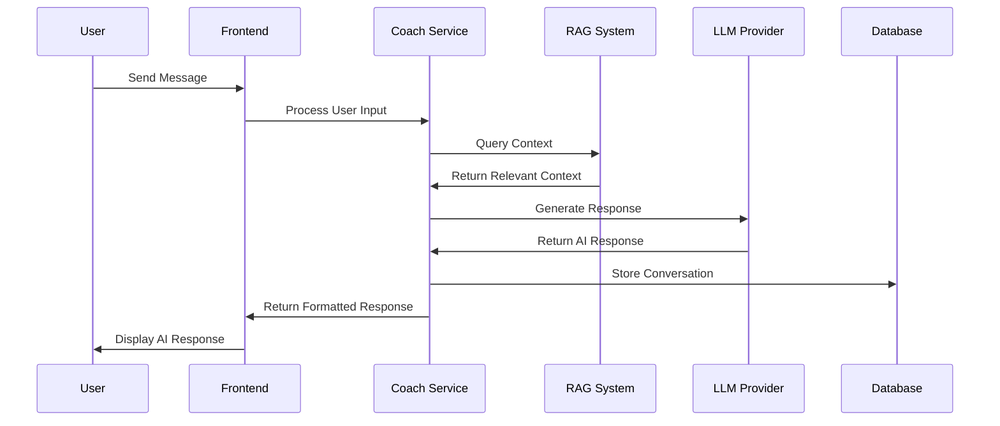

# Low-Level Design - AI Coach Module

**Version**: 1.0  
**Creation Date**: [DATE]  
**Last Update Date**: [DATE]  
**Author**: [AUTHOR]  
**Approval**: [APPROVER]  

---

## 📋 Executive Summary

This document specifies the low-level design for the AI Coach Module of the [PROJECT_NAME] system. It details the technical implementation of conversational AI coaching, context management, and personalized guidance components.

**Main Objectives:**
- Define AI coaching conversation flow and context management
- Specify integration with LLM providers and RAG systems
- Detail personalization and learning mechanisms
- Establish performance and quality metrics

---

## 🏗️ Module Architecture

### AI Coach Flow Diagram



---

## 🔧 Technical Components

### 1. AI Coach Service

#### 1.1 Core Classes

**CoachService**
- Conversation management
- Context retrieval and injection
- Response generation orchestration
- Session state management

**ConversationManager**
- Message history tracking
- Context window management
- Conversation threading
- Memory optimization

**PersonalizationEngine**
- User preference learning
- Coaching style adaptation
- Progress tracking
- Goal setting and monitoring

#### 1.2 API Endpoints

```python
# AI Coach endpoints
POST /api/coach/chat
GET /api/coach/conversations
GET /api/coach/conversations/{id}
POST /api/coach/feedback
GET /api/coach/progress
POST /api/coach/goals
```

### 2. Data Models

#### 2.1 Conversation Model

```python
class Conversation:
    id: UUID
    user_id: UUID
    title: str
    status: ConversationStatus
    created_at: datetime
    updated_at: datetime
    metadata: Dict[str, Any]
```

#### 2.2 Message Model

```python
class Message:
    id: UUID
    conversation_id: UUID
    role: MessageRole  # user, assistant, system
    content: str
    timestamp: datetime
    metadata: Dict[str, Any]
    tokens_used: int
```

#### 2.3 User Profile Model

```python
class CoachingProfile:
    user_id: UUID
    preferences: Dict[str, Any]
    goals: List[str]
    progress_metrics: Dict[str, float]
    coaching_style: str
    interaction_history: Dict[str, Any]
```

---

## 🤖 AI Integration

### 1. LLM Provider Integration

**Supported Providers:**
- OpenAI GPT-4/GPT-3.5
- Anthropic Claude
- Local models via Ollama

**Provider Abstraction:**
```python
class LLMProvider:
    def generate_response(self, messages: List[Message], context: str) -> str
    def estimate_tokens(self, text: str) -> int
    def get_model_info(self) -> ModelInfo
```

### 2. RAG System Integration

**Context Retrieval:**
- Semantic search for relevant information
- Dynamic context injection
- Source attribution and citations

**Knowledge Sources:**
- User documentation
- Best practices guides
- Domain-specific knowledge bases

---

## 🎯 Personalization Features

### 1. Adaptive Coaching
- Learning style detection
- Communication preference adaptation
- Difficulty level adjustment
- Progress-based content delivery

### 2. Goal Management
- SMART goal setting
- Progress tracking and visualization
- Milestone celebrations
- Adaptive goal adjustment

### 3. Feedback Loop
- User satisfaction tracking
- Response quality metrics
- Continuous improvement mechanisms

---

## 📊 Performance and Quality

### 1. Response Quality Metrics
- Relevance scoring
- Helpfulness ratings
- User engagement metrics
- Conversation completion rates

### 2. Performance Metrics
- Response time (target: <2s)
- Token usage optimization
- Context retrieval efficiency
- System availability (>99.5%)

### 3. Cost Management
- Token usage monitoring
- Provider cost tracking
- Usage quotas and limits
- Cost optimization strategies

---

## 🧪 Testing Strategy

### Unit Tests
- Conversation management logic
- Message processing functions
- Personalization algorithms
- Provider integration methods

### Integration Tests
- End-to-end conversation flows
- RAG system integration
- LLM provider connectivity
- Database operations

### Quality Assurance
- Response quality evaluation
- Bias and safety testing
- Performance benchmarking
- User acceptance testing

---

## 🔒 Safety and Compliance

### 1. Content Safety
- Input sanitization
- Output filtering
- Harmful content detection
- Bias mitigation strategies

### 2. Privacy Protection
- Data anonymization
- Conversation encryption
- Retention policy compliance
- User consent management

### 3. Ethical AI Guidelines
- Transparency in AI responses
- User agency preservation
- Fairness and non-discrimination
- Responsible AI practices

---

## 📈 Monitoring and Analytics

### Metrics Dashboard
- Conversation volume and trends
- User satisfaction scores
- Response quality metrics
- System performance indicators

### Logging Strategy
- Conversation logs (anonymized)
- Error tracking and alerting
- Performance monitoring
- Usage analytics

---

## ✅ Acceptance Criteria

- [ ] AI coach can maintain coherent conversations
- [ ] Context retrieval works accurately
- [ ] Personalization adapts to user preferences
- [ ] Response times meet performance targets
- [ ] Safety measures prevent harmful outputs
- [ ] Integration with all LLM providers works
- [ ] Monitoring and analytics are functional
- [ ] User feedback mechanisms are operational

---

**Status**: 📝 Template  
**Next Review**: [DATE]  
**Responsible**: [TEAM_MEMBER]  

--- END OF DOCUMENT LLD_AI_Coach_Module.md (v1.0) ---