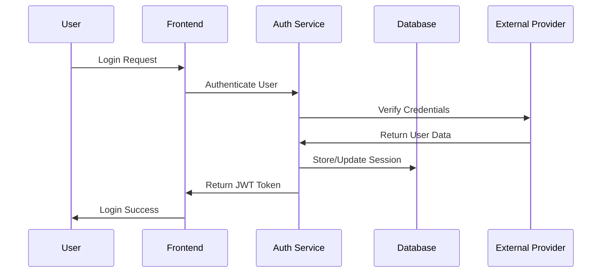

# Low-Level Design - Authentication Module

**Version**: 1.0  
**Creation Date**: [DATE]  
**Last Update Date**: [DATE]  
**Author**: [AUTHOR]  
**Approval**: [APPROVER]  

---

## 📋 Executive Summary

This document specifies the low-level design for the Authentication Module of the [PROJECT_NAME] system. It details the technical implementation of user authentication, authorization, and session management components.

**Main Objectives:**
- Define authentication flow and security mechanisms
- Specify API endpoints and data models
- Detail integration with external authentication providers
- Establish security best practices and compliance requirements

---

## 🏗️ Module Architecture

### Authentication Flow Diagram



---

## 🔧 Technical Components

### 1. Authentication Service

#### 1.1 Core Classes

**AuthenticationService**
- User login/logout functionality
- Token generation and validation
- Password hashing and verification
- Session management

**AuthorizationService**
- Role-based access control (RBAC)
- Permission validation
- Resource access control

#### 1.2 API Endpoints

```python
# Authentication endpoints
POST /api/auth/login
POST /api/auth/logout
POST /api/auth/refresh
GET /api/auth/profile
PUT /api/auth/profile
POST /api/auth/change-password
```

### 2. Data Models

#### 2.1 User Model

```python
class User:
    id: UUID
    email: str
    password_hash: str
    first_name: str
    last_name: str
    role: UserRole
    is_active: bool
    created_at: datetime
    updated_at: datetime
```

#### 2.2 Session Model

```python
class UserSession:
    id: UUID
    user_id: UUID
    token: str
    expires_at: datetime
    created_at: datetime
    last_accessed: datetime
```

---

## 🔒 Security Implementation

### 1. Password Security
- Bcrypt hashing with salt
- Minimum password complexity requirements
- Password history tracking

### 2. Token Management
- JWT tokens with expiration
- Refresh token rotation
- Token blacklisting for logout

### 3. Session Security
- Secure session storage
- Session timeout handling
- Concurrent session limits

---

## 🧪 Testing Strategy

### Unit Tests
- Authentication service methods
- Password hashing/verification
- Token generation/validation

### Integration Tests
- API endpoint testing
- Database integration
- External provider integration

### Security Tests
- Penetration testing
- Vulnerability scanning
- Authentication bypass attempts

---

## 📊 Monitoring and Logging

### Metrics
- Login success/failure rates
- Session duration statistics
- Authentication response times

### Logging
- Authentication attempts
- Security events
- Error tracking

---

## ✅ Acceptance Criteria

- [ ] User can successfully login/logout
- [ ] JWT tokens are properly generated and validated
- [ ] Password security requirements are enforced
- [ ] Session management works correctly
- [ ] API endpoints return appropriate responses
- [ ] Security tests pass
- [ ] Performance requirements are met

---

**Status**: 📝 Template  
**Next Review**: [DATE]  
**Responsible**: [TEAM_MEMBER]  

--- END OF DOCUMENT LLD_Authentication_Module.md (v1.0) ---