# Low-Level Design - CV Optimization Module

**Version**: 1.0  
**Creation Date**: 2025-01-23  
**Last Update Date**: 2025-01-23  
**Author**: @ArquitetoDoCodex  
**Status**: Draft  
**Approval**: Pending  

**Based on**:
- [[LLD.md]] (v1.0) - Consolidated Low-Level Design
- [[HLD.md]] (v1.1) - High-Level Design
- [[ERS.md]] (v1.1) - System Requirements

---

## 📋 Executive Summary

This document details the **Low-Level Design (LLD)** of the CV Optimization Module for the Recoloca.ai system. The module is responsible for analyzing, evaluating, and optimizing CVs using artificial intelligence, providing personalized insights and improvement suggestions to help users enhance their professional profiles.

**Module Scope:**
- CV content analysis and extraction
- Intelligent scoring and evaluation
- Personalized optimization suggestions
- Integration with RAG system for contextual insights
- Multi-format CV support (PDF, DOCX, TXT)

---

## 🎯 Objectives and Requirements

### Functional Objectives
- **Intelligent Analysis**: Extract and analyze CV content using NLP techniques
- **Scoring System**: Provide objective scoring based on industry standards
- **Personalized Optimization**: Generate specific improvement suggestions
- **Multi-format Support**: Handle various CV formats seamlessly
- **Contextual Insights**: Leverage RAG system for industry-specific recommendations

### Non-Functional Requirements
- **Performance**: Analysis completion in < 30 seconds
- **Accuracy**: 85%+ accuracy in content extraction
- **Scalability**: Support 1000+ concurrent analyses
- **Security**: Secure handling of sensitive personal data
- **Availability**: 99.9% uptime for analysis services

---

## 🏗️ System Architecture

### Component Diagram

```mermaid
graph TB
    subgraph "Frontend Layer"
        A["📱 CV Upload Interface"]
        B["📊 Analysis Dashboard"]
        C["💡 Optimization Suggestions"]
        D["📈 Progress Tracking"]
    end
    
    subgraph "API Layer"
        E["🚪 CV Analysis Endpoints"]
        F["🔍 Content Extraction API"]
        G["📊 Scoring API"]
        H["💡 Optimization API"]
    end
    
    subgraph "Business Logic"
        I["📄 CV Parser Service"]
        J["🧠 Analysis Engine"]
        K["📊 Scoring Service"]
        L["💡 Optimization Service"]
    end
    
    subgraph "Data Processing"
        M["🔤 Text Extraction"]
        N["🏷️ Entity Recognition"]
        O["📋 Structure Analysis"]
        P["🎯 Skills Matching"]
    end
    
    subgraph "External Services"
        Q["🤖 Google Gemini"]
        R["🧠 RAG System"]
        S["📚 Knowledge Base"]
    end
    
    subgraph "Storage"
        T["🗄️ Supabase DB"]
        U["📁 File Storage"]
        V["💾 Cache Layer"]
    end
    
    A --> E
    B --> G
    C --> H
    D --> E
    
    E --> I
    F --> M
    G --> K
    H --> L
    
    I --> M
    J --> N
    J --> O
    K --> P
    
    L --> Q
    J --> R
    R --> S
    
    I --> T
    M --> U
    K --> V
    
    style J fill:#4CAF50
    style L fill:#2196F3
    style R fill:#FF9800
```



---

## 🔧 Detailed Component Specifications

### 1. CV Parser Service

#### 1.1 Main Class Structure

```python
from typing import Dict, List, Optional, Union
from dataclasses import dataclass
from enum import Enum
import asyncio

class CVFormat(str, Enum):
    """Supported CV formats."""
    PDF = "pdf"
    DOCX = "docx"
    TXT = "txt"
    HTML = "html"

class CVSection(str, Enum):
    """CV sections for structured analysis."""
    PERSONAL_INFO = "personal_info"
    SUMMARY = "summary"
    EXPERIENCE = "experience"
    EDUCATION = "education"
    SKILLS = "skills"
    CERTIFICATIONS = "certifications"
    LANGUAGES = "languages"
    PROJECTS = "projects"
    ACHIEVEMENTS = "achievements"

@dataclass
class CVContent:
    """Structured CV content."""
    raw_text: str
    sections: Dict[CVSection, str]
    metadata: Dict[str, any]
    extracted_entities: Dict[str, List[str]]
    confidence_score: float

class CVParserService:
    """Main service for CV parsing and content extraction."""
    
    def __init__(self, 
                 text_extractor: 'TextExtractor',
                 entity_recognizer: 'EntityRecognizer',
                 structure_analyzer: 'StructureAnalyzer'):
        self.text_extractor = text_extractor
        self.entity_recognizer = entity_recognizer
        self.structure_analyzer = structure_analyzer
    
    async def parse_cv(self, 
                      file_content: bytes, 
                      file_format: CVFormat,
                      user_context: Optional[Dict] = None) -> CVContent:
        """
        Parses CV file and extracts structured content.
        
        Args:
            file_content: Raw file bytes
            file_format: CV file format
            user_context: Optional user context for personalization
            
        Returns:
            Structured CV content
        """
        # 1. Extract raw text
        raw_text = await self.text_extractor.extract_text(
            file_content, file_format
        )
        
        # 2. Analyze document structure
        sections = await self.structure_analyzer.identify_sections(raw_text)
        
        # 3. Extract entities
        entities = await self.entity_recognizer.extract_entities(
            raw_text, sections
        )
        
        # 4. Calculate confidence score
        confidence = self._calculate_confidence(raw_text, sections, entities)
        
        # 5. Generate metadata
        metadata = self._generate_metadata(
            file_format, len(raw_text), user_context
        )
        
        return CVContent(
            raw_text=raw_text,
            sections=sections,
            metadata=metadata,
            extracted_entities=entities,
            confidence_score=confidence
        )
    
    def _calculate_confidence(self, 
                            text: str, 
                            sections: Dict, 
                            entities: Dict) -> float:
        """
        Calculates confidence score for extraction quality.
        
        Args:
            text: Raw text
            sections: Identified sections
            entities: Extracted entities
            
        Returns:
            Confidence score (0.0-1.0)
        """
        # Implementation for confidence calculation
        base_score = 0.5
        
        # Bonus for identified sections
        section_bonus = len(sections) * 0.05
        
        # Bonus for extracted entities
        entity_bonus = sum(len(ents) for ents in entities.values()) * 0.01
        
        # Text quality bonus
        text_quality = min(len(text) / 1000, 1.0) * 0.2
        
        return min(base_score + section_bonus + entity_bonus + text_quality, 1.0)
    
    def _generate_metadata(self, 
                          file_format: CVFormat, 
                          text_length: int,
                          user_context: Optional[Dict]) -> Dict:
        """
        Generates metadata for the parsed CV.
        
        Args:
            file_format: Original file format
            text_length: Length of extracted text
            user_context: User context
            
        Returns:
            Metadata dictionary
        """
        return {
            "file_format": file_format.value,
            "text_length": text_length,
            "processing_timestamp": datetime.utcnow().isoformat(),
            "user_context": user_context or {},
            "parser_version": "1.0.0"
        }
```

#### 1.2 Text Extraction Components

```python
from abc import ABC, abstractmethod
import PyPDF2
from docx import Document
import re

class TextExtractor:
    """Text extraction from various file formats."""
    
    def __init__(self):
        self.extractors = {
            CVFormat.PDF: self._extract_from_pdf,
            CVFormat.DOCX: self._extract_from_docx,
            CVFormat.TXT: self._extract_from_txt,
            CVFormat.HTML: self._extract_from_html
        }
    
    async def extract_text(self, file_content: bytes, file_format: CVFormat) -> str:
        """
        Extracts text from file based on format.
        
        Args:
            file_content: Raw file bytes
            file_format: File format
            
        Returns:
            Extracted text
        """
        extractor = self.extractors.get(file_format)
        if not extractor:
            raise ValueError(f"Unsupported file format: {file_format}")
        
        try:
            text = await extractor(file_content)
            return self._clean_text(text)
        except Exception as e:
            raise ExtractionError(f"Failed to extract text: {str(e)}")
    
    async def _extract_from_pdf(self, file_content: bytes) -> str:
        """Extracts text from PDF file."""
        import io
        
        pdf_file = io.BytesIO(file_content)
        pdf_reader = PyPDF2.PdfReader(pdf_file)
        
        text = ""
        for page in pdf_reader.pages:
            text += page.extract_text() + "\n"
        
        return text
    
    async def _extract_from_docx(self, file_content: bytes) -> str:
        """Extracts text from DOCX file."""
        import io
        
        docx_file = io.BytesIO(file_content)
        doc = Document(docx_file)
        
        text = ""
        for paragraph in doc.paragraphs:
            text += paragraph.text + "\n"
        
        return text
    
    async def _extract_from_txt(self, file_content: bytes) -> str:
        """Extracts text from TXT file."""
        return file_content.decode('utf-8', errors='ignore')
    
    async def _extract_from_html(self, file_content: bytes) -> str:
        """Extracts text from HTML file."""
        from bs4 import BeautifulSoup
        
        html_content = file_content.decode('utf-8', errors='ignore')
        soup = BeautifulSoup(html_content, 'html.parser')
        
        return soup.get_text()
    
    def _clean_text(self, text: str) -> str:
        """Cleans and normalizes extracted text."""
        # Remove excessive whitespace
        text = re.sub(r'\s+', ' ', text)
        
        # Remove special characters but keep basic punctuation
        text = re.sub(r'[^\w\s.,;:!?()-]', '', text)
        
        # Normalize line breaks
        text = re.sub(r'\n+', '\n', text)
        
        return text.strip()
```

### 2. Analysis Engine

#### 2.1 Core Analysis Service

```python
from typing import Dict, List, Tuple
from dataclasses import dataclass
from datetime import datetime

@dataclass
class AnalysisResult:
    """CV analysis result."""
    overall_score: float
    section_scores: Dict[CVSection, float]
    insights: List[str]
    strengths: List[str]
    weaknesses: List[str]
    recommendations: List[str]
    analysis_metadata: Dict[str, any]

class AnalysisEngine:
    """Main engine for CV analysis and scoring."""
    
    def __init__(self, 
                 scoring_service: 'ScoringService',
                 rag_client: 'RAGClient',
                 ai_client: 'AIClient'):
        self.scoring_service = scoring_service
        self.rag_client = rag_client
        self.ai_client = ai_client
    
    async def analyze_cv(self, 
                        cv_content: CVContent,
                        target_position: Optional[str] = None,
                        target_company: Optional[str] = None) -> AnalysisResult:
        """
        Performs comprehensive CV analysis.
        
        Args:
            cv_content: Parsed CV content
            target_position: Target job position
            target_company: Target company
            
        Returns:
            Complete analysis result
        """
        # 1. Generate section scores
        section_scores = await self.scoring_service.score_sections(
            cv_content.sections
        )
        
        # 2. Calculate overall score
        overall_score = self._calculate_overall_score(section_scores)
        
        # 3. Get contextual insights from RAG
        context_query = self._build_context_query(
            cv_content, target_position, target_company
        )
        rag_context = await self.rag_client.search(context_query)
        
        # 4. Generate AI-powered insights
        ai_analysis = await self.ai_client.analyze_cv_with_context(
            cv_content=cv_content,
            context=rag_context,
            target_position=target_position,
            target_company=target_company
        )
        
        # 5. Compile final result
        return AnalysisResult(
            overall_score=overall_score,
            section_scores=section_scores,
            insights=ai_analysis.insights,
            strengths=ai_analysis.strengths,
            weaknesses=ai_analysis.weaknesses,
            recommendations=ai_analysis.recommendations,
            analysis_metadata={
                "analysis_timestamp": datetime.utcnow().isoformat(),
                "target_position": target_position,
                "target_company": target_company,
                "confidence_score": cv_content.confidence_score,
                "rag_context_count": len(rag_context)
            }
        )
    
    def _calculate_overall_score(self, section_scores: Dict[CVSection, float]) -> float:
        """
        Calculates weighted overall score from section scores.
        
        Args:
            section_scores: Individual section scores
            
        Returns:
            Overall weighted score
        """
        # Define section weights
        weights = {
            CVSection.EXPERIENCE: 0.30,
            CVSection.SKILLS: 0.25,
            CVSection.EDUCATION: 0.20,
            CVSection.SUMMARY: 0.15,
            CVSection.PROJECTS: 0.10
        }
        
        weighted_sum = 0.0
        total_weight = 0.0
        
        for section, score in section_scores.items():
            weight = weights.get(section, 0.05)  # Default weight for other sections
            weighted_sum += score * weight
            total_weight += weight
        
        return weighted_sum / total_weight if total_weight > 0 else 0.0
    
    def _build_context_query(self, 
                           cv_content: CVContent,
                           target_position: Optional[str],
                           target_company: Optional[str]) -> str:
        """
        Builds query for RAG context retrieval.
        
        Args:
            cv_content: CV content
            target_position: Target position
            target_company: Target company
            
        Returns:
            Context query string
        """
        query_parts = []
        
        # Add skills context
        if CVSection.SKILLS in cv_content.sections:
            skills = cv_content.extracted_entities.get('skills', [])
            if skills:
                query_parts.append(f"skills: {', '.join(skills[:5])}")
        
        # Add position context
        if target_position:
            query_parts.append(f"position: {target_position}")
        
        # Add company context
        if target_company:
            query_parts.append(f"company: {target_company}")
        
        # Add experience level context
        experience_years = self._estimate_experience_years(cv_content)
        if experience_years:
            query_parts.append(f"experience: {experience_years} years")
        
        return " ".join(query_parts)
    
    def _estimate_experience_years(self, cv_content: CVContent) -> Optional[int]:
        """
        Estimates years of experience from CV content.
        
        Args:
            cv_content: CV content
            
        Returns:
            Estimated years of experience
        """
        # Implementation for experience estimation
        # This would analyze dates in experience section
        return None  # Placeholder
```

### 3. Scoring Service

#### 3.1 Section Scoring Implementation

```python
from typing import Dict, List
import re
from datetime import datetime, timedelta

class ScoringService:
    """Service for scoring different CV sections."""
    
    def __init__(self):
        self.section_scorers = {
            CVSection.PERSONAL_INFO: self._score_personal_info,
            CVSection.SUMMARY: self._score_summary,
            CVSection.EXPERIENCE: self._score_experience,
            CVSection.EDUCATION: self._score_education,
            CVSection.SKILLS: self._score_skills,
            CVSection.CERTIFICATIONS: self._score_certifications,
            CVSection.LANGUAGES: self._score_languages,
            CVSection.PROJECTS: self._score_projects
        }
    
    async def score_sections(self, sections: Dict[CVSection, str]) -> Dict[CVSection, float]:
        """
        Scores all CV sections.
        
        Args:
            sections: CV sections content
            
        Returns:
            Section scores (0.0-100.0)
        """
        scores = {}
        
        for section, content in sections.items():
            scorer = self.section_scorers.get(section)
            if scorer:
                scores[section] = await scorer(content)
            else:
                scores[section] = self._score_generic_section(content)
        
        return scores
    
    async def _score_personal_info(self, content: str) -> float:
        """
        Scores personal information section.
        
        Args:
            content: Section content
            
        Returns:
            Score (0.0-100.0)
        """
        score = 0.0
        
        # Check for email
        if re.search(r'\b[A-Za-z0-9._%+-]+@[A-Za-z0-9.-]+\.[A-Z|a-z]{2,}\b', content):
            score += 25.0
        
        # Check for phone
        if re.search(r'\b\d{2,3}[-\s]?\d{4,5}[-\s]?\d{4}\b', content):
            score += 25.0
        
        # Check for location
        if any(keyword in content.lower() for keyword in ['cidade', 'city', 'estado', 'state']):
            score += 25.0
        
        # Check for LinkedIn or professional links
        if 'linkedin' in content.lower() or 'github' in content.lower():
            score += 25.0
        
        return score
    
    async def _score_summary(self, content: str) -> float:
        """
        Scores professional summary section.
        
        Args:
            content: Section content
            
        Returns:
            Score (0.0-100.0)
        """
        score = 0.0
        words = content.split()
        
        # Length check (50-150 words is ideal)
        word_count = len(words)
        if 50 <= word_count <= 150:
            score += 40.0
        elif 30 <= word_count < 50 or 150 < word_count <= 200:
            score += 25.0
        elif word_count > 0:
            score += 10.0
        
        # Check for key professional terms
        professional_terms = [
            'experience', 'expertise', 'skilled', 'proficient',
            'specialized', 'accomplished', 'results-driven',
            'experiência', 'especialista', 'habilidoso', 'especializado'
        ]
        
        term_count = sum(1 for term in professional_terms if term in content.lower())
        score += min(term_count * 10, 30.0)
        
        # Check for quantifiable achievements
        if re.search(r'\d+%|\d+\s*(years?|anos?)|\d+\s*(projects?|projetos?)', content.lower()):
            score += 30.0
        
        return min(score, 100.0)
    
    async def _score_experience(self, content: str) -> float:
        """
        Scores work experience section.
        
        Args:
            content: Section content
            
        Returns:
            Score (0.0-100.0)
        """
        score = 0.0
        
        # Count job positions (look for company names, dates, titles)
        job_patterns = [
            r'\d{4}\s*[-–]\s*\d{4}',  # Date ranges
            r'\d{4}\s*[-–]\s*present',  # Current positions
            r'\d{1,2}/\d{4}\s*[-–]\s*\d{1,2}/\d{4}'  # Month/Year ranges
        ]
        
        job_count = 0
        for pattern in job_patterns:
            job_count += len(re.findall(pattern, content, re.IGNORECASE))
        
        # Score based on number of positions
        if job_count >= 3:
            score += 40.0
        elif job_count >= 2:
            score += 30.0
        elif job_count >= 1:
            score += 20.0
        
        # Check for detailed descriptions
        sentences = content.split('.')
        detailed_descriptions = sum(1 for s in sentences if len(s.split()) > 10)
        score += min(detailed_descriptions * 5, 30.0)
        
        # Check for action verbs and achievements
        action_verbs = [
            'developed', 'implemented', 'managed', 'led', 'created',
            'improved', 'increased', 'reduced', 'achieved',
            'desenvolveu', 'implementou', 'gerenciou', 'liderou', 'criou'
        ]
        
        verb_count = sum(1 for verb in action_verbs if verb in content.lower())
        score += min(verb_count * 3, 30.0)
        
        return min(score, 100.0)
    
    async def _score_skills(self, content: str) -> float:
        """
        Scores skills section.
        
        Args:
            content: Section content
            
        Returns:
            Score (0.0-100.0)
        """
        score = 0.0
        
        # Count distinct skills (separated by commas, bullets, or lines)
        skills = re.split(r'[,•\n]', content)
        skill_count = len([s.strip() for s in skills if s.strip()])
        
        # Score based on number of skills
        if skill_count >= 15:
            score += 40.0
        elif skill_count >= 10:
            score += 30.0
        elif skill_count >= 5:
            score += 20.0
        elif skill_count > 0:
            score += 10.0
        
        # Check for technical skills categories
        tech_categories = [
            'programming', 'software', 'database', 'cloud', 'framework',
            'programação', 'software', 'banco de dados', 'nuvem'
        ]
        
        category_count = sum(1 for cat in tech_categories if cat in content.lower())
        score += min(category_count * 10, 30.0)
        
        # Check for proficiency levels
        if any(level in content.lower() for level in ['advanced', 'expert', 'proficient', 'avançado', 'especialista']):
            score += 30.0
        elif any(level in content.lower() for level in ['intermediate', 'intermediário']):
            score += 20.0
        elif any(level in content.lower() for level in ['basic', 'beginner', 'básico', 'iniciante']):
            score += 10.0
        
        return min(score, 100.0)
    
    def _score_generic_section(self, content: str) -> float:
        """
        Generic scoring for unspecified sections.
        
        Args:
            content: Section content
            
        Returns:
            Score (0.0-100.0)
        """
        if not content.strip():
            return 0.0
        
        # Basic scoring based on content length and structure
        word_count = len(content.split())
        
        if word_count >= 50:
            return 80.0
        elif word_count >= 20:
            return 60.0
        elif word_count >= 10:
            return 40.0
        else:
            return 20.0
```

### 4. Optimization Service

#### 4.1 Recommendation Engine

```python
from typing import List, Dict, Tuple
from dataclasses import dataclass

@dataclass
class OptimizationSuggestion:
    """Individual optimization suggestion."""
    section: CVSection
    priority: str  # 'high', 'medium', 'low'
    suggestion_type: str  # 'add', 'improve', 'remove', 'restructure'
    title: str
    description: str
    example: Optional[str] = None
    impact_score: float = 0.0

class OptimizationService:
    """Service for generating CV optimization suggestions."""
    
    def __init__(self, ai_client: 'AIClient', rag_client: 'RAGClient'):
        self.ai_client = ai_client
        self.rag_client = rag_client
    
    async def generate_optimizations(self, 
                                   analysis_result: AnalysisResult,
                                   cv_content: CVContent,
                                   target_context: Optional[Dict] = None) -> List[OptimizationSuggestion]:
        """
        Generates personalized optimization suggestions.
        
        Args:
            analysis_result: CV analysis result
            cv_content: Original CV content
            target_context: Target job/company context
            
        Returns:
            List of optimization suggestions
        """
        suggestions = []
        
        # 1. Generate section-specific suggestions
        for section, score in analysis_result.section_scores.items():
            if score < 70.0:  # Sections needing improvement
                section_suggestions = await self._generate_section_suggestions(
                    section, score, cv_content, target_context
                )
                suggestions.extend(section_suggestions)
        
        # 2. Generate AI-powered suggestions
        ai_suggestions = await self._generate_ai_suggestions(
            analysis_result, cv_content, target_context
        )
        suggestions.extend(ai_suggestions)
        
        # 3. Prioritize and rank suggestions
        suggestions = self._prioritize_suggestions(suggestions)
        
        return suggestions[:10]  # Return top 10 suggestions
    
    async def _generate_section_suggestions(self, 
                                          section: CVSection,
                                          score: float,
                                          cv_content: CVContent,
                                          target_context: Optional[Dict]) -> List[OptimizationSuggestion]:
        """
        Generates suggestions for specific CV section.
        
        Args:
            section: CV section
            score: Current section score
            cv_content: CV content
            target_context: Target context
            
        Returns:
            Section-specific suggestions
        """
        suggestions = []
        section_content = cv_content.sections.get(section, "")
        
        if section == CVSection.SUMMARY:
            if score < 50:
                suggestions.append(OptimizationSuggestion(
                    section=section,
                    priority="high",
                    suggestion_type="improve",
                    title="Enhance Professional Summary",
                    description="Your professional summary needs more impact. Include specific achievements and quantifiable results.",
                    example="Results-driven software engineer with 5+ years of experience, increased system performance by 40% and led 3 successful product launches.",
                    impact_score=25.0
                ))
        
        elif section == CVSection.EXPERIENCE:
            if score < 60:
                suggestions.append(OptimizationSuggestion(
                    section=section,
                    priority="high",
                    suggestion_type="improve",
                    title="Add Quantifiable Achievements",
                    description="Include specific metrics and results in your work experience descriptions.",
                    example="• Increased sales by 30% through implementation of new CRM system\n• Managed team of 8 developers across 3 projects",
                    impact_score=30.0
                ))
        
        elif section == CVSection.SKILLS:
            if score < 70:
                suggestions.append(OptimizationSuggestion(
                    section=section,
                    priority="medium",
                    suggestion_type="add",
                    title="Expand Technical Skills",
                    description="Add more relevant technical skills and specify proficiency levels.",
                    example="Python (Advanced), React (Intermediate), AWS (Intermediate), Docker (Basic)",
                    impact_score=20.0
                ))
        
        return suggestions
    
    async def _generate_ai_suggestions(self, 
                                     analysis_result: AnalysisResult,
                                     cv_content: CVContent,
                                     target_context: Optional[Dict]) -> List[OptimizationSuggestion]:
        """
        Generates AI-powered optimization suggestions.
        
        Args:
            analysis_result: Analysis result
            cv_content: CV content
            target_context: Target context
            
        Returns:
            AI-generated suggestions
        """
        # Get relevant context from RAG
        context_query = f"CV optimization {target_context.get('position', '')} {target_context.get('industry', '')}"
        rag_context = await self.rag_client.search(context_query)
        
        # Generate suggestions using AI
        ai_response = await self.ai_client.generate_optimization_suggestions(
            analysis_result=analysis_result,
            cv_content=cv_content,
            context=rag_context,
            target_context=target_context
        )
        
        return ai_response.suggestions
    
    def _prioritize_suggestions(self, suggestions: List[OptimizationSuggestion]) -> List[OptimizationSuggestion]:
        """
        Prioritizes suggestions based on impact and priority.
        
        Args:
            suggestions: List of suggestions
            
        Returns:
            Prioritized suggestions
        """
        # Define priority weights
        priority_weights = {
            "high": 3.0,
            "medium": 2.0,
            "low": 1.0
        }
        
        # Calculate priority scores
        for suggestion in suggestions:
            priority_weight = priority_weights.get(suggestion.priority, 1.0)
            suggestion.priority_score = suggestion.impact_score * priority_weight
        
        # Sort by priority score
        return sorted(suggestions, key=lambda x: x.priority_score, reverse=True)
```

---

## 📊 Data Models and Storage

### Database Schema

```sql
-- CV analyses table
CREATE TABLE cv_analyses (
    id UUID PRIMARY KEY DEFAULT gen_random_uuid(),
    user_id UUID REFERENCES users(id) ON DELETE CASCADE,
    file_name VARCHAR(255) NOT NULL,
    file_format cv_format NOT NULL,
    file_size INTEGER,
    raw_content TEXT,
    structured_content JSONB,
    overall_score DECIMAL(5,2) CHECK (overall_score >= 0 AND overall_score <= 100),
    section_scores JSONB,
    insights JSONB,
    strengths JSONB,
    weaknesses JSONB,
    recommendations JSONB,
    target_position VARCHAR(255),
    target_company VARCHAR(255),
    confidence_score DECIMAL(3,2),
    processing_time_ms INTEGER,
    created_at TIMESTAMP WITH TIME ZONE DEFAULT NOW(),
    updated_at TIMESTAMP WITH TIME ZONE DEFAULT NOW()
);

-- CV format enum
CREATE TYPE cv_format AS ENUM ('pdf', 'docx', 'txt', 'html');

-- Optimization suggestions table
CREATE TABLE optimization_suggestions (
    id UUID PRIMARY KEY DEFAULT gen_random_uuid(),
    analysis_id UUID REFERENCES cv_analyses(id) ON DELETE CASCADE,
    section cv_section NOT NULL,
    priority suggestion_priority NOT NULL,
    suggestion_type suggestion_type NOT NULL,
    title VARCHAR(255) NOT NULL,
    description TEXT NOT NULL,
    example TEXT,
    impact_score DECIMAL(5,2),
    is_applied BOOLEAN DEFAULT FALSE,
    created_at TIMESTAMP WITH TIME ZONE DEFAULT NOW()
);

-- Enums for suggestions
CREATE TYPE cv_section AS ENUM (
    'personal_info', 'summary', 'experience', 'education', 
    'skills', 'certifications', 'languages', 'projects', 'achievements'
);

CREATE TYPE suggestion_priority AS ENUM ('high', 'medium', 'low');
CREATE TYPE suggestion_type AS ENUM ('add', 'improve', 'remove', 'restructure');

-- Indexes for performance
CREATE INDEX idx_cv_analyses_user_id ON cv_analyses(user_id);
CREATE INDEX idx_cv_analyses_created_at ON cv_analyses(created_at);
CREATE INDEX idx_optimization_suggestions_analysis_id ON optimization_suggestions(analysis_id);
CREATE INDEX idx_optimization_suggestions_priority ON optimization_suggestions(priority);
```

---

## 🔧 API Endpoints

### REST API Specification

```python
from fastapi import APIRouter, Depends, HTTPException, UploadFile, File
from typing import Optional, List

router = APIRouter(prefix="/api/v1/cv", tags=["cv-optimization"])

@router.post("/analyze", response_model=CVAnalysisResponse)
async def analyze_cv(
    file: UploadFile = File(...),
    target_position: Optional[str] = None,
    target_company: Optional[str] = None,
    current_user: User = Depends(get_current_user),
    cv_service: CVOptimizationService = Depends(get_cv_service)
):
    """
    Analyzes uploaded CV and provides optimization insights.
    
    Args:
        file: CV file (PDF, DOCX, TXT)
        target_position: Target job position
        target_company: Target company
        current_user: Authenticated user
        cv_service: CV optimization service
        
    Returns:
        Complete CV analysis with scores and suggestions
    """
    # Validate file format
    if not file.filename.lower().endswith(('.pdf', '.docx', '.txt')):
        raise HTTPException(
            status_code=400,
            detail="Unsupported file format. Please upload PDF, DOCX, or TXT files."
        )
    
    # Check file size (max 10MB)
    if file.size > 10 * 1024 * 1024:
        raise HTTPException(
            status_code=400,
            detail="File too large. Maximum size is 10MB."
        )
    
    try:
        # Read file content
        file_content = await file.read()
        
        # Perform analysis
        analysis_result = await cv_service.analyze_cv(
            file_content=file_content,
            file_name=file.filename,
            user_id=current_user.id,
            target_position=target_position,
            target_company=target_company
        )
        
        return analysis_result
        
    except Exception as e:
        raise HTTPException(
            status_code=500,
            detail=f"Analysis failed: {str(e)}"
        )

@router.get("/analyses", response_model=List[CVAnalysisSummary])
async def get_user_analyses(
    limit: int = 10,
    offset: int = 0,
    current_user: User = Depends(get_current_user),
    cv_service: CVOptimizationService = Depends(get_cv_service)
):
    """
    Retrieves user's CV analysis history.
    
    Args:
        limit: Maximum number of results
        offset: Pagination offset
        current_user: Authenticated user
        cv_service: CV optimization service
        
    Returns:
        List of user's CV analyses
    """
    return await cv_service.get_user_analyses(
        user_id=current_user.id,
        limit=limit,
        offset=offset
    )

@router.get("/analyses/{analysis_id}", response_model=CVAnalysisResponse)
async def get_analysis_details(
    analysis_id: str,
    current_user: User = Depends(get_current_user),
    cv_service: CVOptimizationService = Depends(get_cv_service)
):
    """
    Retrieves detailed CV analysis results.
    
    Args:
        analysis_id: Analysis ID
        current_user: Authenticated user
        cv_service: CV optimization service
        
    Returns:
        Detailed analysis results
    """
    analysis = await cv_service.get_analysis_by_id(
        analysis_id=analysis_id,
        user_id=current_user.id
    )
    
    if not analysis:
        raise HTTPException(
            status_code=404,
            detail="Analysis not found"
        )
    
    return analysis

@router.post("/optimize", response_model=OptimizationResponse)
async def generate_optimizations(
    request: OptimizationRequest,
    current_user: User = Depends(get_current_user),
    cv_service: CVOptimizationService = Depends(get_cv_service)
):
    """
    Generates optimization suggestions for a CV analysis.
    
    Args:
        request: Optimization request
        current_user: Authenticated user
        cv_service: CV optimization service
        
    Returns:
        Optimization suggestions
    """
    return await cv_service.generate_optimizations(
        analysis_id=request.analysis_id,
        user_id=current_user.id,
        target_context=request.target_context
    )
```

---

## 🧪 Testing Strategy

### Unit Tests

```python
import pytest
from unittest.mock import Mock, AsyncMock
from cv_optimization.services import CVParserService, AnalysisEngine

class TestCVParserService:
    """Test cases for CV Parser Service."""
    
    @pytest.fixture
    def parser_service(self):
        text_extractor = Mock()
        entity_recognizer = Mock()
        structure_analyzer = Mock()
        
        return CVParserService(
            text_extractor=text_extractor,
            entity_recognizer=entity_recognizer,
            structure_analyzer=structure_analyzer
        )
    
    @pytest.mark.asyncio
    async def test_parse_cv_success(self, parser_service):
        """Test successful CV parsing."""
        # Arrange
        file_content = b"Sample CV content"
        file_format = CVFormat.PDF
        
        parser_service.text_extractor.extract_text = AsyncMock(
            return_value="Extracted text content"
        )
        parser_service.structure_analyzer.identify_sections = AsyncMock(
            return_value={CVSection.SUMMARY: "Professional summary"}
        )
        parser_service.entity_recognizer.extract_entities = AsyncMock(
            return_value={"skills": ["Python", "JavaScript"]}
        )
        
        # Act
        result = await parser_service.parse_cv(file_content, file_format)
        
        # Assert
        assert result.raw_text == "Extracted text content"
        assert CVSection.SUMMARY in result.sections
        assert "skills" in result.extracted_entities
        assert result.confidence_score > 0.0
    
    @pytest.mark.asyncio
    async def test_parse_cv_invalid_format(self, parser_service):
        """Test CV parsing with invalid format."""
        # Arrange
        file_content = b"Sample content"
        
        parser_service.text_extractor.extract_text = AsyncMock(
            side_effect=ValueError("Unsupported format")
        )
        
        # Act & Assert
        with pytest.raises(ExtractionError):
            await parser_service.parse_cv(file_content, CVFormat.PDF)

class TestAnalysisEngine:
    """Test cases for Analysis Engine."""
    
    @pytest.fixture
    def analysis_engine(self):
        scoring_service = Mock()
        rag_client = Mock()
        ai_client = Mock()
        
        return AnalysisEngine(
            scoring_service=scoring_service,
            rag_client=rag_client,
            ai_client=ai_client
        )
    
    @pytest.mark.asyncio
    async def test_analyze_cv_complete_flow(self, analysis_engine):
        """Test complete CV analysis flow."""
        # Arrange
        cv_content = CVContent(
            raw_text="Sample CV text",
            sections={CVSection.SUMMARY: "Professional summary"},
            metadata={},
            extracted_entities={"skills": ["Python"]},
            confidence_score=0.8
        )
        
        analysis_engine.scoring_service.score_sections = AsyncMock(
            return_value={CVSection.SUMMARY: 75.0}
        )
        analysis_engine.rag_client.search = AsyncMock(
            return_value=["Relevant context"]
        )
        analysis_engine.ai_client.analyze_cv_with_context = AsyncMock(
            return_value=Mock(
                insights=["Good summary"],
                strengths=["Clear writing"],
                weaknesses=["Needs more details"],
                recommendations=["Add metrics"]
            )
        )
        
        # Act
        result = await analysis_engine.analyze_cv(cv_content)
        
        # Assert
        assert result.overall_score > 0
        assert len(result.insights) > 0
        assert len(result.strengths) > 0
        assert len(result.recommendations) > 0
```

### Integration Tests

```python
import pytest
from httpx import AsyncClient
from fastapi.testclient import TestClient
from main import app

class TestCVOptimizationAPI:
    """Integration tests for CV Optimization API."""
    
    @pytest.fixture
    def client(self):
        return TestClient(app)
    
    @pytest.fixture
    def auth_headers(self):
        # Mock authentication headers
        return {"Authorization": "Bearer test_token"}
    
    def test_analyze_cv_endpoint(self, client, auth_headers):
        """Test CV analysis endpoint."""
        # Prepare test file
        test_file = {
            "file": ("test_cv.txt", "Sample CV content", "text/plain")
        }
        
        # Make request
        response = client.post(
            "/api/v1/cv/analyze",
            files=test_file,
            headers=auth_headers
        )
        
        # Assert response
        assert response.status_code == 200
        data = response.json()
        assert "overall_score" in data
        assert "insights" in data
        assert "recommendations" in data
    
    def test_analyze_cv_invalid_file(self, client, auth_headers):
        """Test CV analysis with invalid file format."""
        # Prepare invalid file
        test_file = {
            "file": ("test.exe", b"Invalid content", "application/octet-stream")
        }
        
        # Make request
        response = client.post(
            "/api/v1/cv/analyze",
            files=test_file,
            headers=auth_headers
        )
        
        # Assert error response
        assert response.status_code == 400
        assert "Unsupported file format" in response.json()["detail"]
    
    def test_get_user_analyses(self, client, auth_headers):
        """Test retrieving user's analysis history."""
        response = client.get(
            "/api/v1/cv/analyses",
            headers=auth_headers
        )
        
        assert response.status_code == 200
        data = response.json()
        assert isinstance(data, list)
```

---

## 📈 Performance and Monitoring

### Performance Metrics

```python
from prometheus_client import Counter, Histogram, Gauge
import time
from functools import wraps

# CV Optimization Metrics
cv_analyses_total = Counter(
    'cv_analyses_total',
    'Total CV analyses performed',
    ['file_format', 'user_type']
)

cv_analysis_duration = Histogram(
    'cv_analysis_duration_seconds',
    'CV analysis processing time',
    ['file_format']
)

cv_analysis_score_distribution = Histogram(
    'cv_analysis_scores',
    'Distribution of CV analysis scores',
    buckets=[0, 20, 40, 60, 80, 100]
)

active_analyses = Gauge(
    'cv_analyses_active',
    'Number of CV analyses currently being processed'
)

def monitor_cv_analysis(func):
    """Decorator to monitor CV analysis performance."""
    @wraps(func)
    async def wrapper(*args, **kwargs):
        start_time = time.time()
        active_analyses.inc()
        
        try:
            result = await func(*args, **kwargs)
            
            # Record metrics
            duration = time.time() - start_time
            file_format = kwargs.get('file_format', 'unknown')
            
            cv_analyses_total.labels(
                file_format=file_format,
                user_type='premium'  # Determine from user context
            ).inc()
            
            cv_analysis_duration.labels(
                file_format=file_format
            ).observe(duration)
            
            cv_analysis_score_distribution.observe(result.overall_score)
            
            return result
            
        finally:
            active_analyses.dec()
    
    return wrapper
```

---

## 🚀 Deployment and Configuration

### Environment Configuration

```python
from pydantic import BaseSettings
from typing import Optional

class CVOptimizationSettings(BaseSettings):
    """Configuration settings for CV Optimization module."""
    
    # File Processing
    MAX_FILE_SIZE_MB: int = 10
    SUPPORTED_FORMATS: list = ["pdf", "docx", "txt", "html"]
    
    # Analysis Settings
    DEFAULT_CONFIDENCE_THRESHOLD: float = 0.7
    MAX_SUGGESTIONS_PER_ANALYSIS: int = 10
    
    # AI Integration
    GEMINI_API_KEY: str
    GEMINI_MODEL: str = "gemini-pro"
    
    # RAG Settings
    RAG_SEARCH_TOP_K: int = 5
    RAG_MIN_SIMILARITY: float = 0.2
    
    # Performance
    ANALYSIS_TIMEOUT_SECONDS: int = 300
    MAX_CONCURRENT_ANALYSES: int = 50
    
    # Storage
    CV_STORAGE_BUCKET: str = "cv-files"
    ANALYSIS_CACHE_TTL_HOURS: int = 24
    
    class Config:
        env_file = ".env"
        env_prefix = "CV_OPT_"

settings = CVOptimizationSettings()
```

### Docker Configuration

```dockerfile
# Dockerfile for CV Optimization Service
FROM python:3.11-slim

# Install system dependencies
RUN apt-get update && apt-get install -y \
    poppler-utils \
    tesseract-ocr \
    && rm -rf /var/lib/apt/lists/*

# Set working directory
WORKDIR /app

# Copy requirements
COPY requirements.txt .

# Install Python dependencies
RUN pip install --no-cache-dir -r requirements.txt

# Copy application code
COPY . .

# Expose port
EXPOSE 8000

# Health check
HEALTHCHECK --interval=30s --timeout=30s --start-period=5s --retries=3 \
    CMD curl -f http://localhost:8000/health || exit 1

# Run application
CMD ["uvicorn", "main:app", "--host", "0.0.0.0", "--port", "8000"]
```

---

## 📋 Next Steps and Roadmap

### Phase 1: MVP Implementation (Weeks 1-4)
1. **Core Parser Development**
   - Text extraction for PDF, DOCX, TXT
   - Basic section identification
   - Entity recognition setup

2. **Scoring System**
   - Section scoring algorithms
   - Overall score calculation
   - Basic optimization suggestions

### Phase 2: AI Integration (Weeks 5-8)
1. **Gemini Integration**
   - AI-powered analysis
   - Contextual insights generation
   - Advanced optimization suggestions

2. **RAG Integration**
   - Industry-specific context
   - Best practices retrieval
   - Personalized recommendations

### Phase 3: Advanced Features (Weeks 9-12)
1. **Enhanced Analysis**
   - Multi-language support
   - Industry-specific scoring
   - ATS compatibility checks

2. **Optimization Tools**
   - CV template suggestions
   - Real-time editing assistance
   - A/B testing for improvements

### Phase 4: Performance & Scale (Weeks 13-16)
1. **Performance Optimization**
   - Caching strategies
   - Parallel processing
   - Resource optimization

2. **Monitoring & Analytics**
   - Advanced metrics
   - User behavior analysis
   - Success rate tracking

---

## 📚 References and Dependencies

### Technical References
- **Main Architecture**: [[LLD.md]] - Consolidated Low-Level Design
- **RAG Integration**: [[LLD_001_RAG_MCP_Architecture.md]] - RAG/MCP Specifications
- **API Standards**: [[API_Specifications.md]] - API Design Guidelines

### External Dependencies
- **PyPDF2**: PDF text extraction
- **python-docx**: DOCX file processing
- **spaCy**: Natural language processing
- **Google Generative AI**: AI analysis capabilities
- **Supabase**: Database and storage
- **FastAPI**: API framework
- **Prometheus**: Metrics and monitoring

---

**Status**: 📝 **DRAFT**  
**Next Review**: After technical validation  
**Responsible**: @ArquitetoDoCodex  
**Approval**: Pending Maestro Review  

---

**Creation Date**: 2025-01-23  
**Version**: 1.0 - Initial Draft  

--- END OF LLD_CV_Optimization_Module.md DOCUMENT (v1.0) ---