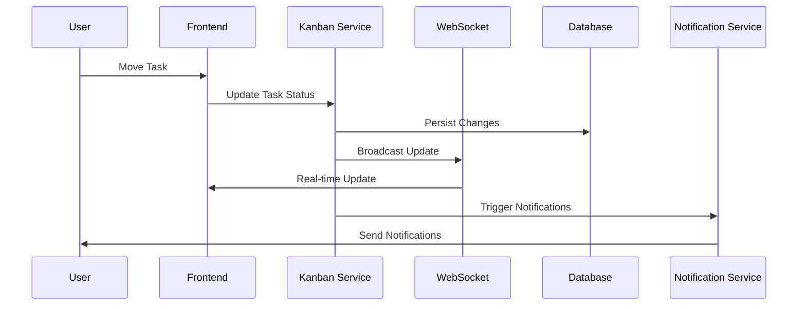

# Low-Level Design - Kanban Module

**Version**: 1.0  
**Creation Date**: [DATE]  
**Last Update Date**: [DATE]  
**Author**: [AUTHOR]  
**Approval**: [APPROVER]  

---

## 📋 Executive Summary

This document specifies the low-level design for the Kanban Module of the [PROJECT_NAME] system. It details the technical implementation of kanban board management, task tracking, workflow automation, and team collaboration features.

**Main Objectives:**
- Define kanban board structure and task management
- Specify drag-and-drop functionality and real-time updates
- Detail workflow automation and business rules
- Establish collaboration and notification mechanisms

---

## 🏗️ Module Architecture

### Kanban System Flow Diagram



---

## 🔧 Technical Components

### 1. Kanban Service

#### 1.1 Core Classes

**KanbanService**
- Board management operations
- Task CRUD operations
- Column management
- Workflow rule enforcement

**TaskManager**
- Task lifecycle management
- Status transitions
- Assignment and ownership
- Priority and deadline handling

**WorkflowEngine**
- Business rule validation
- Automated transitions
- Approval workflows
- Custom field management

#### 1.2 API Endpoints

```python
# Kanban Board endpoints
GET /api/kanban/boards
POST /api/kanban/boards
GET /api/kanban/boards/{id}
PUT /api/kanban/boards/{id}
DELETE /api/kanban/boards/{id}

# Task endpoints
GET /api/kanban/boards/{board_id}/tasks
POST /api/kanban/boards/{board_id}/tasks
GET /api/kanban/tasks/{id}
PUT /api/kanban/tasks/{id}
DELETE /api/kanban/tasks/{id}
POST /api/kanban/tasks/{id}/move

# Column endpoints
GET /api/kanban/boards/{board_id}/columns
POST /api/kanban/boards/{board_id}/columns
PUT /api/kanban/columns/{id}
DELETE /api/kanban/columns/{id}
```

### 2. Data Models

#### 2.1 Board Model

```python
class KanbanBoard:
    id: UUID
    name: str
    description: str
    project_id: UUID
    owner_id: UUID
    visibility: BoardVisibility
    settings: Dict[str, Any]
    created_at: datetime
    updated_at: datetime
```

#### 2.2 Column Model

```python
class KanbanColumn:
    id: UUID
    board_id: UUID
    name: str
    position: int
    wip_limit: Optional[int]
    column_type: ColumnType  # backlog, active, done
    color: str
    settings: Dict[str, Any]
```

#### 2.3 Task Model

```python
class KanbanTask:
    id: UUID
    board_id: UUID
    column_id: UUID
    title: str
    description: str
    assignee_id: Optional[UUID]
    reporter_id: UUID
    priority: TaskPriority
    status: TaskStatus
    tags: List[str]
    due_date: Optional[datetime]
    estimated_hours: Optional[float]
    actual_hours: Optional[float]
    position: int
    created_at: datetime
    updated_at: datetime
```

---

## 🎯 Core Features

### 1. Drag and Drop Interface

**Frontend Implementation:**
- HTML5 Drag and Drop API
- Touch support for mobile devices
- Visual feedback during drag operations
- Collision detection and snap-to-grid

**Backend Validation:**
- Position calculation and validation
- WIP limit enforcement
- Workflow rule checking
- Concurrent update handling

### 2. Real-time Collaboration

**WebSocket Integration:**
- Real-time task updates
- User presence indicators
- Collaborative editing prevention
- Conflict resolution mechanisms

**Event Broadcasting:**
```python
class KanbanEvent:
    event_type: EventType  # task_moved, task_created, etc.
    board_id: UUID
    user_id: UUID
    payload: Dict[str, Any]
    timestamp: datetime
```

### 3. Workflow Automation

**Business Rules Engine:**
- Custom workflow definitions
- Conditional task transitions
- Automated assignments
- Notification triggers

**Rule Examples:**
- Auto-assign tasks based on workload
- Move tasks to "In Review" when marked complete
- Notify stakeholders on status changes
- Block transitions without required fields

---

## 📊 Analytics and Reporting

### 1. Kanban Metrics

**Flow Metrics:**
- Lead time and cycle time
- Throughput and velocity
- Work in progress (WIP) tracking
- Bottleneck identification

**Team Metrics:**
- Individual productivity
- Workload distribution
- Collaboration patterns
- Quality indicators

### 2. Reporting Features

**Built-in Reports:**
- Burndown charts
- Cumulative flow diagrams
- Velocity tracking
- Time in status reports

**Custom Dashboards:**
- Configurable widgets
- Real-time data updates
- Export capabilities
- Scheduled reports

---

## 🔄 Integration Points

### 1. External Tool Integration

**Version Control:**
- Git branch/commit linking
- Pull request status tracking
- Code review integration

**Communication Tools:**
- Slack/Teams notifications
- Email updates
- Calendar integration

### 2. API Integration

**Webhook Support:**
- Outbound webhooks for events
- Configurable payload formats
- Retry mechanisms
- Security validation

**REST API:**
- Full CRUD operations
- Bulk operations support
- Filtering and pagination
- Rate limiting

---

## 🧪 Testing Strategy

### Unit Tests
- Task management operations
- Workflow rule validation
- Position calculation logic
- Event broadcasting mechanisms

### Integration Tests
- API endpoint testing
- Database operations
- WebSocket functionality
- External integrations

### End-to-End Tests
- Complete user workflows
- Multi-user collaboration scenarios
- Performance under load
- Mobile responsiveness

---

## 🚀 Performance Optimization

### 1. Frontend Performance

**Optimization Strategies:**
- Virtual scrolling for large boards
- Lazy loading of task details
- Optimistic UI updates
- Efficient re-rendering

### 2. Backend Performance

**Database Optimization:**
- Indexed queries for fast retrieval
- Efficient position updates
- Connection pooling
- Query optimization

**Caching Strategy:**
- Board data caching
- User permission caching
- Real-time event caching
- CDN for static assets

---

## 📱 Mobile Considerations

### Responsive Design
- Touch-friendly interface
- Swipe gestures for task actions
- Collapsible columns
- Optimized for small screens

### Offline Support
- Local data synchronization
- Conflict resolution
- Queue pending operations
- Progressive Web App features

---

## ✅ Acceptance Criteria

- [ ] Users can create and manage kanban boards
- [ ] Drag and drop functionality works smoothly
- [ ] Real-time updates are delivered to all users
- [ ] Workflow rules are properly enforced
- [ ] Performance targets are met (board load <2s)
- [ ] Mobile interface is fully functional
- [ ] Analytics and reporting features work
- [ ] Integration with external tools is operational
- [ ] All tests pass with >90% coverage

---

**Status**: 📝 Template  
**Next Review**: [DATE]  
**Responsible**: [TEAM_MEMBER]  

--- END OF DOCUMENT LLD_Kanban_Module.md (v1.0) ---