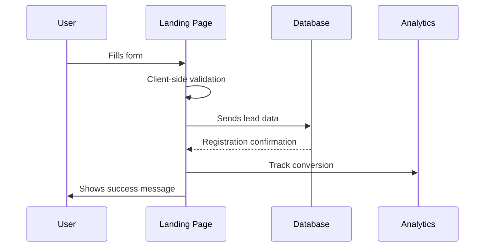
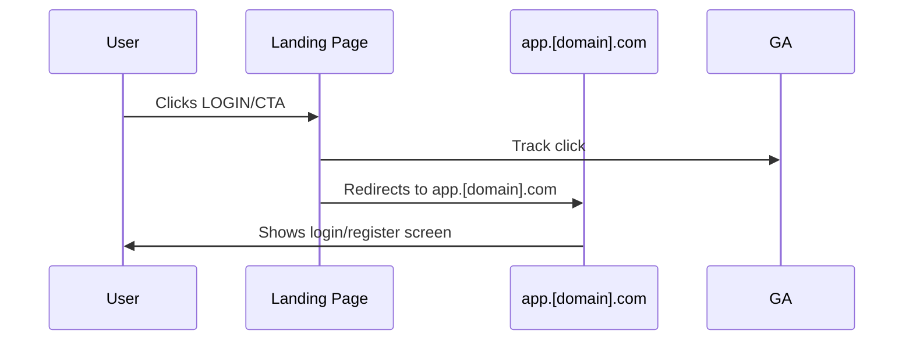

# Low-Level Design (LLD) - Landing Page Module

**Project:** [PROJECT_NAME]  
**Module:** Landing Page and Marketing  
**Version:** 1.0  
**Creation Date:** [DATE]  
**Last Update:** [DATE]  
**Author:** [AUTHOR]  
**Approval:** [APPROVER]  
**Based on:** Project Master Plan, Requirements Specification, High-Level Design  

---

## 1. Module Overview

### 1.1. Purpose
The Landing Page Module serves as the first point of contact for users with [PROJECT_NAME], focusing on user acquisition, value proposition presentation, and conversion to registration in the main application (PWA).

### 1.2. Scope
- **Included:** Responsive landing page, lead capture form, PWA integration, basic analytics
- **Excluded:** Main application functionalities, payment system, user dashboard

### 1.3. Strategic Objectives
- Implement "Build → Measure → Learn" strategy from MVP
- Capture interest before the product is fully active
- Establish professional and credible digital presence
- Facilitate smooth transition to main application

---

## 2. Technical Architecture

### 2.1. Technology Stack
- **Framework:** Next.js 14+ (App Router)
- **Language:** TypeScript
- **Styling:** Tailwind CSS
- **Hosting:** Vercel
- **Domain:** www.[project-domain].com
- **Analytics:** Google Analytics 4 + Vercel Analytics
- **Forms:** React Hook Form + Zod (validation)

### 2.2. File Structure
```
landing-page/
├── app/
│   ├── layout.tsx
│   ├── page.tsx
│   ├── globals.css
│   └── components/
│       ├── Header.tsx
│       ├── Hero.tsx
│       ├── Features.tsx
│       ├── Testimonials.tsx
│       ├── Pricing.tsx
│       ├── CTA.tsx
│       ├── Footer.tsx
│       └── LeadForm.tsx
├── lib/
│   ├── analytics.ts
│   ├── api.ts
│   └── validations.ts
├── public/
│   ├── images/
│   └── icons/
├── styles/
└── types/
```

### 2.3. Integration with Other Components
- **PWA (app.[domain].com):** Redirection via LOGIN button and CTAs
- **Database:** Storage of captured leads
- **Analytics:** Conversion and behavior tracking

---

## 3. Detailed Components

### 3.1. Header
**Responsibilities:**
- Logo and main navigation
- LOGIN button (top right) → app.[domain].com
- Responsive menu for mobile

**Props Interface:**
```typescript
interface HeaderProps {
  isScrolled?: boolean;
  showLoginButton?: boolean;
}
```

### 3.2. Hero Section
**Responsibilities:**
- Main headline with value proposition
- Explanatory subheadline
- Primary CTA for lead capture
- Demonstrative image/video

**Base Content Structure:**
- **Headline:** Clear value proposition
- **Subheadline:** Detailed explanation of benefits
- **CTA:** "Get notified of launch" or similar

### 3.3. Features Section
**Responsibilities:**
- Present main product functionalities
- Highlight competitive differentiation
- Address specific user pain points

**Main Features Template:**
1. **Core Feature 1**
   - Key benefit description
   - Technical advantage
   - User value proposition

2. **Core Feature 2**
   - Personalized experience
   - AI-powered functionality
   - Real-world application

3. **Core Feature 3**
   - Market insights
   - Data-driven decisions
   - Competitive advantage

### 3.4. Social Proof Section
**Responsibilities:**
- Build credibility and trust
- Present testimonials (when available)
- Relevant market statistics

### 3.5. Pricing Preview
**Responsibilities:**
- Present transparent business model
- Highlight delivered value
- CTA for waitlist

### 3.6. Lead Capture Form
**Responsibilities:**
- Capture email and basic information
- Client-side and server-side validation
- Database integration
- Registration confirmation

**Fields:**
```typescript
interface LeadFormData {
  email: string;
  name: string;
  currentRole?: string;
  experienceLevel?: 'junior' | 'mid' | 'senior';
  interests?: string[];
}
```

### 3.7. Footer
**Responsibilities:**
- Institutional links
- Contact and social media
- Privacy policy
- Copyright

---

## 4. Data Flows

### 4.1. Lead Capture Flow


### 4.2. PWA Redirection Flow


---

## 5. Metrics and Analytics

### 5.1. Main KPIs
- **Conversion Rate:** % of visitors who register for waitlist
- **Bounce Rate:** % of users who leave without interacting
- **Time on Page:** Average engagement
- **Traffic Source:** Most effective acquisition channels

### 5.2. Tracking Events
```typescript
interface AnalyticsEvents {
  page_view: { page: string; referrer?: string };
  lead_form_submit: { email: string; source: string };
  cta_click: { button_text: string; location: string };
  login_redirect: { source: string };
  feature_view: { feature_name: string };
}
```

### 5.3. Initial Goals (Baseline)
**Based on B2B SaaS benchmarks:**
- Conversion rate: 2-5% (initial goal: 3%)
- Bounce rate: <60%
- Average time on page: >2 minutes
- CTA click rate: >10%

---

## 6. Responsiveness and Performance

### 6.1. Breakpoints
- **Mobile:** 320px - 768px
- **Tablet:** 768px - 1024px
- **Desktop:** 1024px+

### 6.2. Performance Targets
- **Core Web Vitals:**
  - LCP (Largest Contentful Paint): <2.5s
  - FID (First Input Delay): <100ms
  - CLS (Cumulative Layout Shift): <0.1
- **Lighthouse Score:** >90 in all categories

### 6.3. Optimizations
- Lazy loading of images
- Asset compression
- CDN via hosting platform
- Critical resource preloading

---

## 7. SEO and Accessibility

### 7.1. Technical SEO
- **Meta tags:** Title, description, keywords
- **Open Graph:** For social sharing
- **Schema.org:** Structured markup
- **Sitemap.xml:** Automatic generation
- **Robots.txt:** Proper configuration

### 7.2. Target Keywords
- Industry-specific terms
- Solution-focused keywords
- Problem-solving phrases
- Competitive advantage terms

### 7.3. Accessibility (WCAG 2.1 AA)
- Adequate color contrast
- Keyboard navigation
- Alt text for images
- Form labels
- Semantic HTML structure

---

## 8. Security and Privacy

### 8.1. Data Protection
- **Privacy Compliance:** Explicit consent for data collection
- **Encryption:** Mandatory HTTPS
- **Validation:** Input sanitization
- **Rate Limiting:** Spam protection

### 8.2. Privacy Policy
- Transparency about data collection
- Purpose of data usage
- User rights
- Contact for rights exercise

---

## 9. Deployment and CI/CD

### 9.1. Deploy Pipeline
```yaml
# .github/workflows/deploy.yml
name: Deploy Landing Page
on:
  push:
    branches: [main]
    paths: ['landing-page/**']

jobs:
  deploy:
    runs-on: ubuntu-latest
    steps:
      - uses: actions/checkout@v3
      - uses: actions/setup-node@v3
      - run: npm ci
      - run: npm run build
      - run: npm run test
      - name: Deploy to production
        run: npm run deploy
```

### 9.2. Environments
- **Development:** Feature branches
- **Staging:** Develop branch
- **Production:** Main branch → www.[domain].com

---

## 10. Testing and Validation

### 10.1. Testing Strategy
- **Unit Tests:** React components (Jest + Testing Library)
- **E2E Tests:** Critical flows (Playwright)
- **Visual Tests:** Visual regression (Chromatic)
- **Performance Tests:** Lighthouse CI

### 10.2. User Validation
- **Friend Testing:** Initial UX/UI feedback
- **A/B Testing:** Headlines and CTAs (post-launch)
- **Heatmaps:** Behavior analysis tools
- **User Interviews:** Value proposition validation

---

## 11. Evolution Roadmap

### 11.1. MVP (Version 1.0)
- ✅ Basic landing page
- ✅ Lead capture
- ✅ PWA integration
- ✅ Basic analytics

### 11.2. Version 1.1
- [ ] A/B testing of headlines
- [ ] Beta user testimonials
- [ ] Integrated blog
- [ ] Chat widget

### 11.3. Version 1.2
- [ ] Interactive calculator
- [ ] Assessment quiz
- [ ] Integrated webinars
- [ ] Referral program

---

## 12. Risks and Mitigations

### 12.1. Technical Risks
| Risk | Probability | Impact | Mitigation |
|------|-------------|--------|-----------|
| Poor performance | Low | High | Continuous monitoring, optimizations |
| Form failure | Medium | High | Automated tests, fallbacks |
| Inadequate SEO | Medium | Medium | Regular SEO audits |

### 12.2. Business Risks
| Risk | Probability | Impact | Mitigation |
|------|-------------|--------|-----------|
| Low conversion | High | High | A/B testing, continuous optimization |
| Competition | Medium | Medium | Clear differentiation, unique value |
| Market change | Low | High | Trend monitoring |

---

## 13. Integration Points

### 13.1. External Services
- **Analytics Platform:** User behavior tracking
- **Email Service:** Lead nurturing campaigns
- **CRM Integration:** Lead management
- **Social Media:** Sharing and engagement

### 13.2. Internal Systems
- **Main Application:** Seamless user transition
- **Authentication:** Single sign-on experience
- **Database:** Unified user data
- **Notification System:** User communication

---

## 14. Monitoring and Maintenance

### 14.1. Performance Monitoring
- **Real User Monitoring (RUM)**
- **Synthetic monitoring**
- **Error tracking**
- **Uptime monitoring**

### 14.2. Content Management
- **Regular content updates**
- **A/B test results implementation**
- **SEO optimization**
- **User feedback incorporation**

---

## 15. Acceptance Criteria

- [ ] Responsive design works across all devices
- [ ] Lead capture form functions properly
- [ ] Performance targets are met
- [ ] SEO requirements are implemented
- [ ] Accessibility standards are met
- [ ] Analytics tracking is operational
- [ ] Integration with main app works
- [ ] Security measures are in place
- [ ] All tests pass with >90% coverage

---

## 16. Related Documents

- Project Master Plan - Overall project strategy
- Requirements Specification - Detailed requirements
- High-Level Design - System architecture
- Marketing Strategy - Go-to-market approach
- Technical Decision Records - Architecture decisions

---

**Status**: 📝 Template  
**Next Review**: [DATE]  
**Responsible**: [TEAM_MEMBER]  

--- END OF DOCUMENT LLD_Landing_Page_Module.md (v1.0) ---