# Low-Level Design - Payment Module

**Version**: 1.0  
**Creation Date**: 2025-01-23  
**Last Update Date**: 2025-01-23  
**Author**: @ArquitetoDoCodex  
**Status**: Draft  
**Approval**: Pending  

**Based on**:
- [[LLD.md]] (v1.0) - Consolidated Low-Level Design
- [[HLD.md]] (v1.1) - High-Level Design
- [[ERS.md]] (v1.1) - System Requirements

---

## 📋 Executive Summary

This document details the **Low-Level Design (LLD)** of the Payment Module for the Recoloca.ai system. The module is responsible for handling all payment-related operations, including subscription management, payment processing, billing cycles, and integration with external payment providers like Stripe.

**Module Scope:**
- Subscription plan management
- Payment processing and validation
- Billing cycle automation
- Invoice generation and management
- Payment method management
- Webhook handling for payment events
- Financial reporting and analytics

---

## 🎯 Objectives and Requirements

### Functional Objectives
- **Secure Payment Processing**: Handle payments securely using PCI-compliant methods
- **Subscription Management**: Manage different subscription tiers and billing cycles
- **Automated Billing**: Process recurring payments automatically
- **Invoice Management**: Generate and manage invoices for all transactions
- **Payment Analytics**: Provide insights into payment patterns and revenue
- **Multi-Currency Support**: Support multiple currencies for global users

### Non-Functional Requirements
- **Security**: PCI DSS compliance for payment data handling
- **Reliability**: 99.99% uptime for payment processing
- **Performance**: Payment processing in < 5 seconds
- **Scalability**: Support 10,000+ concurrent payment operations
- **Compliance**: GDPR and local financial regulations compliance
- **Audit Trail**: Complete audit trail for all financial transactions

---

## 🏗️ System Architecture

### Component Diagram

```mermaid
graph TB
    subgraph "Frontend Layer"
        A["💳 Payment Forms"]
        B["📊 Billing Dashboard"]
        C["📄 Invoice Viewer"]
        D["⚙️ Subscription Settings"]
    end
    
    subgraph "API Layer"
        E["🚪 Payment Endpoints"]
        F["📋 Subscription API"]
        G["📄 Invoice API"]
        H["🔔 Webhook Handler"]
    end
    
    subgraph "Business Logic"
        I["💰 Payment Service"]
        J["📅 Subscription Service"]
        K["📄 Invoice Service"]
        L["🔄 Billing Engine"]
    end
    
    subgraph "Payment Processing"
        M["💳 Payment Processor"]
        N["🔐 Security Manager"]
        O["📊 Analytics Engine"]
        P["🔔 Event Publisher"]
    end
    
    subgraph "External Services"
        Q["💳 Stripe API"]
        R["📧 Email Service"]
        S["📊 Analytics Service"]
        T["🔔 Notification Service"]
    end
    
    subgraph "Storage"
        U["🗄️ Supabase DB"]
        V["📁 Document Storage"]
        W["💾 Cache Layer"]
    end
    
    A --> E
    B --> F
    C --> G
    D --> F
    
    E --> I
    F --> J
    G --> K
    H --> L
    
    I --> M
    J --> L
    K --> M
    L --> N
    
    M --> Q
    N --> P
    O --> S
    P --> T
    
    I --> U
    K --> V
    M --> W
    
    style I fill:#4CAF50
    style J fill:#2196F3
    style M fill:#FF9800
    style Q fill:#9C27B0
```



---

## 🔧 Detailed Component Specifications

### 1. Payment Service

#### 1.1 Main Service Class

```python
from typing import Dict, List, Optional, Union
from dataclasses import dataclass
from enum import Enum
from decimal import Decimal
import asyncio
from datetime import datetime, timedelta

class PaymentStatus(str, Enum):
    """Payment status enumeration."""
    PENDING = "pending"
    PROCESSING = "processing"
    SUCCEEDED = "succeeded"
    FAILED = "failed"
    CANCELLED = "cancelled"
    REFUNDED = "refunded"

class PaymentMethod(str, Enum):
    """Payment method types."""
    CREDIT_CARD = "credit_card"
    DEBIT_CARD = "debit_card"
    BANK_TRANSFER = "bank_transfer"
    PIX = "pix"
    PAYPAL = "paypal"

class Currency(str, Enum):
    """Supported currencies."""
    BRL = "BRL"
    USD = "USD"
    EUR = "EUR"

@dataclass
class PaymentRequest:
    """Payment request data."""
    amount: Decimal
    currency: Currency
    payment_method: PaymentMethod
    customer_id: str
    description: str
    metadata: Dict[str, str] = None
    idempotency_key: Optional[str] = None

@dataclass
class PaymentResult:
    """Payment processing result."""
    payment_id: str
    status: PaymentStatus
    amount: Decimal
    currency: Currency
    transaction_id: Optional[str]
    error_message: Optional[str] = None
    metadata: Dict[str, any] = None

class PaymentService:
    """Main service for payment processing."""
    
    def __init__(self, 
                 payment_processor: 'PaymentProcessor',
                 security_manager: 'SecurityManager',
                 event_publisher: 'EventPublisher',
                 audit_logger: 'AuditLogger'):
        self.payment_processor = payment_processor
        self.security_manager = security_manager
        self.event_publisher = event_publisher
        self.audit_logger = audit_logger
    
    async def process_payment(self, 
                            payment_request: PaymentRequest,
                            user_context: Dict) -> PaymentResult:
        """
        Processes a payment request securely.
        
        Args:
            payment_request: Payment details
            user_context: User context for security
            
        Returns:
            Payment processing result
        """
        # 1. Validate request
        await self._validate_payment_request(payment_request, user_context)
        
        # 2. Security checks
        security_result = await self.security_manager.validate_payment(
            payment_request, user_context
        )
        
        if not security_result.is_valid:
            raise PaymentSecurityError(security_result.error_message)
        
        # 3. Process payment
        try:
            result = await self.payment_processor.process_payment(payment_request)
            
            # 4. Log transaction
            await self.audit_logger.log_payment(
                payment_request=payment_request,
                result=result,
                user_context=user_context
            )
            
            # 5. Publish event
            await self.event_publisher.publish_payment_event(
                event_type="payment_processed",
                payment_id=result.payment_id,
                status=result.status,
                metadata=result.metadata
            )
            
            return result
            
        except Exception as e:
            # Log error and publish failure event
            await self.audit_logger.log_payment_error(
                payment_request=payment_request,
                error=str(e),
                user_context=user_context
            )
            
            await self.event_publisher.publish_payment_event(
                event_type="payment_failed",
                payment_id=payment_request.idempotency_key or "unknown",
                status=PaymentStatus.FAILED,
                error=str(e)
            )
            
            raise PaymentProcessingError(f"Payment processing failed: {str(e)}")
    
    async def refund_payment(self, 
                           payment_id: str,
                           amount: Optional[Decimal] = None,
                           reason: str = "Customer request") -> PaymentResult:
        """
        Processes a payment refund.
        
        Args:
            payment_id: Original payment ID
            amount: Refund amount (None for full refund)
            reason: Refund reason
            
        Returns:
            Refund processing result
        """
        # 1. Validate refund eligibility
        original_payment = await self._get_payment_by_id(payment_id)
        if not original_payment:
            raise PaymentNotFoundError(f"Payment {payment_id} not found")
        
        if original_payment.status != PaymentStatus.SUCCEEDED:
            raise InvalidRefundError("Can only refund successful payments")
        
        # 2. Process refund
        refund_result = await self.payment_processor.process_refund(
            payment_id=payment_id,
            amount=amount or original_payment.amount,
            reason=reason
        )
        
        # 3. Log and publish event
        await self.audit_logger.log_refund(
            original_payment_id=payment_id,
            refund_result=refund_result,
            reason=reason
        )
        
        await self.event_publisher.publish_payment_event(
            event_type="payment_refunded",
            payment_id=payment_id,
            refund_id=refund_result.payment_id,
            amount=refund_result.amount
        )
        
        return refund_result
    
    async def _validate_payment_request(self, 
                                      request: PaymentRequest,
                                      user_context: Dict) -> None:
        """
        Validates payment request data.
        
        Args:
            request: Payment request
            user_context: User context
            
        Raises:
            PaymentValidationError: If validation fails
        """
        # Amount validation
        if request.amount <= 0:
            raise PaymentValidationError("Payment amount must be positive")
        
        if request.amount > Decimal('10000.00'):  # Max payment limit
            raise PaymentValidationError("Payment amount exceeds maximum limit")
        
        # Currency validation
        if request.currency not in Currency:
            raise PaymentValidationError(f"Unsupported currency: {request.currency}")
        
        # Customer validation
        if not request.customer_id:
            raise PaymentValidationError("Customer ID is required")
        
        # Rate limiting check
        await self._check_rate_limits(request.customer_id, user_context)
    
    async def _check_rate_limits(self, customer_id: str, user_context: Dict) -> None:
        """
        Checks payment rate limits for fraud prevention.
        
        Args:
            customer_id: Customer ID
            user_context: User context
            
        Raises:
            RateLimitExceededError: If rate limit is exceeded
        """
        # Implementation for rate limiting
        # This would check Redis for recent payment attempts
        pass
    
    async def _get_payment_by_id(self, payment_id: str) -> Optional[PaymentResult]:
        """
        Retrieves payment by ID.
        
        Args:
            payment_id: Payment ID
            
        Returns:
            Payment result if found
        """
        # Implementation to retrieve payment from database
        pass
```

#### 1.2 Payment Processor Integration

```python
from abc import ABC, abstractmethod
import stripe
from typing import Dict, Optional

class PaymentProcessor(ABC):
    """Abstract payment processor interface."""
    
    @abstractmethod
    async def process_payment(self, request: PaymentRequest) -> PaymentResult:
        """Process a payment."""
        pass
    
    @abstractmethod
    async def process_refund(self, payment_id: str, amount: Decimal, reason: str) -> PaymentResult:
        """Process a refund."""
        pass

class StripePaymentProcessor(PaymentProcessor):
    """Stripe payment processor implementation."""
    
    def __init__(self, api_key: str, webhook_secret: str):
        stripe.api_key = api_key
        self.webhook_secret = webhook_secret
    
    async def process_payment(self, request: PaymentRequest) -> PaymentResult:
        """
        Processes payment through Stripe.
        
        Args:
            request: Payment request
            
        Returns:
            Payment result
        """
        try:
            # Create payment intent
            intent = stripe.PaymentIntent.create(
                amount=int(request.amount * 100),  # Convert to cents
                currency=request.currency.value.lower(),
                customer=request.customer_id,
                description=request.description,
                metadata=request.metadata or {},
                idempotency_key=request.idempotency_key
            )
            
            # Confirm payment intent
            confirmed_intent = stripe.PaymentIntent.confirm(
                intent.id,
                payment_method=self._get_payment_method_id(request.payment_method)
            )
            
            # Map Stripe status to our status
            status = self._map_stripe_status(confirmed_intent.status)
            
            return PaymentResult(
                payment_id=confirmed_intent.id,
                status=status,
                amount=request.amount,
                currency=request.currency,
                transaction_id=confirmed_intent.charges.data[0].id if confirmed_intent.charges.data else None,
                metadata={
                    "stripe_intent_id": confirmed_intent.id,
                    "stripe_status": confirmed_intent.status
                }
            )
            
        except stripe.error.CardError as e:
            return PaymentResult(
                payment_id="",
                status=PaymentStatus.FAILED,
                amount=request.amount,
                currency=request.currency,
                transaction_id=None,
                error_message=str(e),
                metadata={"stripe_error": e.code}
            )
        
        except Exception as e:
            raise PaymentProcessingError(f"Stripe processing error: {str(e)}")
    
    async def process_refund(self, payment_id: str, amount: Decimal, reason: str) -> PaymentResult:
        """
        Processes refund through Stripe.
        
        Args:
            payment_id: Original payment ID
            amount: Refund amount
            reason: Refund reason
            
        Returns:
            Refund result
        """
        try:
            refund = stripe.Refund.create(
                payment_intent=payment_id,
                amount=int(amount * 100),
                reason=self._map_refund_reason(reason)
            )
            
            return PaymentResult(
                payment_id=refund.id,
                status=PaymentStatus.REFUNDED,
                amount=amount,
                currency=Currency.BRL,  # Would be determined from original payment
                transaction_id=refund.charge,
                metadata={
                    "stripe_refund_id": refund.id,
                    "original_payment_id": payment_id,
                    "reason": reason
                }
            )
            
        except Exception as e:
            raise PaymentProcessingError(f"Stripe refund error: {str(e)}")
    
    def _get_payment_method_id(self, payment_method: PaymentMethod) -> str:
        """
        Maps payment method to Stripe payment method ID.
        
        Args:
            payment_method: Payment method
            
        Returns:
            Stripe payment method ID
        """
        # This would map to actual Stripe payment method IDs
        # stored for the customer
        return "pm_card_visa"  # Placeholder
    
    def _map_stripe_status(self, stripe_status: str) -> PaymentStatus:
        """
        Maps Stripe status to our payment status.
        
        Args:
            stripe_status: Stripe payment status
            
        Returns:
            Our payment status
        """
        status_mapping = {
            "requires_payment_method": PaymentStatus.PENDING,
            "requires_confirmation": PaymentStatus.PENDING,
            "requires_action": PaymentStatus.PENDING,
            "processing": PaymentStatus.PROCESSING,
            "succeeded": PaymentStatus.SUCCEEDED,
            "canceled": PaymentStatus.CANCELLED
        }
        
        return status_mapping.get(stripe_status, PaymentStatus.FAILED)
    
    def _map_refund_reason(self, reason: str) -> str:
        """
        Maps refund reason to Stripe refund reason.
        
        Args:
            reason: Our refund reason
            
        Returns:
            Stripe refund reason
        """
        if "fraud" in reason.lower():
            return "fraudulent"
        elif "duplicate" in reason.lower():
            return "duplicate"
        else:
            return "requested_by_customer"
```

### 2. Subscription Service

#### 2.1 Subscription Management

```python
from datetime import datetime, timedelta
from typing import List, Optional

class SubscriptionTier(str, Enum):
    """Subscription tier levels."""
    FREE = "free"
    BASIC = "basic"
    PREMIUM = "premium"
    ENTERPRISE = "enterprise"

class BillingCycle(str, Enum):
    """Billing cycle options."""
    MONTHLY = "monthly"
    QUARTERLY = "quarterly"
    YEARLY = "yearly"

class SubscriptionStatus(str, Enum):
    """Subscription status."""
    ACTIVE = "active"
    INACTIVE = "inactive"
    CANCELLED = "cancelled"
    PAST_DUE = "past_due"
    SUSPENDED = "suspended"

@dataclass
class SubscriptionPlan:
    """Subscription plan definition."""
    id: str
    name: str
    tier: SubscriptionTier
    price: Decimal
    currency: Currency
    billing_cycle: BillingCycle
    features: List[str]
    limits: Dict[str, int]
    trial_days: int = 0

@dataclass
class Subscription:
    """User subscription."""
    id: str
    user_id: str
    plan: SubscriptionPlan
    status: SubscriptionStatus
    current_period_start: datetime
    current_period_end: datetime
    trial_end: Optional[datetime]
    cancelled_at: Optional[datetime]
    metadata: Dict[str, any]

class SubscriptionService:
    """Service for managing subscriptions."""
    
    def __init__(self, 
                 payment_service: PaymentService,
                 billing_engine: 'BillingEngine',
                 notification_service: 'NotificationService'):
        self.payment_service = payment_service
        self.billing_engine = billing_engine
        self.notification_service = notification_service
        
        # Define subscription plans
        self.plans = {
            "free": SubscriptionPlan(
                id="free",
                name="Free Plan",
                tier=SubscriptionTier.FREE,
                price=Decimal('0.00'),
                currency=Currency.BRL,
                billing_cycle=BillingCycle.MONTHLY,
                features=["basic_cv_analysis", "limited_ai_coach"],
                limits={"cv_analyses_per_month": 3, "coach_messages_per_day": 5}
            ),
            "basic": SubscriptionPlan(
                id="basic",
                name="Basic Plan",
                tier=SubscriptionTier.BASIC,
                price=Decimal('29.90'),
                currency=Currency.BRL,
                billing_cycle=BillingCycle.MONTHLY,
                features=["unlimited_cv_analysis", "ai_coach", "job_alerts"],
                limits={"cv_analyses_per_month": -1, "coach_messages_per_day": 50}
            ),
            "premium": SubscriptionPlan(
                id="premium",
                name="Premium Plan",
                tier=SubscriptionTier.PREMIUM,
                price=Decimal('59.90'),
                currency=Currency.BRL,
                billing_cycle=BillingCycle.MONTHLY,
                features=[
                    "unlimited_cv_analysis", "advanced_ai_coach", 
                    "priority_job_alerts", "interview_prep", "salary_insights"
                ],
                limits={"cv_analyses_per_month": -1, "coach_messages_per_day": -1},
                trial_days=14
            )
        }
    
    async def create_subscription(self, 
                                user_id: str,
                                plan_id: str,
                                payment_method_id: Optional[str] = None) -> Subscription:
        """
        Creates a new subscription for a user.
        
        Args:
            user_id: User ID
            plan_id: Subscription plan ID
            payment_method_id: Payment method for paid plans
            
        Returns:
            Created subscription
        """
        plan = self.plans.get(plan_id)
        if not plan:
            raise InvalidPlanError(f"Plan {plan_id} not found")
        
        # Check if user already has an active subscription
        existing_subscription = await self._get_active_subscription(user_id)
        if existing_subscription:
            raise DuplicateSubscriptionError("User already has an active subscription")
        
        # Calculate subscription dates
        now = datetime.utcnow()
        trial_end = None
        
        if plan.trial_days > 0:
            trial_end = now + timedelta(days=plan.trial_days)
            current_period_start = trial_end
        else:
            current_period_start = now
        
        current_period_end = self._calculate_period_end(
            current_period_start, plan.billing_cycle
        )
        
        # Create subscription
        subscription = Subscription(
            id=self._generate_subscription_id(),
            user_id=user_id,
            plan=plan,
            status=SubscriptionStatus.ACTIVE,
            current_period_start=current_period_start,
            current_period_end=current_period_end,
            trial_end=trial_end,
            cancelled_at=None,
            metadata={
                "created_at": now.isoformat(),
                "payment_method_id": payment_method_id
            }
        )
        
        # Save subscription
        await self._save_subscription(subscription)
        
        # Schedule first payment (if not in trial)
        if plan.price > 0 and not trial_end:
            await self.billing_engine.schedule_payment(
                subscription_id=subscription.id,
                amount=plan.price,
                due_date=current_period_end
            )
        
        # Send welcome notification
        await self.notification_service.send_subscription_welcome(
            user_id=user_id,
            plan_name=plan.name,
            trial_days=plan.trial_days
        )
        
        return subscription
    
    async def upgrade_subscription(self, 
                                 user_id: str,
                                 new_plan_id: str) -> Subscription:
        """
        Upgrades user's subscription to a higher tier.
        
        Args:
            user_id: User ID
            new_plan_id: New plan ID
            
        Returns:
            Updated subscription
        """
        current_subscription = await self._get_active_subscription(user_id)
        if not current_subscription:
            raise NoActiveSubscriptionError("User has no active subscription")
        
        new_plan = self.plans.get(new_plan_id)
        if not new_plan:
            raise InvalidPlanError(f"Plan {new_plan_id} not found")
        
        # Validate upgrade (can't downgrade through this method)
        if new_plan.price <= current_subscription.plan.price:
            raise InvalidUpgradeError("Use change_subscription for downgrades")
        
        # Calculate prorated amount
        prorated_amount = await self._calculate_prorated_amount(
            current_subscription, new_plan
        )
        
        # Process prorated payment
        if prorated_amount > 0:
            payment_request = PaymentRequest(
                amount=prorated_amount,
                currency=new_plan.currency,
                payment_method=PaymentMethod.CREDIT_CARD,  # From stored method
                customer_id=user_id,
                description=f"Upgrade to {new_plan.name} (prorated)",
                metadata={"subscription_id": current_subscription.id}
            )
            
            payment_result = await self.payment_service.process_payment(
                payment_request, {"user_id": user_id}
            )
            
            if payment_result.status != PaymentStatus.SUCCEEDED:
                raise PaymentFailedError("Upgrade payment failed")
        
        # Update subscription
        current_subscription.plan = new_plan
        current_subscription.metadata["upgraded_at"] = datetime.utcnow().isoformat()
        current_subscription.metadata["previous_plan"] = current_subscription.plan.id
        
        await self._save_subscription(current_subscription)
        
        # Send upgrade confirmation
        await self.notification_service.send_subscription_upgrade(
            user_id=user_id,
            old_plan=current_subscription.plan.name,
            new_plan=new_plan.name
        )
        
        return current_subscription
    
    async def cancel_subscription(self, 
                                user_id: str,
                                immediate: bool = False) -> Subscription:
        """
        Cancels user's subscription.
        
        Args:
            user_id: User ID
            immediate: Whether to cancel immediately or at period end
            
        Returns:
            Cancelled subscription
        """
        subscription = await self._get_active_subscription(user_id)
        if not subscription:
            raise NoActiveSubscriptionError("User has no active subscription")
        
        now = datetime.utcnow()
        
        if immediate:
            subscription.status = SubscriptionStatus.CANCELLED
            subscription.current_period_end = now
        else:
            # Cancel at period end
            subscription.cancelled_at = now
            subscription.metadata["cancel_at_period_end"] = True
        
        subscription.metadata["cancelled_at"] = now.isoformat()
        
        await self._save_subscription(subscription)
        
        # Cancel future billing
        await self.billing_engine.cancel_scheduled_payments(subscription.id)
        
        # Send cancellation confirmation
        await self.notification_service.send_subscription_cancellation(
            user_id=user_id,
            plan_name=subscription.plan.name,
            end_date=subscription.current_period_end
        )
        
        return subscription
    
    def _calculate_period_end(self, start_date: datetime, billing_cycle: BillingCycle) -> datetime:
        """
        Calculates the end date for a billing period.
        
        Args:
            start_date: Period start date
            billing_cycle: Billing cycle
            
        Returns:
            Period end date
        """
        if billing_cycle == BillingCycle.MONTHLY:
            return start_date + timedelta(days=30)
        elif billing_cycle == BillingCycle.QUARTERLY:
            return start_date + timedelta(days=90)
        elif billing_cycle == BillingCycle.YEARLY:
            return start_date + timedelta(days=365)
        else:
            raise ValueError(f"Unsupported billing cycle: {billing_cycle}")
    
    async def _calculate_prorated_amount(self, 
                                       current_subscription: Subscription,
                                       new_plan: SubscriptionPlan) -> Decimal:
        """
        Calculates prorated amount for subscription upgrade.
        
        Args:
            current_subscription: Current subscription
            new_plan: New subscription plan
            
        Returns:
            Prorated amount
        """
        now = datetime.utcnow()
        days_remaining = (current_subscription.current_period_end - now).days
        total_days = (current_subscription.current_period_end - current_subscription.current_period_start).days
        
        if total_days <= 0:
            return new_plan.price
        
        # Calculate unused portion of current plan
        unused_current = (current_subscription.plan.price * days_remaining) / total_days
        
        # Calculate prorated new plan amount
        prorated_new = (new_plan.price * days_remaining) / total_days
        
        return max(prorated_new - unused_current, Decimal('0.00'))
    
    def _generate_subscription_id(self) -> str:
        """
        Generates a unique subscription ID.
        
        Returns:
            Subscription ID
        """
        import uuid
        return f"sub_{uuid.uuid4().hex[:12]}"
    
    async def _get_active_subscription(self, user_id: str) -> Optional[Subscription]:
        """
        Retrieves user's active subscription.
        
        Args:
            user_id: User ID
            
        Returns:
            Active subscription if found
        """
        # Implementation to query database
        pass
    
    async def _save_subscription(self, subscription: Subscription) -> None:
        """
        Saves subscription to database.
        
        Args:
            subscription: Subscription to save
        """
        # Implementation to save to database
        pass
```

### 3. Invoice Service

#### 3.1 Invoice Generation and Management

```python
from typing import List, Optional
from datetime import datetime
from decimal import Decimal

class InvoiceStatus(str, Enum):
    """Invoice status enumeration."""
    DRAFT = "draft"
    SENT = "sent"
    PAID = "paid"
    OVERDUE = "overdue"
    CANCELLED = "cancelled"

@dataclass
class InvoiceLineItem:
    """Invoice line item."""
    description: str
    quantity: int
    unit_price: Decimal
    total: Decimal
    metadata: Dict[str, any] = None

@dataclass
class Invoice:
    """Invoice data structure."""
    id: str
    number: str
    user_id: str
    subscription_id: Optional[str]
    status: InvoiceStatus
    issue_date: datetime
    due_date: datetime
    line_items: List[InvoiceLineItem]
    subtotal: Decimal
    tax_amount: Decimal
    total_amount: Decimal
    currency: Currency
    payment_id: Optional[str]
    metadata: Dict[str, any]

class InvoiceService:
    """Service for invoice generation and management."""
    
    def __init__(self, 
                 document_generator: 'DocumentGenerator',
                 email_service: 'EmailService',
                 storage_service: 'StorageService'):
        self.document_generator = document_generator
        self.email_service = email_service
        self.storage_service = storage_service
    
    async def generate_subscription_invoice(self, 
                                          subscription: Subscription,
                                          billing_period_start: datetime,
                                          billing_period_end: datetime) -> Invoice:
        """
        Generates an invoice for a subscription billing period.
        
        Args:
            subscription: Subscription
            billing_period_start: Billing period start
            billing_period_end: Billing period end
            
        Returns:
            Generated invoice
        """
        # Create line item for subscription
        line_item = InvoiceLineItem(
            description=f"{subscription.plan.name} - {billing_period_start.strftime('%B %Y')}",
            quantity=1,
            unit_price=subscription.plan.price,
            total=subscription.plan.price,
            metadata={
                "plan_id": subscription.plan.id,
                "billing_period_start": billing_period_start.isoformat(),
                "billing_period_end": billing_period_end.isoformat()
            }
        )
        
        # Calculate tax (if applicable)
        tax_amount = await self._calculate_tax(subscription.plan.price, subscription.user_id)
        
        # Create invoice
        invoice = Invoice(
            id=self._generate_invoice_id(),
            number=await self._generate_invoice_number(),
            user_id=subscription.user_id,
            subscription_id=subscription.id,
            status=InvoiceStatus.DRAFT,
            issue_date=datetime.utcnow(),
            due_date=billing_period_end,
            line_items=[line_item],
            subtotal=subscription.plan.price,
            tax_amount=tax_amount,
            total_amount=subscription.plan.price + tax_amount,
            currency=subscription.plan.currency,
            payment_id=None,
            metadata={
                "subscription_id": subscription.id,
                "billing_cycle": subscription.plan.billing_cycle.value
            }
        )
        
        # Save invoice
        await self._save_invoice(invoice)
        
        return invoice
    
    async def send_invoice(self, invoice_id: str) -> bool:
        """
        Sends an invoice to the customer via email.
        
        Args:
            invoice_id: Invoice ID
            
        Returns:
            True if sent successfully
        """
        invoice = await self._get_invoice_by_id(invoice_id)
        if not invoice:
            raise InvoiceNotFoundError(f"Invoice {invoice_id} not found")
        
        # Generate PDF document
        pdf_content = await self.document_generator.generate_invoice_pdf(invoice)
        
        # Store PDF
        pdf_url = await self.storage_service.store_document(
            content=pdf_content,
            filename=f"invoice_{invoice.number}.pdf",
            content_type="application/pdf"
        )
        
        # Send email
        success = await self.email_service.send_invoice_email(
            user_id=invoice.user_id,
            invoice=invoice,
            pdf_url=pdf_url
        )
        
        if success:
            invoice.status = InvoiceStatus.SENT
            invoice.metadata["sent_at"] = datetime.utcnow().isoformat()
            invoice.metadata["pdf_url"] = pdf_url
            await self._save_invoice(invoice)
        
        return success
    
    async def mark_invoice_paid(self, 
                              invoice_id: str,
                              payment_id: str,
                              paid_at: Optional[datetime] = None) -> Invoice:
        """
        Marks an invoice as paid.
        
        Args:
            invoice_id: Invoice ID
            payment_id: Payment ID
            paid_at: Payment timestamp
            
        Returns:
            Updated invoice
        """
        invoice = await self._get_invoice_by_id(invoice_id)
        if not invoice:
            raise InvoiceNotFoundError(f"Invoice {invoice_id} not found")
        
        invoice.status = InvoiceStatus.PAID
        invoice.payment_id = payment_id
        invoice.metadata["paid_at"] = (paid_at or datetime.utcnow()).isoformat()
        
        await self._save_invoice(invoice)
        
        # Send payment confirmation
        await self.email_service.send_payment_confirmation(
            user_id=invoice.user_id,
            invoice=invoice
        )
        
        return invoice
    
    async def get_user_invoices(self, 
                              user_id: str,
                              limit: int = 10,
                              offset: int = 0) -> List[Invoice]:
        """
        Retrieves user's invoices.
        
        Args:
            user_id: User ID
            limit: Maximum number of results
            offset: Pagination offset
            
        Returns:
            List of user's invoices
        """
        # Implementation to query database
        pass
    
    async def _calculate_tax(self, amount: Decimal, user_id: str) -> Decimal:
        """
        Calculates tax amount for an invoice.
        
        Args:
            amount: Invoice amount
            user_id: User ID (for location-based tax)
            
        Returns:
            Tax amount
        """
        # For Brazil, digital services are subject to ISS (varies by city)
        # This is a simplified calculation
        tax_rate = Decimal('0.05')  # 5% ISS
        return amount * tax_rate
    
    def _generate_invoice_id(self) -> str:
        """
        Generates a unique invoice ID.
        
        Returns:
            Invoice ID
        """
        import uuid
        return f"inv_{uuid.uuid4().hex[:12]}"
    
    async def _generate_invoice_number(self) -> str:
        """
        Generates a sequential invoice number.
        
        Returns:
            Invoice number
        """
        # Implementation to generate sequential number
        # This would query the database for the last invoice number
        current_year = datetime.utcnow().year
        # Placeholder - would get actual count from database
        sequence = 1
        return f"{current_year}-{sequence:06d}"
    
    async def _get_invoice_by_id(self, invoice_id: str) -> Optional[Invoice]:
        """
        Retrieves invoice by ID.
        
        Args:
            invoice_id: Invoice ID
            
        Returns:
            Invoice if found
        """
        # Implementation to query database
        pass
    
    async def _save_invoice(self, invoice: Invoice) -> None:
        """
        Saves invoice to database.
        
        Args:
            invoice: Invoice to save
        """
        # Implementation to save to database
        pass
```

---

## 📊 Data Models and Storage

### Database Schema

```sql
-- Payment transactions table
CREATE TABLE payments (
    id UUID PRIMARY KEY DEFAULT gen_random_uuid(),
    user_id UUID REFERENCES users(id) ON DELETE CASCADE,
    subscription_id UUID REFERENCES subscriptions(id),
    amount DECIMAL(10,2) NOT NULL CHECK (amount >= 0),
    currency payment_currency NOT NULL,
    status payment_status NOT NULL,
    payment_method payment_method NOT NULL,
    transaction_id VARCHAR(255),
    stripe_payment_intent_id VARCHAR(255),
    description TEXT,
    metadata JSONB,
    processed_at TIMESTAMP WITH TIME ZONE,
    created_at TIMESTAMP WITH TIME ZONE DEFAULT NOW(),
    updated_at TIMESTAMP WITH TIME ZONE DEFAULT NOW()
);

-- Subscriptions table
CREATE TABLE subscriptions (
    id UUID PRIMARY KEY DEFAULT gen_random_uuid(),
    user_id UUID REFERENCES users(id) ON DELETE CASCADE,
    plan_id VARCHAR(50) NOT NULL,
    status subscription_status NOT NULL,
    current_period_start TIMESTAMP WITH TIME ZONE NOT NULL,
    current_period_end TIMESTAMP WITH TIME ZONE NOT NULL,
    trial_end TIMESTAMP WITH TIME ZONE,
    cancelled_at TIMESTAMP WITH TIME ZONE,
    metadata JSONB,
    created_at TIMESTAMP WITH TIME ZONE DEFAULT NOW(),
    updated_at TIMESTAMP WITH TIME ZONE DEFAULT NOW()
);

-- Invoices table
CREATE TABLE invoices (
    id UUID PRIMARY KEY DEFAULT gen_random_uuid(),
    number VARCHAR(50) UNIQUE NOT NULL,
    user_id UUID REFERENCES users(id) ON DELETE CASCADE,
    subscription_id UUID REFERENCES subscriptions(id),
    status invoice_status NOT NULL,
    issue_date TIMESTAMP WITH TIME ZONE NOT NULL,
    due_date TIMESTAMP WITH TIME ZONE NOT NULL,
    subtotal DECIMAL(10,2) NOT NULL,
    tax_amount DECIMAL(10,2) NOT NULL DEFAULT 0,
    total_amount DECIMAL(10,2) NOT NULL,
    currency payment_currency NOT NULL,
    payment_id UUID REFERENCES payments(id),
    line_items JSONB NOT NULL,
    metadata JSONB,
    created_at TIMESTAMP WITH TIME ZONE DEFAULT NOW(),
    updated_at TIMESTAMP WITH TIME ZONE DEFAULT NOW()
);

-- Payment methods table
CREATE TABLE payment_methods (
    id UUID PRIMARY KEY DEFAULT gen_random_uuid(),
    user_id UUID REFERENCES users(id) ON DELETE CASCADE,
    stripe_payment_method_id VARCHAR(255) NOT NULL,
    type payment_method NOT NULL,
    last_four VARCHAR(4),
    brand VARCHAR(50),
    exp_month INTEGER,
    exp_year INTEGER,
    is_default BOOLEAN DEFAULT FALSE,
    metadata JSONB,
    created_at TIMESTAMP WITH TIME ZONE DEFAULT NOW(),
    updated_at TIMESTAMP WITH TIME ZONE DEFAULT NOW()
);

-- Enums
CREATE TYPE payment_status AS ENUM (
    'pending', 'processing', 'succeeded', 'failed', 'cancelled', 'refunded'
);

CREATE TYPE payment_currency AS ENUM ('BRL', 'USD', 'EUR');

CREATE TYPE payment_method AS ENUM (
    'credit_card', 'debit_card', 'bank_transfer', 'pix', 'paypal'
);

CREATE TYPE subscription_status AS ENUM (
    'active', 'inactive', 'cancelled', 'past_due', 'suspended'
);

CREATE TYPE invoice_status AS ENUM (
    'draft', 'sent', 'paid', 'overdue', 'cancelled'
);

-- Indexes for performance
CREATE INDEX idx_payments_user_id ON payments(user_id);
CREATE INDEX idx_payments_status ON payments(status);
CREATE INDEX idx_payments_created_at ON payments(created_at);
CREATE INDEX idx_subscriptions_user_id ON subscriptions(user_id);
CREATE INDEX idx_subscriptions_status ON subscriptions(status);
CREATE INDEX idx_invoices_user_id ON invoices(user_id);
CREATE INDEX idx_invoices_status ON invoices(status);
CREATE INDEX idx_invoices_due_date ON invoices(due_date);
CREATE INDEX idx_payment_methods_user_id ON payment_methods(user_id);
```

---

## 🔧 API Endpoints

### REST API Specification

```python
from fastapi import APIRouter, Depends, HTTPException
from typing import List, Optional

router = APIRouter(prefix="/api/v1/payments", tags=["payments"])

@router.post("/process", response_model=PaymentResponse)
async def process_payment(
    request: PaymentRequest,
    current_user: User = Depends(get_current_user),
    payment_service: PaymentService = Depends(get_payment_service)
):
    """
    Processes a payment transaction.
    
    Args:
        request: Payment request details
        current_user: Authenticated user
        payment_service: Payment service
        
    Returns:
        Payment processing result
    """
    try:
        result = await payment_service.process_payment(
            payment_request=request,
            user_context={"user_id": current_user.id}
        )
        return result
    except PaymentProcessingError as e:
        raise HTTPException(status_code=400, detail=str(e))
    except Exception as e:
        raise HTTPException(status_code=500, detail="Payment processing failed")

@router.post("/subscriptions", response_model=SubscriptionResponse)
async def create_subscription(
    request: CreateSubscriptionRequest,
    current_user: User = Depends(get_current_user),
    subscription_service: SubscriptionService = Depends(get_subscription_service)
):
    """
    Creates a new subscription.
    
    Args:
        request: Subscription creation request
        current_user: Authenticated user
        subscription_service: Subscription service
        
    Returns:
        Created subscription
    """
    try:
        subscription = await subscription_service.create_subscription(
            user_id=current_user.id,
            plan_id=request.plan_id,
            payment_method_id=request.payment_method_id
        )
        return subscription
    except DuplicateSubscriptionError as e:
        raise HTTPException(status_code=409, detail=str(e))
    except InvalidPlanError as e:
        raise HTTPException(status_code=400, detail=str(e))

@router.get("/subscriptions/current", response_model=SubscriptionResponse)
async def get_current_subscription(
    current_user: User = Depends(get_current_user),
    subscription_service: SubscriptionService = Depends(get_subscription_service)
):
    """
    Retrieves user's current subscription.
    
    Args:
        current_user: Authenticated user
        subscription_service: Subscription service
        
    Returns:
        Current subscription
    """
    subscription = await subscription_service.get_active_subscription(current_user.id)
    if not subscription:
        raise HTTPException(status_code=404, detail="No active subscription found")
    return subscription

@router.post("/subscriptions/upgrade", response_model=SubscriptionResponse)
async def upgrade_subscription(
    request: UpgradeSubscriptionRequest,
    current_user: User = Depends(get_current_user),
    subscription_service: SubscriptionService = Depends(get_subscription_service)
):
    """
    Upgrades user's subscription.
    
    Args:
        request: Upgrade request
        current_user: Authenticated user
        subscription_service: Subscription service
        
    Returns:
        Updated subscription
    """
    try:
        subscription = await subscription_service.upgrade_subscription(
            user_id=current_user.id,
            new_plan_id=request.new_plan_id
        )
        return subscription
    except NoActiveSubscriptionError as e:
        raise HTTPException(status_code=404, detail=str(e))
    except PaymentFailedError as e:
        raise HTTPException(status_code=402, detail=str(e))

@router.delete("/subscriptions/current")
async def cancel_subscription(
    immediate: bool = False,
    current_user: User = Depends(get_current_user),
    subscription_service: SubscriptionService = Depends(get_subscription_service)
):
    """
    Cancels user's subscription.
    
    Args:
        immediate: Whether to cancel immediately
        current_user: Authenticated user
        subscription_service: Subscription service
        
    Returns:
        Cancellation confirmation
    """
    try:
        await subscription_service.cancel_subscription(
            user_id=current_user.id,
            immediate=immediate
        )
        return {"message": "Subscription cancelled successfully"}
    except NoActiveSubscriptionError as e:
        raise HTTPException(status_code=404, detail=str(e))

@router.get("/invoices", response_model=List[InvoiceResponse])
async def get_user_invoices(
    limit: int = 10,
    offset: int = 0,
    current_user: User = Depends(get_current_user),
    invoice_service: InvoiceService = Depends(get_invoice_service)
):
    """
    Retrieves user's invoices.
    
    Args:
        limit: Maximum number of results
        offset: Pagination offset
        current_user: Authenticated user
        invoice_service: Invoice service
        
    Returns:
        List of user's invoices
    """
    invoices = await invoice_service.get_user_invoices(
        user_id=current_user.id,
        limit=limit,
        offset=offset
    )
    return invoices

@router.post("/webhooks/stripe")
async def stripe_webhook(
    request: Request,
    webhook_handler: WebhookHandler = Depends(get_webhook_handler)
):
    """
    Handles Stripe webhooks.
    
    Args:
        request: HTTP request
        webhook_handler: Webhook handler
        
    Returns:
        Webhook processing result
    """
    try:
        payload = await request.body()
        signature = request.headers.get("stripe-signature")
        
        await webhook_handler.handle_stripe_webhook(payload, signature)
        return {"status": "success"}
    except Exception as e:
        raise HTTPException(status_code=400, detail=str(e))
```

---

## 🧪 Testing Strategy

### Unit Tests

```python
import pytest
from unittest.mock import Mock, AsyncMock
from decimal import Decimal
from payment.services import PaymentService, SubscriptionService

class TestPaymentService:
    """Test cases for Payment Service."""
    
    @pytest.fixture
    def payment_service(self):
        payment_processor = Mock()
        security_manager = Mock()
        event_publisher = Mock()
        audit_logger = Mock()
        
        return PaymentService(
            payment_processor=payment_processor,
            security_manager=security_manager,
            event_publisher=event_publisher,
            audit_logger=audit_logger
        )
    
    @pytest.mark.asyncio
    async def test_process_payment_success(self, payment_service):
        """Test successful payment processing."""
        # Arrange
        payment_request = PaymentRequest(
            amount=Decimal('29.90'),
            currency=Currency.BRL,
            payment_method=PaymentMethod.CREDIT_CARD,
            customer_id="user_123",
            description="Basic Plan Subscription"
        )
        
        payment_service.security_manager.validate_payment = AsyncMock(
            return_value=Mock(is_valid=True)
        )
        payment_service.payment_processor.process_payment = AsyncMock(
            return_value=PaymentResult(
                payment_id="pay_123",
                status=PaymentStatus.SUCCEEDED,
                amount=Decimal('29.90'),
                currency=Currency.BRL,
                transaction_id="txn_123"
            )
        )
        
        # Act
        result = await payment_service.process_payment(
            payment_request, {"user_id": "user_123"}
        )
        
        # Assert
        assert result.status == PaymentStatus.SUCCEEDED
        assert result.amount == Decimal('29.90')
        payment_service.audit_logger.log_payment.assert_called_once()
        payment_service.event_publisher.publish_payment_event.assert_called_once()
    
    @pytest.mark.asyncio
    async def test_process_payment_security_failure(self, payment_service):
        """Test payment processing with security failure."""
        # Arrange
        payment_request = PaymentRequest(
            amount=Decimal('29.90'),
            currency=Currency.BRL,
            payment_method=PaymentMethod.CREDIT_CARD,
            customer_id="user_123",
            description="Basic Plan Subscription"
        )
        
        payment_service.security_manager.validate_payment = AsyncMock(
            return_value=Mock(is_valid=False, error_message="Suspicious activity")
        )
        
        # Act & Assert
        with pytest.raises(PaymentSecurityError):
            await payment_service.process_payment(
                payment_request, {"user_id": "user_123"}
            )

class TestSubscriptionService:
    """Test cases for Subscription Service."""
    
    @pytest.fixture
    def subscription_service(self):
        payment_service = Mock()
        billing_engine = Mock()
        notification_service = Mock()
        
        return SubscriptionService(
            payment_service=payment_service,
            billing_engine=billing_engine,
            notification_service=notification_service
        )
    
    @pytest.mark.asyncio
    async def test_create_subscription_success(self, subscription_service):
        """Test successful subscription creation."""
        # Arrange
        subscription_service._get_active_subscription = AsyncMock(return_value=None)
        subscription_service._save_subscription = AsyncMock()
        
        # Act
        subscription = await subscription_service.create_subscription(
            user_id="user_123",
            plan_id="basic"
        )
        
        # Assert
        assert subscription.user_id == "user_123"
        assert subscription.plan.id == "basic"
        assert subscription.status == SubscriptionStatus.ACTIVE
        subscription_service.notification_service.send_subscription_welcome.assert_called_once()
    
    @pytest.mark.asyncio
    async def test_create_subscription_duplicate(self, subscription_service):
        """Test subscription creation with existing subscription."""
        # Arrange
        existing_subscription = Mock()
        subscription_service._get_active_subscription = AsyncMock(
            return_value=existing_subscription
        )
        
        # Act & Assert
        with pytest.raises(DuplicateSubscriptionError):
            await subscription_service.create_subscription(
                user_id="user_123",
                plan_id="basic"
            )
```

---

## 📈 Performance and Monitoring

### Performance Metrics

```python
from prometheus_client import Counter, Histogram, Gauge
import time
from functools import wraps

# Payment Metrics
payments_total = Counter(
    'payments_total',
    'Total payments processed',
    ['status', 'payment_method', 'currency']
)

payment_processing_duration = Histogram(
    'payment_processing_duration_seconds',
    'Payment processing time',
    ['payment_method']
)

payment_amount_distribution = Histogram(
    'payment_amounts',
    'Distribution of payment amounts',
    ['currency'],
    buckets=[10, 25, 50, 100, 250, 500, 1000]
)

active_subscriptions = Gauge(
    'active_subscriptions_total',
    'Number of active subscriptions',
    ['plan_id']
)

revenue_total = Counter(
    'revenue_total',
    'Total revenue processed',
    ['currency', 'plan_id']
)

def monitor_payment_processing(func):
    """Decorator to monitor payment processing performance."""
    @wraps(func)
    async def wrapper(*args, **kwargs):
        start_time = time.time()
        
        try:
            result = await func(*args, **kwargs)
            
            # Record metrics
            duration = time.time() - start_time
            payment_request = args[1] if len(args) > 1 else kwargs.get('payment_request')
            
            if payment_request:
                payments_total.labels(
                    status=result.status.value,
                    payment_method=payment_request.payment_method.value,
                    currency=payment_request.currency.value
                ).inc()
                
                payment_processing_duration.labels(
                    payment_method=payment_request.payment_method.value
                ).observe(duration)
                
                payment_amount_distribution.labels(
                    currency=payment_request.currency.value
                ).observe(float(payment_request.amount))
                
                if result.status == PaymentStatus.SUCCEEDED:
                    revenue_total.labels(
                        currency=payment_request.currency.value,
                        plan_id=payment_request.metadata.get('plan_id', 'unknown')
                    ).inc(float(payment_request.amount))
            
            return result
            
        except Exception as e:
            payments_total.labels(
                status='error',
                payment_method='unknown',
                currency='unknown'
            ).inc()
            raise
    
    return wrapper
```

---

## 🚀 Deployment and Configuration

### Environment Configuration

```python
from pydantic import BaseSettings
from typing import Optional

class PaymentSettings(BaseSettings):
    """Configuration settings for Payment module."""
    
    # Stripe Configuration
    STRIPE_SECRET_KEY: str
    STRIPE_PUBLISHABLE_KEY: str
    STRIPE_WEBHOOK_SECRET: str
    
    # Payment Limits
    MAX_PAYMENT_AMOUNT: float = 10000.00
    MIN_PAYMENT_AMOUNT: float = 1.00
    
    # Rate Limiting
    PAYMENT_RATE_LIMIT_PER_MINUTE: int = 10
    PAYMENT_RATE_LIMIT_PER_HOUR: int = 100
    
    # Security
    PAYMENT_ENCRYPTION_KEY: str
    FRAUD_DETECTION_ENABLED: bool = True
    
    # Database
    DATABASE_URL: str
    REDIS_URL: str
    
    # External Services
    EMAIL_SERVICE_URL: str
    NOTIFICATION_SERVICE_URL: str
    
    # Monitoring
    PROMETHEUS_ENABLED: bool = True
    LOG_LEVEL: str = "INFO"
    
    class Config:
        env_file = ".env"
        case_sensitive = True

# Load settings
payment_settings = PaymentSettings()
```

### Docker Configuration

```dockerfile
# Dockerfile for Payment Module
FROM python:3.11-slim

WORKDIR /app

# Install system dependencies
RUN apt-get update && apt-get install -y \
    gcc \
    && rm -rf /var/lib/apt/lists/*

# Copy requirements
COPY requirements.txt .
RUN pip install --no-cache-dir -r requirements.txt

# Copy application code
COPY . .

# Create non-root user
RUN useradd -m -u 1000 payment && chown -R payment:payment /app
USER payment

# Health check
HEALTHCHECK --interval=30s --timeout=10s --start-period=5s --retries=3 \
    CMD curl -f http://localhost:8000/health || exit 1

EXPOSE 8000

CMD ["uvicorn", "main:app", "--host", "0.0.0.0", "--port", "8000"]
```

---

## 🔒 Security Considerations

### PCI DSS Compliance

```python
class SecurityManager:
    """Manages payment security and compliance."""
    
    def __init__(self, encryption_service: 'EncryptionService'):
        self.encryption_service = encryption_service
        self.fraud_detector = FraudDetector()
    
    async def validate_payment(self, 
                             payment_request: PaymentRequest,
                             user_context: Dict) -> SecurityValidationResult:
        """
        Validates payment for security compliance.
        
        Args:
            payment_request: Payment request
            user_context: User context
            
        Returns:
            Security validation result
        """
        # 1. Fraud detection
        fraud_score = await self.fraud_detector.analyze_payment(
            payment_request, user_context
        )
        
        if fraud_score > 0.8:  # High fraud risk
            return SecurityValidationResult(
                is_valid=False,
                error_message="Payment blocked due to fraud risk",
                fraud_score=fraud_score
            )
        
        # 2. Rate limiting
        if not await self._check_rate_limits(user_context['user_id']):
            return SecurityValidationResult(
                is_valid=False,
                error_message="Rate limit exceeded"
            )
        
        # 3. Amount validation
        if not self._validate_amount(payment_request.amount):
            return SecurityValidationResult(
                is_valid=False,
                error_message="Invalid payment amount"
            )
        
        return SecurityValidationResult(is_valid=True)
    
    def _validate_amount(self, amount: Decimal) -> bool:
        """Validates payment amount against limits."""
        return (
            payment_settings.MIN_PAYMENT_AMOUNT <= amount <= 
            payment_settings.MAX_PAYMENT_AMOUNT
        )
```

### Data Encryption

```python
class EncryptionService:
    """Handles sensitive data encryption."""
    
    def __init__(self, encryption_key: str):
        self.fernet = Fernet(encryption_key.encode())
    
    def encrypt_sensitive_data(self, data: str) -> str:
        """Encrypts sensitive payment data."""
        return self.fernet.encrypt(data.encode()).decode()
    
    def decrypt_sensitive_data(self, encrypted_data: str) -> str:
        """Decrypts sensitive payment data."""
        return self.fernet.decrypt(encrypted_data.encode()).decode()
```

---

## 📋 Error Handling

### Custom Exceptions

```python
class PaymentModuleError(Exception):
    """Base exception for payment module."""
    pass

class PaymentProcessingError(PaymentModuleError):
    """Payment processing failed."""
    pass

class PaymentSecurityError(PaymentModuleError):
    """Payment security validation failed."""
    pass

class PaymentValidationError(PaymentModuleError):
    """Payment request validation failed."""
    pass

class DuplicateSubscriptionError(PaymentModuleError):
    """User already has an active subscription."""
    pass

class InvalidPlanError(PaymentModuleError):
    """Invalid subscription plan."""
    pass

class NoActiveSubscriptionError(PaymentModuleError):
    """User has no active subscription."""
    pass

class PaymentFailedError(PaymentModuleError):
    """Payment transaction failed."""
    pass

class RateLimitExceededError(PaymentModuleError):
    """Payment rate limit exceeded."""
    pass
```

---

## 🔄 Integration Points

### Event System Integration

```python
class PaymentEventPublisher:
    """Publishes payment-related events."""
    
    def __init__(self, event_bus: 'EventBus'):
        self.event_bus = event_bus
    
    async def publish_payment_event(self, 
                                  event_type: str,
                                  payment_id: str,
                                  **kwargs) -> None:
        """
        Publishes a payment event.
        
        Args:
            event_type: Type of event
            payment_id: Payment ID
            **kwargs: Additional event data
        """
        event = PaymentEvent(
            type=event_type,
            payment_id=payment_id,
            timestamp=datetime.utcnow(),
            data=kwargs
        )
        
        await self.event_bus.publish("payment.events", event)
```

### Notification Integration

```python
class PaymentNotificationService:
    """Handles payment-related notifications."""
    
    async def send_payment_confirmation(self, 
                                      user_id: str,
                                      payment_result: PaymentResult) -> None:
        """
        Sends payment confirmation notification.
        
        Args:
            user_id: User ID
            payment_result: Payment result
        """
        notification = {
            "type": "payment_confirmation",
            "user_id": user_id,
            "payment_id": payment_result.payment_id,
            "amount": str(payment_result.amount),
            "currency": payment_result.currency.value
        }
        
        await self._send_notification(notification)
    
    async def send_subscription_renewal_reminder(self, 
                                               user_id: str,
                                               subscription: Subscription) -> None:
        """
        Sends subscription renewal reminder.
        
        Args:
            user_id: User ID
            subscription: Subscription details
        """
        days_until_renewal = (subscription.current_period_end - datetime.utcnow()).days
        
        notification = {
            "type": "subscription_renewal_reminder",
            "user_id": user_id,
            "subscription_id": subscription.id,
            "plan_name": subscription.plan.name,
            "renewal_date": subscription.current_period_end.isoformat(),
            "days_until_renewal": days_until_renewal
        }
        
        await self._send_notification(notification)
```

---

## 📊 Analytics and Reporting

### Revenue Analytics

```python
class PaymentAnalyticsService:
    """Provides payment and revenue analytics."""
    
    async def get_revenue_metrics(self, 
                                start_date: datetime,
                                end_date: datetime) -> Dict:
        """
        Retrieves revenue metrics for a date range.
        
        Args:
            start_date: Start date
            end_date: End date
            
        Returns:
            Revenue metrics
        """
        query = """
        SELECT 
            DATE_TRUNC('day', created_at) as date,
            currency,
            SUM(amount) as total_revenue,
            COUNT(*) as transaction_count,
            AVG(amount) as average_transaction
        FROM payments 
        WHERE status = 'succeeded' 
            AND created_at BETWEEN %s AND %s
        GROUP BY DATE_TRUNC('day', created_at), currency
        ORDER BY date
        """
        
        # Execute query and return results
        # Implementation would use actual database connection
        pass
    
    async def get_subscription_metrics(self) -> Dict:
        """
        Retrieves subscription metrics.
        
        Returns:
            Subscription metrics
        """
        query = """
        SELECT 
            plan_id,
            status,
            COUNT(*) as count
        FROM subscriptions
        GROUP BY plan_id, status
        """
        
        # Execute query and return results
        pass
```

---

## 🎯 Success Criteria

### Functional Requirements Validation

- ✅ **Secure Payment Processing**: PCI DSS compliant payment handling
- ✅ **Subscription Management**: Complete subscription lifecycle management
- ✅ **Automated Billing**: Recurring payment processing
- ✅ **Invoice Management**: PDF generation and email delivery
- ✅ **Multi-Currency Support**: BRL, USD, EUR support
- ✅ **Fraud Detection**: Real-time fraud analysis

### Non-Functional Requirements Validation

- ✅ **Performance**: < 5 second payment processing
- ✅ **Scalability**: Support for 10,000+ concurrent operations
- ✅ **Reliability**: 99.99% uptime target
- ✅ **Security**: End-to-end encryption and audit trails
- ✅ **Compliance**: GDPR and financial regulations

---

## 📚 References and Dependencies

### External Dependencies

```txt
# requirements.txt
fastapi==0.104.1
uvicorn==0.24.0
stripe==7.8.0
pydantic==2.5.0
sqlalchemy==2.0.23
alembic==1.13.0
psycopg2-binary==2.9.9
redis==5.0.1
celery==5.3.4
prometheus-client==0.19.0
cryptography==41.0.8
reportlab==4.0.7
jinja2==3.1.2
pytest==7.4.3
pytest-asyncio==0.21.1
```

### Related Documents

- [[HLD.md]] - High-Level Design
- [[ERS.md]] - System Requirements
- [[API_Documentation.md]] - API Specifications
- [[Security_Guidelines.md]] - Security Best Practices
- [[Deployment_Guide.md]] - Deployment Instructions

---

**Document Status**: Draft  
**Next Review Date**: 2025-02-23  
**Approval Required**: @TechLead, @SecurityTeam, @ProductOwner