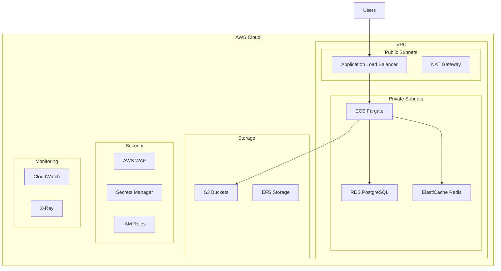

# Infrastructure as Code - Recoloca.ai

## 📋 Overview

This document defines the **Infrastructure as Code (IaC)** setup for the **Recoloca.ai** platform using **Terraform**. The infrastructure is designed to be scalable, secure, and cost-effective, following AWS best practices.

## 🎯 Objectives

- **Reproducibility**: Consistent infrastructure across environments
- **Version Control**: Infrastructure changes tracked in Git
- **Automation**: Automated provisioning and updates
- **Security**: Security best practices built-in
- **Scalability**: Auto-scaling capabilities
- **Cost Optimization**: Resource optimization and monitoring

---

## 🏗️ Architecture Overview

### Infrastructure Components



### Environment Structure

- **Development**: Single AZ, minimal resources
- **Staging**: Multi-AZ, production-like setup
- **Production**: Multi-AZ, high availability, auto-scaling

---

## 📁 Project Structure

```
terraform/
├── environments/
│   ├── dev/
│   │   ├── main.tf
│   │   ├── variables.tf
│   │   ├── terraform.tfvars
│   │   └── outputs.tf
│   ├── staging/
│   │   ├── main.tf
│   │   ├── variables.tf
│   │   ├── terraform.tfvars
│   │   └── outputs.tf
│   └── prod/
│       ├── main.tf
│       ├── variables.tf
│       ├── terraform.tfvars
│       └── outputs.tf
├── modules/
│   ├── networking/
│   ├── compute/
│   ├── database/
│   ├── storage/
│   ├── security/
│   └── monitoring/
├── scripts/
│   ├── deploy.sh
│   ├── destroy.sh
│   └── validate.sh
└── README.md
```

---

## 🌐 Networking Module

### VPC Configuration

```hcl
# modules/networking/main.tf
resource "aws_vpc" "main" {
  cidr_block           = var.vpc_cidr
  enable_dns_hostnames = true
  enable_dns_support   = true

  tags = {
    Name        = "${var.project_name}-${var.environment}-vpc"
    Environment = var.environment
    Project     = var.project_name
  }
}

# Internet Gateway
resource "aws_internet_gateway" "main" {
  vpc_id = aws_vpc.main.id

  tags = {
    Name        = "${var.project_name}-${var.environment}-igw"
    Environment = var.environment
  }
}

# Public Subnets
resource "aws_subnet" "public" {
  count = length(var.availability_zones)

  vpc_id                  = aws_vpc.main.id
  cidr_block              = var.public_subnet_cidrs[count.index]
  availability_zone       = var.availability_zones[count.index]
  map_public_ip_on_launch = true

  tags = {
    Name        = "${var.project_name}-${var.environment}-public-${count.index + 1}"
    Environment = var.environment
    Type        = "Public"
  }
}

# Private Subnets
resource "aws_subnet" "private" {
  count = length(var.availability_zones)

  vpc_id            = aws_vpc.main.id
  cidr_block        = var.private_subnet_cidrs[count.index]
  availability_zone = var.availability_zones[count.index]

  tags = {
    Name        = "${var.project_name}-${var.environment}-private-${count.index + 1}"
    Environment = var.environment
    Type        = "Private"
  }
}

# NAT Gateway
resource "aws_eip" "nat" {
  count = var.environment == "prod" ? length(var.availability_zones) : 1

  domain = "vpc"
  
  tags = {
    Name        = "${var.project_name}-${var.environment}-nat-eip-${count.index + 1}"
    Environment = var.environment
  }

  depends_on = [aws_internet_gateway.main]
}

resource "aws_nat_gateway" "main" {
  count = var.environment == "prod" ? length(var.availability_zones) : 1

  allocation_id = aws_eip.nat[count.index].id
  subnet_id     = aws_subnet.public[count.index].id

  tags = {
    Name        = "${var.project_name}-${var.environment}-nat-${count.index + 1}"
    Environment = var.environment
  }

  depends_on = [aws_internet_gateway.main]
}

# Route Tables
resource "aws_route_table" "public" {
  vpc_id = aws_vpc.main.id

  route {
    cidr_block = "0.0.0.0/0"
    gateway_id = aws_internet_gateway.main.id
  }

  tags = {
    Name        = "${var.project_name}-${var.environment}-public-rt"
    Environment = var.environment
  }
}

resource "aws_route_table" "private" {
  count = var.environment == "prod" ? length(var.availability_zones) : 1

  vpc_id = aws_vpc.main.id

  route {
    cidr_block     = "0.0.0.0/0"
    nat_gateway_id = aws_nat_gateway.main[count.index].id
  }

  tags = {
    Name        = "${var.project_name}-${var.environment}-private-rt-${count.index + 1}"
    Environment = var.environment
  }
}

# Route Table Associations
resource "aws_route_table_association" "public" {
  count = length(aws_subnet.public)

  subnet_id      = aws_subnet.public[count.index].id
  route_table_id = aws_route_table.public.id
}

resource "aws_route_table_association" "private" {
  count = length(aws_subnet.private)

  subnet_id      = aws_subnet.private[count.index].id
  route_table_id = aws_route_table.private[count.index % length(aws_route_table.private)].id
}
```

### Security Groups

```hcl
# modules/networking/security_groups.tf

# ALB Security Group
resource "aws_security_group" "alb" {
  name_prefix = "${var.project_name}-${var.environment}-alb-"
  vpc_id      = aws_vpc.main.id

  ingress {
    description = "HTTP"
    from_port   = 80
    to_port     = 80
    protocol    = "tcp"
    cidr_blocks = ["0.0.0.0/0"]
  }

  ingress {
    description = "HTTPS"
    from_port   = 443
    to_port     = 443
    protocol    = "tcp"
    cidr_blocks = ["0.0.0.0/0"]
  }

  egress {
    from_port   = 0
    to_port     = 0
    protocol    = "-1"
    cidr_blocks = ["0.0.0.0/0"]
  }

  tags = {
    Name        = "${var.project_name}-${var.environment}-alb-sg"
    Environment = var.environment
  }

  lifecycle {
    create_before_destroy = true
  }
}

# ECS Security Group
resource "aws_security_group" "ecs" {
  name_prefix = "${var.project_name}-${var.environment}-ecs-"
  vpc_id      = aws_vpc.main.id

  ingress {
    description     = "HTTP from ALB"
    from_port       = 8000
    to_port         = 8000
    protocol        = "tcp"
    security_groups = [aws_security_group.alb.id]
  }

  ingress {
    description     = "Frontend from ALB"
    from_port       = 3000
    to_port         = 3000
    protocol        = "tcp"
    security_groups = [aws_security_group.alb.id]
  }

  egress {
    from_port   = 0
    to_port     = 0
    protocol    = "-1"
    cidr_blocks = ["0.0.0.0/0"]
  }

  tags = {
    Name        = "${var.project_name}-${var.environment}-ecs-sg"
    Environment = var.environment
  }

  lifecycle {
    create_before_destroy = true
  }
}

# RDS Security Group
resource "aws_security_group" "rds" {
  name_prefix = "${var.project_name}-${var.environment}-rds-"
  vpc_id      = aws_vpc.main.id

  ingress {
    description     = "PostgreSQL from ECS"
    from_port       = 5432
    to_port         = 5432
    protocol        = "tcp"
    security_groups = [aws_security_group.ecs.id]
  }

  tags = {
    Name        = "${var.project_name}-${var.environment}-rds-sg"
    Environment = var.environment
  }

  lifecycle {
    create_before_destroy = true
  }
}

# Redis Security Group
resource "aws_security_group" "redis" {
  name_prefix = "${var.project_name}-${var.environment}-redis-"
  vpc_id      = aws_vpc.main.id

  ingress {
    description     = "Redis from ECS"
    from_port       = 6379
    to_port         = 6379
    protocol        = "tcp"
    security_groups = [aws_security_group.ecs.id]
  }

  tags = {
    Name        = "${var.project_name}-${var.environment}-redis-sg"
    Environment = var.environment
  }

  lifecycle {
    create_before_destroy = true
  }
}
```

---

## 💻 Compute Module (ECS Fargate)

### ECS Cluster

```hcl
# modules/compute/main.tf
resource "aws_ecs_cluster" "main" {
  name = "${var.project_name}-${var.environment}"

  setting {
    name  = "containerInsights"
    value = "enabled"
  }

  tags = {
    Name        = "${var.project_name}-${var.environment}-cluster"
    Environment = var.environment
  }
}

resource "aws_ecs_cluster_capacity_providers" "main" {
  cluster_name = aws_ecs_cluster.main.name

  capacity_providers = ["FARGATE", "FARGATE_SPOT"]

  default_capacity_provider_strategy {
    base              = 1
    weight            = 100
    capacity_provider = "FARGATE"
  }
}

# Application Load Balancer
resource "aws_lb" "main" {
  name               = "${var.project_name}-${var.environment}-alb"
  internal           = false
  load_balancer_type = "application"
  security_groups    = [var.alb_security_group_id]
  subnets            = var.public_subnet_ids

  enable_deletion_protection = var.environment == "prod" ? true : false

  tags = {
    Name        = "${var.project_name}-${var.environment}-alb"
    Environment = var.environment
  }
}

# Target Groups
resource "aws_lb_target_group" "backend" {
  name        = "${var.project_name}-${var.environment}-backend"
  port        = 8000
  protocol    = "HTTP"
  vpc_id      = var.vpc_id
  target_type = "ip"

  health_check {
    enabled             = true
    healthy_threshold   = 2
    interval            = 30
    matcher             = "200"
    path                = "/health"
    port                = "traffic-port"
    protocol            = "HTTP"
    timeout             = 5
    unhealthy_threshold = 2
  }

  tags = {
    Name        = "${var.project_name}-${var.environment}-backend-tg"
    Environment = var.environment
  }
}

resource "aws_lb_target_group" "frontend" {
  name        = "${var.project_name}-${var.environment}-frontend"
  port        = 3000
  protocol    = "HTTP"
  vpc_id      = var.vpc_id
  target_type = "ip"

  health_check {
    enabled             = true
    healthy_threshold   = 2
    interval            = 30
    matcher             = "200"
    path                = "/api/health"
    port                = "traffic-port"
    protocol            = "HTTP"
    timeout             = 5
    unhealthy_threshold = 2
  }

  tags = {
    Name        = "${var.project_name}-${var.environment}-frontend-tg"
    Environment = var.environment
  }
}

# ALB Listeners
resource "aws_lb_listener" "main" {
  load_balancer_arn = aws_lb.main.arn
  port              = "443"
  protocol          = "HTTPS"
  ssl_policy        = "ELBSecurityPolicy-TLS-1-2-2017-01"
  certificate_arn   = var.ssl_certificate_arn

  default_action {
    type             = "forward"
    target_group_arn = aws_lb_target_group.frontend.arn
  }
}

resource "aws_lb_listener" "redirect" {
  load_balancer_arn = aws_lb.main.arn
  port              = "80"
  protocol          = "HTTP"

  default_action {
    type = "redirect"

    redirect {
      port        = "443"
      protocol    = "HTTPS"
      status_code = "HTTP_301"
    }
  }
}

# ALB Listener Rules
resource "aws_lb_listener_rule" "api" {
  listener_arn = aws_lb_listener.main.arn
  priority     = 100

  action {
    type             = "forward"
    target_group_arn = aws_lb_target_group.backend.arn
  }

  condition {
    path_pattern {
      values = ["/api/*"]
    }
  }
}
```

### ECS Task Definitions

```hcl
# modules/compute/task_definitions.tf

# Backend Task Definition
resource "aws_ecs_task_definition" "backend" {
  family                   = "${var.project_name}-${var.environment}-backend"
  network_mode             = "awsvpc"
  requires_compatibilities = ["FARGATE"]
  cpu                      = var.backend_cpu
  memory                   = var.backend_memory
  execution_role_arn       = aws_iam_role.ecs_execution_role.arn
  task_role_arn           = aws_iam_role.ecs_task_role.arn

  container_definitions = jsonencode([
    {
      name  = "backend"
      image = "${var.backend_image}:${var.image_tag}"
      
      portMappings = [
        {
          containerPort = 8000
          protocol      = "tcp"
        }
      ]
      
      environment = [
        {
          name  = "ENVIRONMENT"
          value = var.environment
        },
        {
          name  = "DATABASE_URL"
          value = var.database_url
        },
        {
          name  = "REDIS_URL"
          value = var.redis_url
        }
      ]
      
      secrets = [
        {
          name      = "SECRET_KEY"
          valueFrom = var.secret_key_arn
        },
        {
          name      = "GEMINI_API_KEY"
          valueFrom = var.gemini_api_key_arn
        },
        {
          name      = "STRIPE_SECRET_KEY"
          valueFrom = var.stripe_secret_key_arn
        }
      ]
      
      logConfiguration = {
        logDriver = "awslogs"
        options = {
          "awslogs-group"         = aws_cloudwatch_log_group.backend.name
          "awslogs-region"        = var.aws_region
          "awslogs-stream-prefix" = "ecs"
        }
      }
      
      healthCheck = {
        command     = ["CMD-SHELL", "curl -f http://localhost:8000/health || exit 1"]
        interval    = 30
        timeout     = 5
        retries     = 3
        startPeriod = 60
      }
      
      essential = true
    }
  ])

  tags = {
    Name        = "${var.project_name}-${var.environment}-backend-task"
    Environment = var.environment
  }
}

# Frontend Task Definition
resource "aws_ecs_task_definition" "frontend" {
  family                   = "${var.project_name}-${var.environment}-frontend"
  network_mode             = "awsvpc"
  requires_compatibilities = ["FARGATE"]
  cpu                      = var.frontend_cpu
  memory                   = var.frontend_memory
  execution_role_arn       = aws_iam_role.ecs_execution_role.arn
  task_role_arn           = aws_iam_role.ecs_task_role.arn

  container_definitions = jsonencode([
    {
      name  = "frontend"
      image = "${var.frontend_image}:${var.image_tag}"
      
      portMappings = [
        {
          containerPort = 3000
          protocol      = "tcp"
        }
      ]
      
      environment = [
        {
          name  = "NODE_ENV"
          value = var.environment == "prod" ? "production" : "development"
        },
        {
          name  = "NEXT_PUBLIC_API_URL"
          value = var.api_url
        }
      ]
      
      secrets = [
        {
          name      = "NEXT_PUBLIC_STRIPE_PUBLISHABLE_KEY"
          valueFrom = var.stripe_publishable_key_arn
        }
      ]
      
      logConfiguration = {
        logDriver = "awslogs"
        options = {
          "awslogs-group"         = aws_cloudwatch_log_group.frontend.name
          "awslogs-region"        = var.aws_region
          "awslogs-stream-prefix" = "ecs"
        }
      }
      
      healthCheck = {
        command     = ["CMD-SHELL", "curl -f http://localhost:3000/api/health || exit 1"]
        interval    = 30
        timeout     = 5
        retries     = 3
        startPeriod = 60
      }
      
      essential = true
    }
  ])

  tags = {
    Name        = "${var.project_name}-${var.environment}-frontend-task"
    Environment = var.environment
  }
}
```

### ECS Services

```hcl
# modules/compute/services.tf

# Backend Service
resource "aws_ecs_service" "backend" {
  name            = "${var.project_name}-${var.environment}-backend"
  cluster         = aws_ecs_cluster.main.id
  task_definition = aws_ecs_task_definition.backend.arn
  desired_count   = var.backend_desired_count
  launch_type     = "FARGATE"

  network_configuration {
    security_groups  = [var.ecs_security_group_id]
    subnets          = var.private_subnet_ids
    assign_public_ip = false
  }

  load_balancer {
    target_group_arn = aws_lb_target_group.backend.arn
    container_name   = "backend"
    container_port   = 8000
  }

  deployment_configuration {
    maximum_percent         = 200
    minimum_healthy_percent = 100
  }

  # Auto Scaling
  lifecycle {
    ignore_changes = [desired_count]
  }

  depends_on = [aws_lb_listener.main]

  tags = {
    Name        = "${var.project_name}-${var.environment}-backend-service"
    Environment = var.environment
  }
}

# Frontend Service
resource "aws_ecs_service" "frontend" {
  name            = "${var.project_name}-${var.environment}-frontend"
  cluster         = aws_ecs_cluster.main.id
  task_definition = aws_ecs_task_definition.frontend.arn
  desired_count   = var.frontend_desired_count
  launch_type     = "FARGATE"

  network_configuration {
    security_groups  = [var.ecs_security_group_id]
    subnets          = var.private_subnet_ids
    assign_public_ip = false
  }

  load_balancer {
    target_group_arn = aws_lb_target_group.frontend.arn
    container_name   = "frontend"
    container_port   = 3000
  }

  deployment_configuration {
    maximum_percent         = 200
    minimum_healthy_percent = 100
  }

  # Auto Scaling
  lifecycle {
    ignore_changes = [desired_count]
  }

  depends_on = [aws_lb_listener.main]

  tags = {
    Name        = "${var.project_name}-${var.environment}-frontend-service"
    Environment = var.environment
  }
}

# Auto Scaling
resource "aws_appautoscaling_target" "backend" {
  max_capacity       = var.backend_max_capacity
  min_capacity       = var.backend_min_capacity
  resource_id        = "service/${aws_ecs_cluster.main.name}/${aws_ecs_service.backend.name}"
  scalable_dimension = "ecs:service:DesiredCount"
  service_namespace  = "ecs"
}

resource "aws_appautoscaling_policy" "backend_cpu" {
  name               = "${var.project_name}-${var.environment}-backend-cpu-scaling"
  policy_type        = "TargetTrackingScaling"
  resource_id        = aws_appautoscaling_target.backend.resource_id
  scalable_dimension = aws_appautoscaling_target.backend.scalable_dimension
  service_namespace  = aws_appautoscaling_target.backend.service_namespace

  target_tracking_scaling_policy_configuration {
    predefined_metric_specification {
      predefined_metric_type = "ECSServiceAverageCPUUtilization"
    }
    target_value = 70.0
  }
}

resource "aws_appautoscaling_policy" "backend_memory" {
  name               = "${var.project_name}-${var.environment}-backend-memory-scaling"
  policy_type        = "TargetTrackingScaling"
  resource_id        = aws_appautoscaling_target.backend.resource_id
  scalable_dimension = aws_appautoscaling_target.backend.scalable_dimension
  service_namespace  = aws_appautoscaling_target.backend.service_namespace

  target_tracking_scaling_policy_configuration {
    predefined_metric_specification {
      predefined_metric_type = "ECSServiceAverageMemoryUtilization"
    }
    target_value = 80.0
  }
}
```

---

## 🗄️ Database Module

### RDS PostgreSQL

```hcl
# modules/database/main.tf

# DB Subnet Group
resource "aws_db_subnet_group" "main" {
  name       = "${var.project_name}-${var.environment}-db-subnet-group"
  subnet_ids = var.private_subnet_ids

  tags = {
    Name        = "${var.project_name}-${var.environment}-db-subnet-group"
    Environment = var.environment
  }
}

# DB Parameter Group
resource "aws_db_parameter_group" "main" {
  family = "postgres15"
  name   = "${var.project_name}-${var.environment}-db-params"

  parameter {
    name  = "shared_preload_libraries"
    value = "pg_stat_statements"
  }

  parameter {
    name  = "log_statement"
    value = "all"
  }

  parameter {
    name  = "log_min_duration_statement"
    value = "1000"
  }

  tags = {
    Name        = "${var.project_name}-${var.environment}-db-params"
    Environment = var.environment
  }
}

# RDS Instance
resource "aws_db_instance" "main" {
  identifier = "${var.project_name}-${var.environment}-db"

  # Engine
  engine         = "postgres"
  engine_version = "15.4"
  instance_class = var.db_instance_class

  # Storage
  allocated_storage     = var.db_allocated_storage
  max_allocated_storage = var.db_max_allocated_storage
  storage_type          = "gp3"
  storage_encrypted     = true
  kms_key_id           = var.kms_key_id

  # Database
  db_name  = var.db_name
  username = var.db_username
  password = var.db_password

  # Network
  db_subnet_group_name   = aws_db_subnet_group.main.name
  vpc_security_group_ids = [var.rds_security_group_id]
  publicly_accessible    = false
  port                   = 5432

  # Backup
  backup_retention_period = var.environment == "prod" ? 30 : 7
  backup_window          = "03:00-04:00"
  maintenance_window     = "sun:04:00-sun:05:00"
  delete_automated_backups = false

  # Monitoring
  monitoring_interval = var.environment == "prod" ? 60 : 0
  monitoring_role_arn = var.environment == "prod" ? aws_iam_role.rds_enhanced_monitoring[0].arn : null
  enabled_cloudwatch_logs_exports = ["postgresql"]

  # Performance Insights
  performance_insights_enabled = var.environment == "prod" ? true : false
  performance_insights_retention_period = var.environment == "prod" ? 7 : null

  # Multi-AZ
  multi_az = var.environment == "prod" ? true : false

  # Parameter Group
  parameter_group_name = aws_db_parameter_group.main.name

  # Snapshot
  final_snapshot_identifier = "${var.project_name}-${var.environment}-final-snapshot-${formatdate("YYYY-MM-DD-hhmm", timestamp())}"
  skip_final_snapshot       = var.environment != "prod"

  # Deletion Protection
  deletion_protection = var.environment == "prod" ? true : false

  tags = {
    Name        = "${var.project_name}-${var.environment}-db"
    Environment = var.environment
  }

  lifecycle {
    prevent_destroy = true
  }
}

# Read Replica (Production only)
resource "aws_db_instance" "read_replica" {
  count = var.environment == "prod" ? 1 : 0

  identifier = "${var.project_name}-${var.environment}-db-read-replica"

  replicate_source_db = aws_db_instance.main.identifier
  instance_class      = var.db_replica_instance_class

  publicly_accessible = false
  multi_az           = false

  monitoring_interval = 60
  monitoring_role_arn = aws_iam_role.rds_enhanced_monitoring[0].arn

  performance_insights_enabled = true
  performance_insights_retention_period = 7

  tags = {
    Name        = "${var.project_name}-${var.environment}-db-read-replica"
    Environment = var.environment
  }
}
```

### ElastiCache Redis

```hcl
# modules/database/redis.tf

# Redis Subnet Group
resource "aws_elasticache_subnet_group" "main" {
  name       = "${var.project_name}-${var.environment}-redis-subnet-group"
  subnet_ids = var.private_subnet_ids

  tags = {
    Name        = "${var.project_name}-${var.environment}-redis-subnet-group"
    Environment = var.environment
  }
}

# Redis Parameter Group
resource "aws_elasticache_parameter_group" "main" {
  family = "redis7.x"
  name   = "${var.project_name}-${var.environment}-redis-params"

  parameter {
    name  = "maxmemory-policy"
    value = "allkeys-lru"
  }

  tags = {
    Name        = "${var.project_name}-${var.environment}-redis-params"
    Environment = var.environment
  }
}

# Redis Replication Group
resource "aws_elasticache_replication_group" "main" {
  replication_group_id       = "${var.project_name}-${var.environment}-redis"
  description                = "Redis cluster for ${var.project_name} ${var.environment}"

  # Engine
  engine               = "redis"
  engine_version       = "7.0"
  node_type           = var.redis_node_type
  port                = 6379
  parameter_group_name = aws_elasticache_parameter_group.main.name

  # Cluster Configuration
  num_cache_clusters = var.environment == "prod" ? 2 : 1
  
  # Network
  subnet_group_name  = aws_elasticache_subnet_group.main.name
  security_group_ids = [var.redis_security_group_id]

  # Security
  at_rest_encryption_enabled = true
  transit_encryption_enabled = true
  auth_token                = var.redis_auth_token

  # Backup
  snapshot_retention_limit = var.environment == "prod" ? 7 : 1
  snapshot_window         = "03:00-05:00"
  maintenance_window      = "sun:05:00-sun:07:00"

  # Logging
  log_delivery_configuration {
    destination      = aws_cloudwatch_log_group.redis_slow.name
    destination_type = "cloudwatch-logs"
    log_format       = "text"
    log_type         = "slow-log"
  }

  tags = {
    Name        = "${var.project_name}-${var.environment}-redis"
    Environment = var.environment
  }
}
```

---

## 📦 Storage Module

### S3 Buckets

```hcl
# modules/storage/main.tf

# Application Assets Bucket
resource "aws_s3_bucket" "assets" {
  bucket = "${var.project_name}-${var.environment}-assets-${random_id.bucket_suffix.hex}"

  tags = {
    Name        = "${var.project_name}-${var.environment}-assets"
    Environment = var.environment
    Purpose     = "Application Assets"
  }
}

resource "aws_s3_bucket_versioning" "assets" {
  bucket = aws_s3_bucket.assets.id
  versioning_configuration {
    status = "Enabled"
  }
}

resource "aws_s3_bucket_encryption" "assets" {
  bucket = aws_s3_bucket.assets.id

  server_side_encryption_configuration {
    rule {
      apply_server_side_encryption_by_default {
        sse_algorithm = "AES256"
      }
    }
  }
}

resource "aws_s3_bucket_public_access_block" "assets" {
  bucket = aws_s3_bucket.assets.id

  block_public_acls       = true
  block_public_policy     = true
  ignore_public_acls      = true
  restrict_public_buckets = true
}

# User Uploads Bucket
resource "aws_s3_bucket" "uploads" {
  bucket = "${var.project_name}-${var.environment}-uploads-${random_id.bucket_suffix.hex}"

  tags = {
    Name        = "${var.project_name}-${var.environment}-uploads"
    Environment = var.environment
    Purpose     = "User Uploads"
  }
}

resource "aws_s3_bucket_versioning" "uploads" {
  bucket = aws_s3_bucket.uploads.id
  versioning_configuration {
    status = "Enabled"
  }
}

resource "aws_s3_bucket_encryption" "uploads" {
  bucket = aws_s3_bucket.uploads.id

  server_side_encryption_configuration {
    rule {
      apply_server_side_encryption_by_default {
        kms_master_key_id = var.kms_key_id
        sse_algorithm     = "aws:kms"
      }
    }
  }
}

resource "aws_s3_bucket_public_access_block" "uploads" {
  bucket = aws_s3_bucket.uploads.id

  block_public_acls       = true
  block_public_policy     = true
  ignore_public_acls      = true
  restrict_public_buckets = true
}

# Lifecycle Configuration
resource "aws_s3_bucket_lifecycle_configuration" "uploads" {
  bucket = aws_s3_bucket.uploads.id

  rule {
    id     = "cleanup_incomplete_uploads"
    status = "Enabled"

    abort_incomplete_multipart_upload {
      days_after_initiation = 1
    }
  }

  rule {
    id     = "transition_to_ia"
    status = "Enabled"

    transition {
      days          = 30
      storage_class = "STANDARD_IA"
    }

    transition {
      days          = 90
      storage_class = "GLACIER"
    }

    transition {
      days          = 365
      storage_class = "DEEP_ARCHIVE"
    }
  }
}

# Backup Bucket
resource "aws_s3_bucket" "backups" {
  bucket = "${var.project_name}-${var.environment}-backups-${random_id.bucket_suffix.hex}"

  tags = {
    Name        = "${var.project_name}-${var.environment}-backups"
    Environment = var.environment
    Purpose     = "Database Backups"
  }
}

resource "aws_s3_bucket_versioning" "backups" {
  bucket = aws_s3_bucket.backups.id
  versioning_configuration {
    status = "Enabled"
  }
}

resource "aws_s3_bucket_encryption" "backups" {
  bucket = aws_s3_bucket.backups.id

  server_side_encryption_configuration {
    rule {
      apply_server_side_encryption_by_default {
        kms_master_key_id = var.kms_key_id
        sse_algorithm     = "aws:kms"
      }
    }
  }
}

resource "aws_s3_bucket_lifecycle_configuration" "backups" {
  bucket = aws_s3_bucket.backups.id

  rule {
    id     = "backup_retention"
    status = "Enabled"

    expiration {
      days = var.environment == "prod" ? 2555 : 30  # 7 years for prod, 30 days for others
    }

    noncurrent_version_expiration {
      noncurrent_days = 30
    }
  }
}

resource "random_id" "bucket_suffix" {
  byte_length = 4
}
```

---

## 🔐 Security Module

### IAM Roles and Policies

```hcl
# modules/security/iam.tf

# ECS Execution Role
resource "aws_iam_role" "ecs_execution_role" {
  name = "${var.project_name}-${var.environment}-ecs-execution-role"

  assume_role_policy = jsonencode({
    Version = "2012-10-17"
    Statement = [
      {
        Action = "sts:AssumeRole"
        Effect = "Allow"
        Principal = {
          Service = "ecs-tasks.amazonaws.com"
        }
      }
    ]
  })

  tags = {
    Name        = "${var.project_name}-${var.environment}-ecs-execution-role"
    Environment = var.environment
  }
}

resource "aws_iam_role_policy_attachment" "ecs_execution_role_policy" {
  role       = aws_iam_role.ecs_execution_role.name
  policy_arn = "arn:aws:iam::aws:policy/service-role/AmazonECSTaskExecutionRolePolicy"
}

# ECS Task Role
resource "aws_iam_role" "ecs_task_role" {
  name = "${var.project_name}-${var.environment}-ecs-task-role"

  assume_role_policy = jsonencode({
    Version = "2012-10-17"
    Statement = [
      {
        Action = "sts:AssumeRole"
        Effect = "Allow"
        Principal = {
          Service = "ecs-tasks.amazonaws.com"
        }
      }
    ]
  })

  tags = {
    Name        = "${var.project_name}-${var.environment}-ecs-task-role"
    Environment = var.environment
  }
}

# S3 Access Policy for ECS Tasks
resource "aws_iam_policy" "s3_access" {
  name        = "${var.project_name}-${var.environment}-s3-access"
  description = "S3 access policy for ECS tasks"

  policy = jsonencode({
    Version = "2012-10-17"
    Statement = [
      {
        Effect = "Allow"
        Action = [
          "s3:GetObject",
          "s3:PutObject",
          "s3:DeleteObject"
        ]
        Resource = [
          "${var.assets_bucket_arn}/*",
          "${var.uploads_bucket_arn}/*"
        ]
      },
      {
        Effect = "Allow"
        Action = [
          "s3:ListBucket"
        ]
        Resource = [
          var.assets_bucket_arn,
          var.uploads_bucket_arn
        ]
      }
    ]
  })
}

resource "aws_iam_role_policy_attachment" "ecs_task_s3_access" {
  role       = aws_iam_role.ecs_task_role.name
  policy_arn = aws_iam_policy.s3_access.arn
}

# Secrets Manager Access Policy
resource "aws_iam_policy" "secrets_access" {
  name        = "${var.project_name}-${var.environment}-secrets-access"
  description = "Secrets Manager access policy for ECS tasks"

  policy = jsonencode({
    Version = "2012-10-17"
    Statement = [
      {
        Effect = "Allow"
        Action = [
          "secretsmanager:GetSecretValue"
        ]
        Resource = [
          "arn:aws:secretsmanager:${var.aws_region}:${var.aws_account_id}:secret:${var.project_name}/${var.environment}/*"
        ]
      }
    ]
  })
}

resource "aws_iam_role_policy_attachment" "ecs_execution_secrets_access" {
  role       = aws_iam_role.ecs_execution_role.name
  policy_arn = aws_iam_policy.secrets_access.arn
}
```

### AWS Secrets Manager

```hcl
# modules/security/secrets.tf

# Application Secret Key
resource "aws_secretsmanager_secret" "secret_key" {
  name        = "${var.project_name}/${var.environment}/secret-key"
  description = "Application secret key for ${var.project_name} ${var.environment}"

  tags = {
    Name        = "${var.project_name}-${var.environment}-secret-key"
    Environment = var.environment
  }
}

resource "aws_secretsmanager_secret_version" "secret_key" {
  secret_id     = aws_secretsmanager_secret.secret_key.id
  secret_string = var.secret_key
}

# Gemini API Key
resource "aws_secretsmanager_secret" "gemini_api_key" {
  name        = "${var.project_name}/${var.environment}/gemini-api-key"
  description = "Google Gemini API key for ${var.project_name} ${var.environment}"

  tags = {
    Name        = "${var.project_name}-${var.environment}-gemini-api-key"
    Environment = var.environment
  }
}

resource "aws_secretsmanager_secret_version" "gemini_api_key" {
  secret_id     = aws_secretsmanager_secret.gemini_api_key.id
  secret_string = var.gemini_api_key
}

# Stripe Secret Key
resource "aws_secretsmanager_secret" "stripe_secret_key" {
  name        = "${var.project_name}/${var.environment}/stripe-secret-key"
  description = "Stripe secret key for ${var.project_name} ${var.environment}"

  tags = {
    Name        = "${var.project_name}-${var.environment}-stripe-secret-key"
    Environment = var.environment
  }
}

resource "aws_secretsmanager_secret_version" "stripe_secret_key" {
  secret_id     = aws_secretsmanager_secret.stripe_secret_key.id
  secret_string = var.stripe_secret_key
}

# Database Password
resource "aws_secretsmanager_secret" "db_password" {
  name        = "${var.project_name}/${var.environment}/db-password"
  description = "Database password for ${var.project_name} ${var.environment}"

  tags = {
    Name        = "${var.project_name}-${var.environment}-db-password"
    Environment = var.environment
  }
}

resource "aws_secretsmanager_secret_version" "db_password" {
  secret_id     = aws_secretsmanager_secret.db_password.id
  secret_string = var.db_password
}
```

### KMS Key

```hcl
# modules/security/kms.tf

resource "aws_kms_key" "main" {
  description             = "KMS key for ${var.project_name} ${var.environment}"
  deletion_window_in_days = var.environment == "prod" ? 30 : 7
  enable_key_rotation     = true

  policy = jsonencode({
    Version = "2012-10-17"
    Statement = [
      {
        Sid    = "Enable IAM User Permissions"
        Effect = "Allow"
        Principal = {
          AWS = "arn:aws:iam::${var.aws_account_id}:root"
        }
        Action   = "kms:*"
        Resource = "*"
      },
      {
        Sid    = "Allow ECS Tasks"
        Effect = "Allow"
        Principal = {
          AWS = [
            aws_iam_role.ecs_execution_role.arn,
            aws_iam_role.ecs_task_role.arn
          ]
        }
        Action = [
          "kms:Decrypt",
          "kms:GenerateDataKey"
        ]
        Resource = "*"
      }
    ]
  })

  tags = {
    Name        = "${var.project_name}-${var.environment}-kms-key"
    Environment = var.environment
  }
}

resource "aws_kms_alias" "main" {
  name          = "alias/${var.project_name}-${var.environment}"
  target_key_id = aws_kms_key.main.key_id
}
```

---

## 📊 Monitoring Module

### CloudWatch

```hcl
# modules/monitoring/cloudwatch.tf

# Log Groups
resource "aws_cloudwatch_log_group" "backend" {
  name              = "/ecs/${var.project_name}-${var.environment}-backend"
  retention_in_days = var.environment == "prod" ? 30 : 7

  tags = {
    Name        = "${var.project_name}-${var.environment}-backend-logs"
    Environment = var.environment
  }
}

resource "aws_cloudwatch_log_group" "frontend" {
  name              = "/ecs/${var.project_name}-${var.environment}-frontend"
  retention_in_days = var.environment == "prod" ? 30 : 7

  tags = {
    Name        = "${var.project_name}-${var.environment}-frontend-logs"
    Environment = var.environment
  }
}

resource "aws_cloudwatch_log_group" "redis_slow" {
  name              = "/aws/elasticache/${var.project_name}-${var.environment}-redis/slow-log"
  retention_in_days = var.environment == "prod" ? 14 : 3

  tags = {
    Name        = "${var.project_name}-${var.environment}-redis-slow-logs"
    Environment = var.environment
  }
}

# Custom Metrics
resource "aws_cloudwatch_dashboard" "main" {
  dashboard_name = "${var.project_name}-${var.environment}-dashboard"

  dashboard_body = jsonencode({
    widgets = [
      {
        type   = "metric"
        x      = 0
        y      = 0
        width  = 12
        height = 6

        properties = {
          metrics = [
            ["AWS/ECS", "CPUUtilization", "ServiceName", "${var.project_name}-${var.environment}-backend", "ClusterName", "${var.project_name}-${var.environment}"],
            [".", "MemoryUtilization", ".", ".", ".", "."]
          ]
          view    = "timeSeries"
          stacked = false
          region  = var.aws_region
          title   = "ECS Service Metrics"
          period  = 300
        }
      },
      {
        type   = "metric"
        x      = 0
        y      = 6
        width  = 12
        height = 6

        properties = {
          metrics = [
            ["AWS/ApplicationELB", "RequestCount", "LoadBalancer", aws_lb.main.arn_suffix],
            [".", "TargetResponseTime", ".", "."],
            [".", "HTTPCode_Target_2XX_Count", ".", "."],
            [".", "HTTPCode_Target_4XX_Count", ".", "."],
            [".", "HTTPCode_Target_5XX_Count", ".", "."]
          ]
          view    = "timeSeries"
          stacked = false
          region  = var.aws_region
          title   = "ALB Metrics"
          period  = 300
        }
      },
      {
        type   = "metric"
        x      = 0
        y      = 12
        width  = 12
        height = 6

        properties = {
          metrics = [
            ["AWS/RDS", "CPUUtilization", "DBInstanceIdentifier", aws_db_instance.main.id],
            [".", "DatabaseConnections", ".", "."],
            [".", "FreeableMemory", ".", "."],
            [".", "ReadLatency", ".", "."],
            [".", "WriteLatency", ".", "."]
          ]
          view    = "timeSeries"
          stacked = false
          region  = var.aws_region
          title   = "RDS Metrics"
          period  = 300
        }
      }
    ]
  })
}

# Alarms
resource "aws_cloudwatch_metric_alarm" "high_cpu" {
  alarm_name          = "${var.project_name}-${var.environment}-high-cpu"
  comparison_operator = "GreaterThanThreshold"
  evaluation_periods  = "2"
  metric_name         = "CPUUtilization"
  namespace           = "AWS/ECS"
  period              = "300"
  statistic           = "Average"
  threshold           = "80"
  alarm_description   = "This metric monitors ECS CPU utilization"
  alarm_actions       = [aws_sns_topic.alerts.arn]

  dimensions = {
    ServiceName = "${var.project_name}-${var.environment}-backend"
    ClusterName = "${var.project_name}-${var.environment}"
  }

  tags = {
    Name        = "${var.project_name}-${var.environment}-high-cpu-alarm"
    Environment = var.environment
  }
}

resource "aws_cloudwatch_metric_alarm" "high_memory" {
  alarm_name          = "${var.project_name}-${var.environment}-high-memory"
  comparison_operator = "GreaterThanThreshold"
  evaluation_periods  = "2"
  metric_name         = "MemoryUtilization"
  namespace           = "AWS/ECS"
  period              = "300"
  statistic           = "Average"
  threshold           = "85"
  alarm_description   = "This metric monitors ECS memory utilization"
  alarm_actions       = [aws_sns_topic.alerts.arn]

  dimensions = {
    ServiceName = "${var.project_name}-${var.environment}-backend"
    ClusterName = "${var.project_name}-${var.environment}"
  }

  tags = {
    Name        = "${var.project_name}-${var.environment}-high-memory-alarm"
    Environment = var.environment
  }
}

resource "aws_cloudwatch_metric_alarm" "alb_response_time" {
  alarm_name          = "${var.project_name}-${var.environment}-high-response-time"
  comparison_operator = "GreaterThanThreshold"
  evaluation_periods  = "2"
  metric_name         = "TargetResponseTime"
  namespace           = "AWS/ApplicationELB"
  period              = "300"
  statistic           = "Average"
  threshold           = "2"
  alarm_description   = "This metric monitors ALB response time"
  alarm_actions       = [aws_sns_topic.alerts.arn]

  dimensions = {
    LoadBalancer = aws_lb.main.arn_suffix
  }

  tags = {
    Name        = "${var.project_name}-${var.environment}-high-response-time-alarm"
    Environment = var.environment
  }
}

# SNS Topic for Alerts
resource "aws_sns_topic" "alerts" {
  name = "${var.project_name}-${var.environment}-alerts"

  tags = {
    Name        = "${var.project_name}-${var.environment}-alerts"
    Environment = var.environment
  }
}

resource "aws_sns_topic_subscription" "email_alerts" {
  count = length(var.alert_email_addresses)

  topic_arn = aws_sns_topic.alerts.arn
  protocol  = "email"
  endpoint  = var.alert_email_addresses[count.index]
}
```

---

## 🚀 Environment Configurations

### Production Environment

```hcl
# environments/prod/main.tf
terraform {
  required_version = ">= 1.0"
  
  required_providers {
    aws = {
      source  = "hashicorp/aws"
      version = "~> 5.0"
    }
  }

  backend "s3" {
    bucket         = "recoloca-terraform-state-prod"
    key            = "prod/terraform.tfstate"
    region         = "us-east-1"
    encrypt        = true
    dynamodb_table = "recoloca-terraform-locks"
  }
}

provider "aws" {
  region = var.aws_region
  
  default_tags {
    tags = {
      Project     = var.project_name
      Environment = var.environment
      ManagedBy   = "Terraform"
    }
  }
}

# Networking
module "networking" {
  source = "../../modules/networking"

  project_name            = var.project_name
  environment            = var.environment
  vpc_cidr               = var.vpc_cidr
  availability_zones     = var.availability_zones
  public_subnet_cidrs    = var.public_subnet_cidrs
  private_subnet_cidrs   = var.private_subnet_cidrs
}

# Security
module "security" {
  source = "../../modules/security"

  project_name     = var.project_name
  environment      = var.environment
  aws_region       = var.aws_region
  aws_account_id   = var.aws_account_id
  secret_key       = var.secret_key
  gemini_api_key   = var.gemini_api_key
  stripe_secret_key = var.stripe_secret_key
  db_password      = var.db_password
  assets_bucket_arn = module.storage.assets_bucket_arn
  uploads_bucket_arn = module.storage.uploads_bucket_arn
}

# Storage
module "storage" {
  source = "../../modules/storage"

  project_name = var.project_name
  environment  = var.environment
  kms_key_id   = module.security.kms_key_id
}

# Database
module "database" {
  source = "../../modules/database"

  project_name           = var.project_name
  environment           = var.environment
  vpc_id                = module.networking.vpc_id
  private_subnet_ids    = module.networking.private_subnet_ids
  rds_security_group_id = module.networking.rds_security_group_id
  redis_security_group_id = module.networking.redis_security_group_id
  kms_key_id            = module.security.kms_key_id
  
  # RDS Configuration
  db_instance_class         = var.db_instance_class
  db_allocated_storage      = var.db_allocated_storage
  db_max_allocated_storage  = var.db_max_allocated_storage
  db_name                   = var.db_name
  db_username               = var.db_username
  db_password               = var.db_password
  db_replica_instance_class = var.db_replica_instance_class
  
  # Redis Configuration
  redis_node_type   = var.redis_node_type
  redis_auth_token  = var.redis_auth_token
}

# Compute
module "compute" {
  source = "../../modules/compute"

  project_name           = var.project_name
  environment           = var.environment
  vpc_id                = module.networking.vpc_id
  public_subnet_ids     = module.networking.public_subnet_ids
  private_subnet_ids    = module.networking.private_subnet_ids
  alb_security_group_id = module.networking.alb_security_group_id
  ecs_security_group_id = module.networking.ecs_security_group_id
  ssl_certificate_arn   = var.ssl_certificate_arn
  
  # Task Configuration
  backend_image         = var.backend_image
  frontend_image        = var.frontend_image
  image_tag            = var.image_tag
  backend_cpu          = var.backend_cpu
  backend_memory       = var.backend_memory
  frontend_cpu         = var.frontend_cpu
  frontend_memory      = var.frontend_memory
  
  # Service Configuration
  backend_desired_count  = var.backend_desired_count
  frontend_desired_count = var.frontend_desired_count
  backend_min_capacity   = var.backend_min_capacity
  backend_max_capacity   = var.backend_max_capacity
  
  # Environment Variables
  database_url = module.database.database_url
  redis_url    = module.database.redis_url
  api_url      = "https://${var.domain_name}"
  
  # Secrets
  secret_key_arn              = module.security.secret_key_arn
  gemini_api_key_arn          = module.security.gemini_api_key_arn
  stripe_secret_key_arn       = module.security.stripe_secret_key_arn
  stripe_publishable_key_arn  = module.security.stripe_publishable_key_arn
  
  aws_region = var.aws_region
}

# Monitoring
module "monitoring" {
  source = "../../modules/monitoring"

  project_name           = var.project_name
  environment           = var.environment
  aws_region            = var.aws_region
  alert_email_addresses = var.alert_email_addresses
  
  # Resources to monitor
  alb_arn_suffix = module.compute.alb_arn_suffix
  db_instance_id = module.database.db_instance_id
}
```

### Production Variables

```hcl
# environments/prod/variables.tf
variable "project_name" {
  description = "Name of the project"
  type        = string
  default     = "recoloca"
}

variable "environment" {
  description = "Environment name"
  type        = string
  default     = "prod"
}

variable "aws_region" {
  description = "AWS region"
  type        = string
  default     = "us-east-1"
}

variable "aws_account_id" {
  description = "AWS account ID"
  type        = string
}

# Networking
variable "vpc_cidr" {
  description = "CIDR block for VPC"
  type        = string
  default     = "10.0.0.0/16"
}

variable "availability_zones" {
  description = "Availability zones"
  type        = list(string)
  default     = ["us-east-1a", "us-east-1b", "us-east-1c"]
}

variable "public_subnet_cidrs" {
  description = "CIDR blocks for public subnets"
  type        = list(string)
  default     = ["10.0.1.0/24", "10.0.2.0/24", "10.0.3.0/24"]
}

variable "private_subnet_cidrs" {
  description = "CIDR blocks for private subnets"
  type        = list(string)
  default     = ["10.0.11.0/24", "10.0.12.0/24", "10.0.13.0/24"]
}

# Database
variable "db_instance_class" {
  description = "RDS instance class"
  type        = string
  default     = "db.r6g.large"
}

variable "db_allocated_storage" {
  description = "RDS allocated storage"
  type        = number
  default     = 100
}

variable "db_max_allocated_storage" {
  description = "RDS max allocated storage"
  type        = number
  default     = 1000
}

variable "db_name" {
  description = "Database name"
  type        = string
  default     = "recoloca_prod"
}

variable "db_username" {
  description = "Database username"
  type        = string
  default     = "recoloca_user"
}

variable "db_password" {
  description = "Database password"
  type        = string
  sensitive   = true
}

variable "db_replica_instance_class" {
  description = "RDS read replica instance class"
  type        = string
  default     = "db.r6g.large"
}

# Redis
variable "redis_node_type" {
  description = "ElastiCache node type"
  type        = string
  default     = "cache.r6g.large"
}

variable "redis_auth_token" {
  description = "Redis auth token"
  type        = string
  sensitive   = true
}

# Compute
variable "backend_image" {
  description = "Backend Docker image"
  type        = string
  default     = "recoloca/backend"
}

variable "frontend_image" {
  description = "Frontend Docker image"
  type        = string
  default     = "recoloca/frontend"
}

variable "image_tag" {
  description = "Docker image tag"
  type        = string
  default     = "latest"
}

variable "backend_cpu" {
  description = "Backend task CPU"
  type        = number
  default     = 1024
}

variable "backend_memory" {
  description = "Backend task memory"
  type        = number
  default     = 2048
}

variable "frontend_cpu" {
  description = "Frontend task CPU"
  type        = number
  default     = 512
}

variable "frontend_memory" {
  description = "Frontend task memory"
  type        = number
  default     = 1024
}

variable "backend_desired_count" {
  description = "Backend service desired count"
  type        = number
  default     = 3
}

variable "frontend_desired_count" {
  description = "Frontend service desired count"
  type        = number
  default     = 2
}

variable "backend_min_capacity" {
  description = "Backend auto scaling min capacity"
  type        = number
  default     = 2
}

variable "backend_max_capacity" {
  description = "Backend auto scaling max capacity"
  type        = number
  default     = 10
}

# SSL
variable "ssl_certificate_arn" {
  description = "SSL certificate ARN"
  type        = string
}

variable "domain_name" {
  description = "Domain name"
  type        = string
  default     = "recoloca.ai"
}

# Secrets
variable "secret_key" {
  description = "Application secret key"
  type        = string
  sensitive   = true
}

variable "gemini_api_key" {
  description = "Google Gemini API key"
  type        = string
  sensitive   = true
}

variable "stripe_secret_key" {
  description = "Stripe secret key"
  type        = string
  sensitive   = true
}

variable "stripe_publishable_key" {
  description = "Stripe publishable key"
  type        = string
  sensitive   = true
}

# Monitoring
variable "alert_email_addresses" {
  description = "Email addresses for alerts"
  type        = list(string)
  default     = []
}
```

### Production Terraform Variables

```hcl
# environments/prod/terraform.tfvars
project_name = "recoloca"
environment  = "prod"
aws_region   = "us-east-1"

# Networking
vpc_cidr = "10.0.0.0/16"
availability_zones = ["us-east-1a", "us-east-1b", "us-east-1c"]
public_subnet_cidrs = ["10.0.1.0/24", "10.0.2.0/24", "10.0.3.0/24"]
private_subnet_cidrs = ["10.0.11.0/24", "10.0.12.0/24", "10.0.13.0/24"]

# Database
db_instance_class = "db.r6g.large"
db_allocated_storage = 100
db_max_allocated_storage = 1000
db_name = "recoloca_prod"
db_username = "recoloca_user"
db_replica_instance_class = "db.r6g.large"

# Redis
redis_node_type = "cache.r6g.large"

# Compute
backend_image = "123456789012.dkr.ecr.us-east-1.amazonaws.com/recoloca/backend"
frontend_image = "123456789012.dkr.ecr.us-east-1.amazonaws.com/recoloca/frontend"
image_tag = "v1.0.0"

backend_cpu = 1024
backend_memory = 2048
frontend_cpu = 512
frontend_memory = 1024

backend_desired_count = 3
frontend_desired_count = 2
backend_min_capacity = 2
backend_max_capacity = 10

# SSL
ssl_certificate_arn = "arn:aws:acm:us-east-1:123456789012:certificate/12345678-1234-1234-1234-123456789012"
domain_name = "recoloca.ai"

# Monitoring
alert_email_addresses = ["devops@recoloca.ai", "alerts@recoloca.ai"]
```

---

## 📜 Deployment Scripts

### Deploy Script

```bash
#!/bin/bash
# scripts/deploy.sh

set -e

# Configuration
ENVIRONMENT=${1:-dev}
ACTION=${2:-plan}
REGION=${AWS_REGION:-us-east-1}

echo "🚀 Deploying Recoloca.ai Infrastructure"
echo "Environment: $ENVIRONMENT"
echo "Action: $ACTION"
echo "Region: $REGION"
echo "----------------------------------------"

# Validate environment
if [[ ! "$ENVIRONMENT" =~ ^(dev|staging|prod)$ ]]; then
    echo "❌ Error: Environment must be dev, staging, or prod"
    exit 1
fi

# Validate action
if [[ ! "$ACTION" =~ ^(plan|apply|destroy)$ ]]; then
    echo "❌ Error: Action must be plan, apply, or destroy"
    exit 1
fi

# Change to environment directory
cd "environments/$ENVIRONMENT"

# Initialize Terraform
echo "📦 Initializing Terraform..."
terraform init

# Validate configuration
echo "✅ Validating Terraform configuration..."
terraform validate

# Format check
echo "🎨 Checking Terraform formatting..."
terraform fmt -check=true -diff=true

# Security scan
if command -v tfsec &> /dev/null; then
    echo "🔒 Running security scan..."
    tfsec .
fi

# Plan or Apply
if [ "$ACTION" = "plan" ]; then
    echo "📋 Creating Terraform plan..."
    terraform plan -out=tfplan
elif [ "$ACTION" = "apply" ]; then
    echo "🚀 Applying Terraform configuration..."
    if [ -f "tfplan" ]; then
        terraform apply tfplan
        rm tfplan
    else
        terraform apply -auto-approve
    fi
elif [ "$ACTION" = "destroy" ]; then
    echo "💥 Destroying infrastructure..."
    if [ "$ENVIRONMENT" = "prod" ]; then
        echo "❌ Error: Cannot destroy production environment with this script"
        echo "Use 'terraform destroy' manually with proper confirmation"
        exit 1
    fi
    terraform destroy -auto-approve
fi

echo "✅ Deployment completed successfully!"
```

### Validation Script

```bash
#!/bin/bash
# scripts/validate.sh

set -e

echo "🔍 Validating Terraform Configuration"
echo "====================================="

# Check if Terraform is installed
if ! command -v terraform &> /dev/null; then
    echo "❌ Terraform is not installed"
    exit 1
fi

# Check if AWS CLI is installed
if ! command -v aws &> /dev/null; then
    echo "❌ AWS CLI is not installed"
    exit 1
fi

# Validate all environments
for env in dev staging prod; do
    echo "\n📁 Validating $env environment..."
    cd "environments/$env"
    
    # Initialize and validate
    terraform init -backend=false
    terraform validate
    
    # Format check
    terraform fmt -check=true
    
    cd ../..
done

# Validate modules
echo "\n📦 Validating modules..."
for module in modules/*/; do
    if [ -d "$module" ]; then
        echo "Validating $(basename "$module")..."
        cd "$module"
        terraform init -backend=false
        terraform validate
        terraform fmt -check=true
        cd ../..
    fi
done

echo "\n✅ All validations passed!"
```

---

## 🔧 Best Practices

### Security Best Practices

1. **Encryption**: All data encrypted at rest and in transit
2. **Secrets Management**: Use AWS Secrets Manager for sensitive data
3. **IAM**: Principle of least privilege for all roles
4. **Network Security**: Private subnets for application and database tiers
5. **Security Groups**: Restrictive rules with specific port access
6. **KMS**: Customer-managed keys for encryption
7. **WAF**: Web Application Firewall for additional protection

### Cost Optimization

1. **Right-sizing**: Appropriate instance sizes for workloads
2. **Auto Scaling**: Scale based on demand
3. **Reserved Instances**: For predictable workloads
4. **Spot Instances**: For non-critical workloads
5. **Storage Lifecycle**: Automatic transition to cheaper storage classes
6. **Monitoring**: Track costs and set up billing alerts

### Operational Excellence

1. **Infrastructure as Code**: All infrastructure defined in Terraform
2. **Version Control**: Infrastructure changes tracked in Git
3. **Automated Testing**: Validate infrastructure changes
4. **Monitoring**: Comprehensive monitoring and alerting
5. **Documentation**: Keep documentation up to date
6. **Disaster Recovery**: Regular backups and tested recovery procedures

---

## 📚 Related Documents

- [Docker Configuration](./01_DOCKER_CONFIGURATION.md)
- [CI/CD Pipeline](./02_CI_CD_PIPELINE.md)
- [Monitoring and Observability](../05_QUALITY_AND_TESTING/03_MONITORING_OBSERVABILITY.md)
- [Security Guidelines](../02_STANDARDS_AND_BEST_PRACTICES/02_SECURITY_GUIDELINES.md)
- [API Specifications](../03_SPECIFICATIONS_AND_CONTRACTS/01_API_SPECIFICATIONS.md)

---

**Document Information:**
- **Created**: 2025-01-20
- **Last Updated**: 2025-01-20
- **Version**: 1.0
- **Status**: Active
- **Owner**: @DevOpsTeam