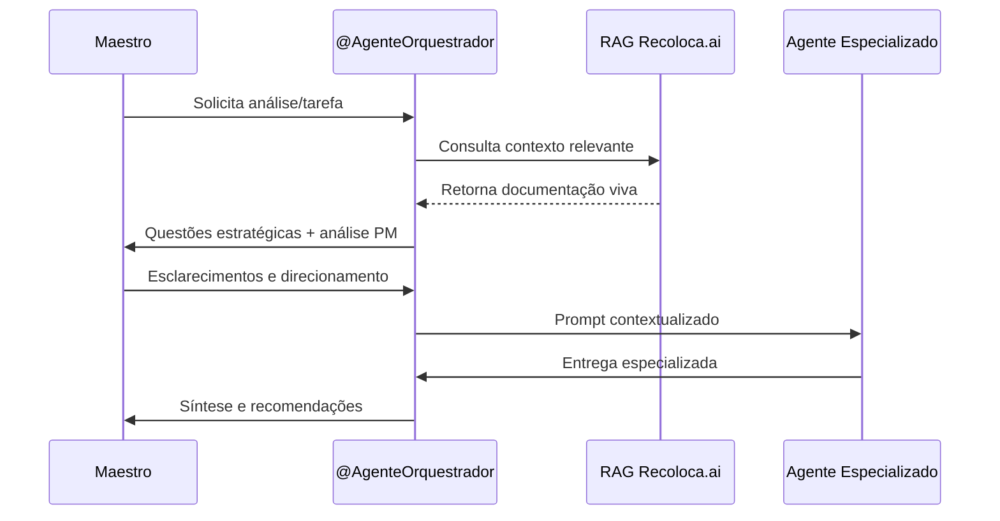

# Fluxo de Orquestração de Agentes IA - Recoloca.AI

**Versão:** 1.0  
**Data de Criação:** Junho 2025  
**Responsável:** Maestro (Bruno S. Rosa)  
**Próxima Revisão:** Setembro 2025  

## 1. Visão Geral

Este documento define o fluxo de orquestração dos Agentes de IA Mentores no projeto Recoloca.AI, estabelecendo como o `@AgenteOrquestrador` coordena e dirige os agentes especializados para maximizar a eficiência e qualidade das entregas.

## 2. Arquitetura de Orquestração

### 2.1 Modelo Hub-and-Spoke

```
                    ┌─────────────────────┐
                    │   @AgenteOrquestrador │
                    │   (PM Mentor &      │
                    │ Prompt Engineer)    │
                    └──────────┬──────────┘
                               │
              ┌────────────────┼────────────────┐
              │                │                │
    ┌─────────▼─────────┐ ┌───▼────┐ ┌────────▼────────┐
    │ Agentes Tier 1    │ │Sistema │ │ Agentes Tier 2  │
    │ (MVP Essenciais)  │ │  RAG   │ │ (Pós-MVP)       │
    └───────────────────┘ └────────┘ └─────────────────┘
```

### 2.2 Princípios de Orquestração

1. **Centralização Estratégica:** O `@AgenteOrquestrador` é o ponto central de coordenação
2. **Especialização por Domínio:** Cada agente possui expertise específica
3. **Context-Aware:** Uso intensivo do RAG Recoloca.ai para contexto
4. **Human-in-the-Loop:** Maestro mantém supervisão e decisão final
5. **Iteração Contínua:** Feedback loops para melhoria constante

## 3. Fluxo de Trabalho Padrão

### 3.1 Fase de Descoberta e Análise Estratégica



### 3.2 Tipos de Interação

#### 3.2.1 Consulta Direta
- **Quando:** Questões específicas de domínio
- **Fluxo:** Maestro → @AgenteOrquestrador → Agente Especializado → Resposta
- **Exemplo:** Consulta técnica sobre FastAPI

#### 3.2.2 Orquestração Complexa
- **Quando:** Tarefas que envolvem múltiplos domínios
- **Fluxo:** Coordenação sequencial ou paralela de múltiplos agentes
- **Exemplo:** Design de nova feature (UX + Backend + Frontend)

#### 3.2.3 Validação Cruzada
- **Quando:** Decisões críticas ou componentes de núcleo
- **Fluxo:** Múltiplos agentes analisam a mesma questão
- **Exemplo:** Arquitetura de sistema crítico

## 4. Matriz de Responsabilidades

### 4.1 @AgenteOrquestrador (Hub Central)

| Responsabilidade | Descrição | Ferramentas |
|------------------|-----------|-------------|
| **Análise Estratégica** | Validação de valor, alinhamento com objetivos | RAG Recoloca.ai, Frameworks PM |
| **Engenharia de Prompt** | Co-criação de prompts otimizados | Templates, Best Practices |
| **Coordenação** | Sequenciamento e priorização de tarefas | Kanban, Metodologia |
| **Síntese** | Consolidação de outputs de múltiplos agentes | Análise crítica |
| **Qualidade** | Validação de entregas e padrões | Checklists, Critérios |

### 4.2 Agentes Especializados (Spokes)

#### Tier 1 - MVP Essenciais

| Agente | Domínio | Responsabilidade Principal |
|--------|---------|---------------------------|
| **@AgenteM_ArquitetoTI** | Arquitetura | HLD, decisões técnicas, padrões |
| **@AgenteM_DevFastAPI** | Backend | APIs, lógica de negócio, integração |
| **@AgenteM_DevFlutter** | Frontend | Interface, UX implementation |
| **@AgenteM_UXDesigner** | Experiência | Wireframes, fluxos, usabilidade |
| **@AgenteM_QA** | Qualidade | Estratégias de teste, validação |
| **@AgenteM_DevOps** | Operações | Deploy, infraestrutura, CI/CD |

#### Tier 2 - Pós-MVP

| Agente | Domínio | Ativação |
|--------|---------|----------|
| **@AgenteM_DataScientist** | Dados/IA | Funcionalidades avançadas de IA |
| **@AgenteM_SecurityExpert** | Segurança | Auditoria e hardening |
| **@AgenteM_BusinessAnalyst** | Negócio | Análise de mercado e métricas |

## 5. Protocolos de Comunicação

### 5.1 Formato de Prompt Padrão

```markdown
## Contexto Estratégico
[Informações do RAG Recoloca.ai + Objetivos]

## Tarefa Específica
[Descrição clara e objetiva]

## Critérios de Sucesso
[Métricas e expectativas]

## Restrições e Considerações
[Limitações técnicas, orçamentárias, temporais]

## Entregáveis Esperados
[Formato e estrutura da resposta]
```

### 5.2 Handoffs Entre Agentes

1. **Documentação de Contexto:** Cada agente documenta decisões e rationale
2. **Versionamento:** Controle de versões de artefatos compartilhados
3. **Validação Cruzada:** Revisão por agentes relacionados quando necessário

## 6. RAG Recoloca.ai na Orquestração

### 6.1 Papel do RAG

- **Contexto Dinâmico:** Fornece informações atualizadas da documentação viva
- **Consistência:** Garante alinhamento com padrões e decisões anteriores
- **Eficiência:** Reduz retrabalho e inconsistências
- **Aprendizado:** Captura e reutiliza conhecimento organizacional

### 6.2 Integração com Fluxo

```
┌─────────────┐    ┌─────────────┐    ┌─────────────┐
│   Maestro   │───▶│@AgenteOrq.  │───▶│RAG Recoloca.ai│
└─────────────┘    └─────────────┘    └─────────────┘
                           │                   │
                           ▼                   ▼
                   ┌─────────────┐    ┌─────────────┐
                   │Prompt Rico  │◀───│Contexto     │
                   │Contextual.  │    │Relevante    │
                   └─────────────┘    └─────────────┘
                           │
                           ▼
                   ┌─────────────┐
                   │Agente       │
                   │Especializado│
                   └─────────────┘
```

## 7. Métricas de Eficácia da Orquestração

### 7.1 Indicadores de Performance

| Métrica | Descrição | Meta |
|---------|-----------|------|
| **Tempo de Resposta** | Tempo médio para resolução de tarefas | < 2h para consultas, < 1 dia para entregas |
| **Taxa de Retrabalho** | % de entregas que precisaram revisão | < 15% |
| **Satisfação do Maestro** | Avaliação qualitativa das entregas | ≥ 4.5/5 |
| **Consistência** | Alinhamento com padrões e documentação | ≥ 95% |
| **Cobertura RAG** | % de prompts que utilizam contexto RAG | ≥ 80% |

### 7.2 Feedback Loops

1. **Retrospectivas Semanais:** Análise de eficácia e ajustes
2. **Refinamento de Prompts:** Melhoria contínua baseada em resultados
3. **Atualização de Contexto:** Evolução da base de conhecimento RAG

## 8. Cenários de Uso Típicos

### 8.1 Desenvolvimento de Nova Feature

1. **@AgenteOrquestrador** analisa valor e viabilidade
2. **@AgenteM_UXDesigner** cria wireframes e fluxos
3. **@AgenteM_ArquitetoTI** define arquitetura técnica
4. **@AgenteM_DevFastAPI** e **@AgenteM_DevFlutter** implementam
5. **@AgenteM_QA** valida qualidade
6. **@AgenteM_DevOps** realiza deploy

### 8.2 Resolução de Problema Técnico

1. **@AgenteOrquestrador** analisa impacto e prioridade
2. Agente especializado relevante investiga e propõe solução
3. **@AgenteOrquestrador** valida alinhamento estratégico
4. Implementação coordenada

### 8.3 Decisão Arquitetural

1. **@AgenteOrquestrador** facilita análise multi-perspectiva
2. **@AgenteM_ArquitetoTI** lidera análise técnica
3. Agentes relacionados fornecem input especializado
4. **@AgenteOrquestrador** sintetiza recomendação final

## 9. Evolução e Melhoria Contínua

### 9.1 Aprendizado Organizacional

- **Captura de Padrões:** Identificação de fluxos recorrentes
- **Otimização de Prompts:** Refinamento baseado em resultados
- **Expansão de Capacidades:** Adição de novos agentes conforme necessidade

### 9.2 Roadmap de Evolução

- **Fase 1 (MVP):** Orquestração manual com agentes Tier 1
- **Fase 2 (Pós-MVP):** Automação parcial e agentes Tier 2
- **Fase 3 (Futuro):** Orquestração inteligente com ML

---

## Documentos Relacionados

- [[docs/04_Agentes_IA/AGENTES_IA_MENTORES_OVERVIEW.md]]
- [[docs/04_Agentes_IA/@AgenteOrquestrador.md]]
- [[docs/01_Guias_Centrais/GUIA_AVANCADO.md]]
- [[docs/01_Guias_Centrais/PLANO_MESTRE_RECOLOCA_AI.md]]
- [[docs/00_Gerenciamento_Projeto/KANBAN_Recoloca_AI.md]]