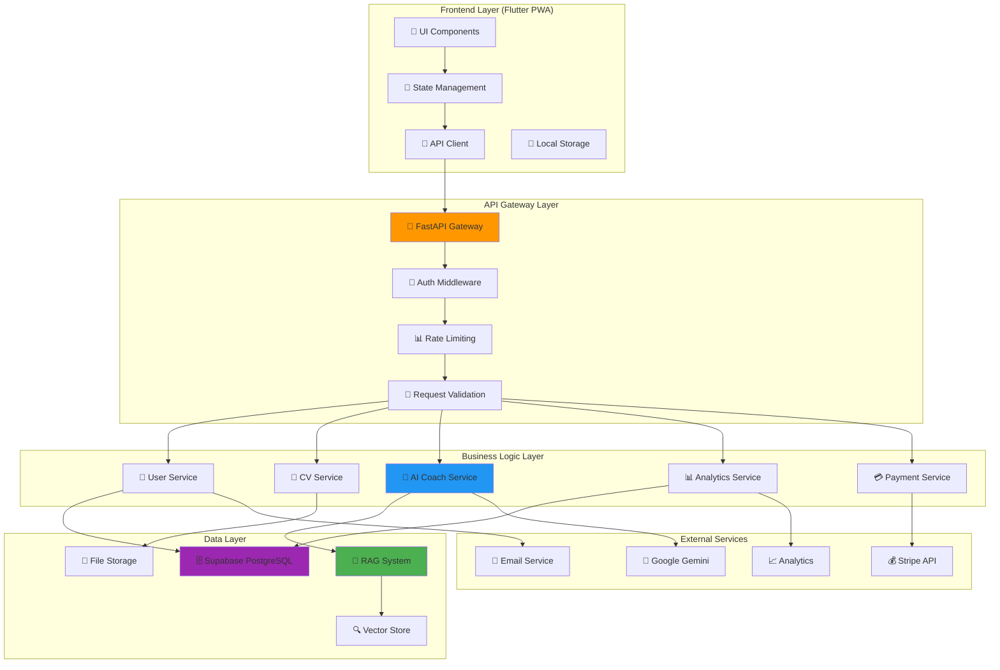

# Low-Level Design (LLD) Consolidado - Recoloca.ai

**Versão**: 1.0  
**Data de Criação**: 19/06/2025  
**Data de Última Atualização**: 19/06/2025  
**Autor**: @AgenteM_ArquitetoTI  
**Aprovação**: Maestro Bruno S. Rosa  

**Baseado em**:
- [[docs/03_Arquitetura_e_Design/01_HLD.md]] (v1.1)
- [[docs/02_Requisitos/01_ERS.md]] (v1.1)
- [[docs/03_Arquitetura_e_Design/02_ADRs/ADR-002_PyTorch_vs_FAISS_GPU.md]] (v1.0)
- [[docs/03_Arquitetura_e_Design/03_LLDs/LLD_001_Arquitetura_RAG_MCP.md]] (v1.0)

---

## 📋 Resumo Executivo

Este documento consolida o **Low-Level Design (LLD)** completo do sistema Recoloca.ai, detalhando a implementação técnica de todos os componentes principais identificados no HLD. O LLD fornece especificações detalhadas de interfaces, estruturas de dados, algoritmos e padrões de implementação para guiar o desenvolvimento do MVP e futuras iterações.

**Escopo do LLD:**
- Especificação detalhada de componentes RAG/MCP
- Interfaces de integração entre módulos
- Estruturas de dados e modelos
- Padrões de implementação e convenções
- Validação técnica e critérios de qualidade

---

## 🏗️ Arquitetura Geral do Sistema

### Diagrama de Componentes Detalhado



---

## 🔧 Especificações Detalhadas por Componente

### 1. Sistema RAG/MCP (Componente Crítico)

#### 1.1 Arquitetura RAG Local

**Referência**: [[docs/03_Arquitetura_e_Design/03_LLDs/LLD_001_Arquitetura_RAG_MCP.md]]

**Componentes Principais**:

```python
# Estrutura de Classes RAG
class RAGRetriever:
    """
    Classe principal para recuperação de informações via RAG.
    Implementa detecção automática de backend (PyTorch vs FAISS-GPU).
    """
    
    def __init__(self, config_path: str = None):
        self.config = self._load_config(config_path)
        self.use_pytorch = self._detect_gpu_compatibility()
        self.embedding_model = EmbeddingModel()
        self._initialize_backend()
    
    def search(self, query: str, top_k: int = 5, min_score: float = 0.2) -> List[SearchResult]:
        """
        Realiza busca semântica na base de conhecimento.
        
        Args:
            query: Consulta em linguagem natural
            top_k: Número máximo de resultados
            min_score: Score mínimo de similaridade (0.0-1.0)
            
        Returns:
            Lista de resultados ordenados por relevância
        """
        pass
    
    def _detect_gpu_compatibility(self) -> bool:
        """
        Detecta compatibilidade GPU para seleção de backend.
        Baseado em ADR-002: PyTorch vs FAISS-GPU.
        """
        pass

class EmbeddingModel:
    """
    Gerenciamento do modelo BAAI/bge-m3 para geração de embeddings.
    """
    
    def __init__(self, model_name: str = "BAAI/bge-m3"):
        self.model_name = model_name
        self.device = self._get_optimal_device()
        self.model = self._load_model()
    
    def encode(self, texts: List[str], batch_size: int = 32) -> np.ndarray:
        """
        Gera embeddings para lista de textos.
        
        Args:
            texts: Lista de textos para encoding
            batch_size: Tamanho do batch para processamento
            
        Returns:
            Array numpy com embeddings normalizados
        """
        pass

class MCPServer:
    """
    Servidor MCP para integração RAG ↔ Trae IDE.
    """
    
    def __init__(self, rag_retriever: RAGRetriever):
        self.rag = rag_retriever
        self.protocol_handlers = self._setup_handlers()
    
    async def handle_rag_query(self, params: dict) -> dict:
        """
        Handler para consultas RAG via MCP.
        
        Args:
            params: Parâmetros da consulta MCP
            
        Returns:
            Resposta formatada para protocolo MCP
        """
        pass
```

#### 1.2 Estruturas de Dados RAG

```python
# Modelos de Dados
@dataclass
class SearchResult:
    """Resultado de busca RAG."""
    content: str
    metadata: Dict[str, Any]
    score: float
    rank: int
    source_file: str
    chunk_index: int

@dataclass
class DocumentChunk:
    """Chunk de documento indexado."""
    content: str
    embedding: np.ndarray
    metadata: ChunkMetadata
    chunk_id: str

@dataclass
class ChunkMetadata:
    """Metadados de chunk."""
    source_file: str
    chunk_index: int
    total_chunks: int
    category: str
    created_at: datetime
    file_hash: str

# Configurações
class RAGConfig:
    """Configurações do sistema RAG."""
    
    # Modelo de Embedding
    EMBEDDING_MODEL = "BAAI/bge-m3"
    EMBEDDING_DIMENSION = 1024
    
    # Chunking
    CHUNK_SIZE = 1000
    CHUNK_OVERLAP = 200
    
    # Busca
    DEFAULT_TOP_K = 5
    MIN_SIMILARITY_SCORE = 0.2
    
    # GPU/Performance
    BATCH_SIZE = 32
    USE_FP16 = True
    CACHE_SIZE = 1000
```

### 2. API Backend (FastAPI)

#### 2.1 Estrutura de Endpoints

```python
# Estrutura Principal da API
from fastapi import FastAPI, Depends, HTTPException
from fastapi.middleware.cors import CORSMiddleware
from fastapi.security import HTTPBearer

app = FastAPI(
    title="Recoloca.ai API",
    version="1.0.0",
    description="API para plataforma de recolocação profissional"
)

# Middleware
app.add_middleware(
    CORSMiddleware,
    allow_origins=["*"],  # Configurar para produção
    allow_credentials=True,
    allow_methods=["*"],
    allow_headers=["*"],
)

# Routers
from routers import auth, users, cv_analysis, ai_coach, payments

app.include_router(auth.router, prefix="/api/v1/auth", tags=["authentication"])
app.include_router(users.router, prefix="/api/v1/users", tags=["users"])
app.include_router(cv_analysis.router, prefix="/api/v1/cv", tags=["cv-analysis"])
app.include_router(ai_coach.router, prefix="/api/v1/coach", tags=["ai-coach"])
app.include_router(payments.router, prefix="/api/v1/payments", tags=["payments"])
```

#### 2.2 Modelos de Dados (Pydantic)

```python
# Modelos de Request/Response
from pydantic import BaseModel, EmailStr, Field
from typing import Optional, List, Dict, Any
from datetime import datetime
from enum import Enum

class UserRole(str, Enum):
    """Roles de usuário."""
    FREE = "free"
    PREMIUM = "premium"
    ADMIN = "admin"

class UserCreate(BaseModel):
    """Modelo para criação de usuário."""
    email: EmailStr
    password: str = Field(..., min_length=8)
    full_name: str = Field(..., min_length=2, max_length=100)
    phone: Optional[str] = None

class UserResponse(BaseModel):
    """Modelo de resposta de usuário."""
    id: str
    email: EmailStr
    full_name: str
    role: UserRole
    created_at: datetime
    is_active: bool
    
    class Config:
        from_attributes = True

class CVAnalysisRequest(BaseModel):
    """Request para análise de CV."""
    file_content: str  # Base64 encoded
    file_name: str
    target_position: Optional[str] = None
    target_company: Optional[str] = None

class CVAnalysisResponse(BaseModel):
    """Response da análise de CV."""
    analysis_id: str
    overall_score: float = Field(..., ge=0, le=100)
    insights: List[str]
    improvements: List[str]
    strengths: List[str]
    weaknesses: List[str]
    optimized_sections: Dict[str, str]
    created_at: datetime

class AICoachRequest(BaseModel):
    """Request para AI Coach."""
    user_message: str = Field(..., min_length=1, max_length=1000)
    context: Optional[Dict[str, Any]] = None
    session_id: Optional[str] = None

class AICoachResponse(BaseModel):
    """Response do AI Coach."""
    response: str
    suggestions: List[str]
    session_id: str
    timestamp: datetime
```

#### 2.3 Serviços de Negócio

```python
# Serviços Principais
class CVAnalysisService:
    """Serviço para análise de CVs."""
    
    def __init__(self, ai_client: AIClient, rag_client: RAGClient):
        self.ai_client = ai_client
        self.rag_client = rag_client
    
    async def analyze_cv(self, cv_content: str, user_context: dict) -> CVAnalysisResponse:
        """
        Analisa CV usando IA e contexto RAG.
        
        Args:
            cv_content: Conteúdo do CV extraído
            user_context: Contexto do usuário
            
        Returns:
            Análise completa do CV
        """
        # 1. Extrair informações estruturadas
        structured_data = await self._extract_cv_data(cv_content)
        
        # 2. Buscar contexto relevante no RAG
        rag_context = await self.rag_client.search(
            f"análise CV {structured_data.get('area', '')} {structured_data.get('nivel', '')}"
        )
        
        # 3. Gerar análise com IA
        analysis = await self.ai_client.analyze_cv(
            cv_data=structured_data,
            context=rag_context,
            user_preferences=user_context
        )
        
        return analysis
    
    async def _extract_cv_data(self, cv_content: str) -> dict:
        """Extrai dados estruturados do CV."""
        pass

class AICoachService:
    """Serviço para AI Coach conversacional."""
    
    def __init__(self, ai_client: AIClient, rag_client: RAGClient):
        self.ai_client = ai_client
        self.rag_client = rag_client
        self.session_manager = SessionManager()
    
    async def process_message(self, message: str, user_id: str, session_id: str = None) -> AICoachResponse:
        """
        Processa mensagem do usuário e gera resposta contextualizada.
        
        Args:
            message: Mensagem do usuário
            user_id: ID do usuário
            session_id: ID da sessão (opcional)
            
        Returns:
            Resposta do AI Coach
        """
        # 1. Gerenciar sessão
        session = await self.session_manager.get_or_create_session(user_id, session_id)
        
        # 2. Buscar contexto relevante
        rag_context = await self.rag_client.search(message)
        
        # 3. Recuperar histórico da conversa
        conversation_history = await self.session_manager.get_history(session.id)
        
        # 4. Gerar resposta
        response = await self.ai_client.generate_coach_response(
            message=message,
            context=rag_context,
            history=conversation_history,
            user_profile=session.user_profile
        )
        
        # 5. Salvar na sessão
        await self.session_manager.add_message(session.id, message, response)
        
        return response
```

### 3. Frontend (Flutter PWA)

#### 3.1 Arquitetura de Estado

```dart
// Gerenciamento de Estado com Riverpod
import 'package:flutter_riverpod/flutter_riverpod.dart';
import 'package:dio/dio.dart';

// Providers Principais
final apiClientProvider = Provider<ApiClient>((ref) {
  return ApiClient(baseUrl: 'https://api.recoloca.ai');
});

final authStateProvider = StateNotifierProvider<AuthNotifier, AuthState>((ref) {
  final apiClient = ref.watch(apiClientProvider);
  return AuthNotifier(apiClient);
});

final userProfileProvider = FutureProvider<UserProfile>((ref) async {
  final authState = ref.watch(authStateProvider);
  if (authState.isAuthenticated) {
    final apiClient = ref.watch(apiClientProvider);
    return await apiClient.getUserProfile(authState.user!.id);
  }
  throw Exception('User not authenticated');
});

// Estados
class AuthState {
  final User? user;
  final bool isLoading;
  final String? error;
  
  AuthState({
    this.user,
    this.isLoading = false,
    this.error,
  });
  
  bool get isAuthenticated => user != null;
  
  AuthState copyWith({
    User? user,
    bool? isLoading,
    String? error,
  }) {
    return AuthState(
      user: user ?? this.user,
      isLoading: isLoading ?? this.isLoading,
      error: error ?? this.error,
    );
  }
}

class AuthNotifier extends StateNotifier<AuthState> {
  final ApiClient _apiClient;
  
  AuthNotifier(this._apiClient) : super(AuthState());
  
  Future<void> login(String email, String password) async {
    state = state.copyWith(isLoading: true, error: null);
    
    try {
      final response = await _apiClient.login(email, password);
      final user = User.fromJson(response.data);
      
      // Salvar token localmente
      await _saveToken(response.data['access_token']);
      
      state = state.copyWith(
        user: user,
        isLoading: false,
      );
    } catch (e) {
      state = state.copyWith(
        isLoading: false,
        error: e.toString(),
      );
    }
  }
  
  Future<void> logout() async {
    await _clearToken();
    state = AuthState();
  }
  
  Future<void> _saveToken(String token) async {
    // Implementar storage seguro
  }
  
  Future<void> _clearToken() async {
    // Implementar limpeza de token
  }
}
```

#### 3.2 Componentes UI Principais

```dart
// Componente de Análise de CV
class CVAnalysisScreen extends ConsumerStatefulWidget {
  const CVAnalysisScreen({Key? key}) : super(key: key);
  
  @override
  ConsumerState<CVAnalysisScreen> createState() => _CVAnalysisScreenState();
}

class _CVAnalysisScreenState extends ConsumerState<CVAnalysisScreen>
    with TickerProviderStateMixin {
  
  late AnimationController _scoreAnimationController;
  late Animation<double> _scoreAnimation;
  
  @override
  void initState() {
    super.initState();
    _scoreAnimationController = AnimationController(
      duration: const Duration(seconds: 2),
      vsync: this,
    );
    _scoreAnimation = Tween<double>(
      begin: 0.0,
      end: 1.0,
    ).animate(CurvedAnimation(
      parent: _scoreAnimationController,
      curve: Curves.easeInOut,
    ));
  }
  
  @override
  Widget build(BuildContext context) {
    final analysisState = ref.watch(cvAnalysisProvider);
    
    return Scaffold(
      appBar: AppBar(
        title: const Text('Análise do CV'),
        backgroundColor: Theme.of(context).colorScheme.primary,
      ),
      body: analysisState.when(
        data: (analysis) => _buildAnalysisResult(analysis),
        loading: () => const _LoadingWidget(),
        error: (error, stack) => _buildErrorWidget(error),
      ),
    );
  }
  
  Widget _buildAnalysisResult(CVAnalysis analysis) {
    return SingleChildScrollView(
      padding: const EdgeInsets.all(16.0),
      child: Column(
        crossAxisAlignment: CrossAxisAlignment.start,
        children: [
          // Score animado
          AnimatedBuilder(
            animation: _scoreAnimation,
            builder: (context, child) {
              return _ScoreWidget(
                score: analysis.overallScore * _scoreAnimation.value,
                maxScore: 100,
              );
            },
          ),
          
          const SizedBox(height: 24),
          
          // Insights
          _SectionCard(
            title: 'Principais Insights',
            icon: Icons.lightbulb_outline,
            children: analysis.insights.map((insight) => 
              _InsightItem(text: insight)
            ).toList(),
          ),
          
          const SizedBox(height: 16),
          
          // Melhorias
          _SectionCard(
            title: 'Oportunidades de Melhoria',
            icon: Icons.trending_up,
            children: analysis.improvements.map((improvement) => 
              _ImprovementItem(text: improvement)
            ).toList(),
          ),
          
          const SizedBox(height: 24),
          
          // Botões de ação
          Row(
            children: [
              Expanded(
                child: ElevatedButton.icon(
                  onPressed: () => _downloadOptimizedCV(analysis),
                  icon: const Icon(Icons.download),
                  label: const Text('Baixar CV Otimizado'),
                ),
              ),
              const SizedBox(width: 16),
              Expanded(
                child: OutlinedButton.icon(
                  onPressed: () => _shareAnalysis(analysis),
                  icon: const Icon(Icons.share),
                  label: const Text('Compartilhar'),
                ),
              ),
            ],
          ),
        ],
      ),
    );
  }
  
  void _downloadOptimizedCV(CVAnalysis analysis) {
    // Implementar download
  }
  
  void _shareAnalysis(CVAnalysis analysis) {
    // Implementar compartilhamento
  }
}

// Widget de Score Animado
class _ScoreWidget extends StatelessWidget {
  final double score;
  final double maxScore;
  
  const _ScoreWidget({
    required this.score,
    required this.maxScore,
  });
  
  @override
  Widget build(BuildContext context) {
    final percentage = score / maxScore;
    
    return Container(
      padding: const EdgeInsets.all(24),
      decoration: BoxDecoration(
        gradient: LinearGradient(
          colors: [
            Theme.of(context).colorScheme.primary.withOpacity(0.1),
            Theme.of(context).colorScheme.secondary.withOpacity(0.1),
          ],
        ),
        borderRadius: BorderRadius.circular(16),
      ),
      child: Column(
        children: [
          // Círculo de progresso
          SizedBox(
            width: 120,
            height: 120,
            child: CircularProgressIndicator(
              value: percentage,
              strokeWidth: 8,
              backgroundColor: Colors.grey.shade300,
              valueColor: AlwaysStoppedAnimation<Color>(
                _getScoreColor(percentage),
              ),
            ),
          ),
          
          const SizedBox(height: 16),
          
          // Score numérico
          Text(
            '${score.toInt()}',
            style: Theme.of(context).textTheme.headlineLarge?.copyWith(
              fontWeight: FontWeight.bold,
              color: _getScoreColor(percentage),
            ),
          ),
          
          Text(
            'Score Geral',
            style: Theme.of(context).textTheme.bodyLarge?.copyWith(
              color: Colors.grey.shade600,
            ),
          ),
        ],
      ),
    );
  }
  
  Color _getScoreColor(double percentage) {
    if (percentage >= 0.8) return Colors.green;
    if (percentage >= 0.6) return Colors.orange;
    return Colors.red;
  }
}
```

### 4. Integração com Supabase

#### 4.1 Configuração de Tabelas

```sql
-- Tabela de Usuários (estende auth.users do Supabase)
CREATE TABLE public.user_profiles (
    id UUID REFERENCES auth.users(id) PRIMARY KEY,
    email TEXT NOT NULL,
    full_name TEXT NOT NULL,
    phone TEXT,
    role user_role DEFAULT 'free',
    subscription_status subscription_status DEFAULT 'inactive',
    subscription_plan TEXT,
    created_at TIMESTAMP WITH TIME ZONE DEFAULT NOW(),
    updated_at TIMESTAMP WITH TIME ZONE DEFAULT NOW(),
    is_active BOOLEAN DEFAULT TRUE
);

-- Tabela de Análises de CV
CREATE TABLE public.cv_analyses (
    id UUID DEFAULT gen_random_uuid() PRIMARY KEY,
    user_id UUID REFERENCES public.user_profiles(id) NOT NULL,
    file_name TEXT NOT NULL,
    file_hash TEXT NOT NULL,
    overall_score DECIMAL(5,2) CHECK (overall_score >= 0 AND overall_score <= 100),
    insights JSONB,
    improvements JSONB,
    strengths JSONB,
    weaknesses JSONB,
    optimized_sections JSONB,
    analysis_metadata JSONB,
    created_at TIMESTAMP WITH TIME ZONE DEFAULT NOW(),
    updated_at TIMESTAMP WITH TIME ZONE DEFAULT NOW()
);

-- Tabela de Sessões do AI Coach
CREATE TABLE public.ai_coach_sessions (
    id UUID DEFAULT gen_random_uuid() PRIMARY KEY,
    user_id UUID REFERENCES public.user_profiles(id) NOT NULL,
    session_name TEXT,
    context JSONB,
    created_at TIMESTAMP WITH TIME ZONE DEFAULT NOW(),
    updated_at TIMESTAMP WITH TIME ZONE DEFAULT NOW(),
    is_active BOOLEAN DEFAULT TRUE
);

-- Tabela de Mensagens do AI Coach
CREATE TABLE public.ai_coach_messages (
    id UUID DEFAULT gen_random_uuid() PRIMARY KEY,
    session_id UUID REFERENCES public.ai_coach_sessions(id) NOT NULL,
    message_type message_type NOT NULL,
    content TEXT NOT NULL,
    metadata JSONB,
    created_at TIMESTAMP WITH TIME ZONE DEFAULT NOW()
);

-- Tipos Enum
CREATE TYPE user_role AS ENUM ('free', 'premium', 'admin');
CREATE TYPE subscription_status AS ENUM ('inactive', 'active', 'cancelled', 'past_due');
CREATE TYPE message_type AS ENUM ('user', 'assistant', 'system');
```

#### 4.2 Políticas RLS (Row Level Security)

```sql
-- Habilitar RLS
ALTER TABLE public.user_profiles ENABLE ROW LEVEL SECURITY;
ALTER TABLE public.cv_analyses ENABLE ROW LEVEL SECURITY;
ALTER TABLE public.ai_coach_sessions ENABLE ROW LEVEL SECURITY;
ALTER TABLE public.ai_coach_messages ENABLE ROW LEVEL SECURITY;

-- Políticas para user_profiles
CREATE POLICY "Users can view own profile" ON public.user_profiles
    FOR SELECT USING (auth.uid() = id);

CREATE POLICY "Users can update own profile" ON public.user_profiles
    FOR UPDATE USING (auth.uid() = id);

-- Políticas para cv_analyses
CREATE POLICY "Users can view own CV analyses" ON public.cv_analyses
    FOR SELECT USING (auth.uid() = user_id);

CREATE POLICY "Users can insert own CV analyses" ON public.cv_analyses
    FOR INSERT WITH CHECK (auth.uid() = user_id);

CREATE POLICY "Users can update own CV analyses" ON public.cv_analyses
    FOR UPDATE USING (auth.uid() = user_id);

-- Políticas para ai_coach_sessions
CREATE POLICY "Users can manage own coach sessions" ON public.ai_coach_sessions
    FOR ALL USING (auth.uid() = user_id);

-- Políticas para ai_coach_messages
CREATE POLICY "Users can manage own coach messages" ON public.ai_coach_messages
    FOR ALL USING (
        auth.uid() = (
            SELECT user_id FROM public.ai_coach_sessions 
            WHERE id = session_id
        )
    );
```

---

## 🔌 Interfaces de Integração

### 1. Interface RAG ↔ API Backend

```python
# Interface para integração RAG
from abc import ABC, abstractmethod
from typing import List, Dict, Any, Optional

class RAGInterface(ABC):
    """Interface abstrata para sistema RAG."""
    
    @abstractmethod
    async def search(self, query: str, top_k: int = 5, min_score: float = 0.2) -> List[SearchResult]:
        """Realiza busca semântica."""
        pass
    
    @abstractmethod
    async def get_document_list(self, category: Optional[str] = None) -> List[str]:
        """Lista documentos indexados."""
        pass
    
    @abstractmethod
    async def reindex(self, force: bool = False) -> Dict[str, Any]:
        """Força reindexação."""
        pass

class RAGClient(RAGInterface):
    """Cliente para comunicação com sistema RAG via MCP."""
    
    def __init__(self, mcp_client: MCPClient):
        self.mcp_client = mcp_client
    
    async def search(self, query: str, top_k: int = 5, min_score: float = 0.2) -> List[SearchResult]:
        """Implementa busca via MCP."""
        response = await self.mcp_client.call_tool(
            "rag_query",
            {
                "query": query,
                "top_k": top_k,
                "min_score": min_score
            }
        )
        
        return [SearchResult.from_dict(result) for result in response["results"]]
```

### 2. Interface Frontend ↔ API

```dart
// Cliente API para Flutter
class ApiClient {
  final Dio _dio;
  final String baseUrl;
  
  ApiClient({required this.baseUrl}) : _dio = Dio() {
    _dio.options.baseUrl = baseUrl;
    _dio.interceptors.add(AuthInterceptor());
    _dio.interceptors.add(LogInterceptor());
  }
  
  // Autenticação
  Future<AuthResponse> login(String email, String password) async {
    final response = await _dio.post('/auth/login', data: {
      'email': email,
      'password': password,
    });
    
    return AuthResponse.fromJson(response.data);
  }
  
  // Análise de CV
  Future<CVAnalysisResponse> analyzeCV(CVAnalysisRequest request) async {
    final response = await _dio.post('/cv/analyze', data: request.toJson());
    return CVAnalysisResponse.fromJson(response.data);
  }
  
  // AI Coach
  Future<AICoachResponse> sendCoachMessage(AICoachRequest request) async {
    final response = await _dio.post('/coach/message', data: request.toJson());
    return AICoachResponse.fromJson(response.data);
  }
}

// Interceptor de Autenticação
class AuthInterceptor extends Interceptor {
  @override
  void onRequest(RequestOptions options, RequestInterceptorHandler handler) async {
    final token = await _getStoredToken();
    if (token != null) {
      options.headers['Authorization'] = 'Bearer $token';
    }
    handler.next(options);
  }
  
  Future<String?> _getStoredToken() async {
    // Implementar recuperação de token
    return null;
  }
}
```

---

## 📊 Estruturas de Dados Principais

### 1. Modelos de Domínio

```python
# Modelos SQLAlchemy para Backend
from sqlalchemy import Column, String, DateTime, Boolean, Text, DECIMAL, ForeignKey
from sqlalchemy.dialects.postgresql import UUID, JSONB
from sqlalchemy.ext.declarative import declarative_base
from sqlalchemy.orm import relationship
import uuid
from datetime import datetime

Base = declarative_base()

class UserProfile(Base):
    """Modelo de perfil de usuário."""
    __tablename__ = 'user_profiles'
    
    id = Column(UUID(as_uuid=True), primary_key=True, default=uuid.uuid4)
    email = Column(String, nullable=False, unique=True)
    full_name = Column(String, nullable=False)
    phone = Column(String)
    role = Column(String, default='free')
    subscription_status = Column(String, default='inactive')
    subscription_plan = Column(String)
    created_at = Column(DateTime, default=datetime.utcnow)
    updated_at = Column(DateTime, default=datetime.utcnow, onupdate=datetime.utcnow)
    is_active = Column(Boolean, default=True)
    
    # Relacionamentos
    cv_analyses = relationship("CVAnalysis", back_populates="user")
    coach_sessions = relationship("AICoachSession", back_populates="user")

class CVAnalysis(Base):
    """Modelo de análise de CV."""
    __tablename__ = 'cv_analyses'
    
    id = Column(UUID(as_uuid=True), primary_key=True, default=uuid.uuid4)
    user_id = Column(UUID(as_uuid=True), ForeignKey('user_profiles.id'), nullable=False)
    file_name = Column(String, nullable=False)
    file_hash = Column(String, nullable=False)
    overall_score = Column(DECIMAL(5, 2))
    insights = Column(JSONB)
    improvements = Column(JSONB)
    strengths = Column(JSONB)
    weaknesses = Column(JSONB)
    optimized_sections = Column(JSONB)
    analysis_metadata = Column(JSONB)
    created_at = Column(DateTime, default=datetime.utcnow)
    updated_at = Column(DateTime, default=datetime.utcnow, onupdate=datetime.utcnow)
    
    # Relacionamentos
    user = relationship("UserProfile", back_populates="cv_analyses")

class AICoachSession(Base):
    """Modelo de sessão do AI Coach."""
    __tablename__ = 'ai_coach_sessions'
    
    id = Column(UUID(as_uuid=True), primary_key=True, default=uuid.uuid4)
    user_id = Column(UUID(as_uuid=True), ForeignKey('user_profiles.id'), nullable=False)
    session_name = Column(String)
    context = Column(JSONB)
    created_at = Column(DateTime, default=datetime.utcnow)
    updated_at = Column(DateTime, default=datetime.utcnow, onupdate=datetime.utcnow)
    is_active = Column(Boolean, default=True)
    
    # Relacionamentos
    user = relationship("UserProfile", back_populates="coach_sessions")
    messages = relationship("AICoachMessage", back_populates="session")

class AICoachMessage(Base):
    """Modelo de mensagem do AI Coach."""
    __tablename__ = 'ai_coach_messages'
    
    id = Column(UUID(as_uuid=True), primary_key=True, default=uuid.uuid4)
    session_id = Column(UUID(as_uuid=True), ForeignKey('ai_coach_sessions.id'), nullable=False)
    message_type = Column(String, nullable=False)  # 'user', 'assistant', 'system'
    content = Column(Text, nullable=False)
    metadata = Column(JSONB)
    created_at = Column(DateTime, default=datetime.utcnow)
    
    # Relacionamentos
    session = relationship("AICoachSession", back_populates="messages")
```

### 2. Modelos Flutter (Dart)

```dart
// Modelos de dados para Flutter
import 'package:json_annotation/json_annotation.dart';

part 'models.g.dart';

@JsonSerializable()
class User {
  final String id;
  final String email;
  final String fullName;
  final String? phone;
  final UserRole role;
  final DateTime createdAt;
  final bool isActive;
  
  User({
    required this.id,
    required this.email,
    required this.fullName,
    this.phone,
    required this.role,
    required this.createdAt,
    required this.isActive,
  });
  
  factory User.fromJson(Map<String, dynamic> json) => _$UserFromJson(json);
  Map<String, dynamic> toJson() => _$UserToJson(this);
}

enum UserRole {
  @JsonValue('free')
  free,
  @JsonValue('premium')
  premium,
  @JsonValue('admin')
  admin,
}

@JsonSerializable()
class CVAnalysis {
  final String id;
  final String userId;
  final String fileName;
  final double overallScore;
  final List<String> insights;
  final List<String> improvements;
  final List<String> strengths;
  final List<String> weaknesses;
  final Map<String, String> optimizedSections;
  final DateTime createdAt;
  
  CVAnalysis({
    required this.id,
    required this.userId,
    required this.fileName,
    required this.overallScore,
    required this.insights,
    required this.improvements,
    required this.strengths,
    required this.weaknesses,
    required this.optimizedSections,
    required this.createdAt,
  });
  
  factory CVAnalysis.fromJson(Map<String, dynamic> json) => _$CVAnalysisFromJson(json);
  Map<String, dynamic> toJson() => _$CVAnalysisToJson(this);
}

@JsonSerializable()
class AICoachMessage {
  final String id;
  final String sessionId;
  final MessageType type;
  final String content;
  final DateTime timestamp;
  final Map<String, dynamic>? metadata;
  
  AICoachMessage({
    required this.id,
    required this.sessionId,
    required this.type,
    required this.content,
    required this.timestamp,
    this.metadata,
  });
  
  factory AICoachMessage.fromJson(Map<String, dynamic> json) => _$AICoachMessageFromJson(json);
  Map<String, dynamic> toJson() => _$AICoachMessageToJson(this);
}

enum MessageType {
  @JsonValue('user')
  user,
  @JsonValue('assistant')
  assistant,
  @JsonValue('system')
  system,
}
```

---

## 🎯 Padrões de Implementação

### 1. Padrões de Arquitetura

**Clean Architecture**: Separação clara entre camadas
- **Entities**: Modelos de domínio
- **Use Cases**: Lógica de negócio
- **Interface Adapters**: Controllers, Presenters
- **Frameworks**: FastAPI, Flutter, Supabase

**Repository Pattern**: Abstração de acesso a dados
```python
class UserRepository(ABC):
    @abstractmethod
    async def get_by_id(self, user_id: str) -> Optional[User]:
        pass
    
    @abstractmethod
    async def create(self, user_data: UserCreate) -> User:
        pass

class SupabaseUserRepository(UserRepository):
    def __init__(self, supabase_client: Client):
        self.client = supabase_client
    
    async def get_by_id(self, user_id: str) -> Optional[User]:
        # Implementação específica do Supabase
        pass
```

**Dependency Injection**: Inversão de dependências
```python
# FastAPI Dependencies
def get_user_repository() -> UserRepository:
    return SupabaseUserRepository(get_supabase_client())

def get_user_service(repo: UserRepository = Depends(get_user_repository)) -> UserService:
    return UserService(repo)
```

### 2. Padrões de Segurança

**Validação de Input**: Sempre validar dados de entrada
```python
from pydantic import BaseModel, validator

class CVAnalysisRequest(BaseModel):
    file_content: str
    file_name: str
    
    @validator('file_content')
    def validate_file_content(cls, v):
        if not v or len(v) < 100:
            raise ValueError('Conteúdo do arquivo muito pequeno')
        return v
    
    @validator('file_name')
    def validate_file_name(cls, v):
        if not v.endswith(('.pdf', '.doc', '.docx')):
            raise ValueError('Formato de arquivo não suportado')
        return v
```

**Rate Limiting**: Controle de taxa de requisições
```python
from slowapi import Limiter, _rate_limit_exceeded_handler
from slowapi.util import get_remote_address
from slowapi.errors import RateLimitExceeded

limiter = Limiter(key_func=get_remote_address)
app.state.limiter = limiter
app.add_exception_handler(RateLimitExceeded, _rate_limit_exceeded_handler)

@app.post("/cv/analyze")
@limiter.limit("5/minute")
async def analyze_cv(request: Request, cv_request: CVAnalysisRequest):
    # Implementação
    pass
```

### 3. Padrões de Performance

**Caching**: Cache de resultados frequentes
```python
from functools import lru_cache
import redis

redis_client = redis.Redis(host='localhost', port=6379, db=0)

@lru_cache(maxsize=1000)
def get_rag_context(query: str) -> str:
    # Cache em memória para consultas RAG
    pass

async def cache_cv_analysis(analysis_id: str, result: dict):
    # Cache Redis para análises de CV
    await redis_client.setex(
        f"cv_analysis:{analysis_id}",
        3600,  # 1 hora
        json.dumps(result)
    )
```

**Async/Await**: Processamento assíncrono
```python
import asyncio
from concurrent.futures import ThreadPoolExecutor

async def process_cv_analysis(cv_content: str) -> CVAnalysisResponse:
    # Executar tarefas CPU-intensivas em thread pool
    with ThreadPoolExecutor() as executor:
        loop = asyncio.get_event_loop()
        
        # Processamento paralelo
        tasks = [
            loop.run_in_executor(executor, extract_text, cv_content),
            loop.run_in_executor(executor, analyze_structure, cv_content),
            get_rag_context(cv_content),  # Async
        ]
        
        text, structure, context = await asyncio.gather(*tasks)
        
        # Combinar resultados
        return await generate_analysis(text, structure, context)
```

---

## ✅ Critérios de Validação Técnica

### 1. Testes Unitários

```python
# Exemplo de testes para serviços
import pytest
from unittest.mock import Mock, AsyncMock
from services.cv_analysis_service import CVAnalysisService

@pytest.fixture
def mock_ai_client():
    client = Mock()
    client.analyze_cv = AsyncMock()
    return client

@pytest.fixture
def mock_rag_client():
    client = Mock()
    client.search = AsyncMock()
    return client

@pytest.fixture
def cv_service(mock_ai_client, mock_rag_client):
    return CVAnalysisService(mock_ai_client, mock_rag_client)

@pytest.mark.asyncio
async def test_analyze_cv_success(cv_service, mock_ai_client, mock_rag_client):
    # Arrange
    cv_content = "Experiência: Desenvolvedor Python..."
    user_context = {"area": "tecnologia", "nivel": "senior"}
    
    mock_rag_client.search.return_value = [
        {"content": "Dicas para CV de desenvolvedor", "score": 0.8}
    ]
    
    mock_ai_client.analyze_cv.return_value = {
        "overall_score": 85.0,
        "insights": ["Boa experiência técnica"],
        "improvements": ["Adicionar métricas de impacto"]
    }
    
    # Act
    result = await cv_service.analyze_cv(cv_content, user_context)
    
    # Assert
    assert result.overall_score == 85.0
    assert len(result.insights) > 0
    mock_rag_client.search.assert_called_once()
    mock_ai_client.analyze_cv.assert_called_once()

@pytest.mark.asyncio
async def test_analyze_cv_invalid_content(cv_service):
    # Arrange
    cv_content = ""  # Conteúdo vazio
    user_context = {}
    
    # Act & Assert
    with pytest.raises(ValueError, match="Conteúdo do CV inválido"):
        await cv_service.analyze_cv(cv_content, user_context)
```

### 2. Testes de Integração

```python
# Testes de integração com Supabase
import pytest
from httpx import AsyncClient
from main import app

@pytest.mark.asyncio
async def test_cv_analysis_endpoint():
    async with AsyncClient(app=app, base_url="http://test") as ac:
        # Simular upload de CV
        response = await ac.post(
            "/api/v1/cv/analyze",
            json={
                "file_content": "base64_encoded_cv_content",
                "file_name": "cv_test.pdf",
                "target_position": "Desenvolvedor Python"
            },
            headers={"Authorization": "Bearer test_token"}
        )
        
        assert response.status_code == 200
        data = response.json()
        assert "analysis_id" in data
        assert "overall_score" in data
        assert data["overall_score"] >= 0
        assert data["overall_score"] <= 100
```

### 3. Testes de Performance

```python
# Testes de carga para RAG
import asyncio
import time
from rag_client import RAGClient

async def test_rag_performance():
    rag_client = RAGClient()
    
    # Teste de latência
    start_time = time.time()
    results = await rag_client.search("análise CV desenvolvedor Python")
    end_time = time.time()
    
    latency = (end_time - start_time) * 1000  # ms
    
    assert latency < 200  # Menos de 200ms
    assert len(results) > 0
    assert all(result.score >= 0.2 for result in results)

async def test_rag_concurrent_load():
    rag_client = RAGClient()
    
    # Teste de carga concorrente
    queries = [
        "análise CV",
        "otimização currículo",
        "dicas entrevista",
        "mercado trabalho TI",
        "habilidades técnicas"
    ] * 10  # 50 consultas
    
    start_time = time.time()
    
    tasks = [rag_client.search(query) for query in queries]
    results = await asyncio.gather(*tasks)
    
    end_time = time.time()
    total_time = end_time - start_time
    
    assert total_time < 10  # Menos de 10 segundos para 50 consultas
    assert len(results) == 50
    assert all(len(result) > 0 for result in results)
```

---

## 📈 Métricas e Monitoramento

### 1. Métricas de Sistema

```python
# Instrumentação com Prometheus
from prometheus_client import Counter, Histogram, Gauge
import time

# Métricas de API
api_requests_total = Counter(
    'api_requests_total',
    'Total API requests',
    ['method', 'endpoint', 'status']
)

api_request_duration = Histogram(
    'api_request_duration_seconds',
    'API request duration',
    ['method', 'endpoint']
)

# Métricas de RAG
rag_queries_total = Counter(
    'rag_queries_total',
    'Total RAG queries',
    ['query_type']
)

rag_query_duration = Histogram(
    'rag_query_duration_seconds',
    'RAG query duration'
)

rag_results_count = Histogram(
    'rag_results_count',
    'Number of RAG results returned'
)

# Métricas de negócio
cv_analyses_total = Counter(
    'cv_analyses_total',
    'Total CV analyses performed',
    ['user_type']
)

coach_sessions_active = Gauge(
    'coach_sessions_active',
    'Active AI coach sessions'
)

# Middleware para instrumentação
class MetricsMiddleware:
    def __init__(self, app):
        self.app = app
    
    async def __call__(self, scope, receive, send):
        if scope["type"] == "http":
            start_time = time.time()
            method = scope["method"]
            path = scope["path"]
            
            # Processar request
            await self.app(scope, receive, send)
            
            # Registrar métricas
            duration = time.time() - start_time
            api_request_duration.labels(method=method, endpoint=path).observe(duration)
            api_requests_total.labels(method=method, endpoint=path, status="200").inc()
        else:
            await self.app(scope, receive, send)
```

### 2. Logging Estruturado

```python
# Configuração de logging
import logging
import json
from datetime import datetime

class StructuredLogger:
    def __init__(self, name: str):
        self.logger = logging.getLogger(name)
        self.logger.setLevel(logging.INFO)
        
        handler = logging.StreamHandler()
        formatter = logging.Formatter('%(message)s')
        handler.setFormatter(formatter)
        self.logger.addHandler(handler)
    
    def log(self, level: str, message: str, **kwargs):
        log_entry = {
            "timestamp": datetime.utcnow().isoformat(),
            "level": level,
            "message": message,
            "service": "recoloca-api",
            **kwargs
        }
        
        self.logger.info(json.dumps(log_entry))
    
    def info(self, message: str, **kwargs):
        self.log("INFO", message, **kwargs)
    
    def error(self, message: str, **kwargs):
        self.log("ERROR", message, **kwargs)
    
    def warning(self, message: str, **kwargs):
        self.log("WARNING", message, **kwargs)

# Uso em serviços
logger = StructuredLogger("cv_analysis")

async def analyze_cv(cv_content: str, user_id: str):
    logger.info(
        "CV analysis started",
        user_id=user_id,
        cv_size=len(cv_content),
        operation="cv_analysis"
    )
    
    try:
        result = await perform_analysis(cv_content)
        
        logger.info(
            "CV analysis completed",
            user_id=user_id,
            score=result.overall_score,
            insights_count=len(result.insights),
            operation="cv_analysis"
        )
        
        return result
        
    except Exception as e:
        logger.error(
            "CV analysis failed",
            user_id=user_id,
            error=str(e),
            operation="cv_analysis"
        )
        raise
```

---

## 🚀 Próximos Passos de Implementação

### Fase 1: Fundação (Semanas 1-2)
1. **Configuração de Infraestrutura**
   - Setup Supabase com tabelas e RLS
   - Configuração FastAPI base
   - Setup Flutter PWA

2. **Sistema RAG/MCP**
   - Finalizar integração MCP
   - Testes de performance
   - Documentação de uso

### Fase 2: Core Features (Semanas 3-6)
1. **Autenticação e Usuários**
   - Login/registro
   - Gestão de perfis
   - Integração Supabase Auth

2. **Análise de CV**
   - Upload e processamento
   - Integração com IA
   - Interface de resultados

### Fase 3: AI Coach (Semanas 7-10)
1. **Sistema Conversacional**
   - Sessões de chat
   - Contexto persistente
   - Integração RAG

2. **Interface de Chat**
   - UI conversacional
   - Histórico de mensagens
   - Sugestões inteligentes

### Fase 4: Otimizações (Semanas 11-12)
1. **Performance e Monitoramento**
   - Métricas de sistema
   - Otimizações de performance
   - Testes de carga

2. **Polimento e Deploy**
   - Testes finais
   - Deploy em produção
   - Documentação final

---

## 📚 Referências Técnicas

- **HLD Principal**: [[docs/03_Arquitetura_e_Design/01_HLD.md]]
- **Especificação RAG/MCP**: [[docs/03_Arquitetura_e_Design/03_LLDs/LLD_001_Arquitetura_RAG_MCP.md]]
- **ADR PyTorch vs FAISS**: [[docs/03_Arquitetura_e_Design/02_ADRs/ADR-002_PyTorch_vs_FAISS_GPU.md]]
- **Requisitos do Sistema**: [[docs/02_Requisitos/01_ERS.md]]
- **Guia de Estilo**: [[docs/03_Arquitetura_e_Design/03_STYLE_GUIDE.md]]
- **API Specifications**: [[docs/03_Arquitetura_e_Design/00_API_Specs/]]

---

**Status**: ✅ **APROVADO**  
**Próxima Revisão**: Após implementação da Fase 1  
**Responsável**: @AgenteM_ArquitetoTI  
**Aprovação**: Maestro Bruno S. Rosa  

---

**Última Atualização**: 19/06/2025  
**Versão**: 1.0 - Consolidação Inicial Completa

--- FIM DO DOCUMENTO LLD.md (v1.0) ---