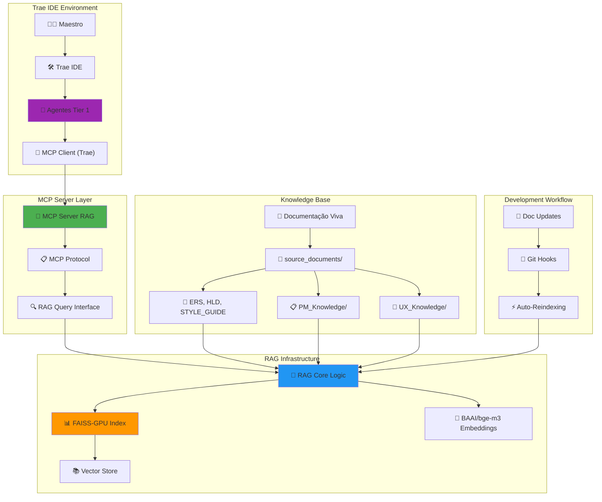
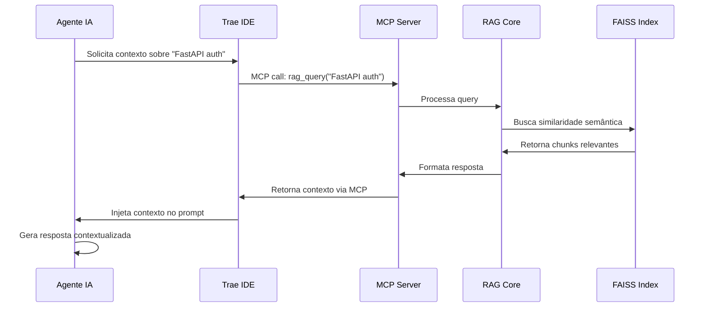
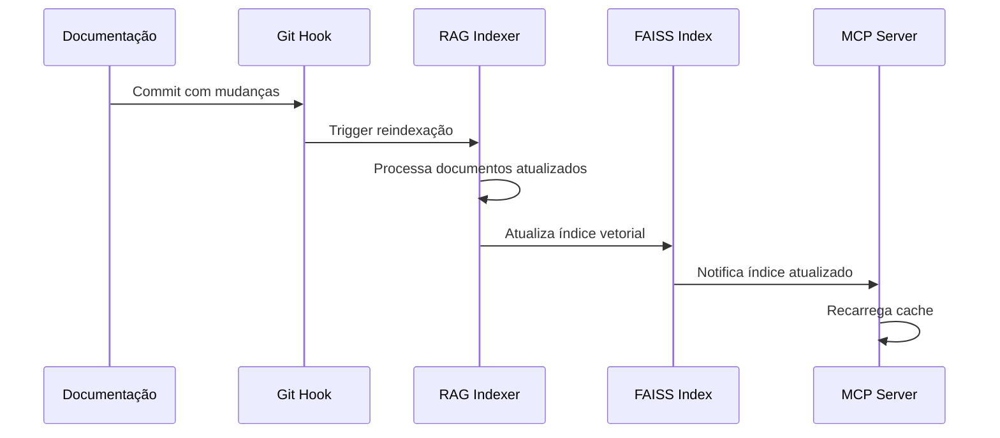

# LLD 001: Especificação da Arquitetura RAG-MCP

**Versão**: 1.0  
**Data de Criação**: Janeiro de 2025  
**Data de Última Atualização**: Janeiro de 2025  
**Autor**: @AgenteM_ArquitetoTI  
**Aprovação**: Maestro Bruno S. Rosa  

**Baseado em**:
- [[docs/03_Arquitetura_e_Design/01_HLD.md]] (v1.1)
- [[docs/00_Gerenciamento_Projeto/10_Maestro_Tasks.md]] (v1.0)
- [[rag_infra/README.md]] (v1.1)
- [[docs/03_Arquitetura_e_Design/02_ADRs/ADR-001_Ferramentas_Core.md]] (v1.1)

---

## 📋 Resumo Executivo

Este documento especifica a arquitetura completa da integração **RAG-MCP** (Retrieval Augmented Generation + Model Context Protocol) para o projeto Recoloca.ai. A solução permite que os Agentes de IA Mentores acessem dinamicamente a "Documentação Viva" do projeto através de um sistema RAG local integrado via MCP Server no Trae IDE.

**Objetivos Principais:**
- Operacionalizar sistema RAG local com FAISS-GPU + BAAI/bge-m3
- Desenvolver MCP Server para integração RAG ↔ Trae IDE
- Configurar acesso contextual para todos os 5 Agentes Tier 1
- Garantir consulta eficiente à base de conhecimento do projeto

---

## 🏗️ Visão Geral da Arquitetura

### Diagrama da Arquitetura RAG-MCP



---

## 🔧 Componentes Técnicos Detalhados

### 1. Sistema RAG Local

#### 1.1 Especificações Técnicas

**Stack Tecnológica:**
- **Linguagem**: Python 3.10
- **Ambiente**: Conda (`rag_env_recolocai`)
- **Framework**: LangChain
- **Vector Store**: FAISS-GPU
- **Embedding Model**: `BAAI/bge-m3` (Sentence Transformers)
- **GPU**: NVIDIA CUDA 12.1+

**Estrutura de Diretórios:**
```
rag_infra/
├── core_logic/
│   ├── __init__.py
│   ├── constants.py
│   ├── data_loader.py
│   ├── embedding_model.py
│   ├── rag_indexer.py
│   ├── rag_retriever.py
│   └── verificar_faiss_gpu.py
├── data_index/
│   └── faiss_index_bge_m3/
├── source_documents/
│   ├── PM_Knowledge/
│   ├── UX_Knowledge/
│   ├── API_Specs_Sumario_para_RAG.md
│   ├── ERS_para_RAG.md
│   ├── GUIA_AVANCADO_para_RAG.md
│   ├── HLD_para_RAG.md
│   └── STYLE_GUIDE_para_RAG.md
├── environment.yml
└── README.md
```

#### 1.2 Módulos Core

**`rag_indexer.py`** - Indexação Principal
```python
# Funcionalidades principais:
- Carregamento de documentos Markdown
- Chunking inteligente (tamanho otimizado)
- Geração de embeddings BAAI/bge-m3
- Criação/atualização índice FAISS-GPU
- Metadados de documentos (fonte, seção, timestamp)
```

**`rag_retriever.py`** - Interface de Consulta
```python
# Funcionalidades principais:
- Carregamento do índice FAISS existente
- Busca por similaridade semântica
- Ranking e filtragem de resultados
- Formatação de contexto para LLMs
- Cache de consultas frequentes
```

**`embedding_model.py`** - Gerenciamento de Embeddings
```python
# Funcionalidades principais:
- Inicialização BAAI/bge-m3
- Otimização GPU/CUDA
- Batch processing para eficiência
- Normalização de vetores
```

### 2. MCP Server para RAG

#### 2.1 Especificação do MCP Server

**Protocolo**: Model Context Protocol (MCP)
**Função**: Bridge entre Trae IDE e Sistema RAG Local
**Linguagem**: Python (compatível com MCP spec)

**Estrutura do MCP Server:**
```
mcp_server_rag/
├── __init__.py
├── server.py          # MCP Server principal
├── rag_interface.py   # Interface com RAG core
├── protocol_handler.py # Handlers MCP
├── config.py          # Configurações
└── requirements.txt
```

#### 2.2 Endpoints MCP

**Tools Disponíveis via MCP:**

1. **`rag_query`**
   - **Descrição**: Consulta semântica à base de conhecimento
   - **Input**: `{"query": "string", "max_results": int, "filter": "optional"}`
   - **Output**: Lista de chunks relevantes com metadados

2. **`rag_search_by_document`**
   - **Descrição**: Busca específica por documento
   - **Input**: `{"document_name": "string", "query": "string"}`
   - **Output**: Chunks do documento específico

3. **`rag_get_document_list`**
   - **Descrição**: Lista documentos indexados
   - **Input**: `{}`
   - **Output**: Lista de documentos com metadados

4. **`rag_reindex`**
   - **Descrição**: Força reindexação da base
   - **Input**: `{"force": boolean}`
   - **Output**: Status da reindexação

#### 2.3 Configuração no Trae IDE

**Arquivo de Configuração MCP:**
```json
{
  "mcpServers": {
    "rag_recoloca": {
      "command": "python",
      "args": ["-m", "mcp_server_rag.server"],
      "cwd": "./rag_infra/",
      "env": {
        "CONDA_DEFAULT_ENV": "rag_env_recolocai"
      }
    }
  }
}
```

### 3. Integração com Agentes Tier 1

#### 3.1 Agentes Configurados

**Lista dos 5 Agentes Tier 1:**
1. **@AgenteM_Orquestrador** - PM Mentor e Coordenação
2. **@AgenteM_ArquitetoTI** - Arquitetura Unificada (HLD+LLD)
3. **@AgenteM_DevFastAPI** - Backend Development
4. **@AgenteM_DevFlutter** - Frontend PWA Development
5. **@AgenteM_DevOps** - Infraestrutura e Deploy

#### 3.2 Padrões de Uso RAG por Agente

**@AgenteM_Orquestrador:**
- Consulta: `PM_Knowledge/` para frameworks e metodologias
- Foco: Validação estratégica e priorização
- Queries típicas: "metodologia MVP", "critérios de priorização"

**@AgenteM_ArquitetoTI:**
- Consulta: `HLD_para_RAG.md`, `ADRs`, especificações técnicas
- Foco: Decisões arquiteturais e padrões
- Queries típicas: "arquitetura FastAPI", "integração Supabase"

**@AgenteM_DevFastAPI:**
- Consulta: `API_Specs_Sumario_para_RAG.md`, `ERS_para_RAG.md`
- Foco: Implementação backend e APIs
- Queries típicas: "endpoints API", "autenticação Supabase"

**@AgenteM_DevFlutter:**
- Consulta: `STYLE_GUIDE_para_RAG.md`, `UX_Knowledge/`
- Foco: Interface e experiência do usuário
- Queries típicas: "componentes UI", "padrões UX"

**@AgenteM_DevOps:**
- Consulta: Documentação de deploy e infraestrutura
- Foco: CI/CD e operações
- Queries típicas: "deploy Vercel", "configuração Render"

---

## ⚙️ Implementação e Configuração

### Fase 1: Setup RAG Local

**Pré-requisitos:**
- NVIDIA GPU com CUDA 12.1+
- Conda/Miniconda instalado
- Git configurado

**Passos de Implementação:**

1. **Configuração do Ambiente**
   ```bash
   cd rag_infra/
   conda env create -f environment.yml
   conda activate rag_env_recolocai
   ```

2. **Verificação GPU**
   ```bash
   python core_logic/verificar_faiss_gpu.py
   ```

3. **Indexação Inicial**
   ```bash
   python core_logic/rag_indexer.py
   ```

4. **Teste de Consulta**
   ```bash
   python core_logic/rag_retriever.py --query "arquitetura FastAPI"
   ```

### Fase 2: Desenvolvimento MCP Server

**Estrutura do Servidor:**

```python
# mcp_server_rag/server.py
import asyncio
from mcp import Server
from .rag_interface import RAGInterface

class RAGMCPServer:
    def __init__(self):
        self.rag = RAGInterface()
        self.server = Server("rag_recoloca")
        self._setup_tools()
    
    def _setup_tools(self):
        @self.server.tool()
        async def rag_query(query: str, max_results: int = 5):
            """Consulta semântica à base de conhecimento"""
            return await self.rag.query(query, max_results)
        
        # Outros tools...
    
    async def run(self):
        await self.server.run()
```

### Fase 3: Configuração Trae IDE

**Configuração MCP no Trae:**

1. **Arquivo de Configuração**
   - Localização: `.trae/mcp_servers.json`
   - Configuração do servidor RAG

2. **Teste de Conectividade**
   - Verificar comunicação MCP
   - Validar tools disponíveis

3. **Configuração dos Agentes**
   - Atualizar prompts com instruções RAG
   - Definir padrões de consulta

---

## 🔄 Fluxo de Operação

### Fluxo de Consulta RAG



### Fluxo de Atualização



---

## 📊 Métricas e Monitoramento

### KPIs do Sistema RAG

**Performance:**
- Tempo de resposta de consulta: < 500ms
- Throughput: > 100 consultas/min
- Uso de GPU: Monitoramento CUDA

**Qualidade:**
- Relevância dos resultados (avaliação manual)
- Cobertura da base de conhecimento
- Precisão das respostas dos agentes

**Operacional:**
- Uptime do MCP Server: > 99%
- Frequência de reindexação
- Tamanho do índice vetorial

### Logs e Debugging

**Estrutura de Logs:**
```
logs/
├── rag_indexer.log
├── rag_retriever.log
├── mcp_server.log
└── performance.log
```

**Níveis de Log:**
- DEBUG: Detalhes de consultas e embeddings
- INFO: Operações normais e estatísticas
- WARNING: Performance degradada
- ERROR: Falhas de sistema

---

## 🚀 Roadmap de Evolução

### Fase 0 (Atual): Fundação
- ✅ Especificação arquitetural
- ⏳ Implementação RAG local
- ⏳ Desenvolvimento MCP Server
- ⏳ Configuração Agentes Tier 1

### Fase 1: Otimização
- Tuning de parâmetros de chunking
- Cache inteligente de consultas
- Métricas de qualidade automatizadas
- Auto-reindexação por Git hooks

### Fase 2: Escalabilidade
- Migração para Vector DB na nuvem (Supabase pgvector)
- API REST para acesso externo
- Integração com sistema de produção
- Multi-tenancy para diferentes projetos

### Fase 3: Inteligência Avançada
- Embeddings híbridos (texto + código)
- Reranking com modelos especializados
- Feedback loop para melhoria contínua
- Integração com ferramentas de análise

---

## 🔒 Considerações de Segurança

### Controle de Acesso
- **MCP Server**: Acesso restrito ao ambiente de desenvolvimento
- **Índice FAISS**: Proteção local, não versionado no Git
- **Documentação Sensível**: Classificação e controle de acesso

### Privacidade
- **Dados Locais**: Todo processamento em ambiente local
- **Sem Telemetria**: Nenhum dado enviado para serviços externos
- **Logs Seguros**: Rotação e limpeza automática

### Backup e Recuperação
- **Índice FAISS**: Backup automático antes de reindexação
- **Configurações**: Versionamento no Git
- **Documentação**: Sincronização com Obsidian

---

## 📚 Referências e Dependências

### Documentação Base
- [[docs/03_Arquitetura_e_Design/01_HLD.md]] - Arquitetura geral
- [[docs/02_Requisitos/01_ERS.md]] - Requisitos funcionais
- [[docs/01_Guias_Centrais/02_GUIA_AVANCADO.md]] - Metodologia
- [[rag_infra/README.md]] - Documentação técnica RAG

### Tecnologias Externas
- **LangChain**: Framework de orquestração RAG
- **FAISS**: Vector database da Meta
- **BAAI/bge-m3**: Modelo de embedding multilíngue
- **MCP Protocol**: Protocolo de contexto para LLMs
- **Sentence Transformers**: Biblioteca de embeddings

### Dependências Python
```yaml
# environment.yml (principais)
name: rag_env_recolocai
dependencies:
  - python=3.10
  - pytorch::pytorch
  - pytorch::torchvision
  - pytorch::torchaudio
  - pytorch::pytorch-cuda=12.1
  - conda-forge::faiss-gpu
  - pip:
    - langchain
    - sentence-transformers
    - pymupdf
    - python-dotenv
    - unstructured
```

---

## ✅ Critérios de Aceitação

### Funcionalidades Mínimas
- [ ] Sistema RAG indexa toda documentação core
- [ ] MCP Server responde a consultas via Trae IDE
- [ ] 5 Agentes Tier 1 acessam contexto RAG
- [ ] Tempo de resposta < 500ms
- [ ] Reindexação automática funcional

### Qualidade
- [ ] Cobertura de testes > 80%
- [ ] Documentação técnica completa
- [ ] Logs estruturados implementados
- [ ] Monitoramento de performance ativo

### Integração
- [ ] Configuração Trae IDE validada
- [ ] Todos os agentes testados com RAG
- [ ] Fluxo de desenvolvimento otimizado
- [ ] Backup e recuperação testados

---

**Status**: 🔄 Em Implementação  
**Próxima Revisão**: Após conclusão Fase 0  
**Responsável**: @AgenteM_ArquitetoTI + Maestro  

--- FIM DO DOCUMENTO LLD_001_Arquitetura_RAG_MCP.md (v1.0) ---