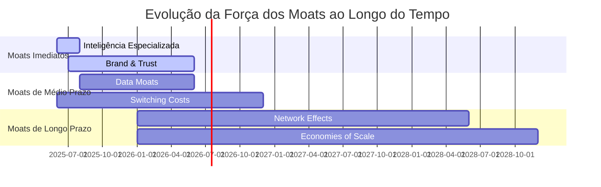

# Vantagens Competitivas Sustentáveis (Moats) - Recoloca.ai

## 1. Visão Geral dos Moats

### 1.1 Definição e Importância

Os "moats" (fossos econômicos) são vantagens competitivas sustentáveis que protegem a posição de mercado de uma empresa contra a concorrência. Para o **Recoloca.ai**, identificamos cinco tipos principais de moats, cada um com diferentes **cronogramas de construção** e **intensidade ao longo do tempo**.

### 1.2 Cronograma de Força dos Moats

## 2. Análise Detalhada dos Cinco Moats

### 2.1 Inteligência Especializada (Força Imediata - Alta)

**Descrição:** Expertise técnica específica em IA para recolocação profissional no mercado brasileiro de TI.

**Por que é forte desde o início:**
- Conhecimento especializado do Maestro em IA e mercado de TI
- Algoritmos proprietários de matching e otimização de CV
- Compreensão profunda das necessidades específicas do mercado brasileiro

**Estratégias de Construção:**
- Desenvolvimento contínuo de algoritmos de IA especializados
- Criação de datasets proprietários sobre o mercado brasileiro de TI
- Parcerias estratégicas com empresas de tecnologia
- Publicação de conteúdo técnico e thought leadership

**Métricas de Acompanhamento:**
- Taxa de sucesso em recolocações vs. concorrentes
- Qualidade dos matches (feedback dos usuários)
- Tempo médio para recolocação
- NPS específico para funcionalidades de IA

### 2.2 Brand & Trust (Força Crescente - Médio/Alto)

**Descrição:** Construção de uma marca confiável e reconhecida no mercado de recolocação profissional.

**Estratégias de Construção:**
- Transparência total nos processos de IA (explicabilidade)
- Casos de sucesso documentados e publicados
- Programa de embaixadores (profissionais recolocados com sucesso)
- Certificações e compliance (LGPD, ISO)
- Conteúdo educacional de alta qualidade

**Métricas de Acompanhamento:**
- Net Promoter Score (NPS)
- Brand awareness (pesquisas de mercado)
- Share of voice em mídias sociais
- Taxa de indicações orgânicas
- Tempo de permanência no site/app

### 2.3 Data Moats (Força Crescente - Médio Prazo)

**Descrição:** Acúmulo de dados proprietários que melhoram continuamente os algoritmos e criam barreiras de entrada.

**Tipos de Dados Proprietários:**
- Histórico de recolocações bem-sucedidas
- Padrões de comportamento de recrutadores
- Tendências salariais por região/tecnologia
- Feedback detalhado sobre matches
- Dados de performance de CVs otimizados

**Estratégias de Construção:**
- Implementação de loops de feedback contínuo
- Gamificação para incentivar compartilhamento de dados
- Parcerias com empresas para dados de vagas
- Análise preditiva de tendências de mercado

**Métricas de Acompanhamento:**
- Volume de dados coletados (GB/mês)
- Qualidade dos dados (completude, precisão)
- Melhoria contínua dos algoritmos (A/B tests)
- Tempo de treinamento de novos modelos

### 2.4 Switching Costs (Força Crescente - Médio Prazo)

**Descrição:** Custos (tempo, esforço, risco) associados à mudança para um concorrente.

**Componentes dos Switching Costs:**
- **Dados Pessoais:** CV otimizado, histórico de aplicações, preferências
- **Relacionamentos:** Conexões com recrutadores, network profissional
- **Aprendizado:** Familiaridade com a plataforma, workflows personalizados
- **Integração:** Conexões com LinkedIn, GitHub, outras ferramentas

**Estratégias de Construção:**
- Criação de perfis ricos e personalizados
- Sistema de reputação interno
- Integração profunda com ferramentas do ecossistema
- Funcionalidades exclusivas baseadas no histórico do usuário

**Métricas de Acompanhamento:**
- Taxa de churn mensal
- Tempo médio de uso da plataforma
- Número de integrações ativas por usuário
- Frequência de uso de funcionalidades avançadas

### 2.5 Network Effects (Força Futura - Longo Prazo) ⭐

**Descrição:** O valor da plataforma aumenta exponencialmente com cada novo usuário (profissionais e recrutadores).

**Por que precisa de escala:**
- Requer massa crítica de profissionais para atrair recrutadores
- Necessita volume de vagas para atrair mais profissionais
- Efeito viral só funciona com base de usuários significativa

**Tipos de Network Effects:**
- **Bilateral:** Mais profissionais atraem mais recrutadores e vice-versa
- **Comunidade:** Profissionais se ajudam mutuamente (mentoria, dicas)
- **Dados:** Mais usuários = melhores algoritmos = melhor experiência para todos

**Estratégias de Construção:**
- Funcionalidades de comunidade e networking
- Sistema de mentoria peer-to-peer
- Gamificação para incentivar participação
- Eventos e webinars exclusivos
- Programa de indicações robusto

**Marcos de Escala Necessários:**
- **Fase 1 (2025):** 1.000+ profissionais ativos
- **Fase 2 (2026):** 5.000+ profissionais, 100+ empresas
- **Fase 3 (2027):** 15.000+ profissionais, 500+ empresas

**Métricas de Acompanhamento:**
- Número de conexões/interações por usuário
- Taxa de crescimento orgânico (viral coefficient)
- Tempo de resposta médio de recrutadores
- Número de vagas exclusivas na plataforma

### 2.6 Economies of Scale (Força Futura - Longo Prazo) ⭐

**Descrição:** Redução do custo unitário conforme o volume de usuários aumenta.

**Por que precisa de escala:**
- Custos de IA (API calls) se diluem com mais usuários
- Desenvolvimento de funcionalidades se amortiza
- Poder de negociação com fornecedores aumenta

**Áreas de Economia de Escala:**
- **Custos de IA:** Custo por otimização de CV diminui com volume
- **Infraestrutura:** Custos fixos de servidores diluídos
- **Desenvolvimento:** Novas funcionalidades beneficiam toda a base
- **Marketing:** CAC diminui com brand recognition e indicações
- **Parcerias:** Melhores condições com fornecedores

**Estratégias de Construção:**
- Otimização contínua de custos operacionais
- Automação máxima de processos
- Negociação de contratos escalonáveis
- Desenvolvimento de funcionalidades escaláveis

**Marcos de Economia:**
- **Fase 1:** Break-even operacional
- **Fase 2:** Margem bruta > 70%
- **Fase 3:** Margem operacional > 25%

**Métricas de Acompanhamento:**
- Custo por usuário ativo (CPU)
- Margem bruta por usuário
- Custo de aquisição de cliente (CAC)
- Lifetime Value (LTV)
- Eficiência operacional (receita/funcionário)

## 3. Roadmap de Construção dos Moats

### 3.1 Fase 1: Fundação (2025 Q1-Q2)
**Foco:** Inteligência Especializada + Brand & Trust

**Prioridades:**
1. Desenvolver algoritmos de IA diferenciados
2. Criar casos de sucesso iniciais
3. Estabelecer transparência e confiança
4. Iniciar coleta de dados proprietários

### 3.2 Fase 2: Crescimento (2025 Q3-2026 Q2)
**Foco:** Data Moats + Switching Costs

**Prioridades:**
1. Acelerar coleta e análise de dados
2. Desenvolver funcionalidades que aumentem switching costs
3. Expandir integrações e personalizações
4. Preparar infraestrutura para network effects

### 3.3 Fase 3: Escala (2026 Q3+)
**Foco:** Network Effects + Economies of Scale

**Prioridades:**
1. Atingir massa crítica para network effects
2. Otimizar custos operacionais
3. Expandir para novos segmentos/regiões
4. Consolidar posição de liderança

## 4. Estratégias de Defesa Competitiva

### 4.1 Contra Novos Entrantes
- **Barreira de Dados:** Vantagem de first-mover em dados proprietários
- **Barreira de Marca:** Investimento contínuo em brand building
- **Barreira Técnica:** Complexidade dos algoritmos de IA

### 4.2 Contra Incumbentes (LinkedIn, Catho, etc.)
- **Especialização:** Foco específico em profissionais de TI
- **Inovação:** Funcionalidades de IA avançadas
- **Agilidade:** Capacidade de adaptação rápida

### 4.3 Contra Disruptores
- **Relacionamentos:** Network effects como barreira
- **Dados:** Vantagem competitiva em qualidade de matching
- **Integração:** Switching costs elevados

## 5. Cenários Competitivos e Contingências

### 5.1 Cenário: Entrada de Big Tech
**Probabilidade:** Média (após validação do mercado)

**Estratégias de Defesa:**
- Acelerar construção de network effects
- Focar em nichos específicos (especialização)
- Parcerias estratégicas com players locais
- Inovação contínua em IA especializada

### 5.2 Cenário: Guerra de Preços
**Probabilidade:** Alta (fase de crescimento)

**Estratégias de Defesa:**
- Diferenciação por valor, não por preço
- Foco em ROI demonstrável
- Modelo freemium para capturar usuários
- Economies of scale para sustentar margens

### 5.3 Cenário: Mudança Regulatória
**Probabilidade:** Média (LGPD, IA)

**Estratégias de Defesa:**
- Compliance proativo
- Transparência como diferencial
- Participação em discussões regulatórias
- Flexibilidade arquitetural

## 6. Métricas Consolidadas de Moats

### 6.1 Dashboard de Moats (Atualização Mensal)

| Moat | Métrica Principal | Meta 2025 | Meta 2026 | Meta 2027 |
|------|------------------|-----------|-----------|----------|
| Inteligência Especializada | Taxa de Sucesso Recolocação | 75% | 85% | 90% |
| Brand & Trust | NPS | 50+ | 70+ | 80+ |
| Data Moats | Volume Dados (GB/mês) | 10 | 100 | 500 |
| Switching Costs | Taxa Churn Mensal | <5% | <3% | <2% |
| Network Effects | Usuários Ativos | 1K | 5K | 15K |
| Economies of Scale | Margem Bruta | 50% | 70% | 80% |

### 6.2 Indicadores de Alerta

**Sinais de Enfraquecimento dos Moats:**
- Queda na taxa de sucesso de recolocações
- Aumento do churn rate
- Redução no NPS
- Estagnação no crescimento de usuários
- Compressão de margens

**Ações Corretivas:**
- Revisão da estratégia de produto
- Investimento adicional em P&D
- Campanhas de retenção
- Análise competitiva aprofundada

## 7. Integração com Outros Documentos Estratégicos

### 7.1 Alinhamento com Go-to-Market
- As estratégias de moats devem ser comunicadas no [[docs/08_Marketing_e_Vendas/ESTRATEGIA_GO_TO_MARKET.md]]
- Mensagens de diferenciação baseadas nos moats mais fortes em cada fase

### 7.2 Validação de Premissas
- Hipóteses sobre moats devem ser testadas no [[docs/01_Guias_Centrais/PLANO_VALIDACAO_PREMISSAS_NEGOCIO.md]]
- Métricas de moats incluídas nos experimentos de validação

### 7.3 Métricas de Sucesso
- KPIs de moats integrados ao [[docs/07_Metricas_e_Analytics/METRICAS_SUCESSO_BASE_MERCADO.md]]
- Benchmarking contínuo contra concorrentes

## 8. Próximos Passos e Responsabilidades

### 8.1 Ações Imediatas (Próximas 4 semanas)
1. **Maestro:** Revisar e validar estratégias de moats
2. **@AgenteOrquestrador:** Integrar métricas de moats no sistema de acompanhamento
3. **Equipe de Produto:** Priorizar funcionalidades que fortalecem switching costs
4. **Marketing:** Desenvolver mensagens baseadas em inteligência especializada

### 8.2 Revisões Periódicas
- **Mensal:** Análise de métricas de moats
- **Trimestral:** Revisão de estratégias competitivas
- **Semestral:** Atualização do roadmap de moats
- **Anual:** Revisão completa do documento

---

## Conclusão

A construção de **vantagens competitivas sustentáveis** para o Recoloca.ai segue uma **progressão temporal estratégica**. Começamos com moats que podemos construir imediatamente (**Inteligência Especializada** e **Brand & Trust**), evoluímos para aqueles que requerem dados e tempo (**Data Moats** e **Switching Costs**), e culminamos com os mais poderosos que dependem de escala significativa (**Network Effects** e **Economies of Scale**).

O reconhecimento de que **Network Effects** e **Economies of Scale** são moats de **força futura** é crucial para o planejamento estratégico. Eles representam o **potencial de longo prazo** da plataforma, mas requerem **paciência, execução consistente e crescimento sustentado** para se materializarem.

A chave do sucesso está em **executar excelentemente os moats imediatos** enquanto **preparamos sistematicamente o terreno** para os moats de longo prazo que, uma vez estabelecidos, criarão barreiras competitivas quase intransponíveis.

---

**Referências Cruzadas:**
- [[docs/01_Guias_Centrais/PLANO_MESTRE_RECOLOCA_AI.md]] - Visão estratégica geral
- [[docs/08_Marketing_e_Vendas/ESTRATEGIA_GO_TO_MARKET.md]] - Execução de mercado
- [[docs/07_Metricas_e_Analytics/METRICAS_SUCESSO_BASE_MERCADO.md]] - Acompanhamento de performance
- [[docs/01_Guias_Centrais/PLANO_VALIDACAO_PREMISSAS_NEGOCIO.md]] - Validação de hipóteses

--- FIM DO DOCUMENTO VANTAGENS_COMPETITIVAS_SUSTENTAVEIS.md (v1.0) ---