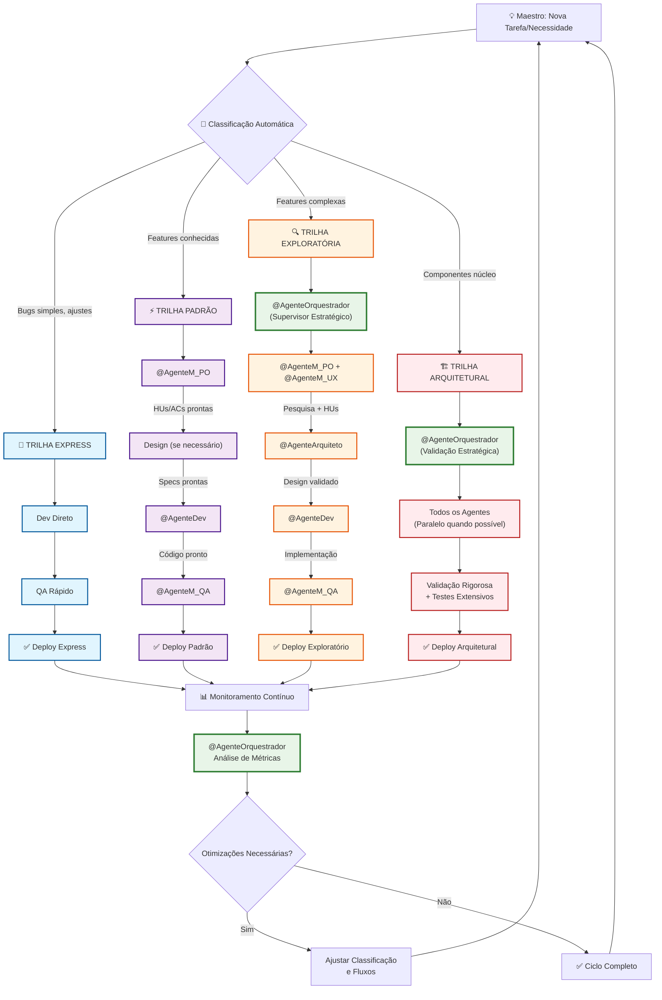

# FLUXO DE TRABALHO GERAL DO PROJETO RECOLOCA.AI

**Versão**: 2.0

**Data de Criação**: 30 de maio de 2025

**Data de Última Atualização**: 06 de junho de 2025 (Fluxo Adaptativo por Contexto)

Baseado em: [[docs/01_Guias_Centrais/PLANO_MESTRE_RECOLOCA_AI.md]] (v1.4) e [[docs/01_Guias_Centrais/GUIA_AVANCADO.md]] (v2.2)

**Principais Mudanças v2.0:**
- Introdução do **Desenvolvimento Adaptativo por Contexto**
- Sistema de **Entregáveis como Gatilhos de Fluxo**
- Evolução do papel do `@AgenteOrquestrador` para **Supervisor Estratégico**
- **Paralelização inteligente** e **feedback loops** contínuos
## 1. Introdução

Este documento descreve o **fluxo de trabalho adaptativo** para o desenvolvimento de funcionalidades e iterações no projeto Recoloca.ai. A versão 2.0 introduz o conceito de **"Desenvolvimento Adaptativo por Contexto"**, que supera as limitações do fluxo sequencial tradicional através de:

- **Classificação dinâmica** por complexidade e risco
- **Paralelização inteligente** de tarefas independentes
- **Entregáveis como gatilhos** para ativação automática de agentes
- **Feedback loops contínuos** para otimização
- **Orquestração sob demanda** com o `@AgenteOrquestrador` atuando como Supervisor Estratégico

O objetivo é maximizar a **eficiência**, **qualidade** e **velocidade de entrega**, adaptando o processo dinamicamente ao contexto de cada tarefa.
## 2. Visão Geral: Trilhas Adaptativas por Contexto

### 2.1. Classificação Automática de Tarefas

Cada tarefa é automaticamente classificada em uma das **quatro trilhas adaptativas**:

| **Trilha** | **Critérios** | **Tempo Estimado** | **Agentes Principais** |
|------------|---------------|-------------------|------------------------|
| **🚀 Express** | Bugs simples, ajustes menores, correções de texto/estilo | 30min - 2h | Dev direto + QA rápido |
| **⚡ Padrão** | Features conhecidas, padrões estabelecidos, baixo risco | 2h - 1 dia | PO → Design → Dev → QA |
| **🔍 Exploratória** | Features complexas, alta incerteza, necessita pesquisa | 1-3 dias | PO → UX → Arq → Dev → QA |
| **🏗️ Arquitetural** | Componentes de núcleo, mudanças estruturais, alto impacto | 3-7 dias | Todos os agentes + validação rigorosa |

### 2.2. Princípios do Fluxo Adaptativo

1. **Paralelização Inteligente**: Agentes trabalham em paralelo quando possível
2. **Entregáveis como Gatilhos**: Outputs estruturados ativam automaticamente o próximo agente
3. **Feedback Loops Rápidos**: Validação contínua em cada etapa
4. **Orquestração Sob Demanda**: `@AgenteOrquestrador` atua apenas quando necessário
5. **Aprendizado Contínuo**: Sistema se otimiza baseado em resultados

## 3. Diagrama do Fluxo Adaptativo (Mermaid.js)



## 4. Sistema de Entregáveis como Gatilhos

### 4.1. Estrutura Padronizada de Entregáveis

Cada agente produz **entregáveis estruturados** que servem como **gatilhos automáticos** para o próximo agente:

```yaml
# Exemplo: Entregável do @AgenteM_PO
metadata:
  agente_origem: "@AgenteM_PO"
  timestamp: "2025-06-06T10:30:00Z"
  versao: "1.0"
  status: "COMPLETO"
  proximos_gatilhos: ["@AgenteM_ArquitetoHLD", "@AgenteM_UXDesigner"]
  
conteudo:
  historias_usuario: [...]
  criterios_aceite: [...]
  definicao_pronto: [...]
  
criterios_completude:
  - todas_hus_validadas: true
  - criterios_mensuráveis: true
  - alinhamento_ers: true
  
gatilhos_automaticos:
  - condicao: "status == COMPLETO AND criterios_completude.all()"
    acao: "ativar_agentes(proximos_gatilhos)"
```

### 4.2. Mapeamento de Entregáveis por Agente

| **Agente** | **Entregáveis Principais** | **Gatilhos para** |
|------------|---------------------------|-------------------|
| `@AgenteM_PO` | HUs, ACs, DoR/DoD | Arquiteto HLD, UX Designer |
| `@AgenteM_ArquitetoHLD` | HLD, Diagramas, ADRs | Arquiteto LLD, API Designer |
| `@AgenteM_UXDesigner` | User Flows, Wireframes | UI Designer |
| `@AgenteM_ArquitetoLLD` | LLDs, Componentes | Dev FastAPI, Dev Flutter |
| `@AgenteM_APIDesigner` | OpenAPI Specs | Dev FastAPI |
| `@AgenteM_UIDesigner` | Mockups, Style Guide | Dev Flutter |
| `@AgenteM_DevFastAPI` | Código Backend, Testes | QA |
| `@AgenteM_DevFlutter` | Código Frontend, Widgets | QA |
| `@AgenteM_QA` | Casos de Teste, Relatórios | Documentação |

### 4.3. Fluxos Automatizados Principais

#### 🔄 **Fluxo 1: Feature Completa**
```
@AgenteM_PO → @AgenteM_ArquitetoHLD → @AgenteM_ArquitetoLLD → @AgenteM_DevFastAPI
                ↓                                              ↓
            @AgenteM_UXDesigner → @AgenteM_UIDesigner → @AgenteM_DevFlutter
                                                              ↓
                                                        @AgenteM_QA
```

#### ⚡ **Fluxo 2: Ajuste de UI**
```
@AgenteM_UIDesigner → @AgenteM_DevFlutter → @AgenteM_QA
```

#### 🏗️ **Fluxo 3: Componente de Núcleo**
```
@AgenteOrquestrador → @AgenteM_PO → @AgenteM_ArquitetoHLD → Todos os Agentes → Validação Rigorosa
```

## 5. Evolução do Papel do @AgenteOrquestrador

### 5.1. De "PM Mentor" para "Supervisor Estratégico"

**Antes (v1.0):**
- Participação em **todas** as etapas
- Orquestração **manual** constante
- Overhead significativo em tarefas simples

**Agora (v2.0):**
- Atuação **sob demanda** baseada em contexto
- Foco em **exceções** e **decisões estratégicas**
- **Monitoramento** contínuo de métricas
- **Otimização** de fluxos baseada em dados

### 5.2. Critérios de Ativação do @AgenteOrquestrador

| **Situação** | **Ativação** | **Papel** |
|--------------|--------------|----------|
| Trilha Express/Padrão | ❌ Não | Monitoramento passivo |
| Trilha Exploratória | ⚠️ Condicional | Validação estratégica inicial |
| Trilha Arquitetural | ✅ Sempre | Supervisão completa |
| Exceções/Bloqueios | ✅ Automática | Resolução de problemas |
| Métricas fora do padrão | ✅ Automática | Análise e otimização |

## 6. Descrição Detalhada das Trilhas

### 6.1. 🚀 Trilha Express (30min - 2h)

**Critérios de Classificação:**
- Bugs simples com causa conhecida
- Ajustes de texto, estilo ou configuração
- Correções de documentação
- Mudanças cosméticas de UI

**Fluxo Otimizado:**
1. **Maestro** identifica e classifica automaticamente
2. **Implementação direta** sem design prévio
3. **QA rápido** com testes básicos
4. **Deploy imediato** em ambiente de teste

**Agentes Envolvidos:** Mínimo necessário (geralmente só Dev + QA)

### 6.2. ⚡ Trilha Padrão (2h - 1 dia)

**Critérios de Classificação:**
- Features com padrões estabelecidos
- Baixo risco técnico e de negócio
- Requisitos claros e bem definidos
- Não afeta componentes de núcleo

**Fluxo Estruturado:**
1. **@AgenteM_PO** → HUs e ACs estruturadas
2. **Design condicional** (se necessário)
3. **Desenvolvimento** seguindo padrões
4. **QA padrão** com casos de teste
5. **Deploy automatizado**

**Paralelização:** Design e desenvolvimento podem ocorrer em paralelo quando aplicável

### 6.3. 🔍 Trilha Exploratória (1-3 dias)

**Critérios de Classificação:**
- Features complexas ou inovadoras
- Alta incerteza técnica ou de UX
- Necessita pesquisa ou prototipação
- Impacto significativo na experiência do usuário

**Fluxo Investigativo:**
1. **@AgenteOrquestrador** → Validação estratégica
2. **@AgenteM_PO + @AgenteM_UX** → Pesquisa e definição
3. **@AgenteM_Arquiteto** → Design técnico
4. **Prototipação** e validação
5. **Desenvolvimento** iterativo
6. **QA extensivo** com múltiplos cenários

**Feedback Loops:** Validação contínua em cada etapa

### 6.4. 🏗️ Trilha Arquitetural (3-7 dias)

**Critérios de Classificação:**
- Componentes de núcleo do sistema
- Mudanças estruturais significativas
- Alto impacto em múltiplos módulos
- Decisões arquiteturais críticas

**Fluxo Rigoroso:**
1. **@AgenteOrquestrador** → Supervisão estratégica completa
2. **Todos os agentes** envolvidos conforme necessário
3. **Validação rigorosa** em cada etapa
4. **Testes extensivos** incluindo integração
5. **Deploy gradual** com monitoramento intensivo

**Governança:** ADRs obrigatórias, revisão de código rigorosa

## 7. Métricas e Otimização Contínua

### 7.1. KPIs por Trilha

| **Trilha** | **Métricas Principais** | **Targets** |
|------------|------------------------|-------------|
| Express | Tempo de resolução, Taxa de regressão | <2h, <5% |
| Padrão | Velocidade, Qualidade, Satisfação | <1 dia, >95%, >4.0 |
| Exploratória | Inovação, Aprendizado, Valor entregue | Qualitativo |
| Arquitetural | Robustez, Escalabilidade, Manutenibilidade | Longo prazo |

### 7.2. Feedback Loops de Otimização

1. **Coleta automática** de métricas de cada trilha
2. **Análise semanal** pelo @AgenteOrquestrador
3. **Ajustes nos critérios** de classificação
4. **Otimização dos fluxos** baseada em dados
5. **Evolução contínua** do sistema

## 8. Implementação Gradual

### Fase 1: Padronização de Entregáveis (Semana 1-2)
- Definir templates estruturados para cada agente
- Implementar metadados e critérios de completude
- Testar com trilha Express

### Fase 2: Fluxos Simples (Semana 3-4)
- Implementar trilhas Express e Padrão
- Automatizar gatilhos básicos
- Monitorar métricas iniciais

### Fase 3: Fluxos Complexos (Semana 5-6)
- Implementar trilhas Exploratória e Arquitetural
- Refinar papel do @AgenteOrquestrador
- Otimizar paralelização

### Fase 4: Otimização e IA (Semana 7+)
- Machine learning para classificação automática
- Predição de gargalos
- Otimização contínua baseada em dados

## 9. Benefícios Estratégicos Esperados

### 9.1. Eficiência Operacional
- **Redução de 40-60%** no tempo de tarefas simples
- **Paralelização** de até 70% das atividades independentes
- **Eliminação** de overhead desnecessário

### 9.2. Qualidade e Consistência
- **Padronização** de entregáveis e processos
- **Rastreabilidade** completa de decisões
- **Feedback loops** para melhoria contínua

### 9.3. Escalabilidade
- **Adaptação automática** à complexidade
- **Aprendizado** baseado em histórico
- **Evolução** contínua do sistema

## 10. Fluxo Legado (v1.0) - Mantido para Referência
    
### 10.1. Fluxo Sequencial Original

1. **Identificação da Ideia/Necessidade (Maestro)**
2. **Validação Estratégica (Maestro + @AgenteOrquestrador)**
3. **Geração/Refinamento de HUs e ACs (Maestro + @AgenteOrquestrador + @AgenteM_PO)**
4. **Design (Maestro + @AgenteOrquestrador + Agentes de Design)**
5. **Desenvolvimento (Maestro + @AgenteOrquestrador + Agentes Dev)**
6. **Revisão HITL e Implementação Manual (Maestro)**
7. **Garantia de Qualidade (Maestro + @AgenteM_QA)**
8. **Documentação Contínua (Maestro + @AgenteM_Documentacao)**
9. **Deploy (Maestro + @AgenteM_DevOps / Pipedream)**
10. **Monitoramento e Iteração (Maestro + @AgenteOrquestrador)**

### 10.2. Limitações Identificadas (v1.0)

- **Sequencialidade excessiva** causando gargalos
- **Overhead de orquestração** em tarefas simples
- **Falta de paralelização** de atividades independentes
- **Ausência de feedback loops** rápidos
- **Rigidez na classificação** de tarefas

### 10.3. Evolução para v2.0

O fluxo v2.0 mantém a **robustez** do processo original enquanto adiciona:
- **Adaptabilidade** baseada em contexto
- **Eficiência** através de paralelização
- **Automação** de gatilhos entre agentes
- **Otimização** contínua baseada em dados

## 11. Próximos Passos

### 11.1. Ações Imediatas
1. **Validar** a proposta com o Maestro
2. **Definir** templates de entregáveis estruturados
3. **Implementar** classificação automática de tarefas
4. **Testar** trilha Express com tarefas simples

### 11.2. Questões para Reflexão
1. Quais **métricas específicas** devemos priorizar para cada trilha?
2. Como **balancear automação** com controle humano?
3. Que **ferramentas adicionais** podem apoiar a implementação?
4. Como **treinar o sistema** para classificação mais precisa?

### 11.3. Documentos Relacionados
- [[docs/01_Guias_Centrais/PLANO_MESTRE_RECOLOCA_AI.md]] - Objetivos estratégicos
- [[docs/04_Agentes_IA/AGENTES_IA_MENTORES_OVERVIEW.md]] - Capacidades dos agentes
- [[docs/05_Prompts/01_Templates_Base/]] - Templates de prompts
- [[docs/00_Gerenciamento_Projeto/KANBAN_INTERNO_PROJETO.md]] - Priorização atual

---

**FIM DO DOCUMENTO FLUXO_TRABALHO_GERAL.md (v2.0)**

*"A eficiência não está em fazer as coisas mais rápido, mas em fazer as coisas certas da forma mais inteligente."*