# FLUXO DE TRABALHO GERAL DO PROJETO RECOLOCA.AI

**Versão**: 1.0

**Data de Criação**: 30 de maio de 2025

**Data de Última Atualização**: 30 de maio de 2025 (Mermaid Corrigido)

Baseado em: [[docs/01_Guias_Centrais/PLANO_MESTRE_RECOLOCA_AI.md]] (v1.4) e [[docs/01_Guias_Centrais/GUIA_AVANCADO.md]] (v2.2)
## 1. Introdução

Este documento descreve o fluxo de trabalho geral para o desenvolvimento de funcionalidades e iterações no projeto Recoloca.ai. Ele ilustra a colaboração entre o "Maestro" (desenvolvedor solo) e os diversos Agentes de IA Mentores, enfatizando o ciclo de vida ágil adaptado e o papel central do `@AgenteOrquestrador` como PM Mentor.

O objetivo é fornecer uma visão clara do processo, desde a identificação de uma necessidade até a entrega de valor ao usuário e a subsequente iteração.
## 2. Diagrama do Fluxo de Trabalho (Mermaid.js)

```mermaid
graph TD
    A["💡 Maestro: Identifica Ideia/Necessidade <br> ou Item do Backlog no Kanban"] --> B{🎯 Validação Estratégica?};

    B -- Sim --> C["Maestro + @AgenteOrquestrador (PM Mentor):<br>1. Alinhar com Objetivos do Plano Mestre<br>2. Definir Problema do Usuário e UVP<br>3. Considerar Métricas/KPIs<br>4. Análise de Riscos e Priorização (RICE, etc.)<br>5. Consultar RAG (PM Knowledge e Docs do Projeto)"];
    B -- Não (Tarefa Tática Clara) --> D_PO;

    C --> D_PO["Maestro + @AgenteOrquestrador + @AgenteMentorPO:<br>Gerar/Refinar HUs e ACs <br> (docs HU_AC) <br>a partir da ERS"];

    D_PO --> E{📐 Design Necessário?};
    E -- Sim --> F["Maestro + @AgenteOrquestrador + Agentes de Design:<br>(HLD/LLD/API, UI/UX)<br>Criar/Refinar HLD, LLDs, API Specs, Style Guide, Mockups"];
    E -- Não (Implementação Direta) --> G;

    F --> G["Maestro + @AgenteOrquestrador + Agentes Dev:<br>(FastAPI, Flutter)<br>Gerar Código Conforme Especificações"];

    G --> H["Maestro (HITL):<br>1. Revisar Código e Design<br>2. Depurar e Refatorar<br>3. Implementar Partes Críticas/Manuais"];

    H --> I{✅ Qualidade OK?};
    I -- Sim --> J;
    I -- Não (Necessita Ajustes) --> G;

    J["Maestro + @AgenteMentorQA:<br>1. Gerar/Executar Casos de Teste<br>2. Validar Critérios de Aceite"];

    J --> K{🧪 Testes OK?};
    K -- Sim --> L;
    K -- Não (Bugs Encontrados) --> H;

    L["Maestro + @AgenteMentorDocumentacao:<br>1. Gerar/Atualizar Docstrings e Comentários<br>2. Atualizar &quot;Documentação Viva&quot; (ERS, LLDs, etc.)<br>3. Curar Base RAG"];

    L --> M["Maestro + @AgenteMentorDevOps (Pipedream):<br>1. Integrar Código (CI)<br>2. Realizar Deploy (CD) em Ambiente de Testes/Produção"];

    M --> N["🚀 Funcionalidade em Produção/Teste"];

    N --> O["Maestro + @AgenteOrquestrador:<br>1. Monitorar Métricas de Uso e KPIs<br>2. Coletar Feedback do Usuário (Pós-MVP)<br>3. Analisar Resultados e Identificar Melhorias"];

    O --> A;

    subgraph Legenda dos Agentes Principais
        direction LR
        AgenteO["@AgenteOrquestrador (PM Mentor)"]
        AgentePO["@AgenteMentorPO"]
        AgenteDesign["Agentes de Design (HLD, LLD, API, UI/UX)"]
        AgenteDev["Agentes de Desenvolvimento (FastAPI, Flutter)"]
        AgenteQA["@AgenteMentorQA"]
        AgenteDoc["@AgenteMentorDocumentacao"]
        AgenteDevOps["@AgenteMentorDevOps (Conceitual/Pipedream)"]
    end

    style A fill:#DAF7A6,stroke:#333,stroke-width:2px
    style B fill:#FFC300,stroke:#333,stroke-width:2px
    style C fill:#C70039,stroke:#FFF,stroke-width:2px,color:#FFF
    style D_PO fill:#900C3F,stroke:#FFF,stroke-width:2px,color:#FFF
    style E fill:#FFC300,stroke:#333,stroke-width:2px
    style F fill:#581845,stroke:#FFF,stroke-width:2px,color:#FFF
    style G fill:#581845,stroke:#FFF,stroke-width:2px,color:#FFF
    style H fill:#DAF7A6,stroke:#333,stroke-width:2px
    style I fill:#FFC300,stroke:#333,stroke-width:2px
    style J fill:#900C3F,stroke:#FFF,stroke-width:2px,color:#FFF
    style K fill:#FFC300,stroke:#333,stroke-width:2px
    style L fill:#C70039,stroke:#FFF,stroke-width:2px,color:#FFF
    style M fill:#581845,stroke:#FFF,stroke-width:2px,color:#FFF
    style N fill:#2ECC71,stroke:#333,stroke-width:2px
    style O fill:#DAF7A6,stroke:#333,stroke-width:2px

```

## 3. Descrição das Etapas do Fluxo

1. **Identificação da Ideia/Necessidade (Maestro):** O ciclo inicia com o Maestro identificando uma nova funcionalidade, uma melhoria, uma correção de bug, ou selecionando um item prioritário do backlog no Kanban ([[docs/00_Gerenciamento_Projeto/KANBAN_Recoloca_AI.md]]).
    
2. **Validação Estratégica (Maestro + `@AgenteOrquestrador`):**
    
    - Se a ideia/necessidade tem um impacto estratégico significativo ou não está claramente definida, o Maestro colabora com o `@AgenteOrquestrador` (atuando como PM Mentor).
        
    - Nesta fase, são discutidos: alinhamento com os objetivos do Plano Mestre (`[[docs/01_Guias_Centrais/PLANO_MESTRE_RECOLOCA_AI.md]]`), o problema do usuário que está sendo resolvido, a Proposta Única de Valor (UVP), métricas de sucesso (KPIs), análise de riscos e priorização (utilizando frameworks como RICE, se aplicável). O `@AgenteOrquestrador` consulta o RAG (incluindo materiais de PM (`[[knowledge_base_rag/PM_Knowledge/]]`) e a documentação do projeto) para embasar a discussão.
        
    - Se a tarefa é mais tática e já bem definida (ex: um bug claro), pode-se pular para a fase de HUs/ACs.
        
3. **Geração/Refinamento de HUs e ACs (Maestro + `@AgenteOrquestrador` + `@AgenteMentorPO`):**
    
    - Com a estratégia validada (se aplicável), o `@AgenteMentorPO` é acionado, com o apoio do `@AgenteOrquestrador` para garantir que o contexto estratégico seja transmitido.
        
    - São geradas ou refinadas as Histórias de Usuário (HUs) e os Critérios de Aceite (ACs) na pasta `[[docs/02_Requisitos/HU_AC/]]`, com base na Especificação de Requisitos de Software (`[[docs/02_Requisitos/ERS.md]]`). O Maestro valida o resultado.
        
4. **Design (Maestro + `@AgenteOrquestrador` + Agentes de Design):**
    
    - Se a funcionalidade requer design (arquitetural, de API, de UI/UX), os Agentes de Design relevantes (`@AgenteMentorArquitetoHLD/LLD/API`, `@AgenteMentorUIDesign`, `@AgenteMentorUX`) são envolvidos.
        
    - O `@AgenteOrquestrador` facilita a passagem de contexto (HUs/ACs, estratégia).
        
    - São criados artefatos como HLD, LLDs, especificações de API, Style Guide, mockups. O Maestro valida e aprova.
        
    - Se não houver necessidade de design complexo (ex: pequena alteração em lógica existente), esta etapa pode ser simplificada.
        
5. **Desenvolvimento (Maestro + `@AgenteOrquestrador` + Agentes Dev):**
    
    - Com os requisitos e o design definidos, os Agentes de Desenvolvimento (`@AgenteMentorDevFastAPI`, `@AgenteMentorDevFlutter`) geram o código, guiados por prompts preparados com o auxílio do `@AgenteOrquestrador`.
        
6. **Revisão HITL e Implementação Manual (Maestro):**
    
    - O Maestro realiza o Human-in-the-Loop, revisando minuciosamente o código e o design gerados.
        
    - Realiza depuração, refatoração e implementa partes críticas, complexas ou que exijam nuance humana.
        
7. **Garantia de Qualidade (Maestro + `@AgenteMentorQA`):**
    
    - O `@AgenteMentorQA` auxilia na geração de planos de teste e casos de teste.
        
    - O Maestro supervisiona a execução dos testes (manuais ou automatizados) e valida se os Critérios de Aceite foram atendidos.
        
8. **Documentação Contínua (Maestro + `@AgenteMentorDocumentacao`):**
    
    - O `@AgenteMentorDocumentacao` auxilia na geração de docstrings, comentários e na atualização da "Documentação Viva" (ERS, LLDs, etc.) para refletir as implementações.
        
    - O Maestro garante a precisão e a curadoria da base RAG.
        
9. **Deploy (Maestro + `@AgenteMentorDevOps` / Pipedream):**
    
    - O código é integrado à branch principal.
        
    - Processos de CI/CD, automatizados via Pipedream (ou scripts gerenciados pelo `@AgenteMentorDevOps` conceitual), realizam o deploy para os ambientes de teste ou produção.
        
10. **Monitoramento e Iteração (Maestro + `@AgenteOrquestrador`):**
    
    - A funcionalidade é monitorada em produção.
        
    - Métricas de uso e KPIs são acompanhados.
        
    - Feedback do usuário (Pós-MVP) é coletado.
        
    - O Maestro e o `@AgenteOrquestrador` analisam esses dados para identificar novas necessidades, melhorias ou correções, reiniciando o ciclo.
        

Este fluxo é iterativo e flexível. Nem todas as etapas serão necessárias com a mesma profundidade para todas as tarefas. O Maestro, com o apoio do `@AgenteOrquestrador`, adapta o processo conforme a complexidade e o risco de cada item do backlog.

## FIM DO DOCUMENTO FLUXO_TRABALHO_GERAL.md (v1.0)