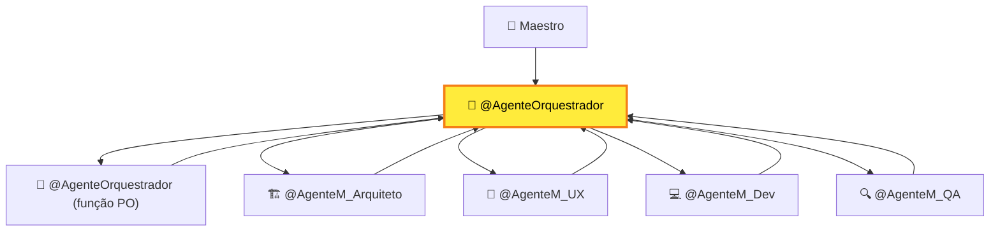
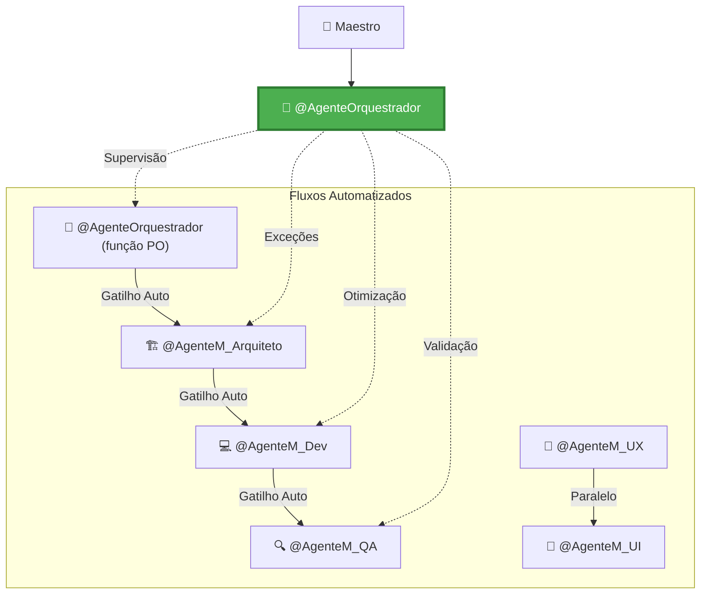
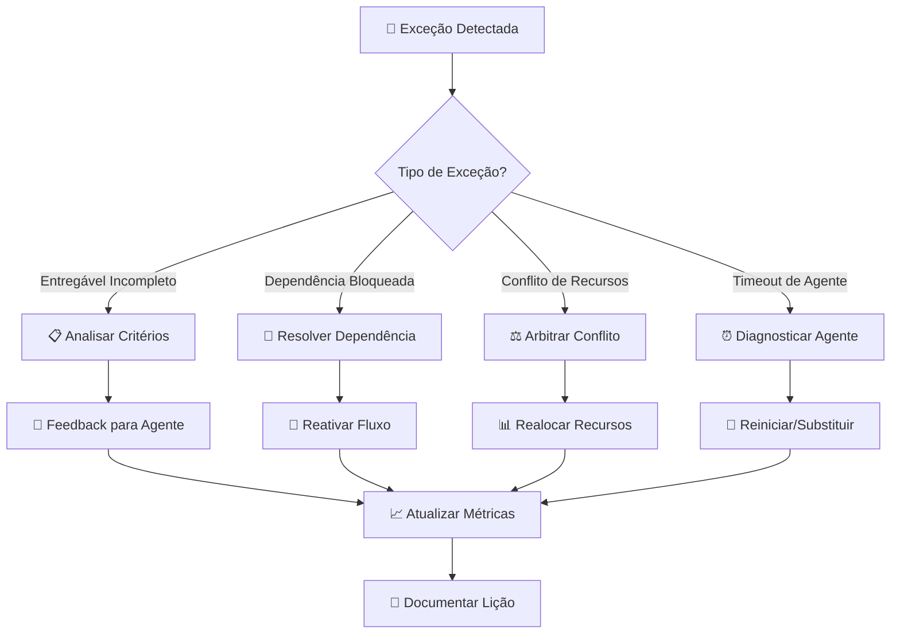
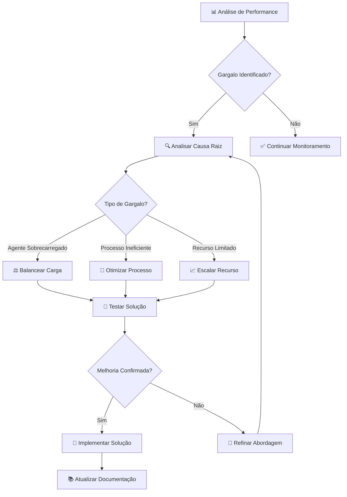

# EVOLUÇÃO DO PAPEL DO @AGENTEORQUESTRADOR

**Versão**: 1.0

**Data de Criação**: 06 de junho de 2025

**Data de Última Atualização**: 06 de junho de 2025

Baseado em: [[FLUXO_TRABALHO_GERAL.md]] (v0.9) e [[SISTEMA_ENTREGAVEIS_GATILHOS.md]] (v1.0)

## 1. Introdução

Este documento detalha a **evolução estratégica** do papel do `@AgenteOrquestrador` no contexto do novo **Sistema de Desenvolvimento Adaptativo por Contexto**. A transformação visa otimizar a eficiência operacional, reduzir overhead de orquestração e focar o agente em atividades de maior valor estratégico.

### 1.1. Contexto da Evolução

Com a implementação do **Sistema de Entregáveis como Gatilhos de Fluxo**, o `@AgenteOrquestrador` pode evoluir de um **"Parceiro Estratégico Constante"** para um **"Supervisor Estratégico"**, atuando de forma mais inteligente, autônomo e sob demanda.

## 2. Comparativo: Antes vs. Depois

### 2.1. Papel Atual (v1.0) - "Coordenador Constante"



**Características:**
- **Orquestração manual** de todas as transições
- **Overhead alto** (30-40% do tempo total)
- **Sequencialidade forçada** mesmo para tarefas independentes
- **Gargalo central** em todos os fluxos
- **Foco operacional** em coordenação

### 2.2. Novo Papel (v2.0) - "Supervisor Estratégico"



**Características:**
- **Ativação sob demanda** baseada em critérios específicos
- **Overhead reduzido** (5-10% do tempo total)
- **Paralelização inteligente** de tarefas independentes
- **Foco estratégico** em exceções e otimizações
- **Supervisão proativa** com intervenção mínima

## 3. Novos Critérios de Ativação

### 3.1. Ativação Automática

O `@AgenteOrquestrador` é ativado automaticamente quando:

```yaml
criterios_ativacao_automatica:
  excecoes_fluxo:
    - entregavel_incompleto: "Critérios de completude não atendidos"
    - dependencia_bloqueada: "Dependência externa não resolvida"
    - conflito_recursos: "Múltiplos agentes tentando acessar mesmo recurso"
    - timeout_agente: "Agente não responde dentro do SLA"
    
  validacao_estrategica:
    - componente_nucleo: "Feature classificada como componente de núcleo"
    - impacto_alto: "Mudança com impacto > 70% dos usuários"
    - risco_elevado: "Score de risco > 0.8"
    - decisao_arquitetural: "ADR requer validação estratégica"
    
  otimizacao_fluxo:
    - gargalo_detectado: "Tempo de trilha > 150% da média"
    - taxa_erro_alta: "Taxa de erro > 10% em 24h"
    - feedback_negativo: "Score de qualidade < 0.7"
    - padrão_ineficiente: "Padrão de fluxo subótimo identificado"
```

### 3.2. Ativação Manual

O Maestro pode ativar o `@AgenteOrquestrador` para:

- **Análise estratégica** de features complexas
- **Resolução de conflitos** entre agentes
- **Validação de decisões** arquiteturais críticas
- **Otimização de processos** baseada em métricas
- **Mentoria especializada** em Product Management

## 4. Novas Responsabilidades

### 4.1. Supervisor de Fluxo

```python
class FlowSupervisor:
    def __init__(self):
        self.active_flows = {}
        self.metrics_collector = MetricsCollector()
        self.anomaly_detector = AnomalyDetector()
    
    def monitor_flow_health(self):
        """Monitora saúde dos fluxos em tempo real"""
        for flow_id, flow in self.active_flows.items():
            health_score = self.calculate_health_score(flow)
            if health_score < 0.7:
                self.trigger_intervention(flow_id, health_score)
    
    def detect_bottlenecks(self):
        """Detecta gargalos automaticamente"""
        bottlenecks = self.anomaly_detector.find_bottlenecks(
            self.metrics_collector.get_recent_metrics()
        )
        return bottlenecks
    
    def suggest_optimizations(self, bottlenecks):
        """Sugere otimizações baseadas em dados"""
        optimizations = []
        for bottleneck in bottlenecks:
            optimization = self.generate_optimization_strategy(bottleneck)
            optimizations.append(optimization)
        return optimizations
```

### 4.2. Mentor Estratégico

**Foco em Product Management:**
- **Validação de valor** para o usuário
- **Análise de impacto** e ROI
- **Priorização estratégica** baseada em frameworks (RICE, ICE, MoSCoW)
- **Alinhamento com objetivos** do produto
- **Identificação de componentes de núcleo**

**Engenharia de Prompt Especializada:**
- **Co-criação de prompts** otimizados para outros agentes
- **Aplicação de melhores práticas** de prompt engineering
- **Contextualização rica** baseada na documentação viva
- **Templates adaptativos** por trilha e complexidade

### 4.3. Analista de Performance

```python
class PerformanceAnalyst:
    def __init__(self):
        self.kpi_tracker = KPITracker()
        self.trend_analyzer = TrendAnalyzer()
        self.predictor = PerformancePredictor()
    
    def track_key_metrics(self):
        """Rastreia KPIs críticos do sistema"""
        return {
            'tempo_medio_por_trilha': self.kpi_tracker.get_avg_time_by_track(),
            'taxa_sucesso_gatilhos': self.kpi_tracker.get_trigger_success_rate(),
            'utilizacao_agentes': self.kpi_tracker.get_agent_utilization(),
            'qualidade_entregaveis': self.kpi_tracker.get_deliverable_quality()
        }
    
    def predict_bottlenecks(self, horizon_days=7):
        """Prediz gargalos futuros"""
        current_trends = self.trend_analyzer.get_trends()
        predicted_bottlenecks = self.predictor.predict(
            trends=current_trends,
            horizon=horizon_days
        )
        return predicted_bottlenecks
    
    def generate_insights(self):
        """Gera insights acionáveis"""
        metrics = self.track_key_metrics()
        trends = self.trend_analyzer.get_trends()
        predictions = self.predict_bottlenecks()
        
        return {
            'current_state': metrics,
            'trends': trends,
            'predictions': predictions,
            'recommendations': self.generate_recommendations(metrics, trends, predictions)
        }
```

## 5. Métricas e KPIs de Supervisão

### 5.1. KPIs Operacionais

| **Métrica** | **Descrição** | **Meta** | **Alerta** |
|-------------|---------------|----------|------------|
| **Tempo Médio por Trilha** | Tempo total do início ao fim | Express: <2h, Padrão: <1d | >150% da meta |
| **Taxa de Sucesso de Gatilhos** | % de gatilhos que funcionaram corretamente | >95% | <90% |
| **Utilização de Agentes** | % de tempo que agentes estão ativos | 60-80% | <40% ou >90% |
| **Qualidade de Entregáveis** | Score médio de qualidade (0-1) | >0.8 | <0.7 |
| **Taxa de Retrabalho** | % de entregáveis que precisaram ser refeitos | <10% | >15% |

### 5.2. KPIs Estratégicos

| **Métrica** | **Descrição** | **Meta** | **Frequência** |
|-------------|---------------|----------|----------------|
| **Time to Market** | Tempo da ideia ao deploy | Redução 50% vs v1.0 | Semanal |
| **Satisfação do Maestro** | Score de satisfação (1-10) | >8 | Quinzenal |
| **ROI de Automação** | Economia vs custo de implementação | >300% em 6 meses | Mensal |
| **Inovação de Processo** | Novas otimizações implementadas | >2 por mês | Mensal |

### 5.3. Dashboard de Supervisão

```yaml
dashboard_config:
  widgets:
    - tipo: "gauge"
      metrica: "tempo_medio_trilha_express"
      meta: 120  # minutos
      alerta: 180
      
    - tipo: "line_chart"
      metrica: "taxa_sucesso_gatilhos"
      periodo: "7d"
      meta: 0.95
      
    - tipo: "heatmap"
      metrica: "utilizacao_agentes"
      dimensoes: ["agente", "hora_dia"]
      
    - tipo: "bar_chart"
      metrica: "qualidade_por_agente"
      ordenacao: "desc"
      
  alertas:
    - condicao: "tempo_medio_trilha_express > 180"
      acao: "notificar_maestro"
      prioridade: "alta"
      
    - condicao: "taxa_sucesso_gatilhos < 0.90"
      acao: "investigar_falhas"
      prioridade: "critica"
```

## 6. Fluxos de Intervenção

### 6.1. Intervenção por Exceção



### 6.2. Intervenção por Otimização



## 7. Templates de Prompts Evolutivos

### 7.1. Template para Supervisão de Fluxo

```markdown
# PROMPT: Supervisão de Fluxo - @AgenteOrquestrador

## Contexto
Você está supervisionando o fluxo de desenvolvimento da feature: {feature_name}
Trilha: {trilha_tipo}
Status atual: {status_atual}
Agentes envolvidos: {agentes_ativos}

## Métricas Atuais
- Tempo decorrido: {tempo_decorrido}
- Entregáveis completos: {entregaveis_completos}/{entregaveis_total}
- Qualidade média: {qualidade_score}
- Gargalos detectados: {gargalos}

## Sua Missão
1. **Analise** a saúde do fluxo atual
2. **Identifique** possíveis riscos ou gargalos
3. **Sugira** otimizações específicas
4. **Determine** se intervenção é necessária

## Critérios de Decisão
- Intervenha se: tempo > 150% da meta OU qualidade < 0.7 OU gargalo crítico
- Otimize se: padrão ineficiente detectado OU oportunidade de melhoria > 20%
- Continue monitorando se: métricas dentro do esperado

## Formato de Resposta
```yaml
analise_fluxo:
  saude_geral: "SAUDAVEL | ATENCAO | CRITICO"
  riscos_identificados: ["...", "..."]
  gargalos_atuais: ["...", "..."]
  
recomendacoes:
  intervencao_necessaria: true/false
  acoes_sugeridas: ["...", "..."]
  otimizacoes_propostas: ["...", "..."]
  
proximo_checkpoint: "YYYY-MM-DD HH:MM"
```
```

### 7.2. Template para Mentoria Estratégica

```markdown
# PROMPT: Mentoria Estratégica - @AgenteOrquestrador

## Contexto Estratégico
O Maestro precisa de orientação sobre: {topico_estrategico}
Contexto do projeto: {contexto_projeto}
Objetivos relacionados: {objetivos_relacionados}

## Documentação Relevante
{documentacao_consultada}

## Sua Missão como PM Mentor
1. **Questione** premissas estratégicas
2. **Analise** alinhamento com objetivos do produto
3. **Sugira** frameworks de priorização apropriados
4. **Identifique** componentes de núcleo potenciais
5. **Co-crie** prompts otimizados para outros agentes

## Frameworks Disponíveis
- RICE (Reach, Impact, Confidence, Effort)
- ICE (Impact, Confidence, Ease)
- MoSCoW (Must, Should, Could, Won't)
- Value vs Effort Matrix
- Kano Model

## Formato de Resposta
```yaml
analise_estrategica:
  premissas_questionadas: ["...", "..."]
  alinhamento_objetivos: "ALTO | MEDIO | BAIXO"
  framework_recomendado: "RICE | ICE | MoSCoW | ..."
  componente_nucleo: true/false
  
recomendacoes_pm:
  priorizacao: "..."
  valor_usuario: "..."
  riscos_estrategicos: ["...", "..."]
  metricas_sucesso: ["...", "..."]
  
prompts_sugeridos:
  agente_alvo: "@AgenteM_..."
  prompt_otimizado: "..."
  contexto_adicional: "..."
```
```

## 8. Plano de Transição

### 8.1. Fase 1: Preparação (Semana 1)

- [ ] **Atualizar** perfil do `@AgenteOrquestrador`
- [ ] **Implementar** sistema de métricas básico
- [ ] **Configurar** critérios de ativação automática
- [ ] **Testar** com trilha Express

### 8.2. Fase 2: Implementação Gradual (Semana 2-3)

- [ ] **Ativar** supervisão automática para trilhas Padrão
- [ ] **Implementar** dashboard de métricas
- [ ] **Treinar** sistema de detecção de anomalias
- [ ] **Refinar** critérios baseado em feedback

### 8.3. Fase 3: Otimização Avançada (Semana 4+)

- [ ] **Adicionar** predição de gargalos
- [ ] **Implementar** otimizações automáticas
- [ ] **Desenvolver** insights de IA
- [ ] **Automatizar** geração de relatórios

## 9. Métricas de Sucesso da Transição

| **Métrica** | **Baseline (v1.0)** | **Meta (v2.0)** | **Prazo** |
|-------------|---------------------|------------------|----------|
| Overhead de Orquestração | 30-40% | 5-10% | 4 semanas |
| Tempo Médio Trilha Express | 4-6h | 30min-2h | 2 semanas |
| Satisfação do Maestro | 7/10 | 9/10 | 6 semanas |
| Paralelização de Tarefas | 10-20% | 60-70% | 4 semanas |
| Detecção Automática de Problemas | 0% | 80% | 8 semanas |

## 10. Considerações Finais

### 10.1. Fatores Críticos de Sucesso

1. **Calibração precisa** dos critérios de ativação
2. **Qualidade das métricas** coletadas
3. **Feedback contínuo** do Maestro
4. **Adaptação baseada** em dados reais
5. **Manutenção da qualidade** estratégica

### 10.2. Riscos e Mitigações

| **Risco** | **Probabilidade** | **Impacto** | **Mitigação** |
|-----------|------------------|-------------|---------------|
| Perda de contexto estratégico | Baixa | Alto | Critérios rigorosos de ativação |
| Falsos positivos em alertas | Média | Médio | Calibração contínua de thresholds |
| Resistência à mudança | Baixa | Médio | Implementação gradual e feedback |
| Complexidade de manutenção | Média | Alto | Documentação e testes abrangentes |

---

**FIM DO DOCUMENTO EVOLUCAO_AGENTE_ORQUESTRADOR.md (v1.0)**

*"A verdadeira inteligência não está em fazer tudo, mas em saber quando e como intervir para maximizar o valor."*