# AGENTES DE IA MENTORES DO PROJETO RECOLOCA.AI (VISÃO GERAL)

**Versão**: 2.0 
**Data de Criação Original**: 03 de junho de 2025
**Data de Última Atualização**: 05 de junho de 2025
**Autor**: @AgenteOrquestrador (com supervisão do Maestro Bruno S. Rosa)
**Baseado em**:
- [[docs/01_Guias_Centrais/PLANO_MESTRE_RECOLOCA_AI.md]] (v1.5)
    
- [[docs/01_Guias_Centrais/GUIA_AVANCADO.md]] (v2.3)
    
- [[docs/03_Arquitetura_e_Design/ADR/ADR_001_Ferramentas_Core.md]] (v1.0)
    
- [[.trae/rules/project_rules.md]] (v1.3)
    
- [[docs/02_Requisitos/ERS.md]] (v0.5)
    
- [[docs/03_Arquitetura_e_Design/HLD.md]] (v1.0)
    
## 1. Introdução

Este documento serve como um **ponto de entrada e resumo** do ecossistema de **Agentes de IA** *Mentores* que compõem o "**squad**" de **desenvolvimento** do projeto Recoloca.ai. Seu propósito é fornecer uma visão geral e direcionar para os perfis detalhados de cada agente, facilitando o entendimento e a orquestração eficaz pelo Maestro (Bruno S. Rosa) e pelos próprios agentes.

A visão é construir um "super squad" de IA, onde cada agente atua como um especialista em sua respectiva área, colaborando sinergicamente sob a liderança do Maestro para acelerar o desenvolvimento, aumentar a qualidade e fomentar a inovação no Recoloca.ai. Este documento é uma peça fundamental da "Documentação Viva" do projeto. Para detalhes específicos sobre cada agente, consulte seu perfil individual linkado abaixo.
## 2. Squad Principal de Agentes IA Mentores

A seguir, apresentamos os Agentes de IA Mentores essenciais para o desenvolvimento do MVP e as fases iniciais do Recoloca.ai.

- **`@AgenteOrquestrador`** (PM Mentor e Engenheiro de Prompt Especialista)
    
    - **Foco:** PM Mentor e Engenheiro de Prompt Especialista
        
    - **Link:** [[docs/04_Agentes_IA/Perfis/@AgenteOrquestrador.md|Perfil Detalhado]]
        
- **`@AgenteM_PO`** (Product Owner Mentor Especialista em Requisitos Ágeis)
    
    - **Foco:** Product Owner Mentor Especialista em Requisitos Ágeis
        
    - **Link:** [[docs/04_Agentes_IA/Perfis/@AgenteM_PO.md|Perfil Detalhado]]
        
- **`@AgenteM_UXDesigner`** (UX Designer e Pesquisador Mentor Sênior)
    
    - **Foco:** UX Designer e Pesquisador Mentor Sênior
        
    - **Link:** [[docs/04_Agentes_IA/Perfis/@AgenteM_UXDesigner.md|Perfil Detalhado]]
        
- **`@AgenteM_UIDesigner`** (UI Designer e Visual Mentor Sênior)
    
    - **Foco:** UI Designer e Visual Mentor Sênior
        
    - **Link:** [[docs/04_Agentes_IA/Perfis/@AgenteM_UIDesigner.md|Perfil Detalhado]]
        
- **`@AgenteM_ArquitetoHLD`** (Arquiteto de Software Mentor - Foco em High-Level Design)
    
    - **Foco:** Arquiteto de Software Mentor - Foco em High-Level Design
        
    - **Link:** [[docs/04_Agentes_IA/Perfis/@AgenteM_ArquitetoHLD.md|Perfil Detalhado]]
        
- **`@AgenteM_ArquitetoLLD`** (Arquiteto/Designer de Software Mentor - Foco em Low-Level Design)
    
    - **Foco:** Arquiteto/Designer de Software Mentor - Foco em Low-Level Design
        
    - **Link:** [[docs/04_Agentes_IA/Perfis/@AgenteM_ArquitetoLLD.md|Perfil Detalhado]]
        
- **`@AgenteM_API`** (Arquiteto de APIs Mentor - Especialista em OpenAPI)
    
    - **Foco:** Arquiteto de APIs Mentor - Especialista em OpenAPI
        
    - **Link:** [[docs/04_Agentes_IA/Perfis/@AgenteM_API.md|Perfil Detalhado]]
        
- **`@AgenteM_DevFastAPI`** (Desenvolvedor Backend Python Sênior e Mentor Especialista em FastAPI)
    
    - **Foco:** Desenvolvedor Backend Python Sênior e Mentor Especialista em FastAPI
        
    - **Link:** [[docs/04_Agentes_IA/Perfis/@AgenteM_DevFastAPI.md|Perfil Detalhado]]
        
- **`@AgenteM_DevFlutter`** (Desenvolvedor Flutter/Dart Mentor Sênior - Especialista em PWA)
    
    - **Foco:** Desenvolvedor Flutter/Dart Mentor Sênior - Especialista em PWA
        
    - **Link:** [[docs/04_Agentes_IA/Perfis/@AgenteM_DevFlutter.md|Perfil Detalhado]]
        
- **`@AgenteM_QA`** (Analista de QA e Testes Mentor Sênior)
    
    - **Foco:** Analista de QA e Testes Mentor Sênior
        
    - **Link:** [[docs/04_Agentes_IA/Perfis/@AgenteM_QA.md|Perfil Detalhado]]
        
- **`@AgenteM_Seguranca`** (Analista de Segurança Mentor Sênior - AppSec & Cloud)
    
    - **Foco:** Analista de Segurança Mentor Sênior - AppSec & Cloud
        
    - **Link:** [[docs/04_Agentes_IA/Perfis/@AgenteM_Seguranca.md|Perfil Detalhado]]
        
- **`@AgenteM_Documentacao`** (Documentador Técnico Mentor Especialista)
    
    - **Foco:** Documentador Técnico Mentor Especialista
        
    - **Link:** [[docs/04_Agentes_IA/Perfis/@AgenteM_Documentacao.md|Perfil Detalhado]]
        
- **`@AgenteM_DevOps`** (Especialista em CI/CD e Automação de Operações Mentor Sênior)
    
    - **Foco:** Especialista em CI/CD e Automação de Operações Mentor Sênior
        
    - **Link:** [[docs/04_Agentes_IA/Perfis/@AgenteM_DevOps.md|Perfil Detalhado]]
        
- **`@AgenteM_DevJS`** (Desenvolvedor de Extensão Chrome Mentor Sênior (JavaScript))
    
    - **Foco:** Desenvolvedor de Extensão Chrome Mentor Sênior (JavaScript)
        
    - **Link:** [[docs/04_Agentes_IA/Perfis/@AgenteM_DevJS.md|Perfil Detalhado]]
        
- **`@AgenteM_Performance`** (APO - Mentor em Análise de Performance e Otimização Contínua)
    
    - **Foco:** APO - Mentor em Análise de Performance e Otimização Contínua
        
    - **Link:** [[docs/04_Agentes_IA/Perfis/@AgenteM_Performance.md|Perfil Detalhado]]
        
- **`@AgenteM_Dados`** (Analista de Dados e BI Mentor Sênior)
    
    - **Foco:** Analista de Dados e BI Mentor Sênior
        
    - **Link:** [[docs/04_Agentes_IA/Perfis/@AgenteM_Dados.md|Perfil Detalhado]]
        
## 3. Visão de Evolução do Squad (Agentes Futuros)

À medida que o Recoloca.ai evolui e novas necessidades surgem, o squad de Agentes de IA Mentores poderá ser expandido. Alguns papéis futuros potenciais incluem (perfis a serem criados em `[[docs/04_Agentes_IA/Perfis/FuturosPerfis/]]`):

- **`@AgenteM_ML`** (Especialista em Machine Learning e IA Mentor):
    
    - **Foco:** Auxiliar no desenvolvimento e otimização de modelos de IA para análise de CVs, matching de vagas, e outras funcionalidades de ML do Recoloca.ai.
        
- **`@AgenteM_MarketingDigital`** (Especialista em Marketing Digital Mentor):
    
    - **Foco:** Orientar sobre estratégias de aquisição de usuários, SEO, marketing de conteúdo, e campanhas para promover o Recoloca.ai, especialmente após o MVP.
        
- **`@AgenteM_Legal`** (Consultor Jurídico Mentor - Foco em Tech Law):
    
    - **Foco:** Fornecer orientação sobre aspectos legais relacionados a SaaS, privacidade de dados (além da LGPD básica), termos de serviço, e propriedade intelectual, especialmente se o produto se expandir ou lidar com dados mais sensíveis.
        
- **`@AgenteM_Financeiro`** (Consultor Financeiro Mentor - Foco em SaaS):
    
    - **Foco:** Auxiliar no planejamento financeiro, modelagem de custos, precificação de tiers, e análise de métricas financeiras de SaaS (MRR, ARR, Churn, LTV) para garantir a sustentabilidade e crescimento do Recoloca.ai.
        
- **`@AgenteM_SuporteUsuario`** (Mentor de Suporte ao Usuário e Comunidade):
    
    - **Foco:** Ajudar a definir estratégias de atendimento, FAQs, e gestão de comunidade conforme a base de usuários cresce.
        
- **`@AgenteM_Growth`** (Mentor de Growth Hacking):
    
    - **Foco:** Experimentação rápida e táticas de crescimento acelerado.
        
- **`@AgenteM_ConteudoEducacional`** (Mentor de Conteúdo Educacional e Onboarding):
    
    - **Foco:** Estruturar e refinar conteúdo educacional para usuários.
        
- **`@AgenteM_I18nL10n`** (Mentor de Internacionalização e Localização):
    
    - **Foco:** Adaptação do produto para diferentes idiomas e culturas.
        

A introdução desses agentes dependerá das prioridades estratégicas, dos desafios encontrados e dos recursos disponíveis para o Maestro.
## 4. Diagrama de Processo de Desenvolvimento Otimizado (com Foco na Documentação)

Este diagrama em Mermaid.js ilustra um fluxo de trabalho idealizado, enfatizando a criação e atualização contínua da "Documentação Viva" como um elemento central e integrado ao processo de desenvolvimento, envolvendo os Agentes de IA Mentores.

```mermaid
graph LR
    A["🏁 Início da Feature/Correção (Ideia/Bug Report)"] --> B{{"❓ Validação Estratégica e de Requisitos<br>(Maestro + @AgenteOrquestrador)"}};
    B -- "Estratégia Aprovada" --> C["📝 Definição de HUs/ACs<br>(Maestro + @AgenteM_PO)"];
    C --> C_Doc["📄 Criação/Atualização: [[docs/02_Requisitos/HU_AC/...]]<br>(@AgenteM_Documentacao assiste)"];
    
    subgraph "Ciclo de Documentação Contínua"
        direction LR
        RAG_Update["🔄 Atualização da Base RAG<br>com nova documentação<br>(Maestro/Script + @AgenteM_Documentacao)"]
        C_Doc --> RAG_Update;
        D_Doc --> RAG_Update;
        E_Doc_Internal --> RAG_Update;
        %% Sumários/explicações do código podem ir para o RAG
        F_Doc --> RAG_Update;
        I_Doc --> RAG_Update;
    end

    C_Doc --> D{{"📐 Design UX/UI e Arquitetura (HLD/LLD/API)<br>(Maestro + @AgenteM_UXDesigner, @AgenteM_UIDesigner, @AgenteM_ArquitetoHLD, @AgenteM_ArquitetoLLD, @AgenteM_API)"}};
    D -- "Design Aprovado" --> D_Doc["📄 Criação/Atualização: [[docs/03_Arquitetura_e_Design/...]]<br>(@AgenteM_Documentacao assiste)"];
    D_Doc --> E["💻 Desenvolvimento do Código<br>(Maestro + @AgenteM_DevFastAPI, @AgenteM_DevFlutter, etc.)"];
    E --> E_Doc_Internal["✍️ Geração de Docstrings/Comentários no Código<br>(@AgenteM_Documentacao assiste @AgentesDev)"];
    E_Doc_Internal --> F["🧪 Geração de Casos de Teste e Testes Unitários<br>(Maestro + @AgenteM_QA + @AgentesDev)"];
    F --> F_Doc["📄 Criação/Atualização: [[docs/06_Qualidade_e_Testes/...]]<br>(@AgenteM_Documentacao assiste)"];
    F_Doc --> G["⚙️ Implementação de Testes e Execução"];
    G --> H{{"🐞 Revisão de Código, Testes e Segurança<br>(Maestro + @AgenteM_Seguranca)"}};
    H -- "Ajustes Necessários" --> E;
    H -- "Tudo OK" --> I["🚀 Preparação para Deploy<br>(Maestro + @AgenteM_DevOps)"];
    I --> I_Doc["📄 Criação/Atualização: [[docs/07_Operacoes_e_Deploy/...]]<br>(@AgenteM_Documentacao assiste)"];
    I_Doc --> J["🚢 Deploy em Ambiente de Teste/Produção"];
    J --> K["🔍 Monitoramento e Feedback Pós-Deploy"];
    K --> A;

	%% Styling
    classDef default fill:#f9f9f9,stroke:#333,stroke-width:2px,color:#333;
    classDef decision fill:#ececff,stroke:#667eea,stroke-width:2px,color:#333;
    classDef doc fill:#fff8dc,stroke:#ffbf00,stroke-width:2px,color:#333;
    classDef dev fill:#e6ffe6,stroke:#5cb85c,stroke-width:2px,color:#333;
    classDef qa fill:#ffe6e6,stroke:#d9534f,stroke-width:2px,color:#333;
    classDef deploy fill:#e6f7ff,stroke:#5bc0de,stroke-width:2px,color:#333;

    class A,K default;
    class B,D,H decision;
    class C,E,G,I,J dev;
    class F qa;
    class C_Doc,D_Doc,E_Doc_Internal,F_Doc,I_Doc,RAG_Update doc;
```

**Interpretação do Diagrama:**

1. O fluxo começa com uma ideia ou necessidade, que passa por validação estratégica com o `@AgenteOrquestrador`.
    
2. Requisitos são detalhados pelo `@AgenteM_PO`, e a documentação correspondente é criada/atualizada.
    
3. O design (UX, UI, Arquitetura) é elaborado pelos agentes especializados, e seus artefatos são documentados.
    
4. O desenvolvimento do código ocorre, com documentação interna (docstrings, comentários) sendo gerada simultaneamente.
    
5. Testes são planejados e casos de teste são documentados.
    
6. Após a implementação e execução dos testes, há uma fase de revisão (código, testes, segurança).
    
7. A preparação para o deploy também envolve a documentação dos procedimentos.
    
8. **Crucialmente**, cada etapa de criação/atualização de artefatos documentais (HUs, Designs, Casos de Teste, Guias de Deploy) alimenta a "Documentação Viva". O `@AgenteM_Documentacao` desempenha um papel de assistência contínua.
    
9. A "Documentação Viva" atualizada é então usada para **refrescar** a **base de conhecimento do Sistema RAG**, garantindo que todos os agentes (incluindo o `@AgenteOrquestrador`) tenham acesso ao contexto mais recente para as interações futuras.
    

Este ciclo reforça a importância da documentação não como uma tarefa posterior, mas como parte integral e contínua do desenvolvimento, potencializando a eficácia dos Agentes de IA.

--- FIM DO DOCUMENTO XXX.Md (v X.X) ---