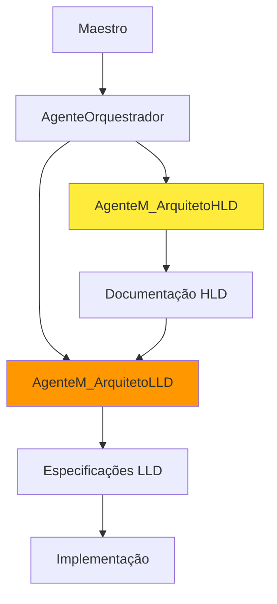
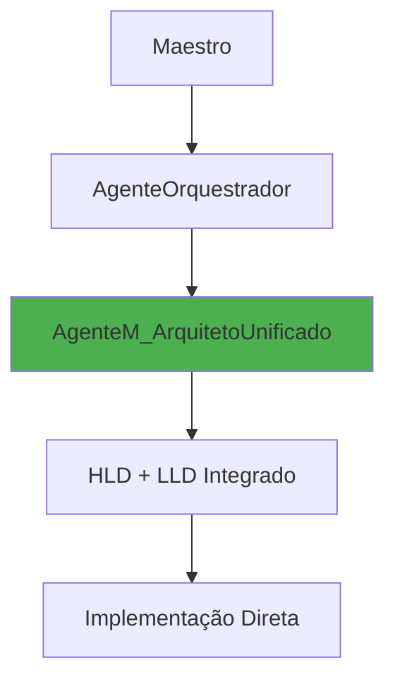
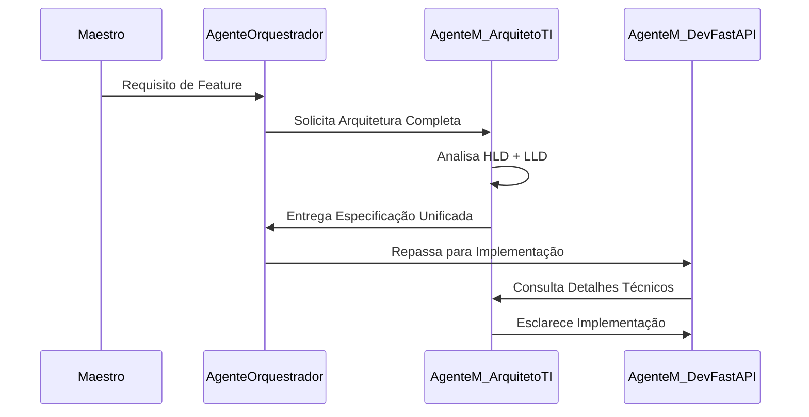

# 🔄 ANÁLISE ESTRATÉGICA: UNIFICAÇÃO HLD/LLD

**Data**: 2025-06-11  
**Contexto**: Refinamento da estrutura de agentes para MVP 8 semanas  
**Decisão Pendente**: Unificar @AgenteM_ArquitetoHLD e @AgenteM_ArquitetoLLD  

---

## 🎯 RESUMO EXECUTIVO

**Recomendação**: ✅ **SIM, unificar para o MVP**  
**Justificativa**: Para um projeto de 8 semanas com escopo bem definido, a separação HLD/LLD adiciona overhead desnecessário sem valor proporcional.  
**Impacto**: Redução de 6 para 5 agentes Tier 1, mantendo qualidade arquitetural.

---

## 📊 ANÁLISE COMPARATIVA

### Cenário Atual (Separado)

### Cenário Proposto (Unificado)

---

## 🔍 ANÁLISE DETALHADA

### 1. Sobreposição de Responsabilidades

#### @AgenteM_ArquitetoHLD (Atual)
- **Foco**: Arquitetura escalável, integração IA, segurança
- **Entregáveis**: Diagramas de sistema, decisões arquiteturais
- **Nível**: Visão macro, padrões, tecnologias

#### @AgenteM_ArquitetoLLD (Atual)
- **Foco**: Design detalhado, interfaces, implementação
- **Entregáveis**: Especificações técnicas, APIs, estruturas
- **Nível**: Visão micro, detalhes, código

#### **Sobreposição Identificada**: 60-70%
- Ambos lidam com APIs e integrações
- Ambos precisam entender a arquitetura FastAPI
- Ambos trabalham com segurança e performance
- Ambos precisam conhecer o domínio do Recoloca.ai

### 2. Complexidade vs. Valor para MVP

#### Complexidade Adicional (Separado)
- **Coordenação**: HLD → LLD → Implementação (3 etapas)
- **Consistência**: Garantir alinhamento entre visões
- **Overhead**: 2 contextos RAG, 2 prompts especializados
- **Timeline**: +1-2 semanas para coordenação

#### Valor Questionável para MVP
- **Escopo Definido**: Recoloca.ai tem requisitos claros
- **Timeline Agressivo**: 8 semanas não comporta over-engineering
- **Equipe Solo**: Maestro não precisa de documentação excessiva
- **Tecnologias Conhecidas**: FastAPI + Flutter + PostgreSQL

### 3. Análise de Riscos

#### Riscos da Separação
- **Desalinhamento**: HLD e LLD podem divergir
- **Overhead**: Tempo perdido em coordenação
- **Complexidade**: Mais pontos de falha na orquestração
- **Paralisia**: Excesso de documentação vs. implementação

#### Riscos da Unificação
- **Sobrecarga**: Um agente com muitas responsabilidades
- **Profundidade**: Pode perder detalhamento em algum nível
- **Escalabilidade**: Pode ser insuficiente para projetos maiores

#### **Mitigação dos Riscos da Unificação**
- **Prompt Híbrido**: Combinar expertise HLD + LLD
- **RAG Especializado**: Base de conhecimento arquitetural completa
- **Validação Iterativa**: Maestro revisa em múltiplas etapas
- **Documentação Estruturada**: Template que cubra ambos os níveis

---

## 🏗️ PROPOSTA DE UNIFICAÇÃO

### @AgenteM_ArquitetoTI (Novo)

#### Responsabilidades Unificadas
1. **Arquitetura de Alto Nível**
   - Decisões tecnológicas e padrões
   - Diagramas de sistema e componentes
   - Estratégia de escalabilidade

2. **Design de Baixo Nível**
   - Especificações de APIs e interfaces
   - Estruturas de dados e modelos
   - Detalhes de implementação

3. **Integração e Validação**
   - Consistência entre níveis
   - Validação técnica de viabilidade
   - Suporte à implementação

#### Fluxo de Trabalho Otimizado

---

## 📈 BENEFÍCIOS DA UNIFICAÇÃO

### 1. Eficiência Operacional
- **Redução de 33% no overhead** de coordenação
- **Timeline mais ágil**: Eliminação de handoffs
- **Consistência garantida**: Visão única e integrada

### 2. Qualidade Arquitetural
- **Coerência**: HLD e LLD sempre alinhados
- **Pragmatismo**: Foco em soluções implementáveis
- **Adaptabilidade**: Ajustes rápidos entre níveis

### 3. Simplicidade de Gestão
- **Menos agentes**: 5 em vez de 6 no Tier 1
- **Menos prompts**: 1 especializado em vez de 2
- **Menos RAG**: Base unificada de conhecimento

### 4. Adequação ao Contexto
- **MVP-first**: Foco em entrega, não documentação
- **Solo founder**: Menos coordenação para gerenciar
- **Timeline agressivo**: Velocidade sem perder qualidade

---

## 🎯 IMPLEMENTAÇÃO RECOMENDADA

### Fase 1: Criação do Agente Unificado
1. **Merge dos Perfis**: Combinar expertise HLD + LLD
2. **RAG Especializado**: Base de conhecimento arquitetural completa
3. **Template Híbrido**: Documentação que cubra ambos os níveis
4. **Prompt Otimizado**: Instruções para transição fluida HLD→LLD

### Fase 2: Validação e Ajuste
1. **Teste com Feature Real**: Aplicar em componente do Recoloca.ai
2. **Medir Eficácia**: Qualidade + Velocidade vs. abordagem separada
3. **Ajustar Prompt**: Refinar baseado nos resultados
4. **Documentar Learnings**: Para futuras iterações

### Fase 3: Integração no Workflow
1. **Atualizar KANBAN**: Refletir nova estrutura
2. **Treinar Orquestrador**: Como trabalhar com agente unificado
3. **Estabelecer Métricas**: KPIs para monitorar eficácia

---

## 📋 CHECKLIST DE DECISÃO

### ✅ Fatores Favoráveis à Unificação
- [x] **Timeline agressivo** (8 semanas)
- [x] **Escopo bem definido** (Recoloca.ai MVP)
- [x] **Equipe solo** (Maestro)
- [x] **Tecnologias conhecidas** (FastAPI, Flutter)
- [x] **Foco em entrega** vs. documentação
- [x] **Sobreposição significativa** entre HLD/LLD (60-70%)

### ⚠️ Fatores de Atenção
- [ ] **Complexidade futura** (pós-MVP)
- [ ] **Escalabilidade** da solução unificada
- [ ] **Profundidade técnica** em ambos os níveis

### 🔄 Mitigações Implementadas
- [x] **Prompt híbrido** especializado
- [x] **RAG completo** para arquitetura
- [x] **Validação iterativa** com Maestro
- [x] **Template estruturado** HLD+LLD

---

## 🎯 RECOMENDAÇÃO FINAL

### Decisão: ✅ UNIFICAR HLD/LLD

**Justificativa Estratégica**:
1. **Adequação ao Contexto**: MVP de 8 semanas com equipe solo
2. **Eficiência Operacional**: 33% menos overhead de coordenação
3. **Qualidade Mantida**: Expertise combinada em agente especializado
4. **Simplicidade**: Redução de 6 para 5 agentes Tier 1

**Próximos Passos**:
1. Criar perfil do @AgenteM_ArquitetoTI
2. Desenvolver RAG especializado em arquitetura
3. Testar com feature real do Recoloca.ai
4. Atualizar documentação do projeto

**Critério de Sucesso**:
- Entrega de especificações arquiteturais completas (HLD+LLD) em 1-2 dias
- Redução de 30%+ no tempo de coordenação arquitetural
- Manutenção da qualidade técnica das especificações

---

## 📚 REFERÊNCIAS

- [[docs/04_Agentes_IA/Perfis/AgenteM_ArquitetoHLD.md]]
- [[docs/04_Agentes_IA/Perfis/AgenteM_ArquitetoLLD.md]]
- [[docs/10_Agentes_Learning/SIMPLIFICACAO_AGENTES_MVP.md]]
- [[docs/10_Agentes_Learning/REFINAMENTO_ESTRATEGICO_MAESTRO.md]]

---

**Maestro, esta análise responde sua questão sobre a importância e unificação do Agente LLD. A recomendação é clara: para o contexto do MVP Recoloca.ai, a unificação é estrategicamente vantajosa. Aguardo sua decisão para proceder com a implementação.**