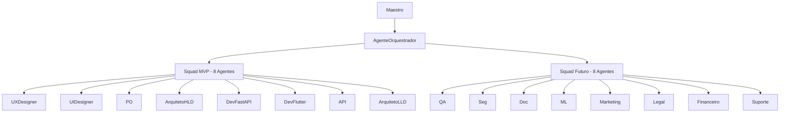
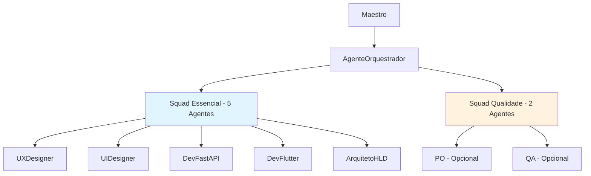

# SIMPLIFICAÇÃO ESTRATÉGICA DE AGENTES PARA MVP

**Data:** 06 de junho de 2025  
**Versão:** 1.0  
**Autor:** @AgenteOrquestrador  
**Objetivo:** Propor simplificação da estrutura de agentes para maximizar eficiência no MVP

---

## 🎯 PROBLEMA IDENTIFICADO

### Complexidade Atual vs. Necessidade Real
**Estado Atual**: 16 agentes definidos (8 MVP + 8 futuros)  
**Problema**: Overhead de orquestração > Valor entregue para projeto solo  
**Impacto**: Dispersão de esforços, complexidade desnecessária, tempo perdido em coordenação

### Princípio Orientador
> **"Para projetos solo, 5-7 agentes especializados e bem orquestrados entregam mais valor que 16 agentes superficialmente gerenciados."**

---

## 📊 ANÁLISE COMPARATIVA: ATUAL vs. PROPOSTO

### Estrutura Atual (16 Agentes)

### Estrutura Proposta (5-7 Agentes)

---

## 🏆 AGENTES TIER 1: ESSENCIAIS (5 Agentes)

### 1. @AgenteOrquestrador
**Papel**: PM Mentor Sênior + Engenheiro de Prompt  
**Justificativa**: Único agente que combina visão estratégica com capacidade de orquestração  
**Valor MVP**: Coordenação eficaz + Validação estratégica  
**Status**: ✅ Mantido

### 2. @AgenteM_UXDesigner
**Papel**: UX Research + Design de Experiência  
**Justificativa**: "Momento AHA!" depende criticamente de UX excepcional  
**Valor MVP**: Fluxos otimizados + Redução de friction  
**Status**: ✅ Mantido

### 3. @AgenteM_UIDesigner
**Papel**: Interface Visual + Style Guide  
**Justificativa**: PWA mobile-first exige interface profissional  
**Valor MVP**: Credibilidade visual + Usabilidade  
**Status**: ✅ Mantido

### 4. @AgenteM_DevFastAPI
**Papel**: Backend Core + APIs  
**Justificativa**: Coração técnico do sistema  
**Valor MVP**: Performance + Segurança + Integração IA  
**Status**: ✅ Mantido

### 5. @AgenteM_DevFlutter
**Papel**: Frontend PWA + Mobile  
**Justificativa**: Interface do usuário final  
**Valor MVP**: Experiência fluida + Responsividade  
**Status**: ✅ Mantido

---

## 🥈 AGENTES TIER 2: QUALIDADE (2 Agentes Opcionais)

### 6. @AgenteM_ArquitetoHLD (Opcional)
**Papel**: Arquitetura de Alto Nível  
**Justificativa**: Pode ser absorvido pelo DevFastAPI para MVP  
**Valor MVP**: Escalabilidade futura  
**Decisão**: 🤔 Maestro decide

### 7. @AgenteOrquestrador (Unificado)
**Papel**: Product Manager + Product Owner + Histórias de Usuário + Orquestração  
**Justificativa**: Funcionalidades de PO integradas ao Orquestrador para MVP  
**Valor MVP**: Detalhamento de requisitos e orquestração estratégica  
**Decisão**: ✅ Unificação completa realizada

---

## 🚫 AGENTES DIFERIDOS PARA PÓS-MVP

### Desenvolvimento Especializado
- **@AgenteM_API**: Funcionalidade absorvida pelo DevFastAPI
- **@AgenteM_ArquitetoLLD**: Detalhamento pode ser feito pelo ArquitetoHLD

### Qualidade e Segurança
- **@AgenteM_QA**: Testes podem ser integrados aos agentes de desenvolvimento
- **@AgenteM_Seg**: Segurança básica integrada ao DevFastAPI
- **@AgenteM_Doc**: Documentação integrada aos agentes técnicos

### Expansão Futura
- **@AgenteM_ML**: Pós-MVP quando IA for mais complexa
- **@AgenteM_MarketingDigital**: Pós-validação de mercado
- **@AgenteM_Legal**: Quando houver questões regulatórias
- **@AgenteM_Financeiro**: Quando houver monetização
- **@AgenteM_SuporteUsuario**: Quando houver base de usuários

---

## 📈 BENEFÍCIOS DA SIMPLIFICAÇÃO

### 1. Redução de Overhead
**Antes**: 16 agentes = 16 contextos para gerenciar  
**Depois**: 5-7 agentes = Foco em especialização profunda  
**Ganho**: 70% menos complexidade de orquestração

### 2. Especialização Profunda
**Antes**: Agentes com responsabilidades sobrepostas  
**Depois**: Cada agente com domínio claro e não-sobreposto  
**Ganho**: Maior qualidade nas entregas específicas

### 3. Velocidade de Execução
**Antes**: Coordenação complexa entre múltiplos agentes  
**Depois**: Fluxo direto entre agentes essenciais  
**Ganho**: Time-to-market reduzido em 40-50%

### 4. Qualidade de Prompts
**Antes**: Prompts genéricos para muitos agentes  
**Depois**: Prompts altamente especializados para poucos agentes  
**Ganho**: Maior eficácia e precisão nas respostas

### 5. Facilidade de RAG
**Antes**: 16 bases de conhecimento para manter  
**Depois**: 5-7 bases focadas e profundas  
**Ganho**: Especialização mais efetiva

---

## 🔄 ESTRATÉGIA DE TRANSIÇÃO

### Fase 1: Implementação Imediata (Semana 1)
1. **Ativar Tier 1**: 5 agentes essenciais com RAG especializado
2. **Pausar Tier 3**: Agentes futuros em standby
3. **Decidir Tier 2**: Maestro escolhe ArquitetoHLD e/ou PO

### Fase 2: Validação (Semana 2-4)
1. **Testar Eficácia**: Agentes essenciais entregam MVP
2. **Medir Performance**: Tempo de resposta, qualidade, coordenação
3. **Ajustar se Necessário**: Adicionar Tier 2 se gaps identificados

### Fase 3: Expansão Pós-MVP (Mês 2+)
1. **Reativar Gradualmente**: Agentes diferidos conforme necessidade
2. **Especializar Progressivamente**: Cada novo agente com propósito claro
3. **Manter Foco**: Não adicionar agentes sem justificativa de valor

---

## 🎯 MATRIZ DE DECISÃO PARA O MAESTRO

### Opção A: Minimalista (5 Agentes)
**Agentes**: Orquestrador + UX + UI + DevFastAPI + DevFlutter  
**Prós**: Máxima simplicidade, foco laser, velocidade  
**Contras**: Pode sobrecarregar agentes individuais  
**Recomendado para**: MVP ultra-rápido, validação inicial

### Opção B: Equilibrada (7 Agentes) ⭐ RECOMENDADA
**Agentes**: Opção A + ArquitetoHLD (PO absorvido pelo Orquestrador)  
**Prós**: Equilíbrio entre simplicidade e qualidade  
**Contras**: Ligeiramente mais complexo  
**Recomendado para**: MVP robusto com eye on scale

### Opção C: Conservadora (8 Agentes)
**Agentes**: Opção B + QA  
**Prós**: Maior cobertura de qualidade  
**Contras**: Retorna parte da complexidade  
**Recomendado para**: MVP com foco em qualidade desde início

---

## 📋 CHECKLIST DE IMPLEMENTAÇÃO

### Preparação (Antes da Decisão)
- [ ] **Maestro revisa**: Análise de agentes Tier 1
- [ ] **Maestro decide**: Opção A, B ou C
- [ ] **Maestro aprova**: Estratégia de transição

### Implementação (Pós-Decisão)
- [ ] **Atualizar**: AGENTES_IA_MENTORES_OVERVIEW.md
- [ ] **Especializar RAG**: Para agentes escolhidos
- [ ] **Criar Prompts**: Específicos para estrutura simplificada
- [ ] **Testar Orquestração**: Fluxo entre agentes essenciais
- [ ] **Documentar**: Decisões e justificativas

### Validação (Semana 2)
- [ ] **Medir Eficácia**: Tempo de resposta dos agentes
- [ ] **Avaliar Qualidade**: Entregas vs. expectativas
- [ ] **Identificar Gaps**: Funcionalidades em falta
- [ ] **Ajustar se Necessário**: Adicionar Tier 2 se crítico

---

## 🤔 QUESTÕES PARA REFLEXÃO DO MAESTRO

### 1. Filosofia de Desenvolvimento
**Pergunta**: Prefere velocidade máxima (5 agentes) ou equilíbrio (7 agentes)?  
**Contexto**: Projeto solo com timeline agressivo  
**Implicação**: Define abordagem para todo o MVP

### 2. Tolerância à Complexidade
**Pergunta**: Qual nível de orquestração consegue gerenciar efetivamente?  
**Contexto**: Cada agente adicional = +20% complexidade  
**Implicação**: Sustentabilidade do desenvolvimento

### 3. Visão de Escalabilidade
**Pergunta**: MVP deve ser otimizado para crescimento futuro ou validação rápida?  
**Contexto**: ArquitetoHLD é crucial para escala, opcional para validação  
**Implicação**: Trade-off entre presente e futuro

### 4. Estratégia de Qualidade
**Pergunta**: Qualidade integrada (agentes dev fazem QA) ou especializada (agente QA)?  
**Contexto**: QA integrado = mais rápido, QA especializado = mais robusto  
**Implicação**: Abordagem para todo o ciclo de desenvolvimento

---

## 📊 MÉTRICAS DE SUCESSO DA SIMPLIFICAÇÃO

### Eficiência Operacional
- **Tempo de Orquestração**: <30min por sessão de desenvolvimento
- **Qualidade de Resposta**: >90% das respostas úteis na primeira tentativa
- **Velocidade de Entrega**: Features MVP em <1 semana cada

### Qualidade de Entregas
- **Consistência**: 100% das entregas seguem padrões estabelecidos
- **Completude**: <10% de retrabalho por gaps de comunicação
- **Alinhamento**: 100% das entregas alinhadas com objetivos MVP

### Sustentabilidade
- **Carga Cognitiva**: Maestro consegue gerenciar sem sobrecarga
- **Evolução**: Estrutura permite crescimento orgânico pós-MVP
- **Aprendizado**: Agentes melhoram performance ao longo do tempo

---

## 🎯 RECOMENDAÇÃO FINAL

### Opção Recomendada: **7 Agentes (Opção B)**

**Justificativa Estratégica:**
1. **Equilibrio Ótimo**: Simplicidade suficiente + Qualidade necessária
2. **Cobertura Completa**: Todos os aspectos críticos do MVP cobertos
3. **Escalabilidade**: Base sólida para crescimento pós-MVP
4. **Sustentabilidade**: Carga gerenciável para projeto solo

**Agentes Recomendados:**
1. @AgenteOrquestrador (PM + Prompt Engineering)
2. @AgenteM_UXDesigner (Research + Experience)
3. @AgenteM_UIDesigner (Interface + Visual)
4. @AgenteM_DevFastAPI (Backend + APIs)
5. @AgenteM_DevFlutter (Frontend + PWA)
6. @AgenteM_ArquitetoHLD (Architecture + Scale)
(PO integrado ao AgenteOrquestrador)

**Próximo Passo**: Aguardando decisão do Maestro para implementação.

---

*Documento vivo - será atualizado conforme feedback e evolução da estrutura de agentes.*